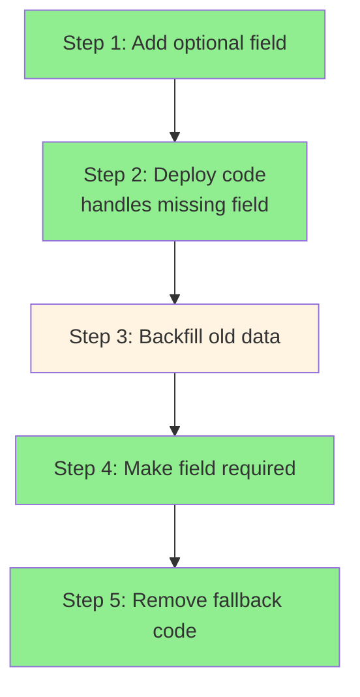
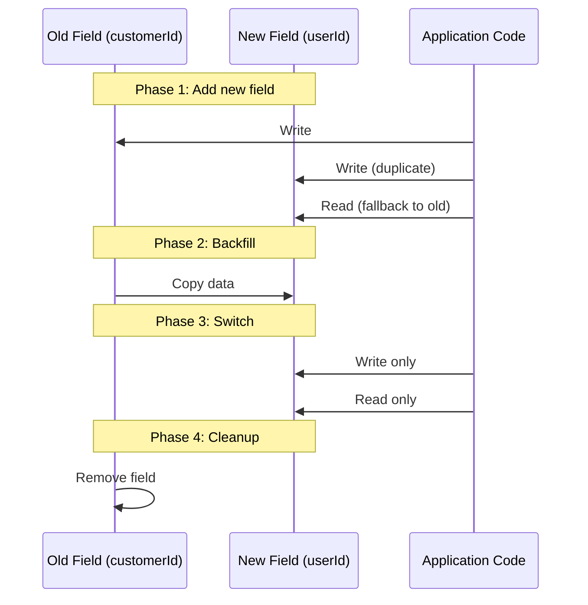
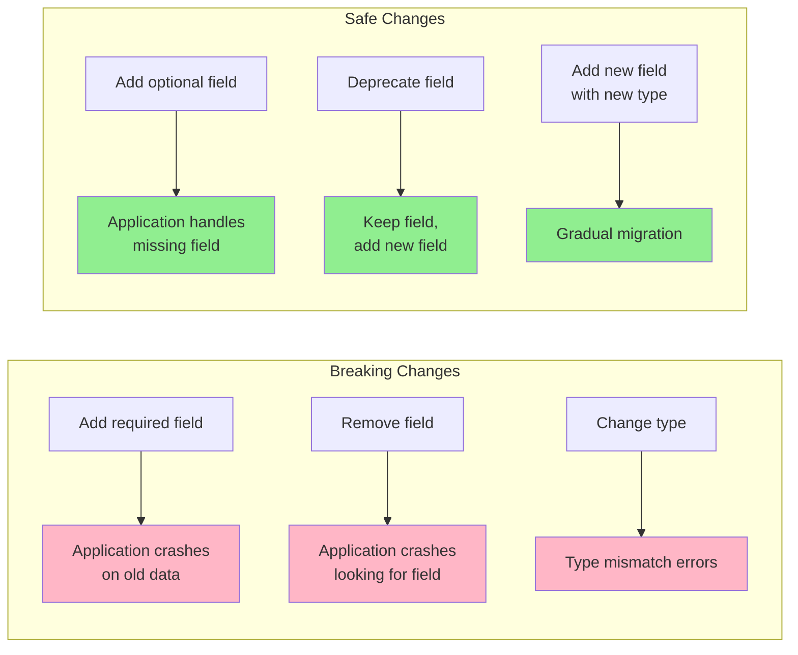
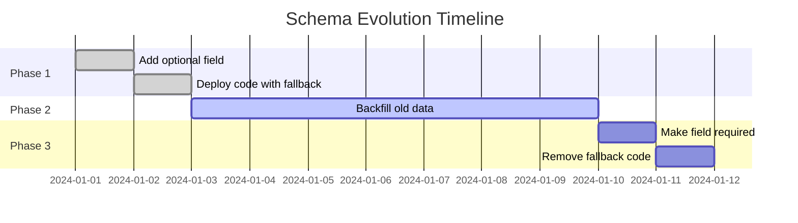

# Schema evolution

## 1. Why this exists (Real-world problem first)

Your user database has `email` field. Product team wants to add `phoneNumber` for SMS notifications. You add the field. Old code expects only `email`, crashes when it sees `phoneNumber`. New code expects `phoneNumber`, crashes on old records without it. The problem? No schema evolution strategy causes data migration failures and application crashes.

**Real production failures from poor schema evolution:**

1. **The Required Field Disaster**: User service adds required `phoneNumber` field to user schema. Deploys new code. New code validates all users must have `phoneNumber`. Existing 1M users don't have it. All user lookups fail validation. Login broken. Registration broken. Entire service down. Emergency rollback. Feature delayed 3 months while team learns about optional fields and backfilling.

2. **The Field Rename Catastrophe**: Order service renames `customerId` to `userId` for consistency. Updates code to use `userId`. Deploys. Old orders in database still have `customerId`. New code looks for `userId`, finds `undefined`. Order history broken. Customer support can't look up orders. Manual data migration required for 10M orders. Takes 48 hours. Service degraded during migration.

3. **The Type Change Nightmare**: Product price stored as integer (cents): `price: 2999`. Team changes to float for simplicity: `price: 29.99`. Deploys new code. Old records have integers. New code treats `2999` as `$2999.00` instead of `$29.99`. Prices wrong by 100x. Customers see $2999 products. Sales stop. Emergency rollback. Data corruption in 50K products.

4. **The Index Missing Failure**: Team adds `createdAt` timestamp to all documents for analytics. Doesn't add database index. Analytics queries scan full table. Query time goes from 100ms to 30 seconds. Database CPU at 100%. All queries slow down. API timeouts. Service degradation. Takes 6 hours to identify missing index. Index creation takes 4 hours on 100M records.

**What breaks without schema evolution:**
- Breaking changes crash applications
- Can't add fields safely
- Can't rename or remove fields
- Don't understand backward/forward compatibility
- Fail to plan data migrations
- Can't handle gradual rollouts

## 2. Mental model (build imagination)

Think of schema evolution as **Building Renovations**.

### The Building Renovation Analogy

**Bad Renovation (Breaking Changes)**:
- Close entire building
- Demolish and rebuild
- Everyone moves out
- Business stops during renovation
- High risk, high cost

**Good Renovation (Gradual Evolution)**:
- Keep building open
- Renovate one floor at a time
- People use old and new floors simultaneously
- Business continues during renovation
- Low risk, low cost

**The Flow:**

**Bad Evolution:**
1. Add required field to schema
2. Deploy new code (expects field)
3. Old data doesn't have field
4. Application crashes
5. Emergency rollback

**Good Evolution:**
1. Add optional field to schema
2. Deploy new code (handles missing field)
3. Backfill old data gradually
4. Make field required after backfill
5. Clean up old code

**Why this matters:**
- Enables zero-downtime deployments
- Allows gradual data migration
- Supports backward compatibility
- Prevents breaking changes
- Enables safe rollbacks

## 3. How Node.js implements this internally

### Adding Optional Fields (Backward Compatible)

```javascript
// Step 1: Add optional field to schema
const UserSchemaV1 = {
  email: { type: String, required: true },
  name: { type: String, required: true }
};

const UserSchemaV2 = {
  email: { type: String, required: true },
  name: { type: String, required: true },
  phoneNumber: { type: String, required: false } // Optional!
};

// Step 2: Update code to handle missing field
class UserService {
  async getUser(userId) {
    const user = await db.users.findById(userId);
    
    return {
      email: user.email,
      name: user.name,
      phoneNumber: user.phoneNumber || null // Handle missing field
    };
  }
  
  async sendNotification(userId, message) {
    const user = await db.users.findById(userId);
    
    // Send email (always available)
    await emailService.send(user.email, message);
    
    // Send SMS only if phone number exists
    if (user.phoneNumber) {
      await smsService.send(user.phoneNumber, message);
    }
  }
}

// Step 3: Backfill old data (gradual)
async function backfillPhoneNumbers() {
  const batchSize = 1000;
  let processed = 0;
  
  while (true) {
    const users = await db.users.find({
      phoneNumber: { $exists: false }
    }).limit(batchSize);
    
    if (users.length === 0) break;
    
    for (const user of users) {
      // Get phone number from external source or set default
      const phoneNumber = await getPhoneNumberFromCRM(user.email);
      
      await db.users.update(
        { _id: user._id },
        { $set: { phoneNumber } }
      );
    }
    
    processed += users.length;
    console.log(`Backfilled ${processed} users`);
    
    // Rate limit to avoid overwhelming database
    await sleep(1000);
  }
}

// Step 4: Make field required (after backfill complete)
const UserSchemaV3 = {
  email: { type: String, required: true },
  name: { type: String, required: true },
  phoneNumber: { type: String, required: true } // Now required!
};
```

### Renaming Fields (Multi-Step Process)

```javascript
// Step 1: Add new field, keep old field
const OrderSchemaV1 = {
  customerId: { type: String, required: true }
};

const OrderSchemaV2 = {
  customerId: { type: String, required: true }, // Keep old
  userId: { type: String, required: false } // Add new
};

// Step 2: Write to both fields
class OrderService {
  async createOrder(orderData) {
    const order = await db.orders.create({
      ...orderData,
      customerId: orderData.userId, // Write to old field
      userId: orderData.userId // Write to new field
    });
    
    return order;
  }
  
  // Read from new field, fallback to old
  async getOrder(orderId) {
    const order = await db.orders.findById(orderId);
    
    return {
      ...order,
      userId: order.userId || order.customerId // Fallback
    };
  }
}

// Step 3: Backfill old data
async function backfillUserId() {
  await db.orders.updateMany(
    { userId: { $exists: false } },
    [{ $set: { userId: '$customerId' } }] // Copy customerId to userId
  );
}

// Step 4: Make new field required, remove old field
const OrderSchemaV3 = {
  userId: { type: String, required: true } // Only new field
};

// Step 5: Remove old field from database (optional cleanup)
async function removeOldField() {
  await db.orders.updateMany(
    {},
    { $unset: { customerId: '' } }
  );
}
```

### Changing Field Types (Complex Migration)

```javascript
// Step 1: Old schema (price as integer in cents)
const ProductSchemaV1 = {
  price: { type: Number, required: true } // 2999 = $29.99
};

// Step 2: Add new field with new type
const ProductSchemaV2 = {
  price: { type: Number, required: true }, // Keep old (cents)
  priceDecimal: { type: Number, required: false } // New (dollars)
};

// Step 3: Write to both fields
class ProductService {
  async updatePrice(productId, priceInDollars) {
    await db.products.update(
      { _id: productId },
      {
        $set: {
          price: Math.round(priceInDollars * 100), // Old format (cents)
          priceDecimal: priceInDollars // New format (dollars)
        }
      }
    );
  }
  
  // Read from new field, fallback to old
  async getProduct(productId) {
    const product = await db.products.findById(productId);
    
    return {
      ...product,
      priceDecimal: product.priceDecimal || (product.price / 100)
    };
  }
}

// Step 4: Backfill new field
async function backfillPriceDecimal() {
  await db.products.updateMany(
    { priceDecimal: { $exists: false } },
    [{ $set: { priceDecimal: { $divide: ['$price', 100] } } }]
  );
}

// Step 5: Switch to new field, remove old
const ProductSchemaV3 = {
  priceDecimal: { type: Number, required: true }
};
```

### Common Misunderstandings

**Mistake 1**: "Can add required fields directly"
- **Reality**: Must add as optional first, then backfill
- **Impact**: Breaks existing data

**Mistake 2**: "Can rename fields in one step"
- **Reality**: Need multi-step process (add, backfill, remove)
- **Impact**: Data loss or application crashes

**Mistake 3**: "Schema changes are instant"
- **Reality**: Need gradual migration for large datasets
- **Impact**: Long-running migrations block deployments

## 4. Multiple diagrams (MANDATORY)

### Diagram 1: Safe Field Addition Process



### Diagram 2: Field Rename Process



### Diagram 3: Breaking vs Safe Changes



### Diagram 4: Migration Timeline



## 5. Where this is used in real projects

### Adding Optional Field with Backfill

```javascript
const mongoose = require('mongoose');

// Phase 1: Add optional field
const UserSchema = new mongoose.Schema({
  email: { type: String, required: true },
  name: { type: String, required: true },
  phoneNumber: { type: String, required: false }, // New optional field
  createdAt: { type: Date, default: Date.now }
});

// Phase 2: Code handles missing field
class UserService {
  async getUser(userId) {
    const user = await User.findById(userId);
    
    return {
      id: user._id,
      email: user.email,
      name: user.name,
      phoneNumber: user.phoneNumber || null, // Handle missing
      hasPhoneNumber: !!user.phoneNumber
    };
  }
  
  async updatePhoneNumber(userId, phoneNumber) {
    await User.updateOne(
      { _id: userId },
      { $set: { phoneNumber } }
    );
  }
}

// Phase 3: Backfill script
async function backfillPhoneNumbers() {
  const batchSize = 1000;
  let skip = 0;
  let totalProcessed = 0;
  
  while (true) {
    const users = await User.find({
      phoneNumber: { $exists: false }
    })
    .skip(skip)
    .limit(batchSize)
    .lean();
    
    if (users.length === 0) break;
    
    const bulkOps = users.map(user => ({
      updateOne: {
        filter: { _id: user._id },
        update: {
          $set: {
            phoneNumber: getPhoneFromExternalSource(user.email) || null
          }
        }
      }
    }));
    
    await User.bulkWrite(bulkOps);
    
    totalProcessed += users.length;
    console.log(`Backfilled ${totalProcessed} users`);
    
    skip += batchSize;
    
    // Rate limit
    await new Promise(resolve => setTimeout(resolve, 1000));
  }
  
  console.log(`Backfill complete: ${totalProcessed} users`);
}

// Phase 4: Make required (after backfill)
const UserSchemaV2 = new mongoose.Schema({
  email: { type: String, required: true },
  name: { type: String, required: true },
  phoneNumber: { type: String, required: true }, // Now required
  createdAt: { type: Date, default: Date.now }
});
```

### Renaming Field Safely

```javascript
// Phase 1: Add new field, keep old
const OrderSchema = new mongoose.Schema({
  customerId: { type: String, required: true }, // Old
  userId: { type: String, required: false }, // New
  items: [{ type: Object }],
  total: { type: Number, required: true }
});

// Phase 2: Write to both, read from new
class OrderService {
  async createOrder(data) {
    const order = await Order.create({
      ...data,
      customerId: data.userId, // Write to old
      userId: data.userId // Write to new
    });
    
    return order;
  }
  
  async getOrder(orderId) {
    const order = await Order.findById(orderId);
    
    return {
      ...order.toObject(),
      userId: order.userId || order.customerId // Fallback
    };
  }
  
  async updateOrder(orderId, updates) {
    if (updates.userId) {
      updates.customerId = updates.userId; // Keep both in sync
    }
    
    await Order.updateOne({ _id: orderId }, { $set: updates });
  }
}

// Phase 3: Backfill
async function migrateCustomerIdToUserId() {
  const result = await Order.updateMany(
    { userId: { $exists: false } },
    [{ $set: { userId: '$customerId' } }]
  );
  
  console.log(`Migrated ${result.modifiedCount} orders`);
}

// Phase 4: Remove old field
const OrderSchemaV2 = new mongoose.Schema({
  userId: { type: String, required: true }, // Only new field
  items: [{ type: Object }],
  total: { type: Number, required: true }
});

// Phase 5: Cleanup (optional)
async function removeOldField() {
  await Order.updateMany(
    {},
    { $unset: { customerId: '' } }
  );
}
```

### Adding Index During Migration

```javascript
// Phase 1: Add field without index
const ProductSchema = new mongoose.Schema({
  name: String,
  price: Number,
  createdAt: { type: Date, default: Date.now } // New field
});

// Phase 2: Backfill data
async function backfillCreatedAt() {
  await Product.updateMany(
    { createdAt: { $exists: false } },
    { $set: { createdAt: new Date('2024-01-01') } }
  );
}

// Phase 3: Add index (after backfill)
ProductSchema.index({ createdAt: -1 });

// Or add index manually
async function addIndex() {
  await Product.collection.createIndex(
    { createdAt: -1 },
    { background: true } // Non-blocking
  );
}
```

## 6. Where this should NOT be used

### Over-Engineering Simple Schemas

```javascript
// WRONG: Complex migration for internal tool
// Only 100 records, no production traffic
await complexMultiPhaseMigration();

// RIGHT: Simple update for small dataset
await db.users.updateMany(
  {},
  { $set: { newField: 'default' } }
);
```

### Premature Optimization

```javascript
// WRONG: Planning for schema changes that may never happen
const UserSchema = {
  email: String,
  emailV2: String, // "Just in case"
  emailV3: String, // "Future proof"
};

// RIGHT: Add fields when needed
const UserSchema = {
  email: String
};
```

## 7. Failure modes & edge cases

### Failure Mode 1: Incomplete Backfill

**Scenario**: Backfill script crashes mid-way

```javascript
// DISASTER: No tracking of progress
async function backfill() {
  const users = await User.find({ phoneNumber: { $exists: false } });
  for (const user of users) {
    await updateUser(user); // Crashes at user 50,000
  }
  // No way to resume from where it stopped
}

// SOLUTION: Track progress
async function backfillWithTracking() {
  let lastProcessedId = await getLastProcessedId();
  
  while (true) {
    const users = await User.find({
      _id: { $gt: lastProcessedId },
      phoneNumber: { $exists: false }
    }).limit(1000);
    
    if (users.length === 0) break;
    
    for (const user of users) {
      await updateUser(user);
      lastProcessedId = user._id;
      await saveProgress(lastProcessedId);
    }
  }
}
```

### Failure Mode 2: Index Creation Blocking

**Scenario**: Creating index locks database

```javascript
// DISASTER: Foreground index creation
await db.collection.createIndex({ createdAt: -1 });
// Blocks all writes for 30 minutes on 100M records

// SOLUTION: Background index creation
await db.collection.createIndex(
  { createdAt: -1 },
  { background: true }
);
```

### Failure Mode 3: Type Coercion Issues

**Scenario**: Implicit type conversion causes bugs

```javascript
// Old: price as string "29.99"
// New: price as number 29.99

// DISASTER: Comparison fails
if (product.price > 20) // "29.99" > 20 is true (string comparison)

// SOLUTION: Explicit conversion
const price = Number(product.price);
if (price > 20) // 29.99 > 20 is true (numeric comparison)
```

## 8. Trade-offs & alternatives

### Gradual Migration

**Gain**: Zero downtime, safe rollback, low risk
**Sacrifice**: Slower deployment, more code complexity
**When**: Production databases, large datasets, critical systems

### Big Bang Migration

**Gain**: Fast, simple, clean
**Sacrifice**: Downtime required, high risk, no rollback
**When**: Small datasets, development environments, maintenance windows

### Schema Versioning

**Gain**: Multiple schemas coexist, flexible
**Sacrifice**: Complex code, version management overhead
**When**: Event sourcing, long-term data storage

## 9. Interview-level articulation

**Q: "How do you safely add a new required field to a database schema?"**

**A**: "I use a multi-phase approach. First, I add the field as optional and deploy code that handles the missing field with a default value. Second, I run a backfill script to populate the field for existing records, processing in batches to avoid overwhelming the database. Third, after verifying all records have the field, I make it required in the schema and remove the fallback code. This approach ensures zero downtime and allows safe rollback at any point. For example, when adding a `phoneNumber` field to users, I'd add it as optional, deploy code that uses `phoneNumber || null`, backfill from an external source, then make it required once backfill is complete."

**Q: "How do you rename a database field without breaking the application?"**

**A**: "I use a four-phase process. Phase 1: Add the new field while keeping the old field, and update code to write to both fields but read from the new field with fallback to old. Phase 2: Run a backfill script to copy data from old field to new field for existing records. Phase 3: Deploy code that only uses the new field. Phase 4: Remove the old field from the schema and optionally clean it up from the database. This ensures the application works throughout the migration. For example, renaming `customerId` to `userId` would involve writing to both, backfilling `userId` from `customerId`, then switching to `userId` only."

## 10. Key takeaways (engineer mindset)

### What to Remember

1. **Add fields as optional first**, then backfill, then make required
2. **Rename in phases**: Add new, backfill, switch, remove old
3. **Change types**: Add new field, backfill, switch, remove old
4. **Backfill in batches** to avoid overwhelming database
5. **Track progress** for resumable migrations
6. **Create indexes in background** to avoid blocking
7. **Test rollback** at each phase

### What Decisions This Enables

**Schema design decisions**:
- When to add optional vs required fields
- How to handle field renames
- Type change strategies

**Migration decisions**:
- Batch size for backfills
- Rate limiting strategy
- Progress tracking approach

**Deployment decisions**:
- Multi-phase deployment plan
- Rollback strategy at each phase
- Coordination with database changes

### How It Connects to Other Node.js Concepts

**Event Versioning** (Topic 24):
- Schema evolution applies to events
- Version fields enable evolution

**Event Replay** (Topic 26):
- Schema changes affect replay
- Need upcasting for old events

**CQRS** (Topic 28):
- Read/write models evolve independently
- Projections need schema migration

### The Golden Rule

**Always add fields as optional first**. Backfill existing data before making fields required. Use multi-phase process for renames and type changes. Process migrations in batches with progress tracking. Create indexes in background. Test rollback at each phase. Never deploy breaking schema changes without migration plan.
