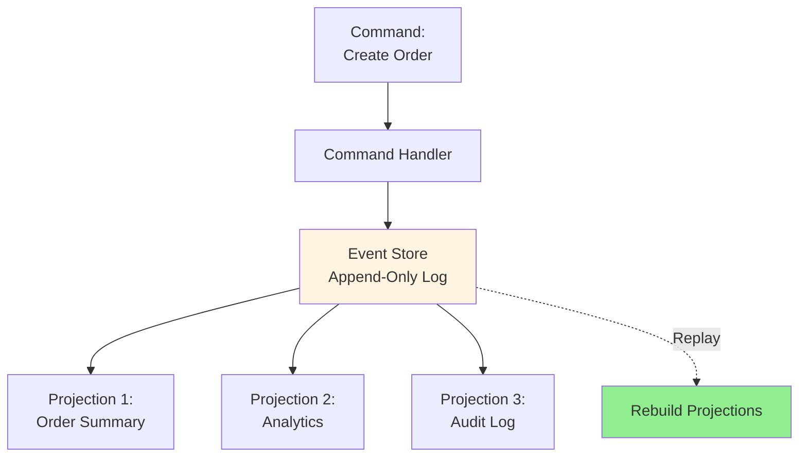
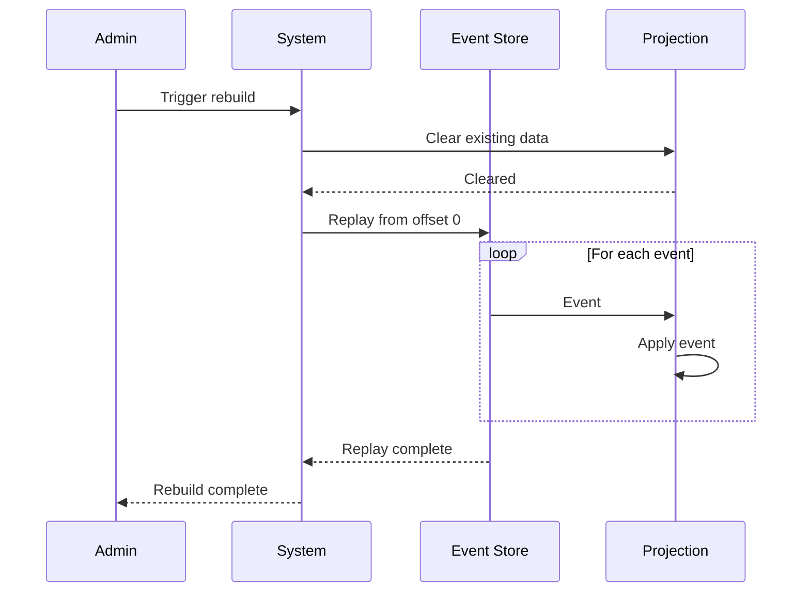
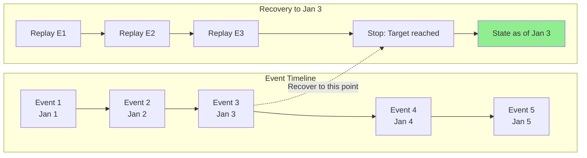
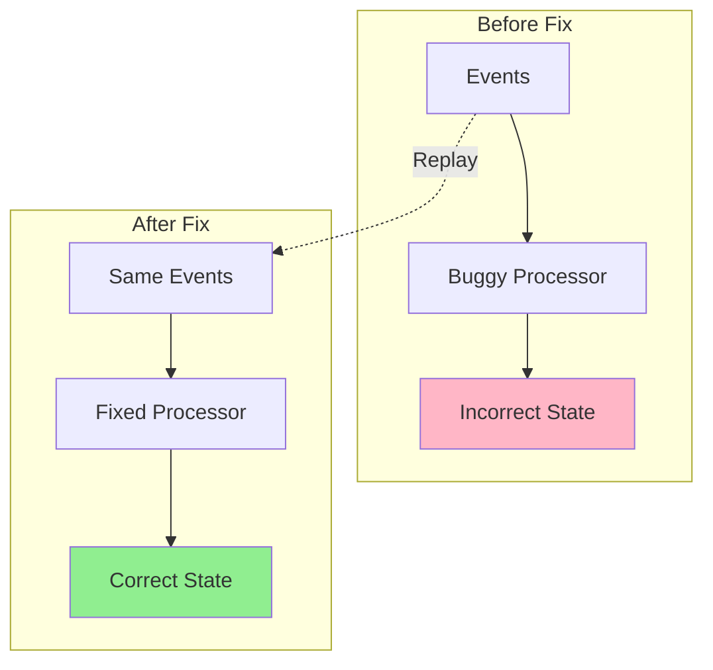

# Event replay & recovery

## 1. Why this exists (Real-world problem first)

Your payment service has a bug that incorrectly calculates tax for international orders. Bug deployed 3 days ago. Affected 5,000 orders. You fix the bug, but how do you recalculate tax for those 5,000 orders? Events were processed and discarded. No event history. The problem? Without event replay capability, you can't recover from bugs or recalculate derived data.

**Real production failures from missing event replay:**

1. **The Tax Calculation Bug**: E-commerce platform calculates tax incorrectly for EU orders. Bug exists for 2 weeks. Affects 10,000 orders. Team fixes bug. But can't recalculate tax for past orders—events were processed and discarded. Manual correction required for 10,000 orders. 80 hours of engineering time. $50K in operational costs. Customer trust damaged.

2. **The Analytics Rebuild Nightmare**: Analytics service builds dashboards from order events. Database corrupted. Need to rebuild from scratch. But events weren't persisted—only processed in real-time. No way to rebuild. Analytics data lost. Team manually reconstructs 6 months of data from database snapshots. Takes 3 weeks. Dashboards inaccurate.

3. **The Projection Bug**: CQRS system maintains read model (projection) from events. Bug in projection logic causes incorrect inventory counts. Shows 100 items in stock when actually 0. Oversell by 100 units. Team fixes projection bug. But can't replay events to rebuild correct projection. Manual inventory reconciliation required across 50,000 products.

4. **The Compliance Audit Failure**: Banking app must provide audit trail of all transactions. Regulator requests transaction history for investigation. Events were processed but not stored. No audit trail. Compliance violation. $500K fine. Emergency implementation of event storage takes 2 months.

**What breaks without event replay:**
- Can't recover from bugs
- Can't rebuild derived data
- Can't audit historical events
- Can't add new consumers retroactively
- Don't understand event sourcing
- Fail to implement disaster recovery

## 2. Mental model (build imagination)

Think of event replay as **Security Camera Footage**.

### The Security Camera Analogy

**Without Event Replay (No Recording)**:
- Security guard watches live feed
- Incident happens
- No recording, can't review
- Can't prove what happened
- Can't learn from incident

**With Event Replay (Recorded Footage)**:
- Security camera records everything
- Incident happens
- Review footage to understand what happened
- Prove sequence of events
- Learn and prevent future incidents
- Can replay from any point

**The Flow:**

**Without Replay:**
1. Event arrives
2. Process event
3. Discard event
4. Bug discovered later
5. Can't fix past data

**With Replay:**
1. Event arrives
2. Store event (append-only log)
3. Process event
4. Bug discovered later
5. Replay events with fixed code
6. Rebuild correct state

**Why this matters:**
- Events are source of truth
- Can rebuild any state from events
- Can recover from bugs
- Can add new consumers
- Enables time travel debugging

## 3. How Node.js implements this internally

### Event Store with Kafka

```javascript
const { Kafka } = require('kafkajs');

// Event Store
class EventStore {
  constructor() {
    this.kafka = new Kafka({
      clientId: 'event-store',
      brokers: ['localhost:9092']
    });
    
    this.producer = this.kafka.producer();
  }
  
  async connect() {
    await this.producer.connect();
  }
  
  async append(streamId, event) {
    await this.producer.send({
      topic: streamId,
      messages: [{
        key: event.aggregateId,
        value: JSON.stringify({
          eventId: event.id,
          eventType: event.type,
          timestamp: new Date().toISOString(),
          data: event.data,
          metadata: event.metadata
        })
      }]
    });
  }
  
  async replay(streamId, fromOffset, handler) {
    const consumer = this.kafka.consumer({
      groupId: `replay-${Date.now()}` // Unique group for replay
    });
    
    await consumer.connect();
    await consumer.subscribe({ topic: streamId, fromBeginning: true });
    
    await consumer.run({
      eachMessage: async ({ topic, partition, message }) => {
        if (message.offset >= fromOffset) {
          const event = JSON.parse(message.value.toString());
          await handler(event);
        }
      }
    });
  }
}

// Usage
const eventStore = new EventStore();
await eventStore.connect();

// Append events
await eventStore.append('orders', {
  id: '123',
  type: 'order.created',
  aggregateId: 'order-456',
  data: { total: 100, items: [...] }
});

// Replay events
await eventStore.replay('orders', 0, async (event) => {
  console.log('Replaying:', event);
  await processEvent(event);
});
```

### Projection Rebuild from Events

```javascript
class OrderProjection {
  constructor(eventStore) {
    this.eventStore = eventStore;
    this.db = require('./database');
  }
  
  async rebuild() {
    console.log('Rebuilding order projection...');
    
    // Clear existing projection
    await this.db.orderSummary.deleteMany({});
    
    // Replay all events
    await this.eventStore.replay('orders', 0, async (event) => {
      await this.handleEvent(event);
    });
    
    console.log('Projection rebuild complete');
  }
  
  async handleEvent(event) {
    switch (event.eventType) {
      case 'order.created':
        await this.handleOrderCreated(event);
        break;
      case 'order.paid':
        await this.handleOrderPaid(event);
        break;
      case 'order.shipped':
        await this.handleOrderShipped(event);
        break;
    }
  }
  
  async handleOrderCreated(event) {
    await this.db.orderSummary.create({
      orderId: event.data.orderId,
      userId: event.data.userId,
      total: event.data.total,
      status: 'created',
      createdAt: event.timestamp
    });
  }
  
  async handleOrderPaid(event) {
    await this.db.orderSummary.updateOne(
      { orderId: event.data.orderId },
      { $set: { status: 'paid', paidAt: event.timestamp } }
    );
  }
  
  async handleOrderShipped(event) {
    await this.db.orderSummary.updateOne(
      { orderId: event.data.orderId },
      { $set: { status: 'shipped', shippedAt: event.timestamp } }
    );
  }
}

// Rebuild projection after bug fix
const projection = new OrderProjection(eventStore);
await projection.rebuild();
```

### Point-in-Time Recovery

```javascript
class PointInTimeRecovery {
  constructor(eventStore) {
    this.eventStore = eventStore;
  }
  
  async recoverToTimestamp(streamId, targetTimestamp) {
    const state = {};
    
    await this.eventStore.replay(streamId, 0, async (event) => {
      const eventTime = new Date(event.timestamp);
      
      // Only process events before target timestamp
      if (eventTime <= targetTimestamp) {
        await this.applyEvent(state, event);
      }
    });
    
    return state;
  }
  
  async applyEvent(state, event) {
    switch (event.eventType) {
      case 'order.created':
        state[event.data.orderId] = {
          id: event.data.orderId,
          total: event.data.total,
          status: 'created'
        };
        break;
      
      case 'order.paid':
        if (state[event.data.orderId]) {
          state[event.data.orderId].status = 'paid';
        }
        break;
    }
  }
}

// Recover state as it was on 2024-01-01
const recovery = new PointInTimeRecovery(eventStore);
const stateAtDate = await recovery.recoverToTimestamp(
  'orders',
  new Date('2024-01-01')
);
```

### Common Misunderstandings

**Mistake 1**: "Replay means reprocessing everything"
- **Reality**: Can replay from specific offset or time
- **Impact**: Unnecessary reprocessing

**Mistake 2**: "Events can be modified"
- **Reality**: Events are immutable, append-only
- **Impact**: Data corruption if events modified

**Mistake 3**: "Replay is instant"
- **Reality**: Replaying millions of events takes time
- **Impact**: Underestimating rebuild time

## 4. Multiple diagrams (MANDATORY)

### Diagram 1: Event Sourcing Architecture



### Diagram 2: Event Replay Process



### Diagram 3: Point-in-Time Recovery



### Diagram 4: Bug Fix with Replay



## 5. Where this is used in real projects

### Order Event Sourcing

```javascript
const { Kafka } = require('kafkajs');

class OrderEventStore {
  constructor() {
    this.kafka = new Kafka({
      clientId: 'order-service',
      brokers: ['localhost:9092']
    });
    
    this.producer = this.kafka.producer();
  }
  
  async connect() {
    await this.producer.connect();
  }
  
  async appendEvent(orderId, event) {
    await this.producer.send({
      topic: 'order-events',
      messages: [{
        key: orderId,
        value: JSON.stringify({
          eventId: crypto.randomUUID(),
          eventType: event.type,
          aggregateId: orderId,
          timestamp: new Date().toISOString(),
          data: event.data,
          version: event.version || 1
        }),
        headers: {
          'event-type': event.type,
          'aggregate-id': orderId
        }
      }]
    });
  }
  
  async getOrderHistory(orderId) {
    const consumer = this.kafka.consumer({
      groupId: `order-history-${Date.now()}`
    });
    
    await consumer.connect();
    await consumer.subscribe({ topic: 'order-events', fromBeginning: true });
    
    const events = [];
    
    await consumer.run({
      eachMessage: async ({ message }) => {
        if (message.key.toString() === orderId) {
          events.push(JSON.parse(message.value.toString()));
        }
      }
    });
    
    return events;
  }
  
  async replayOrderEvents(orderId, handler) {
    const events = await this.getOrderHistory(orderId);
    
    for (const event of events) {
      await handler(event);
    }
  }
}

// Usage: Rebuild order state from events
class OrderAggregate {
  constructor(orderId) {
    this.orderId = orderId;
    this.state = {
      status: 'new',
      total: 0,
      items: []
    };
  }
  
  async loadFromHistory(eventStore) {
    await eventStore.replayOrderEvents(this.orderId, (event) => {
      this.applyEvent(event);
    });
  }
  
  applyEvent(event) {
    switch (event.eventType) {
      case 'order.created':
        this.state.status = 'created';
        this.state.total = event.data.total;
        this.state.items = event.data.items;
        break;
      
      case 'order.paid':
        this.state.status = 'paid';
        this.state.paidAt = event.timestamp;
        break;
      
      case 'order.shipped':
        this.state.status = 'shipped';
        this.state.shippedAt = event.timestamp;
        break;
      
      case 'order.cancelled':
        this.state.status = 'cancelled';
        this.state.cancelledAt = event.timestamp;
        break;
    }
  }
}

// Rebuild order state
const order = new OrderAggregate('order-123');
await order.loadFromHistory(eventStore);
console.log(order.state);
```

### Analytics Projection Rebuild

```javascript
class AnalyticsProjection {
  constructor(eventStore) {
    this.eventStore = eventStore;
    this.db = require('./database');
  }
  
  async rebuildFromDate(startDate) {
    console.log(`Rebuilding analytics from ${startDate}...`);
    
    // Clear analytics data from start date
    await this.db.analytics.deleteMany({
      date: { $gte: startDate }
    });
    
    // Replay events from start date
    const consumer = this.eventStore.kafka.consumer({
      groupId: `analytics-rebuild-${Date.now()}`
    });
    
    await consumer.connect();
    await consumer.subscribe({ topic: 'order-events', fromBeginning: true });
    
    let processed = 0;
    
    await consumer.run({
      eachMessage: async ({ message }) => {
        const event = JSON.parse(message.value.toString());
        const eventDate = new Date(event.timestamp);
        
        if (eventDate >= startDate) {
          await this.processEvent(event);
          processed++;
          
          if (processed % 1000 === 0) {
            console.log(`Processed ${processed} events`);
          }
        }
      }
    });
  }
  
  async processEvent(event) {
    const date = new Date(event.timestamp).toISOString().split('T')[0];
    
    switch (event.eventType) {
      case 'order.created':
        await this.db.analytics.updateOne(
          { date, metric: 'orders_created' },
          { $inc: { count: 1, total: event.data.total } },
          { upsert: true }
        );
        break;
      
      case 'order.paid':
        await this.db.analytics.updateOne(
          { date, metric: 'orders_paid' },
          { $inc: { count: 1, revenue: event.data.total } },
          { upsert: true }
        );
        break;
    }
  }
}

// Rebuild analytics after bug fix
const analytics = new AnalyticsProjection(eventStore);
await analytics.rebuildFromDate(new Date('2024-01-01'));
```

### Audit Log Recovery

```javascript
class AuditLogRecovery {
  constructor(eventStore) {
    this.eventStore = eventStore;
  }
  
  async generateAuditReport(userId, startDate, endDate) {
    const consumer = this.eventStore.kafka.consumer({
      groupId: `audit-${Date.now()}`
    });
    
    await consumer.connect();
    await consumer.subscribe({ topic: 'user-events', fromBeginning: true });
    
    const auditTrail = [];
    
    await consumer.run({
      eachMessage: async ({ message }) => {
        const event = JSON.parse(message.value.toString());
        const eventDate = new Date(event.timestamp);
        
        if (
          event.data.userId === userId &&
          eventDate >= startDate &&
          eventDate <= endDate
        ) {
          auditTrail.push({
            timestamp: event.timestamp,
            eventType: event.eventType,
            action: this.describeAction(event),
            details: event.data
          });
        }
      }
    });
    
    return auditTrail;
  }
  
  describeAction(event) {
    const actions = {
      'user.login': 'User logged in',
      'user.logout': 'User logged out',
      'order.created': 'Created order',
      'payment.processed': 'Processed payment',
      'profile.updated': 'Updated profile'
    };
    
    return actions[event.eventType] || event.eventType;
  }
}

// Generate audit report for compliance
const audit = new AuditLogRecovery(eventStore);
const report = await audit.generateAuditReport(
  'user-123',
  new Date('2024-01-01'),
  new Date('2024-12-31')
);

console.log('Audit Trail:', report);
```

## 6. Where this should NOT be used

### High-Frequency Events

```javascript
// WRONG: Event sourcing for sensor data
// 1000 events/sec per sensor, 1000 sensors
// 1M events/sec, 86B events/day
await eventStore.append('sensor-123', {
  type: 'temperature.reading',
  data: { value: 23.5 }
});

// RIGHT: Aggregate and sample
await eventStore.append('sensor-123', {
  type: 'temperature.summary',
  data: {
    avg: 23.5,
    min: 20.0,
    max: 25.0,
    samples: 1000
  }
});
```

### Temporary State

```javascript
// WRONG: Event sourcing for session state
await eventStore.append('session-123', {
  type: 'mouse.moved',
  data: { x: 100, y: 200 }
});

// RIGHT: Use cache/memory
await redis.set('session:123:mouse', JSON.stringify({ x: 100, y: 200 }));
```

## 7. Failure modes & edge cases

### Failure Mode 1: Replay Too Slow

**Scenario**: Replaying 100M events takes 10 hours

```javascript
// DISASTER: Sequential replay
for (const event of events) {
  await processEvent(event); // 100M * 100ms = 10 hours
}

// SOLUTION: Parallel replay with batching
const batchSize = 1000;
for (let i = 0; i < events.length; i += batchSize) {
  const batch = events.slice(i, i + batchSize);
  await Promise.all(batch.map(e => processEvent(e)));
}
```

### Failure Mode 2: Event Schema Changes

**Scenario**: Old events have different schema

```javascript
// DISASTER: Assume all events have same schema
const total = event.data.total; // Undefined for old events

// SOLUTION: Upcasting
function upcastEvent(event) {
  if (event.version === 1) {
    return {
      ...event,
      version: 2,
      data: {
        ...event.data,
        total: event.data.amount || 0 // Handle old field name
      }
    };
  }
  return event;
}
```

### Failure Mode 3: Idempotency Issues

**Scenario**: Replay processes events twice

```javascript
// DISASTER: Non-idempotent replay
await db.inventory.decrement('product-123', 1);
// Replay decrements again!

// SOLUTION: Idempotent operations
await db.inventory.set('product-123', calculatedValue);
// Or track processed events
```

## 8. Trade-offs & alternatives

### Event Sourcing with Replay

**Gain**: Complete audit trail, time travel, bug recovery
**Sacrifice**: Storage cost, replay complexity, eventual consistency
**When**: Financial systems, audit requirements, complex domains

### Snapshots + Events

**Gain**: Faster replay, reduced storage
**Sacrifice**: More complexity, snapshot management
**When**: Large event streams, frequent replays

### Traditional CRUD

**Gain**: Simple, immediate consistency, familiar
**Sacrifice**: No audit trail, can't replay, hard to recover
**When**: Simple domains, no audit requirements

## 9. Interview-level articulation

**Q: "What is event replay and why is it useful?"**

**A**: "Event replay is the ability to reprocess historical events to rebuild state or recover from bugs. In event sourcing, events are stored in an append-only log as the source of truth. If I discover a bug in my projection logic, I can replay all events through the fixed code to rebuild the correct state. For example, if my analytics service had a bug that miscounted orders, I'd fix the bug, clear the analytics database, and replay all order events from Kafka to rebuild accurate analytics. This is only possible because events are immutable and stored permanently. Event replay also enables point-in-time recovery—I can rebuild state as it existed at any point in the past by replaying events up to that timestamp."

**Q: "How do you handle schema changes during event replay?"**

**A**: "I use upcasting to transform old events to the latest schema before processing. Each event includes a version number. When replaying, I check the version and apply transformation functions to convert old formats to new formats. For example, if version 1 events had a `customerId` field and version 2 renamed it to `userId`, my upcaster would copy `customerId` to `userId` for v1 events. This allows my processing code to only handle the latest schema while still being able to replay historical events. I also use semantic versioning to track breaking changes and maintain upcasters for each version transition."

## 10. Key takeaways (engineer mindset)

### What to Remember

1. **Events are immutable** source of truth
2. **Append-only log** enables replay
3. **Replay rebuilds state** from events
4. **Point-in-time recovery** possible
5. **Upcasting** handles schema changes
6. **Idempotent processing** required
7. **Snapshots** optimize long replays

### What Decisions This Enables

**Architecture decisions**:
- Event sourcing vs traditional CRUD
- When to use snapshots
- Event retention policies

**Recovery decisions**:
- How to fix bugs in production
- How to rebuild projections
- Disaster recovery strategy

**Audit decisions**:
- Compliance and audit trails
- Historical data analysis
- Debugging production issues

### How It Connects to Other Node.js Concepts

**Event Versioning** (Topic 24):
- Replay requires handling multiple versions
- Upcasting transforms old events

**Message Brokers** (Topic 21):
- Kafka provides event storage
- Retention policies affect replay

**CQRS** (Topic 28):
- Projections rebuilt from events
- Read models derived from event log

### The Golden Rule

**Store events as immutable source of truth**. Use append-only log (Kafka, EventStore). Enable replay for bug recovery and projection rebuilds. Handle schema changes with upcasting. Make processing idempotent. Use snapshots for performance. Implement point-in-time recovery for audit and compliance.
