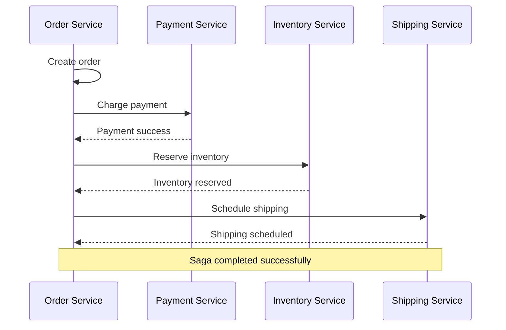
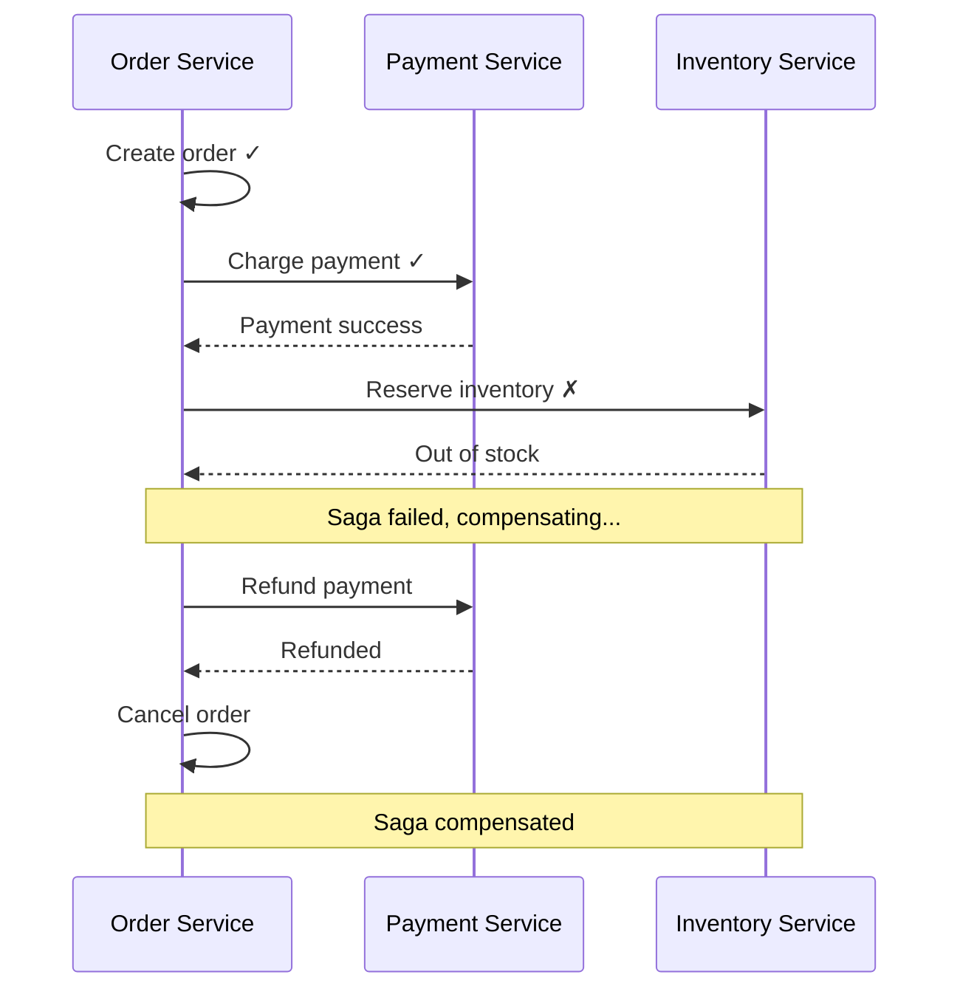
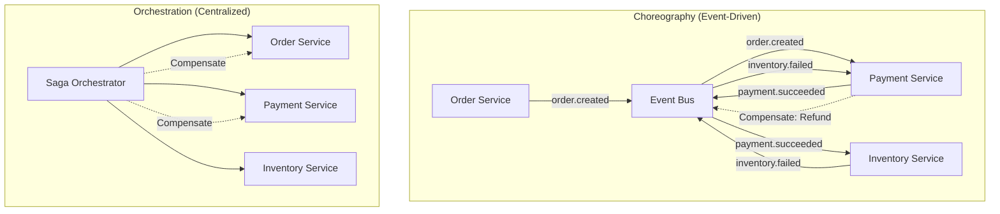
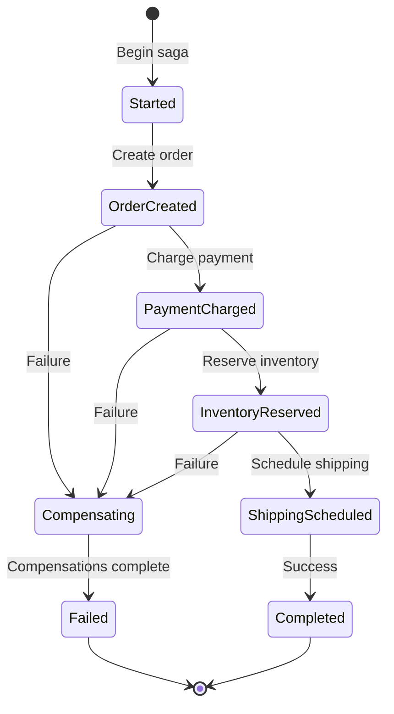

# Saga Pattern

## 1. Why this exists (Real-world problem first)

Your e-commerce order flow spans 4 microservices: Order, Payment, Inventory, Shipping. Order created → Payment charged → Inventory reserved → Shipping scheduled. Payment succeeds, inventory reservation fails (out of stock). Customer charged but order can't be fulfilled. The problem? No distributed transaction coordination means partial failures leave system in inconsistent state.

**Real production failures from missing saga pattern:**

1. **The Partial Order Disaster**: E-commerce platform processes order across 4 services. Order service creates order. Payment service charges $500. Inventory service fails (out of stock). No rollback logic. Customer charged $500 but order cancelled. Happens to 200 customers during Black Friday. $100K in charges that need manual refunds. Support overwhelmed. Takes 2 weeks to process refunds.

2. **The Hotel Booking Nightmare**: Travel booking platform books flight + hotel + car. Flight booked successfully. Hotel booking fails (no availability). Car rental proceeds anyway. Customer has flight and car but no hotel. Discovers issue at airport. Support can't fix in real-time. Customer stranded. $5K compensation per affected customer. 50 customers affected. $250K in compensation costs.

3. **The Inventory Leak**: Order processing reserves inventory, charges payment, schedules shipping. Shipping service crashes before completing. Inventory stays reserved forever. After 1 week, 500 products show "out of stock" but aren't actually sold. Manual inventory reconciliation required. Sales lost due to false "out of stock" status.

4. **The Payment Limbo**: Payment service charges card, then crashes before confirming to order service. Order service times out, shows "payment failed" to customer. But payment actually succeeded. Customer charged without order. Happens 100 times per day. Manual reconciliation required. Customer trust damaged.

**What breaks without saga pattern:**
- Partial failures leave inconsistent state
- Can't rollback distributed transactions
- Don't understand compensation logic
- Fail to coordinate across services
- Can't handle long-running workflows
- Don't know when to use sagas vs 2PC

## 2. Mental model (build imagination)

Think of sagas as **Travel Itinerary with Cancellation Policies**.

### The Travel Itinerary Analogy

**Without Saga (No Coordination)**:
- Book flight
- Book hotel
- Book car
- Hotel booking fails
- Flight and car still booked
- Manual cancellation required

**With Saga (Coordinated with Compensation)**:
- Book flight (save cancellation policy)
- Book hotel (save cancellation policy)
- Hotel fails → Cancel flight → Cancel car
- All or nothing (eventually)

**The Flow:**

**Forward Flow (Happy Path)**:
1. Create order → Success
2. Charge payment → Success
3. Reserve inventory → Success
4. Schedule shipping → Success
5. Complete saga

**Compensation Flow (Failure)**:
1. Create order → Success
2. Charge payment → Success
3. Reserve inventory → **Failure**
4. Compensate: Refund payment
5. Compensate: Cancel order
6. Saga failed (consistent state)

**Why this matters:**
- Enables distributed transactions
- Provides eventual consistency
- Handles partial failures gracefully
- Maintains data consistency across services
- No need for distributed locks

## 3. How Node.js implements this internally

### Choreography-Based Saga (Event-Driven)

```javascript
const EventEmitter = require('events');
const eventBus = new EventEmitter();

// Order Service
class OrderService {
  async createOrder(orderData) {
    const order = await db.orders.create({
      ...orderData,
      status: 'pending'
    });
    
    // Emit event to start saga
    eventBus.emit('order.created', {
      orderId: order.id,
      userId: orderData.userId,
      total: orderData.total,
      items: orderData.items
    });
    
    return order;
  }
  
  // Listen for compensation events
  constructor() {
    eventBus.on('payment.failed', this.handlePaymentFailed.bind(this));
    eventBus.on('inventory.failed', this.handleInventoryFailed.bind(this));
  }
  
  async handlePaymentFailed({ orderId }) {
    await db.orders.update(orderId, {
      status: 'cancelled',
      reason: 'payment_failed'
    });
  }
  
  async handleInventoryFailed({ orderId }) {
    await db.orders.update(orderId, {
      status: 'cancelled',
      reason: 'out_of_stock'
    });
  }
}

// Payment Service
class PaymentService {
  constructor() {
    eventBus.on('order.created', this.handleOrderCreated.bind(this));
    eventBus.on('inventory.failed', this.handleInventoryFailed.bind(this));
  }
  
  async handleOrderCreated({ orderId, userId, total }) {
    try {
      const payment = await this.chargePayment(userId, total);
      
      eventBus.emit('payment.succeeded', {
        orderId,
        paymentId: payment.id,
        total
      });
    } catch (err) {
      eventBus.emit('payment.failed', {
        orderId,
        error: err.message
      });
    }
  }
  
  // Compensation: Refund payment
  async handleInventoryFailed({ orderId, paymentId }) {
    await this.refundPayment(paymentId);
    console.log(`Refunded payment for order ${orderId}`);
  }
  
  async chargePayment(userId, total) {
    // Charge via Stripe
    return await stripe.charges.create({ amount: total, customer: userId });
  }
  
  async refundPayment(paymentId) {
    await stripe.refunds.create({ charge: paymentId });
  }
}

// Inventory Service
class InventoryService {
  constructor() {
    eventBus.on('payment.succeeded', this.handlePaymentSucceeded.bind(this));
  }
  
  async handlePaymentSucceeded({ orderId, items }) {
    try {
      await this.reserveInventory(items);
      
      eventBus.emit('inventory.reserved', {
        orderId,
        items
      });
    } catch (err) {
      eventBus.emit('inventory.failed', {
        orderId,
        error: err.message
      });
    }
  }
  
  async reserveInventory(items) {
    for (const item of items) {
      const product = await db.inventory.findOne({ productId: item.productId });
      
      if (product.quantity < item.quantity) {
        throw new Error(`Insufficient inventory for ${item.productId}`);
      }
      
      await db.inventory.decrement(item.productId, item.quantity);
    }
  }
}
```

### Orchestration-Based Saga (Centralized Coordinator)

```javascript
class OrderSagaOrchestrator {
  async executeOrderSaga(orderData) {
    const sagaId = crypto.randomUUID();
    const sagaState = {
      sagaId,
      status: 'started',
      steps: [],
      compensations: []
    };
    
    try {
      // Step 1: Create order
      const order = await this.createOrder(orderData);
      sagaState.steps.push({ step: 'order_created', orderId: order.id });
      sagaState.compensations.push(() => this.cancelOrder(order.id));
      
      // Step 2: Charge payment
      const payment = await this.chargePayment(order);
      sagaState.steps.push({ step: 'payment_charged', paymentId: payment.id });
      sagaState.compensations.push(() => this.refundPayment(payment.id));
      
      // Step 3: Reserve inventory
      await this.reserveInventory(order);
      sagaState.steps.push({ step: 'inventory_reserved' });
      sagaState.compensations.push(() => this.releaseInventory(order));
      
      // Step 4: Schedule shipping
      const shipment = await this.scheduleShipping(order);
      sagaState.steps.push({ step: 'shipping_scheduled', shipmentId: shipment.id });
      
      // Saga completed successfully
      sagaState.status = 'completed';
      await this.saveSagaState(sagaState);
      
      return { success: true, orderId: order.id };
    } catch (err) {
      // Saga failed, execute compensations in reverse order
      console.error('Saga failed:', err);
      sagaState.status = 'compensating';
      
      for (const compensation of sagaState.compensations.reverse()) {
        try {
          await compensation();
        } catch (compErr) {
          console.error('Compensation failed:', compErr);
          // Log for manual intervention
        }
      }
      
      sagaState.status = 'failed';
      await this.saveSagaState(sagaState);
      
      return { success: false, error: err.message };
    }
  }
  
  async createOrder(orderData) {
    return await db.orders.create({
      ...orderData,
      status: 'pending'
    });
  }
  
  async cancelOrder(orderId) {
    await db.orders.update(orderId, { status: 'cancelled' });
  }
  
  async chargePayment(order) {
    return await stripe.charges.create({
      amount: order.total,
      customer: order.userId
    });
  }
  
  async refundPayment(paymentId) {
    await stripe.refunds.create({ charge: paymentId });
  }
  
  async reserveInventory(order) {
    for (const item of order.items) {
      await db.inventory.decrement(item.productId, item.quantity);
    }
  }
  
  async releaseInventory(order) {
    for (const item of order.items) {
      await db.inventory.increment(item.productId, item.quantity);
    }
  }
  
  async scheduleShipping(order) {
    return await shippingService.schedule({
      orderId: order.id,
      address: order.shippingAddress
    });
  }
  
  async saveSagaState(state) {
    await db.sagas.upsert({
      sagaId: state.sagaId,
      status: state.status,
      steps: state.steps,
      updatedAt: new Date()
    });
  }
}

// Usage
const saga = new OrderSagaOrchestrator();
const result = await saga.executeOrderSaga({
  userId: 'user-123',
  items: [{ productId: 'prod-1', quantity: 2 }],
  total: 5000,
  shippingAddress: { /* ... */ }
});
```

### Common Misunderstandings

**Mistake 1**: "Sagas provide ACID transactions"
- **Reality**: Sagas provide eventual consistency, not atomicity
- **Impact**: Wrong expectations about consistency guarantees

**Mistake 2**: "Compensations always succeed"
- **Reality**: Compensations can fail, need retry/manual intervention
- **Impact**: Incomplete rollback, inconsistent state

**Mistake 3**: "Sagas are always better than 2PC"
- **Reality**: 2PC provides stronger guarantees but lower availability
- **Impact**: Wrong pattern choice for use case

## 4. Multiple diagrams (MANDATORY)

### Diagram 1: Saga Success Flow



### Diagram 2: Saga Compensation Flow



### Diagram 3: Choreography vs Orchestration



### Diagram 4: Saga State Machine



## 5. Where this is used in real projects

### E-Commerce Order Processing

```javascript
class OrderSaga {
  async processOrder(orderData) {
    const saga = {
      id: crypto.randomUUID(),
      orderId: null,
      paymentId: null,
      reservationId: null,
      status: 'started',
      compensations: []
    };
    
    try {
      // Step 1: Create order
      const order = await db.orders.create({
        ...orderData,
        status: 'processing'
      });
      saga.orderId = order.id;
      saga.compensations.push({
        action: 'cancel_order',
        params: { orderId: order.id }
      });
      
      // Step 2: Validate inventory
      const inventoryCheck = await inventoryService.checkAvailability(orderData.items);
      if (!inventoryCheck.available) {
        throw new Error('Insufficient inventory');
      }
      
      // Step 3: Charge payment
      const payment = await paymentService.charge({
        amount: orderData.total,
        userId: orderData.userId,
        orderId: order.id
      });
      saga.paymentId = payment.id;
      saga.compensations.push({
        action: 'refund_payment',
        params: { paymentId: payment.id }
      });
      
      // Step 4: Reserve inventory
      const reservation = await inventoryService.reserve({
        orderId: order.id,
        items: orderData.items
      });
      saga.reservationId = reservation.id;
      saga.compensations.push({
        action: 'release_inventory',
        params: { reservationId: reservation.id }
      });
      
      // Step 5: Schedule shipping
      await shippingService.schedule({
        orderId: order.id,
        address: orderData.shippingAddress
      });
      
      // Step 6: Complete order
      await db.orders.update(order.id, { status: 'completed' });
      saga.status = 'completed';
      
      return { success: true, orderId: order.id };
    } catch (err) {
      console.error('Saga failed:', err);
      saga.status = 'compensating';
      
      // Execute compensations
      await this.compensate(saga.compensations);
      
      saga.status = 'failed';
      return { success: false, error: err.message };
    } finally {
      await db.sagas.insert(saga);
    }
  }
  
  async compensate(compensations) {
    for (const comp of compensations.reverse()) {
      try {
        switch (comp.action) {
          case 'cancel_order':
            await db.orders.update(comp.params.orderId, {
              status: 'cancelled'
            });
            break;
          
          case 'refund_payment':
            await paymentService.refund(comp.params.paymentId);
            break;
          
          case 'release_inventory':
            await inventoryService.release(comp.params.reservationId);
            break;
        }
      } catch (compErr) {
        console.error('Compensation failed:', compErr);
        // Log for manual intervention
        await db.failedCompensations.insert({
          action: comp.action,
          params: comp.params,
          error: compErr.message
        });
      }
    }
  }
}
```

### Travel Booking Saga

```javascript
class TravelBookingSaga {
  async bookTrip(tripData) {
    const bookings = [];
    
    try {
      // Book flight
      const flight = await flightService.book({
        from: tripData.origin,
        to: tripData.destination,
        date: tripData.date
      });
      bookings.push({
        type: 'flight',
        id: flight.id,
        cancel: () => flightService.cancel(flight.id)
      });
      
      // Book hotel
      const hotel = await hotelService.book({
        location: tripData.destination,
        checkIn: tripData.date,
        checkOut: tripData.returnDate
      });
      bookings.push({
        type: 'hotel',
        id: hotel.id,
        cancel: () => hotelService.cancel(hotel.id)
      });
      
      // Book car rental
      const car = await carService.book({
        location: tripData.destination,
        pickupDate: tripData.date,
        returnDate: tripData.returnDate
      });
      bookings.push({
        type: 'car',
        id: car.id,
        cancel: () => carService.cancel(car.id)
      });
      
      // All bookings successful
      return {
        success: true,
        bookings: {
          flight: flight.id,
          hotel: hotel.id,
          car: car.id
        }
      };
    } catch (err) {
      console.error('Booking failed:', err);
      
      // Cancel all successful bookings
      for (const booking of bookings.reverse()) {
        try {
          await booking.cancel();
          console.log(`Cancelled ${booking.type}: ${booking.id}`);
        } catch (cancelErr) {
          console.error(`Failed to cancel ${booking.type}:`, cancelErr);
        }
      }
      
      return { success: false, error: err.message };
    }
  }
}
```

## 6. Where this should NOT be used

### Simple Single-Service Operations

```javascript
// WRONG: Saga for single service
const saga = new Saga();
await saga.execute([
  () => db.users.create(userData)
]);

// RIGHT: Simple transaction
await db.transaction(async (trx) => {
  await trx('users').insert(userData);
});
```

### Real-Time Consistency Required

```javascript
// WRONG: Saga for bank transfer (needs immediate consistency)
// Account A: -$100
// Account B: +$100 (eventually)
// Inconsistent balance during saga

// RIGHT: Database transaction
await db.transaction(async (trx) => {
  await trx('accounts').where({ id: accountA }).decrement('balance', 100);
  await trx('accounts').where({ id: accountB }).increment('balance', 100);
});
```

## 7. Failure modes & edge cases

### Failure Mode 1: Compensation Failure

**Scenario**: Refund API fails during compensation

```javascript
// DISASTER: Compensation fails, no retry
try {
  await stripe.refunds.create({ charge: paymentId });
} catch (err) {
  // Compensation failed, payment not refunded!
}

// SOLUTION: Retry with exponential backoff
async function refundWithRetry(paymentId, maxRetries = 3) {
  for (let i = 0; i < maxRetries; i++) {
    try {
      await stripe.refunds.create({ charge: paymentId });
      return;
    } catch (err) {
      if (i === maxRetries - 1) {
        // Log for manual intervention
        await db.failedRefunds.insert({ paymentId, error: err.message });
        throw err;
      }
      await sleep(Math.pow(2, i) * 1000);
    }
  }
}
```

### Failure Mode 2: Partial Compensation

**Scenario**: Some compensations succeed, others fail

```
Step 1: Create order ✓
Step 2: Charge payment ✓
Step 3: Reserve inventory ✗ (failure)

Compensation:
- Refund payment ✓
- Cancel order ✗ (compensation failed!)

Result: Payment refunded but order still exists
```

**Solution**: Idempotent compensations, manual intervention queue

### Failure Mode 3: Saga Timeout

**Scenario**: Long-running saga times out

```javascript
// DISASTER: No timeout handling
await saga.execute(); // Runs forever if service hangs

// SOLUTION: Timeout with cleanup
const timeoutMs = 30000;
const sagaPromise = saga.execute();
const timeoutPromise = new Promise((_, reject) =>
  setTimeout(() => reject(new Error('Saga timeout')), timeoutMs)
);

try {
  await Promise.race([sagaPromise, timeoutPromise]);
} catch (err) {
  await saga.compensate();
  throw err;
}
```

## 8. Trade-offs & alternatives

### Saga Pattern

**Gain**: Eventual consistency, no distributed locks, high availability
**Sacrifice**: Complex compensation logic, eventual consistency, harder debugging
**When**: Cross-service workflows, long-running processes, high availability needed

### Two-Phase Commit (2PC)

**Gain**: Strong consistency, ACID guarantees
**Sacrifice**: Lower availability, blocking, coordinator dependency
**When**: Financial transactions, strong consistency required

### Event Sourcing

**Gain**: Complete audit trail, time travel, replay
**Sacrifice**: Storage overhead, complexity
**When**: Audit requirements, complex domains

## 9. Interview-level articulation

**Q: "What is the saga pattern and when would you use it?"**

**A**: "The saga pattern coordinates distributed transactions across multiple services using a sequence of local transactions with compensating actions. Instead of a single ACID transaction, a saga breaks the workflow into steps, where each step has a compensation that undoes its effect if the saga fails. For example, in order processing, I'd create the order, charge payment, reserve inventory, and schedule shipping as separate steps. If inventory reservation fails, I execute compensations in reverse: refund payment, cancel order. I use sagas for cross-service workflows where I need eventual consistency and high availability. I wouldn't use sagas where I need immediate consistency, like bank transfers—those need database transactions or 2PC."

**Q: "What's the difference between choreography and orchestration in sagas?"**

**A**: "Choreography is event-driven where each service listens for events and decides what to do next. When an order is created, the order service emits 'order.created', payment service listens and charges payment, then emits 'payment.succeeded', and so on. There's no central coordinator. Orchestration uses a central saga coordinator that explicitly calls each service in sequence and handles compensations. I prefer orchestration for complex workflows because it's easier to understand the flow and debug failures. Choreography works well for simpler workflows and provides better decoupling, but it's harder to track the overall saga state and can lead to circular dependencies."

## 10. Key takeaways (engineer mindset)

### What to Remember

1. **Sagas coordinate** distributed transactions
2. **Compensating actions** undo completed steps
3. **Eventual consistency**, not ACID
4. **Choreography**: Event-driven, decentralized
5. **Orchestration**: Centralized coordinator
6. **Compensations can fail**: Need retry/manual intervention
7. **Idempotent operations** essential

### What Decisions This Enables

**Architecture decisions**:
- When to use sagas vs 2PC vs event sourcing
- Choreography vs orchestration approach
- Compensation strategy design

**Reliability decisions**:
- How to handle partial failures
- Retry and timeout strategies
- Manual intervention processes

**Consistency decisions**:
- Eventual vs strong consistency trade-offs
- When immediate consistency is required
- How to communicate saga status to users

### How It Connects to Other Node.js Concepts

**Distributed Transactions** (Topic 29):
- Sagas are alternative to 2PC
- Trade availability for consistency

**Event-Driven Architecture** (Topic 19):
- Choreography uses events
- Enables loose coupling

**Idempotency** (Topic 23):
- Compensations must be idempotent
- Handle duplicate compensation attempts

### The Golden Rule

**Use sagas for distributed workflows** that need eventual consistency. Design compensating actions for each step. Use orchestration for complex flows, choreography for simple ones. Make all operations idempotent. Implement retry logic for compensations. Log failed compensations for manual intervention. Don't use sagas where strong consistency is required.
