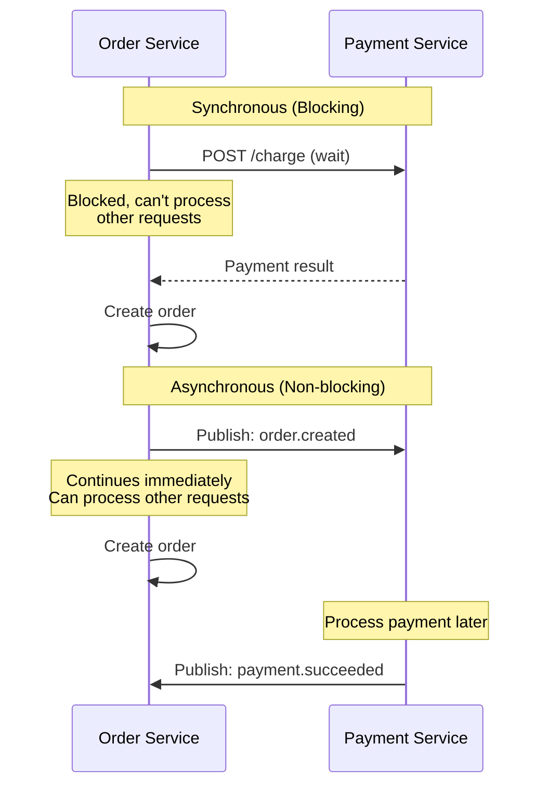
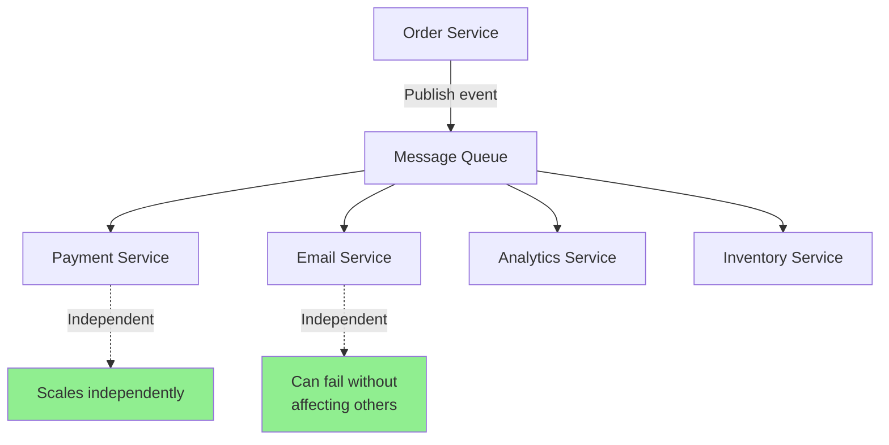
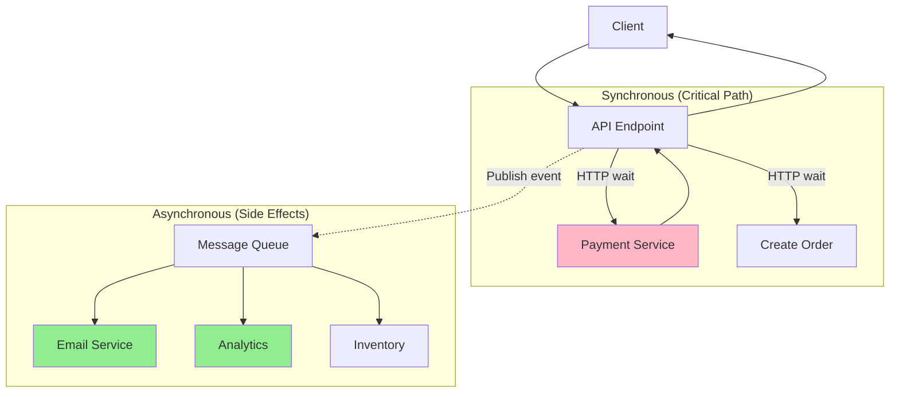

# Service communication (Sync vs Async)

## 1. Why this exists (Real-world problem first)

Your order service calls payment service via HTTP. Payment service takes 5 seconds to process. Order service waits 5 seconds, blocking a thread. Under load, all threads blocked waiting for payment. Order service crashes. Entire checkout flow down. The problem? Synchronous communication creates tight coupling, cascading failures, and doesn't scale under load.

**Real production failures from wrong communication pattern:**

1. **The Synchronous Cascade Failure**: E-commerce checkout flow: Order Service → Payment Service → Fraud Check Service → Bank API. Each call synchronous (HTTP). Bank API slow (10 seconds). Payment service waits 10s. Order service waits 10s. Under Black Friday load (1000 req/sec), all order service threads blocked. Order service crashes. Checkout completely down. $2M in lost sales. Should have used async communication.

2. **The Async Complexity Nightmare**: Startup builds everything async with message queues. Simple user registration: publish event → email service consumes → sends email. Email service crashes. No error propagates to user. User never gets confirmation email. Debugging nightmare—can't trace request flow. Eventual consistency confuses users. Should have used sync for critical path.

3. **The Timeout Hell**: Microservices communicate via HTTP with 30-second timeouts. Recommendation service occasionally slow (20 seconds). Product page waits 20 seconds for recommendations. Page load time: 20 seconds. Users abandon. Team reduces timeout to 3 seconds. Now recommendations fail frequently. Users see empty "recommended products" section. No good solution with sync communication.

4. **The Event Storm**: Order created → 15 services consume event. Each service publishes more events. Cascade of events. 1 order = 50 events. Under load, message queue overwhelmed. Events delayed by minutes. Inventory not updated. Oversell products. Manual reconciliation required.

**What breaks without proper communication patterns:**
- Sync calls create cascading failures
- Async adds complexity and debugging difficulty
- Tight coupling prevents independent scaling
- Don't understand when to use each pattern
- Can't handle partial failures
- Don't know how to mix sync and async

## 2. Mental model (build imagination)

Think of service communication as **Restaurant Operations**.

### The Restaurant Analogy

**Synchronous (Waiter Waits)**:
- Customer orders food
- Waiter goes to kitchen
- Waiter waits at kitchen until food ready
- Waiter brings food to customer
- Waiter blocked during cooking
- Can't serve other customers

**Asynchronous (Ticket System)**:
- Customer orders food
- Waiter gives ticket to kitchen
- Waiter serves other customers
- Kitchen cooks food
- Kitchen rings bell when ready
- Waiter picks up food
- Waiter not blocked

**The Flow:**

**Synchronous Communication:**
```
Order Service → (HTTP call, wait) → Payment Service
Order Service blocked until Payment responds
Fast, simple, but doesn't scale
```

**Asynchronous Communication:**
```
Order Service → (publish event) → Message Queue
Order Service continues immediately
Payment Service consumes event later
Scalable, but complex
```

**Why this matters:**
- Sync is simple but creates coupling
- Async is complex but scales better
- Most systems need both patterns
- Choose based on use case

## 3. How Node.js implements this internally

### Synchronous HTTP Communication

```javascript
const express = require('express');
const axios = require('axios');
const app = express();

// Synchronous service call
app.post('/orders', async (req, res) => {
  try {
    // Call payment service synchronously
    const payment = await axios.post(`${PAYMENT_SERVICE}/charge`, {
      amount: req.body.total,
      token: req.body.paymentToken
    }, {
      timeout: 5000 // 5 second timeout
    });
    
    // Create order only after payment succeeds
    const order = await db.orders.create({
      userId: req.body.userId,
      items: req.body.items,
      paymentId: payment.data.id,
      status: 'paid'
    });
    
    res.json(order);
  } catch (err) {
    // Payment failed, order not created
    res.status(500).json({ error: 'Payment failed' });
  }
});
```

### Asynchronous Event-Based Communication

```javascript
const { Kafka } = require('kafkajs');

// Publisher (Order Service)
class OrderService {
  async createOrder(orderData) {
    // Create order immediately
    const order = await db.orders.create({
      ...orderData,
      status: 'pending'
    });
    
    // Publish event asynchronously
    await kafka.producer.send({
      topic: 'orders',
      messages: [{
        key: order.id,
        value: JSON.stringify({
          eventType: 'order.created',
          orderId: order.id,
          userId: orderData.userId,
          total: orderData.total
        })
      }]
    });
    
    // Return immediately (don't wait for payment)
    return order;
  }
}

// Consumer (Payment Service)
class PaymentService {
  async start() {
    const consumer = kafka.consumer({ groupId: 'payment-service' });
    await consumer.subscribe({ topic: 'orders' });
    
    await consumer.run({
      eachMessage: async ({ message }) => {
        const event = JSON.parse(message.value.toString());
        
        if (event.eventType === 'order.created') {
          await this.processPayment(event);
        }
      }
    });
  }
  
  async processPayment(event) {
    try {
      // Process payment asynchronously
      const payment = await this.chargeCard(event.total);
      
      // Publish payment success event
      await kafka.producer.send({
        topic: 'payments',
        messages: [{
          value: JSON.stringify({
            eventType: 'payment.succeeded',
            orderId: event.orderId,
            paymentId: payment.id
          })
        }]
      });
    } catch (err) {
      // Publish payment failed event
      await kafka.producer.send({
        topic: 'payments',
        messages: [{
          value: JSON.stringify({
            eventType: 'payment.failed',
            orderId: event.orderId,
            error: err.message
          })
        }]
      });
    }
  }
}
```

### Hybrid Pattern (Sync for Critical Path, Async for Side Effects)

```javascript
app.post('/orders', async (req, res) => {
  // Synchronous: Critical path
  const payment = await axios.post(`${PAYMENT_SERVICE}/charge`, {
    amount: req.body.total
  });
  
  const order = await db.orders.create({
    userId: req.body.userId,
    items: req.body.items,
    paymentId: payment.data.id,
    status: 'paid'
  });
  
  // Asynchronous: Side effects (don't block response)
  await kafka.producer.send({
    topic: 'orders',
    messages: [{
      value: JSON.stringify({
        eventType: 'order.created',
        orderId: order.id
      })
    }]
  });
  
  // Email, analytics, inventory updates happen async
  
  res.json(order);
});
```

### Request-Reply Pattern (Async with Correlation)

```javascript
// Async request with reply
class AsyncRequestReply {
  async callServiceAsync(request) {
    const correlationId = crypto.randomUUID();
    
    // Publish request
    await kafka.producer.send({
      topic: 'payment-requests',
      messages: [{
        key: correlationId,
        value: JSON.stringify({
          correlationId,
          amount: request.amount
        })
      }]
    });
    
    // Wait for reply (with timeout)
    return new Promise((resolve, reject) => {
      const timeout = setTimeout(() => {
        reject(new Error('Request timeout'));
      }, 5000);
      
      // Listen for reply
      this.replyHandlers.set(correlationId, (reply) => {
        clearTimeout(timeout);
        resolve(reply);
      });
    });
  }
  
  async handleReply(message) {
    const reply = JSON.parse(message.value.toString());
    const handler = this.replyHandlers.get(reply.correlationId);
    
    if (handler) {
      handler(reply);
      this.replyHandlers.delete(reply.correlationId);
    }
  }
}
```

### Common Misunderstandings

**Mistake 1**: "Always use async for scalability"
- **Reality**: Async adds complexity, use only when needed
- **Impact**: Over-complicated systems

**Mistake 2**: "Sync is bad, async is good"
- **Reality**: Both have trade-offs, choose based on use case
- **Impact**: Wrong pattern for requirements

**Mistake 3**: "Async means eventual consistency"
- **Reality**: Can have sync-over-async (request-reply)
- **Impact**: Missing hybrid patterns

## 4. Multiple diagrams (MANDATORY)

### Diagram 1: Synchronous vs Asynchronous Communication



### Diagram 2: Cascading Failure (Sync)


### Diagram 3: Event-Driven Decoupling (Async)



### Diagram 4: Hybrid Pattern



## 5. Where this is used in real projects

### E-Commerce Checkout (Hybrid Pattern)

```javascript
// Synchronous for critical path
app.post('/checkout', async (req, res) => {
  try {
    // 1. Validate cart (sync)
    const cart = await cartService.validate(req.body.cartId);
    
    // 2. Reserve inventory (sync - critical)
    await inventoryService.reserve(cart.items);
    
    // 3. Process payment (sync - critical)
    const payment = await paymentService.charge({
      amount: cart.total,
      token: req.body.paymentToken
    });
    
    // 4. Create order (sync)
    const order = await orderService.create({
      userId: req.user.id,
      items: cart.items,
      paymentId: payment.id,
      status: 'paid'
    });
    
    // 5. Publish event for async processing
    await eventBus.publish('order.completed', {
      orderId: order.id,
      userId: req.user.id,
      total: cart.total
    });
    
    // Return immediately
    res.json({ orderId: order.id, status: 'success' });
    
    // Async side effects (don't block response):
    // - Send confirmation email
    // - Update analytics
    // - Trigger shipping workflow
    // - Update recommendations
  } catch (err) {
    // Rollback if any critical step fails
    await this.rollback(err);
    res.status(500).json({ error: err.message });
  }
});
```

### Notification Service (Async Only)

```javascript
// Email service consumes events asynchronously
class EmailService {
  async start() {
    const consumer = kafka.consumer({ groupId: 'email-service' });
    
    await consumer.subscribe({ topic: 'orders' });
    await consumer.subscribe({ topic: 'users' });
    
    await consumer.run({
      eachMessage: async ({ topic, message }) => {
        const event = JSON.parse(message.value.toString());
        
        switch (event.eventType) {
          case 'order.completed':
            await this.sendOrderConfirmation(event);
            break;
          case 'user.registered':
            await this.sendWelcomeEmail(event);
            break;
        }
      }
    });
  }
  
  async sendOrderConfirmation(event) {
    // Send email asynchronously
    // If fails, will retry via Kafka consumer groups
    await emailProvider.send({
      to: event.userEmail,
      subject: 'Order Confirmation',
      body: `Your order ${event.orderId} is confirmed`
    });
  }
}
```

## 6. Where this should NOT be used

### Don't Use Async for Critical Path

```javascript
// WRONG: Async for payment (user needs immediate feedback)
app.post('/checkout', async (req, res) => {
  await eventBus.publish('payment.process', req.body);
  res.json({ status: 'processing' }); // User doesn't know if payment succeeded!
});

// RIGHT: Sync for payment
app.post('/checkout', async (req, res) => {
  const payment = await paymentService.charge(req.body);
  res.json({ status: 'success', paymentId: payment.id });
});
```

### Don't Use Sync for Non-Critical Side Effects

```javascript
// WRONG: Sync call for analytics (blocks response)
app.post('/orders', async (req, res) => {
  const order = await createOrder(req.body);
  await analyticsService.track(order); // Blocks response!
  res.json(order);
});

// RIGHT: Async for analytics
app.post('/orders', async (req, res) => {
  const order = await createOrder(req.body);
  eventBus.publish('order.created', order); // Don't wait
  res.json(order);
});
```

## 7. Failure modes & edge cases

### Failure Mode 1: Timeout Cascade

**Scenario**: Service A calls B calls C, all with 30s timeout

```
Service C slow (25s)
Service B waits 25s, then times out at 30s
Service A waits 30s, then times out
Total: 30s+ of blocking
```

**Solution**: Aggressive timeouts, circuit breakers

### Failure Mode 2: Event Loss

**Scenario**: Publish event, consumer crashes before processing

```
Order Service publishes event
Message queue receives event
Consumer crashes
Event lost (if not using persistent queue)
```

**Solution**: Persistent queues, consumer acknowledgments

### Failure Mode 3: Duplicate Events

**Scenario**: At-least-once delivery causes duplicates

```
Consumer processes event
Consumer crashes before acknowledging
Event redelivered
Processed twice
```

**Solution**: Idempotent consumers

## 8. Trade-offs & alternatives

### Synchronous HTTP

**Gain**: Simple, immediate feedback, easy debugging
**Sacrifice**: Tight coupling, cascading failures, doesn't scale
**When**: Critical path, need immediate response, small scale

### Asynchronous Events

**Gain**: Decoupled, scalable, resilient
**Sacrifice**: Complex, eventual consistency, hard to debug
**When**: Side effects, high scale, independent services

### Request-Reply (Async)

**Gain**: Decoupled but with response, scalable
**Sacrifice**: More complex than sync, latency overhead
**When**: Need decoupling but also need response

## 9. Interview-level articulation

**Q: "When would you use synchronous vs asynchronous communication?"**

**A**: "I use synchronous communication for the critical path where I need immediate feedback—like payment processing in checkout. The user needs to know right away if payment succeeded or failed. I use asynchronous communication for side effects that don't need immediate feedback—like sending confirmation emails, updating analytics, or triggering inventory updates. For example, in checkout, I synchronously call the payment service and wait for the response. But I asynchronously publish an 'order.created' event for email, analytics, and shipping services to consume. This gives me immediate feedback for critical operations while keeping the system decoupled and scalable for non-critical operations."

**Q: "How do you handle failures in asynchronous communication?"**

**A**: "For async communication, I use message queues like Kafka or RabbitMQ with consumer groups and acknowledgments. If a consumer fails to process an event, it doesn't acknowledge, and the message is redelivered. I make consumers idempotent so duplicate processing doesn't cause issues. I also implement dead letter queues for messages that fail repeatedly—after 3 retries, the message goes to a DLQ for manual investigation. For monitoring, I track consumer lag to detect if consumers are falling behind, and I use distributed tracing to correlate events across services."

## 10. Key takeaways (engineer mindset)

### What to Remember

1. **Sync**: Simple, immediate feedback, tight coupling
2. **Async**: Complex, scalable, eventual consistency
3. **Hybrid**: Sync for critical path, async for side effects
4. **Critical path**: Use sync (payment, order creation)
5. **Side effects**: Use async (email, analytics)
6. **Timeouts**: Aggressive timeouts prevent cascading failures
7. **Idempotency**: Required for async consumers

### What Decisions This Enables

**Communication decisions**:
- When to use sync vs async
- Timeout and retry strategies
- Error handling approaches

**Scalability decisions**:
- How to decouple services
- Independent scaling strategies
- Load handling patterns

**Reliability decisions**:
- Failure isolation
- Circuit breaker placement
- Message queue configuration

### How It Connects to Other Node.js Concepts

**Circuit Breaker** (Topic 37):
- Protects sync calls from cascading failures
- Fails fast instead of waiting

**Saga Pattern** (Topic 27):
- Coordinates async operations
- Handles distributed transactions

**Event Sourcing** (Topic 26):
- Async event-based architecture
- Events as source of truth

### The Golden Rule

**Use sync for critical path, async for side effects**. Synchronous communication for operations that need immediate feedback (payment, order creation). Asynchronous communication for side effects that don't block user (email, analytics, inventory updates). Implement timeouts and circuit breakers for sync calls. Make async consumers idempotent. Use hybrid pattern for most real-world systems.
