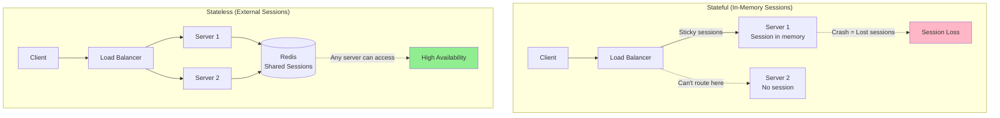
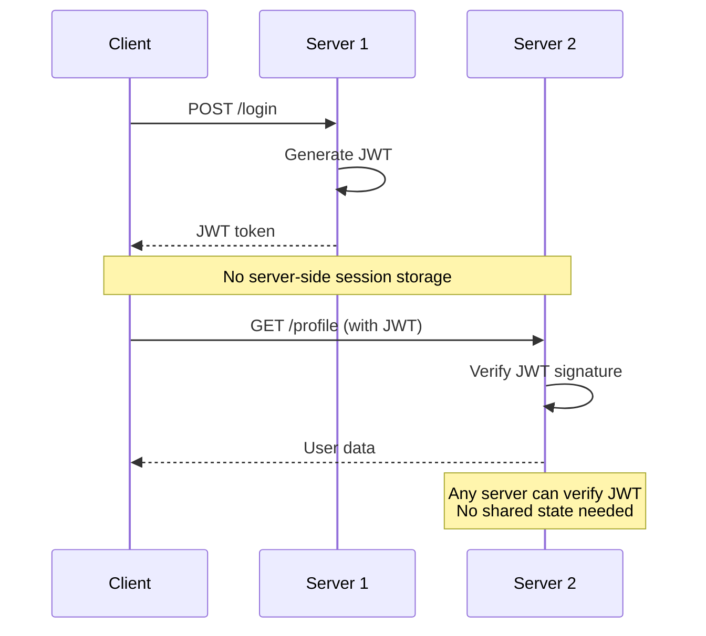
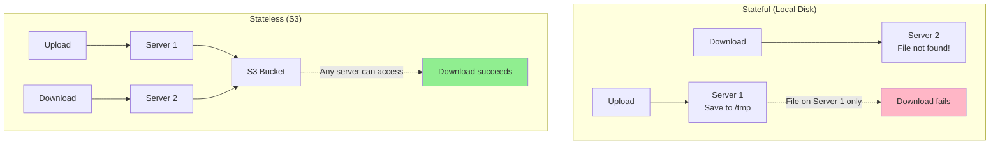
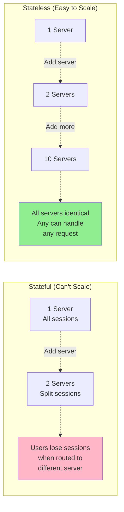

# Stateless services

## 1. Why this exists (Real-world problem first)

Your API server stores user sessions in memory. User logs in on Server 1. Load balancer routes next request to Server 2. Server 2 doesn't have session. User appears logged out. You implement sticky sessions (IP hash). Server 1 crashes. 1000 users lose sessions, must re-login. The problem? Stateful services can't scale horizontally, create single points of failure, and complicate deployments.

**Real production failures from stateful services:**

1. **The Session Loss Disaster**: E-commerce platform stores sessions in-memory. Deploys new version. Rolling deployment restarts servers one by one. Each restart loses all sessions on that server. 10,000 users logged out during deployment. Shopping carts lost. $200K in abandoned carts. Customer support overwhelmed. Should have used stateless design with external session store.

2. **The Sticky Session Nightmare**: Video streaming platform uses sticky sessions (IP hash). Large office (2000 employees) behind single NAT IP. All 2000 users routed to Server 3. Server 3 crashes under load. Other 9 servers idle. Users can't stream videos. Should have made services stateless.

3. **The File Upload Failure**: API server stores uploaded files on local disk. User uploads file to Server 1. Next request (process file) goes to Server 2. File not found on Server 2. Upload fails. Should have used S3 or shared storage.

4. **The Auto-Scaling Failure**: Kubernetes auto-scaler adds pods during traffic spike. New pods have no cached data (in-memory cache). All requests to new pods hit database. Database overwhelmed. Auto-scaling makes problem worse. Should have used external cache (Redis).

**What breaks without stateless services:**
- Can't scale horizontally
- Deployments cause session loss
- Server failures lose data
- Can't use auto-scaling effectively
- Load balancing becomes complex
- Don't understand state externalization

## 2. Mental model (build imagination)

Think of stateless services as **Fast Food Restaurants**.

### The Fast Food Analogy

**Stateful (Personal Chef)**:
- Chef remembers your preferences
- Chef knows your order history
- If chef is sick, you can't get food
- Can't serve multiple customers efficiently
- Chef is single point of failure

**Stateless (Fast Food)**:
- Any worker can take your order
- Order written down (external state)
- If one worker leaves, another continues
- Can serve many customers in parallel
- No single point of failure
- Workers are interchangeable

**The Flow:**

**Stateful Service:**
```
Request 1 → Server 1 (stores session in memory)
Request 2 → Server 2 (session not found, user logged out)
Server 1 crashes → All sessions lost
```

**Stateless Service:**
```
Request 1 → Server 1 (stores session in Redis)
Request 2 → Server 2 (reads session from Redis, works!)
Server 1 crashes → No sessions lost, Redis has all data
```

**Why this matters:**
- Stateless services are interchangeable
- Any server can handle any request
- Enables horizontal scaling
- Simplifies deployments
- Improves reliability

## 3. How Node.js implements this internally

### Stateful Service (Wrong)

```javascript
const express = require('express');
const app = express();

// Stateful: Sessions in memory
const sessions = new Map();

app.post('/login', (req, res) => {
  const sessionId = crypto.randomUUID();
  
  // Store in memory (stateful!)
  sessions.set(sessionId, {
    userId: req.body.userId,
    createdAt: new Date()
  });
  
  res.json({ sessionId });
});

app.get('/profile', (req, res) => {
  const sessionId = req.headers['session-id'];
  const session = sessions.get(sessionId);
  
  if (!session) {
    return res.status(401).json({ error: 'Not logged in' });
  }
  
  res.json({ userId: session.userId });
});

// Problem: Sessions lost on restart
// Problem: Can't scale horizontally
// Problem: Server crash loses all sessions
```

### Stateless Service (Right)

```javascript
const express = require('express');
const Redis = require('ioredis');
const app = express();

// Stateless: Sessions in Redis
const redis = new Redis({
  host: process.env.REDIS_HOST,
  port: 6379
});

app.post('/login', async (req, res) => {
  const sessionId = crypto.randomUUID();
  
  // Store in Redis (external state)
  await redis.setex(
    `session:${sessionId}`,
    3600, // 1 hour TTL
    JSON.stringify({
      userId: req.body.userId,
      createdAt: new Date()
    })
  );
  
  res.json({ sessionId });
});

app.get('/profile', async (req, res) => {
  const sessionId = req.headers['session-id'];
  
  // Read from Redis
  const sessionData = await redis.get(`session:${sessionId}`);
  
  if (!sessionData) {
    return res.status(401).json({ error: 'Not logged in' });
  }
  
  const session = JSON.parse(sessionData);
  res.json({ userId: session.userId });
});

// Benefits: Sessions survive restarts
// Benefits: Can scale horizontally
// Benefits: Server crash doesn't lose sessions
```

### JWT-Based Stateless Authentication

```javascript
const jwt = require('jsonwebtoken');
const express = require('express');
const app = express();

const JWT_SECRET = process.env.JWT_SECRET;

app.post('/login', (req, res) => {
  const { userId, email } = req.body;
  
  // Create JWT (no server-side state!)
  const token = jwt.sign(
    { userId, email },
    JWT_SECRET,
    { expiresIn: '1h' }
  );
  
  res.json({ token });
});

// Stateless authentication middleware
const authenticate = (req, res, next) => {
  const token = req.headers.authorization?.split(' ')[1];
  
  if (!token) {
    return res.status(401).json({ error: 'No token' });
  }
  
  try {
    // Verify JWT (stateless!)
    const decoded = jwt.verify(token, JWT_SECRET);
    req.user = decoded;
    next();
  } catch (err) {
    res.status(401).json({ error: 'Invalid token' });
  }
};

app.get('/profile', authenticate, (req, res) => {
  // req.user populated by middleware
  res.json({ userId: req.user.userId, email: req.user.email });
});

// Benefits: No server-side session storage
// Benefits: Any server can verify token
// Benefits: Truly stateless
```

### File Upload to S3 (Stateless)

```javascript
const AWS = require('aws-sdk');
const multer = require('multer');
const upload = multer({ storage: multer.memoryStorage() });

const s3 = new AWS.S3({
  accessKeyId: process.env.AWS_ACCESS_KEY,
  secretAccessKey: process.env.AWS_SECRET_KEY
});

// Stateless file upload
app.post('/upload', upload.single('file'), async (req, res) => {
  const fileKey = `uploads/${crypto.randomUUID()}-${req.file.originalname}`;
  
  // Upload to S3 (external storage, not local disk)
  await s3.upload({
    Bucket: 'my-bucket',
    Key: fileKey,
    Body: req.file.buffer,
    ContentType: req.file.mimetype
  }).promise();
  
  res.json({ fileKey });
});

// Stateless file download
app.get('/download/:fileKey', async (req, res) => {
  // Download from S3 (any server can access)
  const file = await s3.getObject({
    Bucket: 'my-bucket',
    Key: req.params.fileKey
  }).promise();
  
  res.send(file.Body);
});

// Benefits: Files accessible from any server
// Benefits: No local disk dependency
// Benefits: Survives server restarts
```

### Caching with Redis (Stateless)

```javascript
const Redis = require('ioredis');
const redis = new Redis();

// Stateless caching
app.get('/api/products/:id', async (req, res) => {
  const cacheKey = `product:${req.params.id}`;
  
  // Check Redis cache (external, shared)
  const cached = await redis.get(cacheKey);
  if (cached) {
    return res.json(JSON.parse(cached));
  }
  
  // Fetch from database
  const product = await db.products.findById(req.params.id);
  
  // Cache in Redis for 5 minutes
  await redis.setex(cacheKey, 300, JSON.stringify(product));
  
  res.json(product);
});

// Benefits: Cache shared across all servers
// Benefits: Any server can read cached data
// Benefits: Cache survives server restarts
```

### Common Misunderstandings

**Mistake 1**: "Stateless means no database"
- **Reality**: Stateless means no in-memory state, database is fine
- **Impact**: Confusion about what stateless means

**Mistake 2**: "JWT is always better than sessions"
- **Reality**: JWT can't be invalidated, sessions can
- **Impact**: Wrong authentication choice

**Mistake 3**: "Stateless is always faster"
- **Reality**: External state stores add latency
- **Impact**: Performance expectations

## 4. Multiple diagrams (MANDATORY)

### Diagram 1: Stateful vs Stateless



### Diagram 2: JWT Stateless Authentication



### Diagram 3: File Upload Stateless vs Stateful



### Diagram 4: Scaling Stateful vs Stateless



## 5. Where this is used in real projects

### Stateless API Server

```javascript
const express = require('express');
const Redis = require('ioredis');
const AWS = require('aws-sdk');
const app = express();

const redis = new Redis(process.env.REDIS_URL);
const s3 = new AWS.S3();

// Stateless authentication
app.use(async (req, res, next) => {
  const token = req.headers.authorization?.split(' ')[1];
  if (!token) return res.status(401).json({ error: 'Unauthorized' });
  
  try {
    const user = jwt.verify(token, process.env.JWT_SECRET);
    req.user = user;
    next();
  } catch (err) {
    res.status(401).json({ error: 'Invalid token' });
  }
});

// Stateless endpoint with external cache
app.get('/api/products/:id', async (req, res) => {
  const cacheKey = `product:${req.params.id}`;
  
  // Check Redis
  const cached = await redis.get(cacheKey);
  if (cached) return res.json(JSON.parse(cached));
  
  // Fetch from database
  const product = await db.products.findById(req.params.id);
  
  // Cache in Redis
  await redis.setex(cacheKey, 300, JSON.stringify(product));
  
  res.json(product);
});

// Stateless file upload
app.post('/api/upload', upload.single('file'), async (req, res) => {
  const fileKey = `${req.user.id}/${crypto.randomUUID()}`;
  
  // Upload to S3 (not local disk)
  await s3.upload({
    Bucket: 'my-bucket',
    Key: fileKey,
    Body: req.file.buffer
  }).promise();
  
  res.json({ fileKey });
});

app.listen(3000);

// This server is completely stateless
// Can run 100 instances
// Any instance can handle any request
// Deployments don't lose data
```

### Background Worker (Stateless)

```javascript
const Queue = require('bull');
const Redis = require('ioredis');

// Shared queue (external state)
const emailQueue = new Queue('email', process.env.REDIS_URL);

// Stateless worker
emailQueue.process(async (job) => {
  const { to, subject, body } = job.data;
  
  // Send email
  await sendEmail(to, subject, body);
  
  return { sent: true };
});

// Can run 50 worker instances
// All process jobs from shared queue
// Workers are interchangeable
```

## 6. Where this should NOT be used

### Don't Make Everything Stateless

```javascript
// WRONG: External state for every variable
await redis.set('counter', count);
count = await redis.get('counter');

// RIGHT: Local variables are fine, just not session/user data
let counter = 0;
counter++;
```

### Don't Use JWT for Sensitive Sessions

```javascript
// WRONG: JWT for admin sessions (can't revoke)
const adminToken = jwt.sign({ role: 'admin' }, secret);

// RIGHT: Server-side sessions for admin (can revoke)
await redis.set(`admin:session:${sessionId}`, userData);
```

## 7. Failure modes & edge cases

### Failure Mode 1: External Store Failure

**Scenario**: Redis crashes, all sessions lost

```
Redis crashes
All session reads fail
All users logged out
```

**Solution**: Redis cluster, session replication

### Failure Mode 2: JWT Token Leakage

**Scenario**: JWT stolen, can't revoke

```
JWT token stolen
Token valid for 1 hour
Can't revoke (stateless!)
Attacker has access for 1 hour
```

**Solution**: Short expiry, refresh tokens, token blacklist

### Failure Mode 3: S3 Latency

**Scenario**: S3 slower than local disk

```
Local disk: 1ms
S3: 50ms
File operations 50x slower
```

**Solution**: CDN, caching, accept trade-off

## 8. Trade-offs & alternatives

### Stateless Services

**Gain**: Horizontal scaling, high availability, simple deployments
**Sacrifice**: External dependencies, latency, complexity
**When**: APIs, workers, most services

### Stateful Services

**Gain**: Lower latency, simpler code, no external dependencies
**Sacrifice**: Can't scale horizontally, deployment complexity
**When**: WebSocket servers, game servers, specific use cases

### Hybrid

**Gain**: Best of both worlds
**Sacrifice**: More complex architecture
**When**: Most real-world systems

## 9. Interview-level articulation

**Q: "What does it mean for a service to be stateless?"**

**A**: "A stateless service doesn't store any request-specific data in memory or on local disk. All state is externalized to databases, caches, or object storage. This means any server instance can handle any request—they're completely interchangeable. For example, instead of storing user sessions in memory, I store them in Redis. Instead of saving uploaded files to local disk, I save them to S3. Instead of using in-memory caching, I use Redis. This enables horizontal scaling because I can add or remove server instances without losing data. It also simplifies deployments because restarting a server doesn't lose any state. The trade-off is added latency from external stores and dependency on those stores."

**Q: "How do you handle authentication in a stateless service?"**

**A**: "I use JWT for stateless authentication. When a user logs in, I generate a JWT containing their user ID and role, sign it with a secret key, and return it to the client. On subsequent requests, the client sends the JWT in the Authorization header. Any server can verify the JWT signature without checking a database or session store—that's what makes it stateless. The downside is I can't revoke JWTs before they expire, so I use short expiry times (15 minutes) and refresh tokens for longer sessions. For admin sessions or sensitive operations, I use server-side sessions in Redis where I can revoke access immediately if needed."

## 10. Key takeaways (engineer mindset)

### What to Remember

1. **Stateless**: No in-memory or local disk state
2. **Externalize state**: Redis, S3, database
3. **JWT**: Stateless authentication
4. **Sessions**: Redis for server-side sessions
5. **Files**: S3 not local disk
6. **Cache**: Redis not in-memory
7. **Interchangeable**: Any server handles any request

### What Decisions This Enables

**Scaling decisions**:
- When to scale horizontally
- How many instances to run
- Auto-scaling configuration

**Deployment decisions**:
- Rolling deployments without downtime
- Blue-green deployments
- Canary deployments

**Architecture decisions**:
- Session management approach
- File storage strategy
- Caching strategy

### How It Connects to Other Node.js Concepts

**Horizontal Scaling** (Topic 34):
- Stateless required for horizontal scaling
- Enables adding/removing instances

**Session Management** (Topic 40):
- Stateless uses external session stores
- JWT vs server-side sessions

**Load Balancing** (Topic 33):
- Stateless simplifies load balancing
- No need for sticky sessions

### The Golden Rule

**Externalize all state to enable horizontal scaling**. Store sessions in Redis, not memory. Store files in S3, not local disk. Use JWT for stateless auth or Redis for server-side sessions. Make servers completely interchangeable—any server should handle any request. Accept latency trade-off for scalability and reliability. Don't make everything stateless—local variables are fine, just not user/session data.
