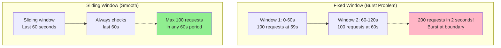
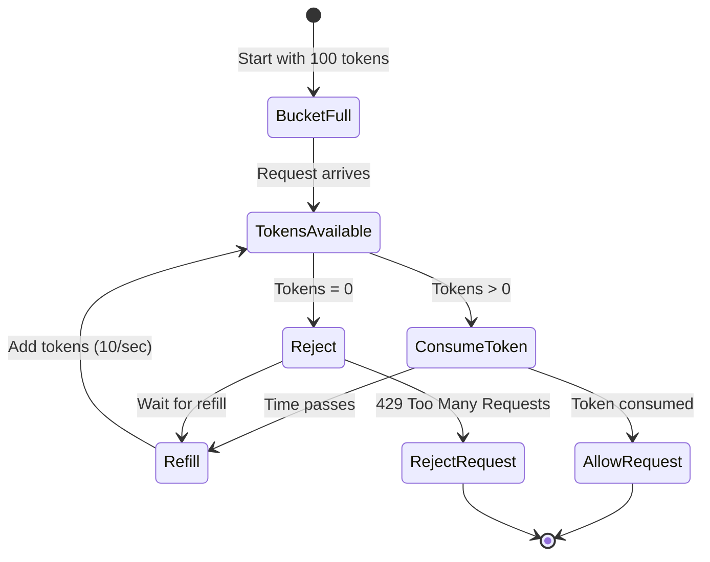
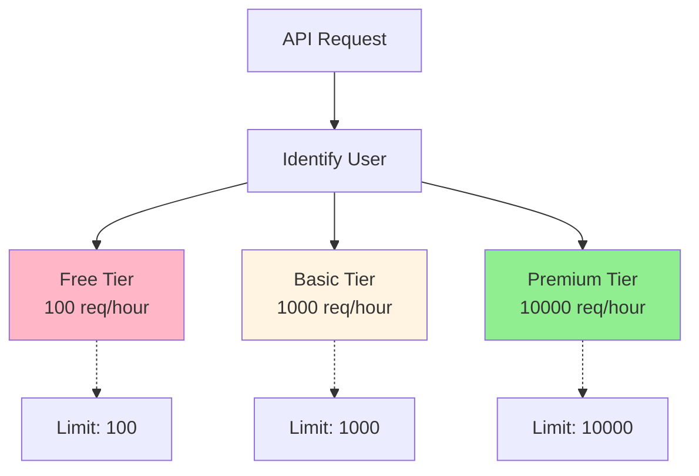
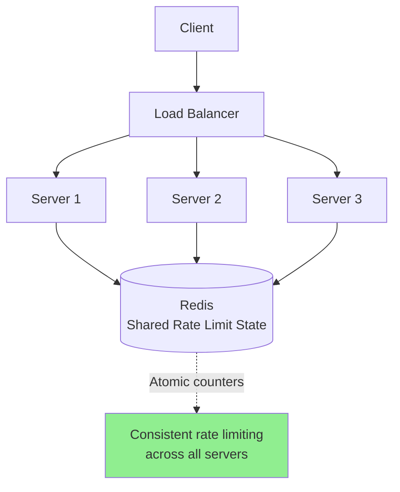

# Rate limiting & throttling

## 1. Why this exists (Real-world problem first)

Your API has no rate limiting. Attacker sends 100,000 requests/second. Database overwhelmed. Server CPU at 100%. Legitimate users can't access site. API crashes. The problem? Without rate limiting, a single malicious or buggy client can take down your entire system.

**Real production failures from missing rate limiting:**

1. **The DDoS Disaster**: Payment API has no rate limiting. Attacker sends 1M requests/second. Database connections exhausted. All payment processing stops. E-commerce site down for 4 hours. $2M in lost sales. Manual intervention required to block attacker IP. Should have had rate limiting from day one.

2. **The Buggy Client Nightmare**: Mobile app has bug in retry logic. Infinite retry loop. Single user generates 10,000 requests/second. API server crashes. Affects all 100K users. Team doesn't know which client causing issue. Takes 2 hours to identify and fix. Should have had per-client rate limiting.

3. **The Scraper Attack**: Public API has no rate limiting. Competitor scrapes entire product catalog. 500,000 requests in 10 minutes. Database slow for all users. Legitimate traffic suffers. Competitor steals all product data. Should have had aggressive rate limiting for unauthenticated requests.

4. **The Cost Explosion**: Third-party API charges per request. Internal service has bug, calls API in loop. 1M requests in 1 hour. $50K bill from third-party. Should have had outbound rate limiting to prevent runaway costs.

**What breaks without rate limiting:**
- Single client can overwhelm system
- DDoS attacks take down service
- Buggy clients cause outages
- Can't protect against abuse
- Costs spiral out of control
- Don't understand different rate limiting strategies

## 2. Mental model (build imagination)

Think of rate limiting as **Highway Toll Booth**.

### The Toll Booth Analogy

**No Rate Limiting (No Toll Booth)**:
- All cars enter highway at once
- Highway overwhelmed
- Traffic jam, nobody moves
- System crashes

**Rate Limiting (Toll Booth)**:
- Toll booth controls entry rate
- Only 100 cars/minute allowed
- Highway flows smoothly
- Excess cars wait or rejected

**The Flow:**

**Without Rate Limiting:**
```
Client sends 10,000 req/sec
Server tries to process all
Database overwhelmed
Server crashes
All users affected
```

**With Rate Limiting:**
```
Client sends 10,000 req/sec
Rate limiter allows 100 req/sec
Excess 9,900 req/sec rejected (429 Too Many Requests)
Server processes 100 req/sec smoothly
System stable
```

**Why this matters:**
- Protects system from overload
- Prevents abuse and attacks
- Ensures fair resource allocation
- Controls costs
- Maintains service quality

## 3. How Node.js implements this internally

### Fixed Window Rate Limiting

```javascript
const Redis = require('ioredis');
const redis = new Redis();

class FixedWindowRateLimiter {
  constructor(maxRequests, windowMs) {
    this.maxRequests = maxRequests;
    this.windowMs = windowMs;
  }
  
  async isAllowed(clientId) {
    const now = Date.now();
    const windowStart = Math.floor(now / this.windowMs) * this.windowMs;
    const key = `ratelimit:${clientId}:${windowStart}`;
    
    const requests = await redis.incr(key);
    
    if (requests === 1) {
      // Set expiry on first request in window
      await redis.pexpire(key, this.windowMs);
    }
    
    return requests <= this.maxRequests;
  }
}

// Usage
const limiter = new FixedWindowRateLimiter(100, 60000); // 100 req/min

app.use(async (req, res, next) => {
  const clientId = req.ip;
  const allowed = await limiter.isAllowed(clientId);
  
  if (!allowed) {
    return res.status(429).json({
      error: 'Too many requests',
      retryAfter: 60
    });
  }
  
  next();
});
```

### Sliding Window Rate Limiting

```javascript
class SlidingWindowRateLimiter {
  constructor(maxRequests, windowMs) {
    this.maxRequests = maxRequests;
    this.windowMs = windowMs;
  }
  
  async isAllowed(clientId) {
    const now = Date.now();
    const windowStart = now - this.windowMs;
    const key = `ratelimit:${clientId}`;
    
    // Remove old requests
    await redis.zremrangebyscore(key, 0, windowStart);
    
    // Count requests in window
    const requests = await redis.zcard(key);
    
    if (requests < this.maxRequests) {
      // Add current request
      await redis.zadd(key, now, `${now}-${Math.random()}`);
      await redis.pexpire(key, this.windowMs);
      return true;
    }
    
    return false;
  }
}
```

### Token Bucket Rate Limiting

```javascript
class TokenBucketRateLimiter {
  constructor(capacity, refillRate) {
    this.capacity = capacity; // Max tokens
    this.refillRate = refillRate; // Tokens per second
  }
  
  async isAllowed(clientId) {
    const key = `bucket:${clientId}`;
    const now = Date.now();
    
    // Get current bucket state
    const bucket = await redis.hgetall(key);
    
    let tokens = parseFloat(bucket.tokens || this.capacity);
    let lastRefill = parseInt(bucket.lastRefill || now);
    
    // Refill tokens based on time elapsed
    const elapsed = (now - lastRefill) / 1000;
    tokens = Math.min(this.capacity, tokens + elapsed * this.refillRate);
    
    if (tokens >= 1) {
      // Consume 1 token
      tokens -= 1;
      
      await redis.hset(key, 'tokens', tokens);
      await redis.hset(key, 'lastRefill', now);
      await redis.expire(key, 3600);
      
      return true;
    }
    
    return false;
  }
}

// Usage
const limiter = new TokenBucketRateLimiter(100, 10); // 100 capacity, 10 tokens/sec

app.use(async (req, res, next) => {
  const allowed = await limiter.isAllowed(req.ip);
  
  if (!allowed) {
    return res.status(429).json({ error: 'Rate limit exceeded' });
  }
  
  next();
});
```

### Tiered Rate Limiting

```javascript
class TieredRateLimiter {
  constructor() {
    this.limits = {
      free: { requests: 100, window: 3600000 }, // 100/hour
      basic: { requests: 1000, window: 3600000 }, // 1000/hour
      premium: { requests: 10000, window: 3600000 } // 10000/hour
    };
  }
  
  async isAllowed(userId, tier) {
    const limit = this.limits[tier] || this.limits.free;
    const key = `ratelimit:${tier}:${userId}`;
    
    const requests = await redis.incr(key);
    
    if (requests === 1) {
      await redis.pexpire(key, limit.window);
    }
    
    const remaining = Math.max(0, limit.requests - requests);
    
    return {
      allowed: requests <= limit.requests,
      limit: limit.requests,
      remaining,
      resetAt: Date.now() + limit.window
    };
  }
}

// Usage
app.use(async (req, res, next) => {
  const limiter = new TieredRateLimiter();
  const result = await limiter.isAllowed(req.user.id, req.user.tier);
  
  // Set rate limit headers
  res.setHeader('X-RateLimit-Limit', result.limit);
  res.setHeader('X-RateLimit-Remaining', result.remaining);
  res.setHeader('X-RateLimit-Reset', result.resetAt);
  
  if (!result.allowed) {
    return res.status(429).json({
      error: 'Rate limit exceeded',
      limit: result.limit,
      resetAt: result.resetAt
    });
  }
  
  next();
});
```

### Distributed Rate Limiting with Redis

```javascript
const rateLimit = require('express-rate-limit');
const RedisStore = require('rate-limit-redis');

// Distributed rate limiting across multiple servers
const limiter = rateLimit({
  store: new RedisStore({
    client: redis,
    prefix: 'rl:'
  }),
  windowMs: 15 * 60 * 1000, // 15 minutes
  max: 100, // limit each IP to 100 requests per windowMs
  message: 'Too many requests from this IP',
  standardHeaders: true, // Return rate limit info in headers
  legacyHeaders: false
});

app.use('/api/', limiter);
```

### Common Misunderstandings

**Mistake 1**: "Rate limiting is only for DDoS protection"
- **Reality**: Also prevents abuse, controls costs, ensures fairness
- **Impact**: Under-utilizing rate limiting

**Mistake 2**: "Fixed window is good enough"
- **Reality**: Fixed window has burst problem at window boundaries
- **Impact**: Allows 2x traffic at window boundaries

**Mistake 3**: "Rate limit per IP is sufficient"
- **Reality**: NAT/proxies share IPs, need per-user limiting too
- **Impact**: Legitimate users blocked, abusers not blocked

## 4. Multiple diagrams (MANDATORY)

### Diagram 1: Fixed Window vs Sliding Window



### Diagram 2: Token Bucket Algorithm



### Diagram 3: Tiered Rate Limiting



### Diagram 4: Distributed Rate Limiting



## 5. Where this is used in real projects

### API Rate Limiting

```javascript
const express = require('express');
const Redis = require('ioredis');
const app = express();
const redis = new Redis();

// Different rate limits for different endpoints
const createRateLimiter = (maxRequests, windowMs) => {
  return async (req, res, next) => {
    const clientId = req.user?.id || req.ip;
    const key = `ratelimit:${req.path}:${clientId}`;
    
    const requests = await redis.incr(key);
    
    if (requests === 1) {
      await redis.pexpire(key, windowMs);
    }
    
    const remaining = Math.max(0, maxRequests - requests);
    
    res.setHeader('X-RateLimit-Limit', maxRequests);
    res.setHeader('X-RateLimit-Remaining', remaining);
    
    if (requests > maxRequests) {
      return res.status(429).json({
        error: 'Too many requests',
        retryAfter: Math.ceil(windowMs / 1000)
      });
    }
    
    next();
  };
};

// Strict rate limit for authentication
app.post('/api/login', createRateLimiter(5, 60000), async (req, res) => {
  // Only 5 login attempts per minute
  const user = await authenticateUser(req.body);
  res.json({ token: generateToken(user) });
});

// Generous rate limit for reads
app.get('/api/products', createRateLimiter(1000, 60000), async (req, res) => {
  // 1000 requests per minute
  const products = await db.products.find();
  res.json(products);
});

// Moderate rate limit for writes
app.post('/api/orders', createRateLimiter(100, 60000), async (req, res) => {
  // 100 orders per minute
  const order = await db.orders.create(req.body);
  res.json(order);
});
```

### Outbound Rate Limiting

```javascript
// Rate limit calls to external API
class OutboundRateLimiter {
  constructor(maxRequestsPerSecond) {
    this.maxRequestsPerSecond = maxRequestsPerSecond;
    this.queue = [];
    this.processing = false;
  }
  
  async callAPI(url, options) {
    return new Promise((resolve, reject) => {
      this.queue.push({ url, options, resolve, reject });
      this.processQueue();
    });
  }
  
  async processQueue() {
    if (this.processing || this.queue.length === 0) return;
    
    this.processing = true;
    
    while (this.queue.length > 0) {
      const { url, options, resolve, reject } = this.queue.shift();
      
      try {
        const response = await axios(url, options);
        resolve(response.data);
      } catch (err) {
        reject(err);
      }
      
      // Wait to respect rate limit
      await new Promise(r => setTimeout(r, 1000 / this.maxRequestsPerSecond));
    }
    
    this.processing = false;
  }
}

// Usage
const stripeRateLimiter = new OutboundRateLimiter(10); // 10 req/sec

app.post('/api/charge', async (req, res) => {
  // Rate-limited call to Stripe
  const charge = await stripeRateLimiter.callAPI('https://api.stripe.com/v1/charges', {
    method: 'POST',
    data: req.body
  });
  
  res.json(charge);
});
```

## 6. Where this should NOT be used

### Don't Rate Limit Internal Services

```javascript
// WRONG: Rate limit internal service-to-service calls
app.use('/internal/api', rateLimiter);

// RIGHT: Only rate limit external/public APIs
app.use('/public/api', rateLimiter);
```

### Don't Use Same Limit for All Endpoints

```javascript
// WRONG: Same rate limit for login and product listing
app.use(rateLimiter(100, 60000));

// RIGHT: Different limits per endpoint
app.post('/login', rateLimiter(5, 60000)); // Strict
app.get('/products', rateLimiter(1000, 60000)); // Generous
```

## 7. Failure modes & edge cases

### Failure Mode 1: Redis Failure

**Scenario**: Redis crashes, rate limiting fails

```
Redis crashes
Rate limiter can't check limits
Option 1: Fail open (allow all) - risk of abuse
Option 2: Fail closed (block all) - service down
```

**Solution**: In-memory fallback, Redis cluster

### Failure Mode 2: Clock Skew

**Scenario**: Server clocks out of sync

```
Server 1 time: 12:00:00
Server 2 time: 12:00:30
Rate limit window inconsistent
```

**Solution**: Use Redis time, not server time

### Failure Mode 3: Distributed Counter Race

**Scenario**: Multiple servers increment counter simultaneously

```
Server 1 reads: 99 requests
Server 2 reads: 99 requests
Both allow request (100th)
Actually 101 requests allowed
```

**Solution**: Atomic operations (INCR in Redis)

## 8. Trade-offs & alternatives

### Rate Limiting

**Gain**: Protection from abuse, fair resource allocation, cost control
**Sacrifice**: Complexity, Redis dependency, potential false positives
**When**: Public APIs, authentication endpoints, cost-sensitive operations

### Throttling

**Gain**: Smooth traffic flow, prevents bursts
**Sacrifice**: Adds latency, queue management complexity
**When**: Background jobs, outbound API calls

### No Limiting

**Gain**: Simple, no overhead
**Sacrifice**: Vulnerable to abuse, no cost control
**When**: Internal services, trusted clients only

## 9. Interview-level articulation

**Q: "How would you implement rate limiting for an API?"**

**A**: "I'd use Redis-based distributed rate limiting with a sliding window algorithm. For each request, I'd use the client's user ID or IP as the key and increment a counter in Redis. I'd use a sorted set with timestamps to implement a sliding window—removing entries older than the window and counting remaining entries. If the count exceeds the limit, I return 429 Too Many Requests with Retry-After header. I'd implement different rate limits for different endpoints—strict limits for authentication (5 requests/minute) and generous limits for reads (1000 requests/minute). I'd also implement tiered rate limiting based on user subscription level. For headers, I'd include X-RateLimit-Limit, X-RateLimit-Remaining, and X-RateLimit-Reset to help clients manage their request rate."

**Q: "What's the difference between fixed window and sliding window rate limiting?"**

**A**: "Fixed window divides time into discrete windows—for example, 0-60 seconds, 60-120 seconds. The problem is burst traffic at window boundaries. A client could send 100 requests at 59 seconds and another 100 at 60 seconds, getting 200 requests in 2 seconds. Sliding window solves this by continuously checking the last N seconds. At any point in time, it counts requests in the previous 60 seconds. This prevents bursts but requires more storage—I need to track individual request timestamps, not just a counter. For most use cases, I use sliding window for better protection, but for high-traffic scenarios where storage is a concern, I might use fixed window with smaller windows to reduce burst impact."

## 10. Key takeaways (engineer mindset)

### What to Remember

1. **Rate limiting**: Protects from abuse and overload
2. **Fixed window**: Simple but has burst problem
3. **Sliding window**: Better protection, more storage
4. **Token bucket**: Allows bursts, smooth long-term
5. **Tiered limits**: Different limits per user tier
6. **Distributed**: Use Redis for multi-server consistency
7. **Headers**: Include limit info in response headers

### What Decisions This Enables

**Protection decisions**:
- Which endpoints need rate limiting
- What limits to set per endpoint
- How to handle limit violations

**Architecture decisions**:
- Fixed vs sliding window
- In-memory vs Redis-based
- Per-IP vs per-user limiting

**Business decisions**:
- Free vs paid tier limits
- API pricing based on rate limits
- Abuse prevention strategy

### How It Connects to Other Node.js Concepts

**API Gateway** (Topic 30):
- Gateway implements centralized rate limiting
- Protects backend services

**Stateless Services** (Topic 35):
- Rate limiting uses external state (Redis)
- Enables distributed rate limiting

**Circuit Breaker** (Topic 37):
- Rate limiting prevents overload
- Circuit breaker handles failures

### The Golden Rule

**Implement rate limiting for all public APIs**. Use sliding window for better protection. Store state in Redis for distributed consistency. Set different limits per endpoint (strict for auth, generous for reads). Include rate limit headers (X-RateLimit-Limit, Remaining, Reset). Implement tiered limits for different user tiers. Use atomic operations (Redis INCR) to prevent race conditions. Have fallback strategy if Redis fails.
