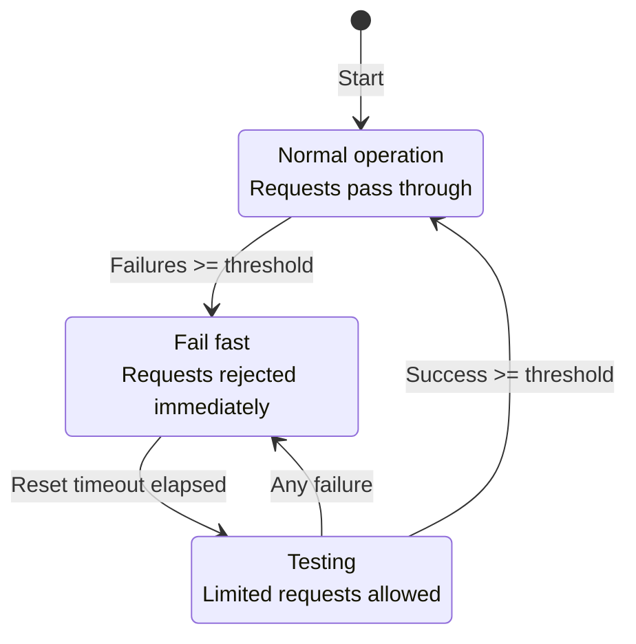
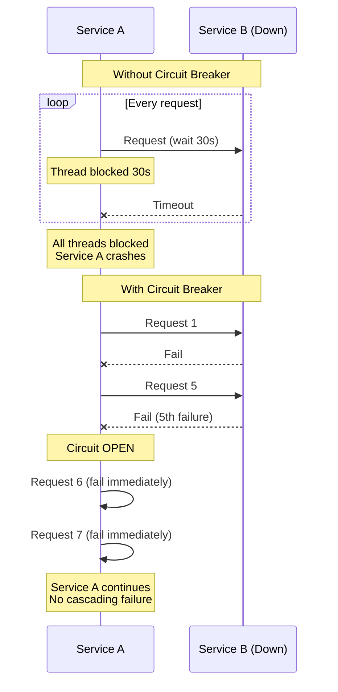
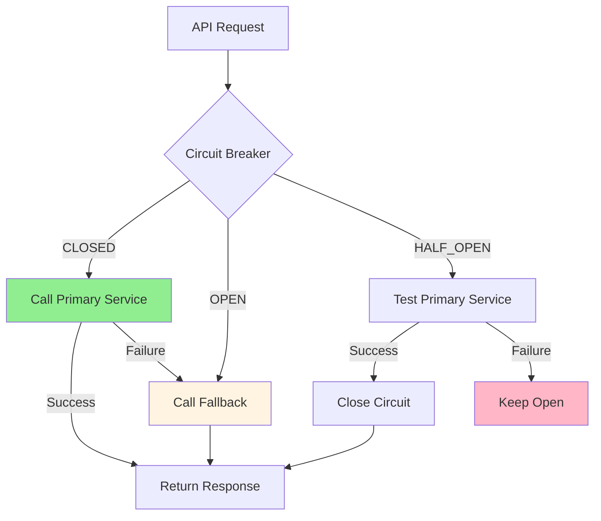
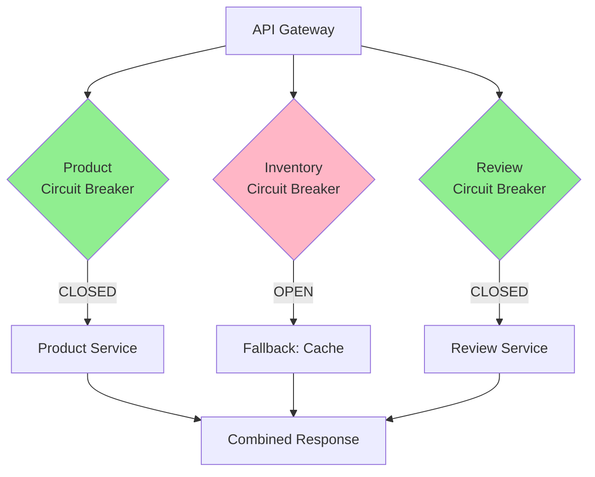

# Circuit Breaker

## 1. Why this exists (Real-world problem first)

Your payment service calls external bank API. Bank API down. Payment service waits 30 seconds per request for timeout. Under load (100 req/sec), all threads blocked waiting for bank API. Payment service crashes. Entire checkout flow down. The problem? Without circuit breaker, failing dependencies cause cascading failures that take down your entire system.

**Real production failures from missing circuit breakers:**

1. **The Cascading Failure Disaster**: E-commerce checkout calls payment service. Payment service calls fraud detection service. Fraud detection service slow (10 seconds per request). Payment service threads blocked waiting. All payment threads exhausted. Checkout service times out calling payment service. Checkout threads exhausted. Entire site down. 4-hour outage. $5M in lost sales. One slow service took down everything. Should have had circuit breakers.

2. **The Retry Storm**: Recommendation service calls ML API. ML API crashes. Recommendation service retries failed requests. 1000 requests/second × 3 retries = 3000 requests/second hitting crashed ML API. ML API can't recover under load. Retry storm prevents recovery. Manual intervention required to stop retries. Should have had circuit breaker to stop retries.

3. **The Timeout Hell**: Order service calls inventory service with 30-second timeout. Inventory service database slow. Every request takes 25 seconds. Order service waits 25 seconds per request. Under load, all order service threads blocked. Order service crashes. Should have had circuit breaker with aggressive timeout (3 seconds) and fail-fast.

4. **The Partial Outage Amplification**: Product service calls 5 microservices. Image service slow (5 seconds). Product service waits 5 seconds for images. Page load time: 5 seconds. Users abandon. Image service partial outage becomes total product service outage. Should have had circuit breaker to fail fast and show products without images.

**What breaks without circuit breakers:**
- Cascading failures across services
- Slow dependencies block all threads
- Retry storms prevent recovery
- Can't isolate failures
- Don't fail fast
- Don't understand circuit breaker states

## 2. Mental model (build imagination)

Think of circuit breaker as **Electrical Circuit Breaker**.

### The Electrical Breaker Analogy

**No Circuit Breaker**:
- Electrical short circuit
- Wires overheat
- Fire starts
- House burns down

**With Circuit Breaker**:
- Electrical short circuit
- Circuit breaker detects problem
- Circuit breaker trips (opens)
- Electricity stops flowing
- Prevents fire
- Can reset after problem fixed

**The Flow:**

**Without Circuit Breaker:**
```
Service A calls Service B
Service B slow/down
Service A waits 30 seconds
All Service A threads blocked
Service A crashes
Cascading failure
```

**With Circuit Breaker:**
```
Service A calls Service B via circuit breaker
Service B fails 5 times
Circuit breaker opens (trips)
Future calls fail immediately (no wait)
Service A continues (degraded mode)
After 30 seconds, circuit breaker tries again (half-open)
If success, circuit closes (normal mode)
```

**Why this matters:**
- Prevents cascading failures
- Fails fast instead of waiting
- Allows system to recover
- Isolates failures
- Maintains partial functionality

## 3. How Node.js implements this internally

### Basic Circuit Breaker

```javascript
class CircuitBreaker {
  constructor(fn, options = {}) {
    this.fn = fn;
    this.state = 'CLOSED'; // CLOSED, OPEN, HALF_OPEN
    this.failureCount = 0;
    this.successCount = 0;
    this.nextAttempt = Date.now();
    
    this.failureThreshold = options.failureThreshold || 5;
    this.successThreshold = options.successThreshold || 2;
    this.timeout = options.timeout || 3000;
    this.resetTimeout = options.resetTimeout || 60000;
  }
  
  async execute(...args) {
    if (this.state === 'OPEN') {
      if (Date.now() < this.nextAttempt) {
        throw new Error('Circuit breaker is OPEN');
      }
      
      // Try half-open
      this.state = 'HALF_OPEN';
    }
    
    try {
      const result = await Promise.race([
        this.fn(...args),
        new Promise((_, reject) => 
          setTimeout(() => reject(new Error('Timeout')), this.timeout)
        )
      ]);
      
      this.onSuccess();
      return result;
    } catch (err) {
      this.onFailure();
      throw err;
    }
  }
  
  onSuccess() {
    this.failureCount = 0;
    
    if (this.state === 'HALF_OPEN') {
      this.successCount++;
      
      if (this.successCount >= this.successThreshold) {
        this.state = 'CLOSED';
        this.successCount = 0;
      }
    }
  }
  
  onFailure() {
    this.failureCount++;
    this.successCount = 0;
    
    if (this.failureCount >= this.failureThreshold) {
      this.state = 'OPEN';
      this.nextAttempt = Date.now() + this.resetTimeout;
    }
  }
  
  getState() {
    return this.state;
  }
}

// Usage
const paymentBreaker = new CircuitBreaker(
  async (amount) => {
    return await axios.post(`${PAYMENT_SERVICE}/charge`, { amount });
  },
  {
    failureThreshold: 5,
    timeout: 3000,
    resetTimeout: 60000
  }
);

app.post('/api/checkout', async (req, res) => {
  try {
    const payment = await paymentBreaker.execute(req.body.amount);
    res.json({ success: true, payment });
  } catch (err) {
    // Circuit breaker open or payment failed
    res.status(503).json({ error: 'Payment service unavailable' });
  }
});
```

### Circuit Breaker with Fallback

```javascript
class CircuitBreakerWithFallback {
  constructor(fn, fallback, options = {}) {
    this.breaker = new CircuitBreaker(fn, options);
    this.fallback = fallback;
  }
  
  async execute(...args) {
    try {
      return await this.breaker.execute(...args);
    } catch (err) {
      console.log('Circuit breaker failed, using fallback');
      return await this.fallback(...args);
    }
  }
}

// Usage
const recommendationBreaker = new CircuitBreakerWithFallback(
  async (userId) => {
    // Primary: ML-based recommendations
    return await axios.get(`${ML_SERVICE}/recommendations/${userId}`);
  },
  async (userId) => {
    // Fallback: Popular products
    return await db.products.find().sort({ popularity: -1 }).limit(10);
  },
  { failureThreshold: 3, timeout: 2000 }
);

app.get('/api/recommendations', async (req, res) => {
  const recommendations = await recommendationBreaker.execute(req.user.id);
  res.json(recommendations);
});
```

### Circuit Breaker with opossum Library

```javascript
const CircuitBreaker = require('opossum');

// Create circuit breaker
const breaker = new CircuitBreaker(
  async (orderId) => {
    return await axios.get(`${INVENTORY_SERVICE}/stock/${orderId}`);
  },
  {
    timeout: 3000, // 3 second timeout
    errorThresholdPercentage: 50, // Open after 50% failures
    resetTimeout: 30000, // Try again after 30 seconds
    rollingCountTimeout: 10000, // 10 second window
    rollingCountBuckets: 10 // 10 buckets
  }
);

// Event listeners
breaker.on('open', () => {
  console.log('Circuit breaker opened');
});

breaker.on('halfOpen', () => {
  console.log('Circuit breaker half-open, trying request');
});

breaker.on('close', () => {
  console.log('Circuit breaker closed, back to normal');
});

breaker.on('fallback', (result) => {
  console.log('Fallback executed:', result);
});

// Fallback function
breaker.fallback(() => {
  return { inStock: false, message: 'Inventory service unavailable' };
});

// Usage
app.get('/api/inventory/:orderId', async (req, res) => {
  try {
    const inventory = await breaker.fire(req.params.orderId);
    res.json(inventory);
  } catch (err) {
    res.status(503).json({ error: 'Service unavailable' });
  }
});
```

### Multi-Service Circuit Breaker

```javascript
class ServiceCircuitBreakers {
  constructor() {
    this.breakers = new Map();
  }
  
  getBreaker(serviceName, fn, options) {
    if (!this.breakers.has(serviceName)) {
      const breaker = new CircuitBreaker(fn, options);
      
      breaker.on('open', () => {
        console.log(`Circuit breaker OPEN for ${serviceName}`);
        // Alert monitoring system
      });
      
      this.breakers.set(serviceName, breaker);
    }
    
    return this.breakers.get(serviceName);
  }
  
  async callService(serviceName, fn, ...args) {
    const breaker = this.getBreaker(serviceName, fn, {
      timeout: 3000,
      failureThreshold: 5,
      resetTimeout: 60000
    });
    
    return await breaker.execute(...args);
  }
  
  getStatus() {
    const status = {};
    
    for (const [name, breaker] of this.breakers) {
      status[name] = breaker.getState();
    }
    
    return status;
  }
}

// Usage
const breakers = new ServiceCircuitBreakers();

app.get('/api/product/:id', async (req, res) => {
  try {
    const [product, inventory, reviews] = await Promise.all([
      breakers.callService('product', 
        () => axios.get(`${PRODUCT_SERVICE}/products/${req.params.id}`)
      ),
      breakers.callService('inventory',
        () => axios.get(`${INVENTORY_SERVICE}/stock/${req.params.id}`)
      ),
      breakers.callService('reviews',
        () => axios.get(`${REVIEW_SERVICE}/reviews/${req.params.id}`)
      )
    ]);
    
    res.json({ product, inventory, reviews });
  } catch (err) {
    res.status(503).json({ error: 'Service unavailable' });
  }
});

// Health check endpoint
app.get('/health/breakers', (req, res) => {
  res.json(breakers.getStatus());
});
```

### Common Misunderstandings

**Mistake 1**: "Circuit breaker is just retry logic"
- **Reality**: Circuit breaker prevents retries when service is down
- **Impact**: Retry storms make problem worse

**Mistake 2**: "Always use same thresholds"
- **Reality**: Different services need different thresholds
- **Impact**: Too sensitive or not sensitive enough

**Mistake 3**: "Circuit breaker solves all failure problems"
- **Reality**: Need fallbacks, timeouts, retries too
- **Impact**: Incomplete resilience strategy

## 4. Multiple diagrams (MANDATORY)

### Diagram 1: Circuit Breaker States



### Diagram 2: Without vs With Circuit Breaker



### Diagram 3: Circuit Breaker with Fallback



### Diagram 4: Multi-Service Circuit Breakers



## 5. Where this is used in real projects

### E-Commerce Product Page

```javascript
const CircuitBreaker = require('opossum');

// Circuit breakers for each service
const productBreaker = new CircuitBreaker(
  async (productId) => {
    return await axios.get(`${PRODUCT_SERVICE}/products/${productId}`);
  },
  { timeout: 2000, errorThresholdPercentage: 50 }
);

const inventoryBreaker = new CircuitBreaker(
  async (productId) => {
    return await axios.get(`${INVENTORY_SERVICE}/stock/${productId}`);
  },
  { timeout: 2000, errorThresholdPercentage: 50 }
);

// Fallback for inventory
inventoryBreaker.fallback(() => ({
  inStock: true,
  message: 'Stock information unavailable'
}));

const reviewBreaker = new CircuitBreaker(
  async (productId) => {
    return await axios.get(`${REVIEW_SERVICE}/reviews/${productId}`);
  },
  { timeout: 2000, errorThresholdPercentage: 50 }
);

// Fallback for reviews
reviewBreaker.fallback(() => ({
  reviews: [],
  message: 'Reviews unavailable'
}));

app.get('/api/products/:id', async (req, res) => {
  try {
    // Product is critical, no fallback
    const product = await productBreaker.fire(req.params.id);
    
    // Inventory and reviews have fallbacks
    const [inventory, reviews] = await Promise.all([
      inventoryBreaker.fire(req.params.id),
      reviewBreaker.fire(req.params.id)
    ]);
    
    res.json({
      ...product.data,
      inventory: inventory.data || inventory,
      reviews: reviews.data || reviews
    });
  } catch (err) {
    res.status(503).json({ error: 'Product service unavailable' });
  }
});
```

### Payment Processing with Retry

```javascript
const breaker = new CircuitBreaker(
  async (paymentData) => {
    return await axios.post(`${PAYMENT_SERVICE}/charge`, paymentData);
  },
  {
    timeout: 5000,
    errorThresholdPercentage: 50,
    resetTimeout: 30000
  }
);

// Retry with exponential backoff
async function processPaymentWithRetry(paymentData, maxRetries = 3) {
  for (let attempt = 0; attempt < maxRetries; attempt++) {
    try {
      const result = await breaker.fire(paymentData);
      return result.data;
    } catch (err) {
      if (breaker.opened) {
        // Circuit open, don't retry
        throw new Error('Payment service unavailable');
      }
      
      if (attempt === maxRetries - 1) {
        throw err;
      }
      
      // Exponential backoff
      await new Promise(r => setTimeout(r, Math.pow(2, attempt) * 1000));
    }
  }
}

app.post('/api/checkout', async (req, res) => {
  try {
    const payment = await processPaymentWithRetry(req.body.payment);
    res.json({ success: true, payment });
  } catch (err) {
    res.status(503).json({ error: err.message });
  }
});
```

## 6. Where this should NOT be used

### Don't Use for Database Queries

```javascript
// WRONG: Circuit breaker for database
// Database should always be available
const dbBreaker = new CircuitBreaker(() => db.query(...));

// RIGHT: Use connection pooling, retries, but not circuit breaker
```

### Don't Use for Critical Services Without Fallback

```javascript
// WRONG: Circuit breaker for authentication, no fallback
const authBreaker = new CircuitBreaker(authenticateUser);
// If circuit opens, nobody can log in!

// RIGHT: Don't use circuit breaker for critical services
// Or have proper fallback strategy
```

## 7. Failure modes & edge cases

### Failure Mode 1: Premature Circuit Opening

**Scenario**: Circuit opens after 5 failures, but service recovers quickly

```
5 requests fail
Circuit opens
Service recovers in 1 second
Circuit stays open for 60 seconds
Unnecessary degradation
```

**Solution**: Lower failure threshold, shorter reset timeout

### Failure Mode 2: Thundering Herd

**Scenario**: Circuit half-open, all requests try at once

```
Circuit opens
Reset timeout elapses
Circuit half-open
100 requests hit service simultaneously
Service overwhelmed again
```

**Solution**: Limit concurrent requests in half-open state

### Failure Mode 3: False Positives

**Scenario**: Network blip causes circuit to open

```
Network blip (1 second)
5 requests fail
Circuit opens for 60 seconds
Service actually fine
```

**Solution**: Higher failure threshold, consider error types

## 8. Trade-offs & alternatives

### Circuit Breaker

**Gain**: Prevents cascading failures, fails fast, allows recovery
**Sacrifice**: Complexity, potential false positives, requires tuning
**When**: External service calls, microservices, unreliable dependencies

### Retry Logic

**Gain**: Simple, handles transient failures
**Sacrifice**: Can make problem worse (retry storm)
**When**: Transient failures, idempotent operations

### Timeout Only

**Gain**: Simple, prevents indefinite waiting
**Sacrifice**: Doesn't prevent cascading failures
**When**: Simple systems, reliable dependencies

## 9. Interview-level articulation

**Q: "What is a circuit breaker and when would you use it?"**

**A**: "A circuit breaker prevents cascading failures by failing fast when a dependency is down. It has three states: CLOSED (normal), OPEN (failing fast), and HALF-OPEN (testing recovery). When failures exceed a threshold, the circuit opens and rejects requests immediately without calling the failing service. After a timeout, it enters half-open state to test if the service recovered. I use circuit breakers for external service calls—for example, when calling a payment service, if it fails 5 times, I open the circuit and return errors immediately instead of waiting 30 seconds per request. This prevents my service from crashing when dependencies fail. I also implement fallbacks—if the recommendation service circuit is open, I return popular products instead."

**Q: "How do you tune circuit breaker thresholds?"**

**A**: "I tune based on the service characteristics and business requirements. For critical services like payment, I use a higher failure threshold (10 failures) and longer timeout (5 seconds) to avoid false positives. For non-critical services like recommendations, I use a lower threshold (3 failures) and shorter timeout (2 seconds) to fail fast. I monitor circuit breaker state changes and adjust based on false positive rate. If the circuit opens too often for transient issues, I increase the threshold. If cascading failures still occur, I decrease the threshold. I also consider error types—network errors might warrant opening the circuit, but 404 errors shouldn't."

## 10. Key takeaways (engineer mindset)

### What to Remember

1. **Circuit breaker**: Prevents cascading failures
2. **Three states**: CLOSED, OPEN, HALF_OPEN
3. **Fail fast**: Don't wait for timeout when circuit open
4. **Fallbacks**: Provide degraded functionality
5. **Thresholds**: Tune based on service characteristics
6. **Monitoring**: Track circuit state changes
7. **Recovery**: Half-open state tests service recovery

### What Decisions This Enables

**Resilience decisions**:
- Which services need circuit breakers
- Failure thresholds and timeouts
- Fallback strategies

**Architecture decisions**:
- Service dependency management
- Graceful degradation approach
- Monitoring and alerting

**Business decisions**:
- Critical vs non-critical services
- Acceptable degradation levels
- SLA requirements

### How It Connects to Other Node.js Concepts

**Service Communication** (Topic 32):
- Circuit breaker protects sync service calls
- Prevents cascading failures

**Rate Limiting** (Topic 36):
- Both protect services from overload
- Different mechanisms

**Bulkhead Pattern** (Topic 38):
- Complementary isolation strategy
- Circuit breaker + bulkhead = robust system

### The Golden Rule

**Use circuit breakers for all external service calls**. Implement three states (CLOSED, OPEN, HALF_OPEN). Fail fast when circuit open. Provide fallbacks for non-critical services. Tune thresholds based on service characteristics (critical services: higher threshold, non-critical: lower threshold). Monitor circuit state changes. Use aggressive timeouts (2-3 seconds). Don't use for databases or critical services without fallbacks.
