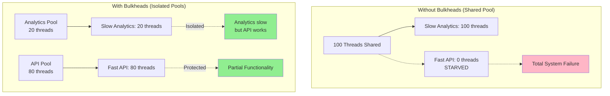
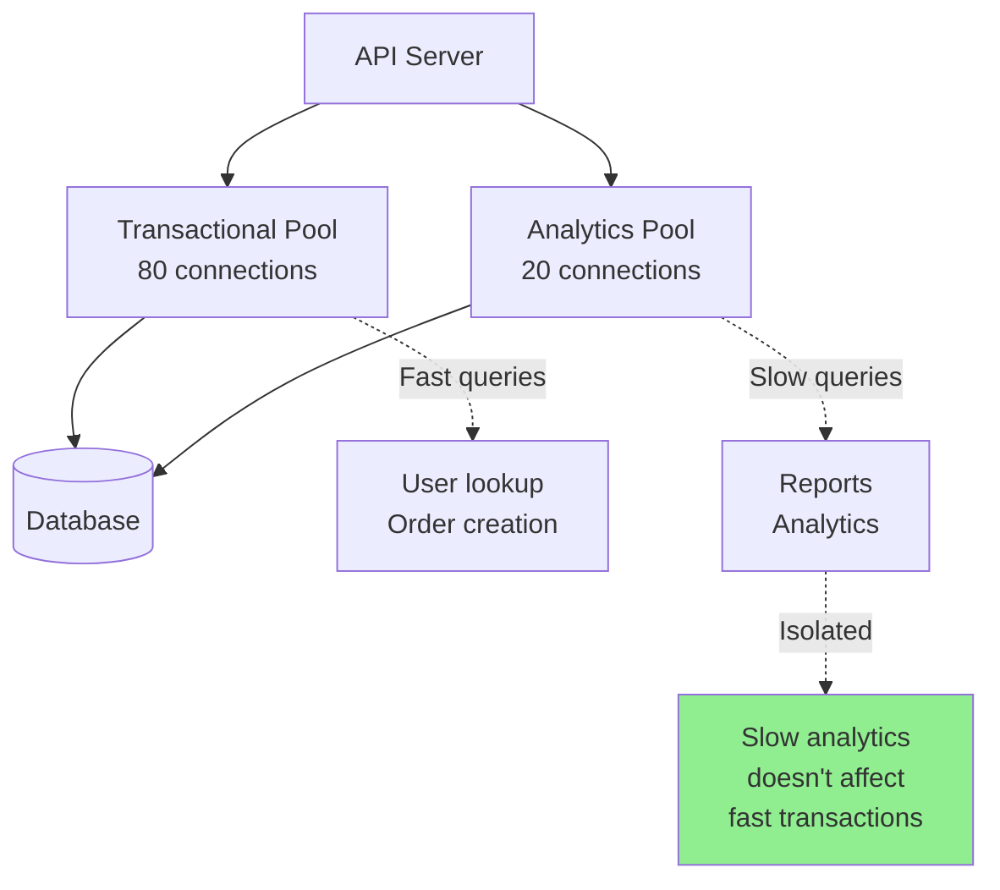
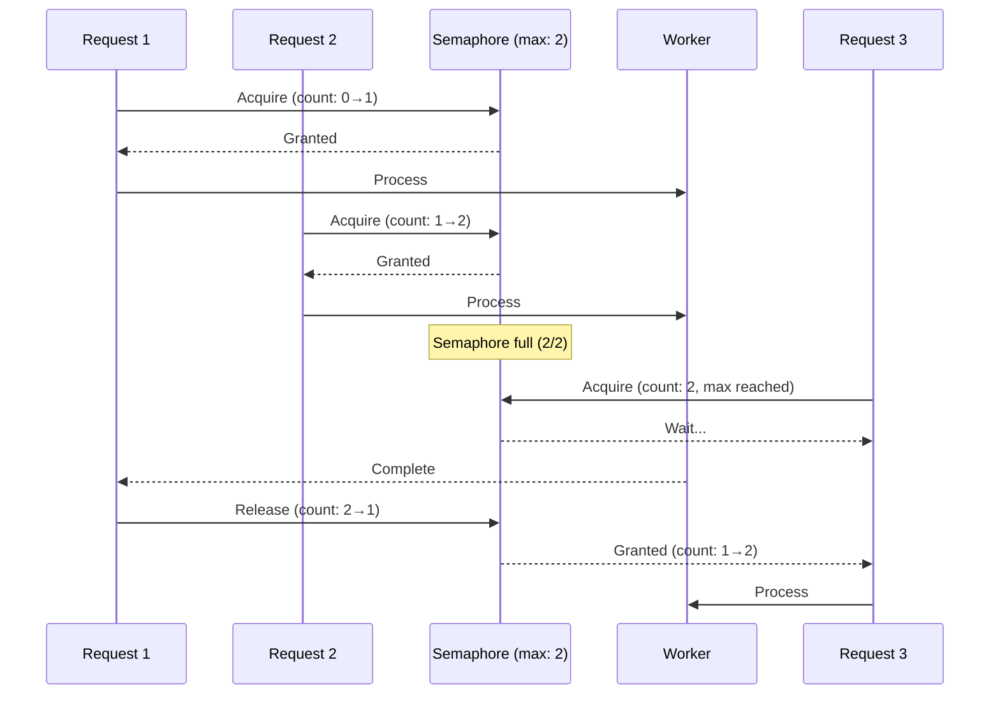
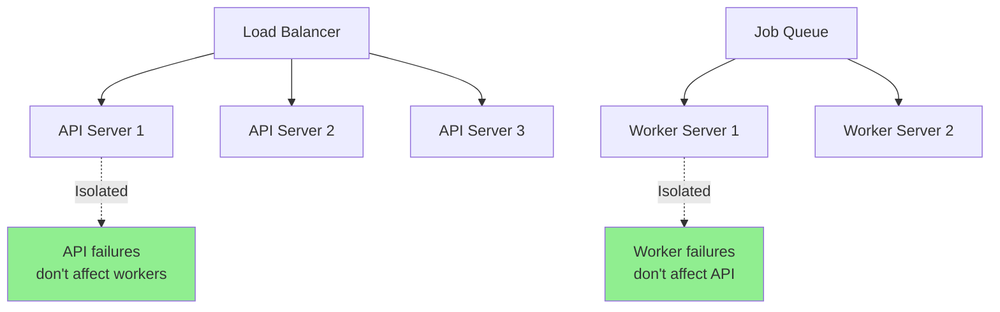

# Bulkhead pattern

## 1. Why this exists (Real-world problem first)

Your API server has single thread pool (100 threads). Slow analytics endpoint takes 10 seconds per request. 100 concurrent analytics requests consume all threads. Fast product listing endpoint (100ms) can't get threads. All users affected by slow analytics. The problem? Without bulkheads, one slow operation can starve all other operations of resources, causing total system failure.

**Real production failures from missing bulkheads:**

1. **The Thread Pool Exhaustion**: E-commerce API has 200-thread pool shared across all endpoints. Report generation endpoint takes 30 seconds per request. Marketing team runs 200 concurrent reports. All 200 threads busy generating reports. Product listing, checkout, search all blocked. Entire site down for 30 seconds. Should have isolated report generation in separate thread pool (bulkhead).

2. **The Database Connection Starvation**: API server has 100 database connections shared across all operations. Slow analytics query takes 60 seconds, holds connection. 100 concurrent analytics queries consume all connections. Fast user lookup queries can't get connections. Login fails. Checkout fails. Should have separate connection pools for analytics vs transactional queries.

3. **The Memory Leak Cascade**: Image processing service shares memory with API requests. Image processing has memory leak. Consumes all available memory. API requests fail with out-of-memory errors. Entire service crashes. Should have isolated image processing in separate process (bulkhead).

4. **The CPU Starvation**: Background job processor shares CPU with API server. CPU-intensive video encoding jobs run. API response time increases from 100ms to 5 seconds. Users complain about slow site. Should have separate servers for background jobs vs API (bulkhead).

**What breaks without bulkheads:**
- One slow operation affects everything
- Resource starvation across system
- Can't isolate failures
- Don't understand resource partitioning
- Total system failure from partial problem
- Can't prioritize critical operations

## 2. Mental model (build imagination)

Think of bulkhead pattern as **Ship Compartments**.

### The Ship Compartment Analogy

**No Bulkheads (Single Compartment)**:
- Ship has one large compartment
- Hull breach in one area
- Water floods entire ship
- Ship sinks completely
- Total failure

**With Bulkheads (Multiple Compartments)**:
- Ship divided into sealed compartments
- Hull breach in one compartment
- Water contained to that compartment
- Other compartments stay dry
- Ship stays afloat
- Partial failure, not total

**The Flow:**

**Without Bulkheads:**
```
100 threads shared
Slow operation uses 100 threads
Fast operations starved
Entire system blocked
```

**With Bulkheads:**
```
Analytics: 20 threads (bulkhead)
API: 80 threads (bulkhead)
Slow analytics uses 20 threads
API still has 80 threads
System partially functional
```

**Why this matters:**
- Isolates failures
- Prevents resource starvation
- Maintains partial functionality
- Protects critical operations
- Enables resource prioritization

## 3. How Node.js implements this internally

### Thread Pool Bulkhead

```javascript
const { Worker } = require('worker_threads');

class ThreadPoolBulkhead {
  constructor(poolSize) {
    this.poolSize = poolSize;
    this.workers = [];
    this.queue = [];
    this.activeWorkers = 0;
    
    // Create worker pool
    for (let i = 0; i < poolSize; i++) {
      this.workers.push(null);
    }
  }
  
  async execute(task) {
    return new Promise((resolve, reject) => {
      this.queue.push({ task, resolve, reject });
      this.processQueue();
    });
  }
  
  processQueue() {
    if (this.queue.length === 0) return;
    
    // Find available worker slot
    const workerIndex = this.workers.findIndex(w => w === null);
    if (workerIndex === -1) return; // All workers busy
    
    const { task, resolve, reject } = this.queue.shift();
    
    // Create worker
    const worker = new Worker('./worker.js', {
      workerData: task
    });
    
    this.workers[workerIndex] = worker;
    this.activeWorkers++;
    
    worker.on('message', (result) => {
      resolve(result);
      this.cleanup(workerIndex);
    });
    
    worker.on('error', (err) => {
      reject(err);
      this.cleanup(workerIndex);
    });
  }
  
  cleanup(workerIndex) {
    this.workers[workerIndex].terminate();
    this.workers[workerIndex] = null;
    this.activeWorkers--;
    this.processQueue();
  }
}

// Separate bulkheads for different operations
const analyticsPool = new ThreadPoolBulkhead(5); // 5 threads for analytics
const apiPool = new ThreadPoolBulkhead(20); // 20 threads for API

app.get('/api/analytics/report', async (req, res) => {
  try {
    const result = await analyticsPool.execute({
      type: 'analytics',
      query: req.query
    });
    res.json(result);
  } catch (err) {
    res.status(500).json({ error: 'Analytics failed' });
  }
});

app.get('/api/products', async (req, res) => {
  try {
    const result = await apiPool.execute({
      type: 'products',
      query: req.query
    });
    res.json(result);
  } catch (err) {
    res.status(500).json({ error: 'Products failed' });
  }
});
```

### Database Connection Pool Bulkhead

```javascript
const { Pool } = require('pg');

// Separate connection pools (bulkheads)
const transactionalPool = new Pool({
  host: 'localhost',
  database: 'mydb',
  max: 80, // 80 connections for transactional queries
  idleTimeoutMillis: 30000
});

const analyticsPool = new Pool({
  host: 'localhost',
  database: 'mydb',
  max: 20, // 20 connections for analytics
  idleTimeoutMillis: 30000
});

// Transactional queries use transactional pool
app.get('/api/users/:id', async (req, res) => {
  const client = await transactionalPool.connect();
  try {
    const result = await client.query('SELECT * FROM users WHERE id = $1', [req.params.id]);
    res.json(result.rows[0]);
  } finally {
    client.release();
  }
});

// Analytics queries use analytics pool
app.get('/api/analytics/sales', async (req, res) => {
  const client = await analyticsPool.connect();
  try {
    const result = await client.query(`
      SELECT date, SUM(amount) as total
      FROM orders
      WHERE date >= $1
      GROUP BY date
    `, [req.query.startDate]);
    res.json(result.rows);
  } finally {
    client.release();
  }
});
```

### Semaphore-Based Bulkhead

```javascript
class SemaphoreBulkhead {
  constructor(maxConcurrent) {
    this.maxConcurrent = maxConcurrent;
    this.currentConcurrent = 0;
    this.queue = [];
  }
  
  async acquire() {
    if (this.currentConcurrent < this.maxConcurrent) {
      this.currentConcurrent++;
      return;
    }
    
    // Wait for available slot
    await new Promise(resolve => this.queue.push(resolve));
  }
  
  release() {
    this.currentConcurrent--;
    
    if (this.queue.length > 0) {
      const resolve = this.queue.shift();
      this.currentConcurrent++;
      resolve();
    }
  }
  
  async execute(fn) {
    await this.acquire();
    try {
      return await fn();
    } finally {
      this.release();
    }
  }
}

// Separate semaphores for different operations
const imageProcessingSemaphore = new SemaphoreBulkhead(5);
const apiSemaphore = new SemaphoreBulkhead(100);

app.post('/api/images/process', async (req, res) => {
  try {
    const result = await imageProcessingSemaphore.execute(async () => {
      return await processImage(req.body.imageUrl);
    });
    res.json(result);
  } catch (err) {
    res.status(500).json({ error: 'Image processing failed' });
  }
});

app.get('/api/products', async (req, res) => {
  try {
    const result = await apiSemaphore.execute(async () => {
      return await db.products.find();
    });
    res.json(result);
  } catch (err) {
    res.status(500).json({ error: 'Products failed' });
  }
});
```

### Process-Level Bulkhead

```javascript
// Separate processes for different operations

// api-server.js (main API)
const express = require('express');
const app = express();

app.get('/api/products', async (req, res) => {
  const products = await db.products.find();
  res.json(products);
});

app.listen(3000);

// worker-server.js (background jobs)
const Queue = require('bull');
const queue = new Queue('jobs');

queue.process(async (job) => {
  // CPU-intensive work isolated in separate process
  return await processJob(job.data);
});

// Deploy as separate services
// API Server: 10 instances
// Worker Server: 5 instances
// Isolated resources, failures don't cascade
```

### Common Misunderstandings

**Mistake 1**: "Bulkhead is same as circuit breaker"
- **Reality**: Bulkhead isolates resources, circuit breaker prevents cascading failures
- **Impact**: Confusion about when to use each

**Mistake 2**: "Always use maximum isolation"
- **Reality**: Over-isolation wastes resources
- **Impact**: Inefficient resource utilization

**Mistake 3**: "Bulkhead solves all resource problems"
- **Reality**: Need proper sizing, monitoring, auto-scaling too
- **Impact**: Incomplete resource management

## 4. Multiple diagrams (MANDATORY)

### Diagram 1: Without vs With Bulkheads



### Diagram 2: Database Connection Pool Bulkheads



### Diagram 3: Semaphore Bulkheads



### Diagram 4: Process-Level Bulkheads



## 5. Where this is used in real projects

### Multi-Tier API with Bulkheads

```javascript
const express = require('express');
const { Pool } = require('pg');
const app = express();

// Database connection bulkheads
const criticalPool = new Pool({ max: 50 }); // Critical operations
const standardPool = new Pool({ max: 30 }); // Standard operations
const analyticsPool = new Pool({ max: 20 }); // Analytics

// Semaphore bulkheads
const criticalSemaphore = new SemaphoreBulkhead(100);
const standardSemaphore = new SemaphoreBulkhead(50);
const analyticsSemaphore = new SemaphoreBulkhead(10);

// Critical endpoint (payment, checkout)
app.post('/api/checkout', async (req, res) => {
  await criticalSemaphore.execute(async () => {
    const client = await criticalPool.connect();
    try {
      await client.query('BEGIN');
      
      // Create order
      const order = await client.query(
        'INSERT INTO orders (user_id, total) VALUES ($1, $2) RETURNING *',
        [req.user.id, req.body.total]
      );
      
      // Process payment
      await processPayment(req.body.payment);
      
      await client.query('COMMIT');
      res.json(order.rows[0]);
    } catch (err) {
      await client.query('ROLLBACK');
      throw err;
    } finally {
      client.release();
    }
  });
});

// Standard endpoint (product listing)
app.get('/api/products', async (req, res) => {
  await standardSemaphore.execute(async () => {
    const client = await standardPool.connect();
    try {
      const result = await client.query('SELECT * FROM products LIMIT 100');
      res.json(result.rows);
    } finally {
      client.release();
    }
  });
});

// Analytics endpoint (slow queries)
app.get('/api/analytics/sales', async (req, res) => {
  await analyticsSemaphore.execute(async () => {
    const client = await analyticsPool.connect();
    try {
      const result = await client.query(`
        SELECT date, SUM(amount) as total
        FROM orders
        WHERE date >= $1
        GROUP BY date
      `, [req.query.startDate]);
      res.json(result.rows);
    } finally {
      client.release();
    }
  });
});
```

### Microservices with Process Bulkheads

```javascript
// Separate services (process-level bulkheads)

// user-service.js
const app = express();
app.get('/users/:id', async (req, res) => {
  const user = await db.users.findById(req.params.id);
  res.json(user);
});
app.listen(3001);

// order-service.js
const app = express();
app.get('/orders/:id', async (req, res) => {
  const order = await db.orders.findById(req.params.id);
  res.json(order);
});
app.listen(3002);

// analytics-service.js (isolated, can crash without affecting others)
const app = express();
app.get('/analytics/report', async (req, res) => {
  const report = await generateReport(req.query);
  res.json(report);
});
app.listen(3003);

// Deploy separately
// User Service: 10 instances, 2GB RAM each
// Order Service: 10 instances, 2GB RAM each
// Analytics Service: 2 instances, 8GB RAM each
```

## 6. Where this should NOT be used

### Don't Over-Isolate

```javascript
// WRONG: Separate pool for every endpoint
const userPool = new Pool({ max: 10 });
const orderPool = new Pool({ max: 10 });
const productPool = new Pool({ max: 10 });
// ... 50 more pools
// Total: 500 connections, wasteful!

// RIGHT: Group by characteristics
const transactionalPool = new Pool({ max: 80 });
const analyticsPool = new Pool({ max: 20 });
```

### Don't Use for Homogeneous Workloads

```javascript
// WRONG: Bulkheads for identical operations
const pool1 = new Pool({ max: 50 });
const pool2 = new Pool({ max: 50 });
// All operations same speed, no benefit

// RIGHT: Single pool for homogeneous workload
const pool = new Pool({ max: 100 });
```

## 7. Failure modes & edge cases

### Failure Mode 1: Bulkhead Too Small

**Scenario**: Analytics bulkhead too small (5 threads)

```
10 analytics requests arrive
5 process, 5 queue
Queue grows unbounded
Memory exhaustion
```

**Solution**: Monitor queue size, auto-scale, reject excess

### Failure Mode 2: Bulkhead Too Large

**Scenario**: Analytics bulkhead too large (80 threads)

```
Analytics gets 80 threads
API gets 20 threads
Analytics starves API
Defeats purpose of bulkhead
```

**Solution**: Proper sizing based on workload

### Failure Mode 3: Resource Leak

**Scenario**: Connections not released

```
Acquire connection from pool
Exception thrown
Connection not released
Pool exhausted over time
```

**Solution**: Always use try/finally to release

## 8. Trade-offs & alternatives

### Bulkhead Pattern

**Gain**: Isolates failures, prevents resource starvation, maintains partial functionality
**Sacrifice**: Resource overhead, complexity, requires sizing
**When**: Mixed workloads, different priorities, critical operations

### Shared Resources

**Gain**: Simple, efficient resource utilization
**Sacrifice**: No isolation, cascading failures
**When**: Homogeneous workloads, small scale

### Auto-Scaling

**Gain**: Dynamic resource allocation
**Sacrifice**: Slower response, cost
**When**: Variable load, cloud environments

## 9. Interview-level articulation

**Q: "What is the bulkhead pattern and when would you use it?"**

**A**: "The bulkhead pattern isolates resources into separate pools to prevent one operation from starving others. It's like ship compartments—if one compartment floods, others stay dry. I use it when I have mixed workloads with different characteristics. For example, I separate database connections into a transactional pool (80 connections for fast queries) and an analytics pool (20 connections for slow queries). This prevents slow analytics queries from consuming all connections and blocking fast user lookups. I also use process-level bulkheads—running API servers separately from background workers so CPU-intensive jobs don't slow down API responses. The key is identifying operations with different resource needs and isolating them."

**Q: "How do you size bulkheads?"**

**A**: "I size based on workload characteristics and business priorities. For critical operations like checkout, I allocate more resources—maybe 60% of connections. For non-critical operations like analytics, I allocate less—maybe 20%. I monitor queue sizes and response times to validate sizing. If the analytics queue grows unbounded, I increase that bulkhead. If critical operations are starved, I decrease non-critical bulkheads. I also consider request patterns—if analytics runs mostly at night, I can use smaller bulkheads. The goal is to prevent starvation while maximizing resource utilization. I start conservative and adjust based on production metrics."

## 10. Key takeaways (engineer mindset)

### What to Remember

1. **Bulkhead**: Isolates resources into separate pools
2. **Prevents starvation**: One operation can't consume all resources
3. **Thread pools**: Separate pools for different operations
4. **Connection pools**: Separate pools for different query types
5. **Process-level**: Separate services for different workloads
6. **Sizing**: Based on workload and priorities
7. **Monitoring**: Track queue sizes and utilization

### What Decisions This Enables

**Resource decisions**:
- How to partition resources
- Pool sizes for different operations
- Critical vs non-critical allocation

**Architecture decisions**:
- Microservices vs monolith
- Process separation strategy
- Resource isolation approach

**Reliability decisions**:
- Failure isolation strategy
- Graceful degradation approach
- Priority-based resource allocation

### How It Connects to Other Node.js Concepts

**Circuit Breaker** (Topic 37):
- Bulkhead isolates resources, circuit breaker prevents cascading failures
- Complementary patterns

**Worker Threads** (Topic 14):
- Worker thread pools are bulkheads
- Isolate CPU-intensive work

**Horizontal Scaling** (Topic 34):
- Process-level bulkheads enable independent scaling
- Different services scale differently

### The Golden Rule

**Isolate resources for operations with different characteristics**. Separate thread pools for CPU-intensive vs I/O operations. Separate database connection pools for transactional vs analytics queries. Separate processes for API vs background jobs. Size bulkheads based on workload (critical: 60%, standard: 30%, analytics: 10%). Monitor queue sizes and adjust. Always release resources (try/finally). Don't over-isolate—group similar operations.
