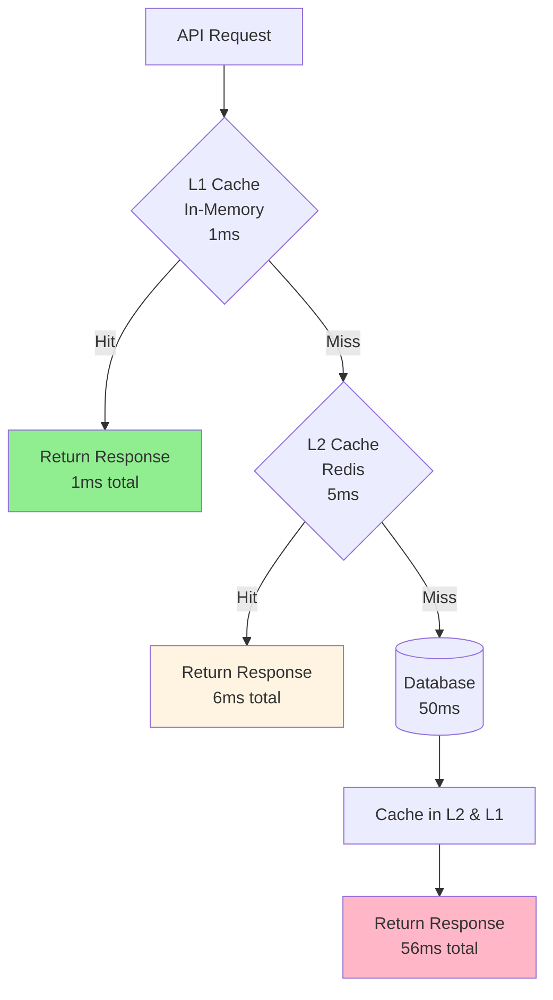
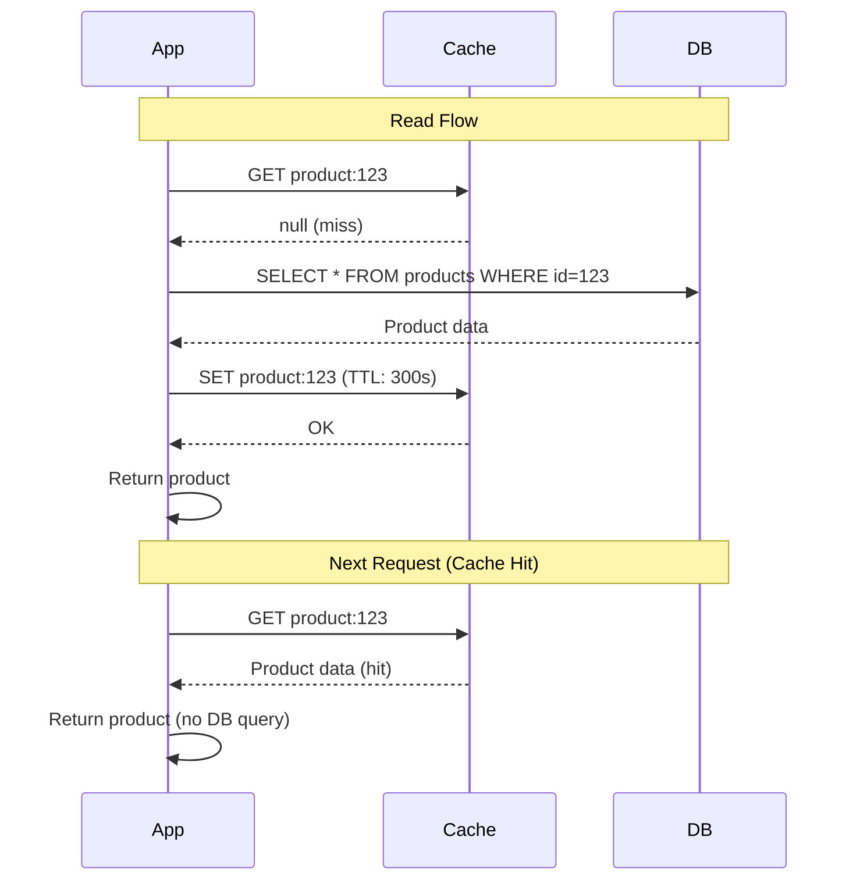
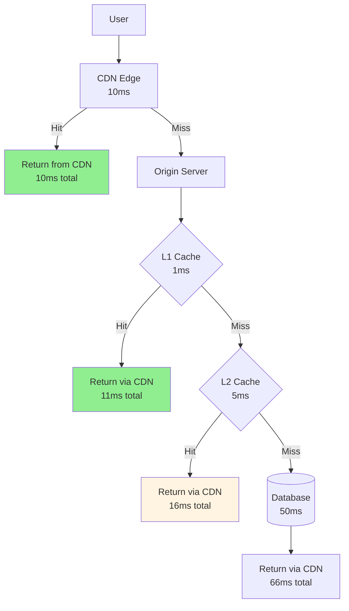

# Caching strategies (L1, L2, CDN)

## 1. Why this exists (Real-world problem first)

Your product API queries database for every request. Database query takes 50ms. Under load (1000 req/sec), database overwhelmed. Response time increases to 5 seconds. Database crashes. The problem? Without caching, every request hits slow data sources, causing poor performance and database overload.

**Real production failures from missing caching:**

1. **The Database Overload**: E-commerce product listing queries database for every request. Product catalog has 100K products. Query takes 100ms. Under Black Friday load (10,000 req/sec), database CPU at 100%. Queries timeout. Site crashes. $10M in lost sales. Product data rarely changes (once per hour). Should have cached product listings for 5 minutes.

2. **The API Cost Explosion**: SaaS platform calls third-party geocoding API for every address lookup. API charges $0.001 per request. 1M requests/day = $1000/day = $30K/month. 80% of requests are for same addresses. Should have cached geocoding results. Would reduce cost to $6K/month.

3. **The Stale Data Nightmare**: News site caches articles for 1 hour. Breaking news published. Cache not invalidated. Users see old news for 1 hour. Competitors publish first. Lost traffic. Should have implemented cache invalidation on article updates.

4. **The Cache Stampede**: Product page cached for 10 minutes. Cache expires. 1000 concurrent requests hit expired cache. All 1000 requests query database simultaneously. Database crashes. Should have implemented cache warming or request coalescing.

**What breaks without proper caching:**
- Database overload from repeated queries
- Slow response times
- High API costs
- Can't handle traffic spikes
- Don't understand cache layers
- Don't know when to invalidate

## 2. Mental model (build imagination)

Think of caching as **Library vs Bookstore**.

### The Library Analogy

**No Cache (Always Buy New)**:
- Need book, drive to bookstore (30 minutes)
- Buy book, drive home (30 minutes)
- Total: 1 hour per book
- Expensive, slow

**L1 Cache (Personal Bookshelf)**:
- Check personal bookshelf (1 second)
- If found, read immediately
- Fast, but limited space

**L2 Cache (Local Library)**:
- Not on bookshelf, check local library (5 minutes)
- If found, borrow and read
- Faster than bookstore, more space than bookshelf

**CDN (Regional Libraries)**:
- Not in local library, check regional library (15 minutes)
- If found, borrow and read
- Distributed, closer than central bookstore

**The Flow:**

**Without Cache:**
```
Request → Database (50ms)
Every request hits database
1000 req/sec = 1000 DB queries/sec
Database overwhelmed
```

**With Multi-Layer Cache:**
```
Request → L1 (in-memory, 1ms) → Hit? Return
         → L2 (Redis, 5ms) → Hit? Return
         → Database (50ms) → Cache in L2 and L1 → Return
Most requests served from cache (1-5ms)
Database load reduced 90%
```

**Why this matters:**
- Reduces database load
- Improves response time
- Lowers costs
- Handles traffic spikes
- Multiple cache layers optimize for different needs

## 3. How Node.js implements this internally

### L1 Cache (In-Memory)

```javascript
class L1Cache {
  constructor(maxSize = 1000, ttl = 60000) {
    this.cache = new Map();
    this.maxSize = maxSize;
    this.ttl = ttl;
  }
  
  get(key) {
    const item = this.cache.get(key);
    
    if (!item) return null;
    
    // Check expiry
    if (Date.now() > item.expiry) {
      this.cache.delete(key);
      return null;
    }
    
    return item.value;
  }
  
  set(key, value) {
    // Evict oldest if at capacity
    if (this.cache.size >= this.maxSize) {
      const firstKey = this.cache.keys().next().value;
      this.cache.delete(firstKey);
    }
    
    this.cache.set(key, {
      value,
      expiry: Date.now() + this.ttl
    });
  }
  
  delete(key) {
    this.cache.delete(key);
  }
  
  clear() {
    this.cache.clear();
  }
}

// Usage
const productCache = new L1Cache(1000, 300000); // 1000 items, 5 min TTL

app.get('/api/products/:id', async (req, res) => {
  const cacheKey = `product:${req.params.id}`;
  
  // Check L1 cache
  let product = productCache.get(cacheKey);
  
  if (!product) {
    // Cache miss, fetch from database
    product = await db.products.findById(req.params.id);
    
    // Store in L1 cache
    productCache.set(cacheKey, product);
  }
  
  res.json(product);
});
```

### L2 Cache (Redis)

```javascript
const Redis = require('ioredis');
const redis = new Redis();

class L2Cache {
  constructor(redis, ttl = 3600) {
    this.redis = redis;
    this.ttl = ttl;
  }
  
  async get(key) {
    const value = await this.redis.get(key);
    return value ? JSON.parse(value) : null;
  }
  
  async set(key, value, ttl = this.ttl) {
    await this.redis.setex(key, ttl, JSON.stringify(value));
  }
  
  async delete(key) {
    await this.redis.del(key);
  }
  
  async clear(pattern) {
    const keys = await this.redis.keys(pattern);
    if (keys.length > 0) {
      await this.redis.del(...keys);
    }
  }
}

// Usage
const l2Cache = new L2Cache(redis, 3600);

app.get('/api/products/:id', async (req, res) => {
  const cacheKey = `product:${req.params.id}`;
  
  // Check L2 cache
  let product = await l2Cache.get(cacheKey);
  
  if (!product) {
    // Cache miss, fetch from database
    product = await db.products.findById(req.params.id);
    
    // Store in L2 cache
    await l2Cache.set(cacheKey, product, 300); // 5 minutes
  }
  
  res.json(product);
});
```

### Multi-Layer Cache (L1 + L2)

```javascript
class MultiLayerCache {
  constructor(l1Cache, l2Cache) {
    this.l1 = l1Cache;
    this.l2 = l2Cache;
  }
  
  async get(key) {
    // Check L1 first (fastest)
    let value = this.l1.get(key);
    if (value) return value;
    
    // Check L2 (slower but larger)
    value = await this.l2.get(key);
    if (value) {
      // Populate L1 for next request
      this.l1.set(key, value);
      return value;
    }
    
    return null;
  }
  
  async set(key, value, ttl) {
    // Set in both layers
    this.l1.set(key, value);
    await this.l2.set(key, value, ttl);
  }
  
  async delete(key) {
    // Delete from both layers
    this.l1.delete(key);
    await this.l2.delete(key);
  }
}

// Usage
const cache = new MultiLayerCache(
  new L1Cache(1000, 60000), // L1: 1000 items, 1 min
  new L2Cache(redis, 3600)   // L2: 1 hour
);

app.get('/api/products/:id', async (req, res) => {
  const cacheKey = `product:${req.params.id}`;
  
  // Check multi-layer cache
  let product = await cache.get(cacheKey);
  
  if (!product) {
    // Cache miss, fetch from database
    product = await db.products.findById(req.params.id);
    
    // Store in cache (both L1 and L2)
    await cache.set(cacheKey, product, 300);
  }
  
  res.json(product);
});
```

### Cache-Aside Pattern

```javascript
async function getCachedProduct(productId) {
  const cacheKey = `product:${productId}`;
  
  // Try cache first
  let product = await cache.get(cacheKey);
  
  if (product) {
    return product; // Cache hit
  }
  
  // Cache miss, fetch from database
  product = await db.products.findById(productId);
  
  if (product) {
    // Store in cache for next time
    await cache.set(cacheKey, product, 300);
  }
  
  return product;
}
```

### Write-Through Cache

```javascript
async function updateProduct(productId, updates) {
  // Update database
  const product = await db.products.findByIdAndUpdate(productId, updates, {
    new: true
  });
  
  // Update cache immediately (write-through)
  const cacheKey = `product:${productId}`;
  await cache.set(cacheKey, product, 300);
  
  return product;
}
```

### Cache Invalidation

```javascript
// Invalidate on update
app.put('/api/products/:id', async (req, res) => {
  const product = await db.products.findByIdAndUpdate(
    req.params.id,
    req.body,
    { new: true }
  );
  
  // Invalidate cache
  const cacheKey = `product:${req.params.id}`;
  await cache.delete(cacheKey);
  
  res.json(product);
});

// Invalidate related caches
app.put('/api/products/:id', async (req, res) => {
  const product = await db.products.findByIdAndUpdate(
    req.params.id,
    req.body,
    { new: true }
  );
  
  // Invalidate product cache
  await cache.delete(`product:${req.params.id}`);
  
  // Invalidate category cache
  await cache.delete(`category:${product.categoryId}:products`);
  
  // Invalidate search cache
  await cache.clear('search:*');
  
  res.json(product);
});
```

### CDN Caching

```javascript
// Set cache headers for CDN
app.get('/api/products/:id', async (req, res) => {
  const product = await getCachedProduct(req.params.id);
  
  // Cache in CDN for 5 minutes
  res.setHeader('Cache-Control', 'public, max-age=300');
  res.setHeader('ETag', generateETag(product));
  
  res.json(product);
});

// Conditional requests
app.get('/api/products/:id', async (req, res) => {
  const product = await getCachedProduct(req.params.id);
  const etag = generateETag(product);
  
  // Check if client has current version
  if (req.headers['if-none-match'] === etag) {
    return res.status(304).send(); // Not Modified
  }
  
  res.setHeader('Cache-Control', 'public, max-age=300');
  res.setHeader('ETag', etag);
  res.json(product);
});
```

### Common Misunderstandings

**Mistake 1**: "Cache everything"
- **Reality**: Caching has overhead, cache selectively
- **Impact**: Wasted memory, stale data

**Mistake 2**: "Longer TTL is always better"
- **Reality**: Longer TTL = more stale data
- **Impact**: Users see outdated information

**Mistake 3**: "Cache invalidation is easy"
- **Reality**: "There are only two hard things in Computer Science: cache invalidation and naming things"
- **Impact**: Stale data, complex invalidation logic

## 4. Multiple diagrams (MANDATORY)

### Diagram 1: Multi-Layer Cache Architecture



### Diagram 2: Cache-Aside Pattern



### Diagram 3: Write-Through vs Write-Behind

```mermaid
graph TB
    subgraph "Write-Through (Immediate)"
        WT1[Update Request] --> WT2[Update Database]
        WT2 --> WT3[Update Cache]
        WT3 --> WT4[Return Response]
        WT4 -.Slower writes<br/>Always consistent.-> WTN[Consistency]
    end
    
    subgraph "Write-Behind (Async)"
        WB1[Update Request] --> WB2[Update Cache]
        WB2 --> WB3[Return Response]
        WB3 -.Async.-> WB4[Update Database]
        WB4 -.Faster writes<br/>Risk of data loss.-> WBN[Performance]
    end
    
    style WTN fill:#90EE90
    style WBN fill:#FFF4E1
```



### Diagram 4: CDN Caching Layers



## 5. Where this is used in real projects

### E-Commerce Product Catalog

```javascript
const NodeCache = require('node-cache');
const Redis = require('ioredis');

// L1: In-memory cache
const l1Cache = new NodeCache({ stdTTL: 60, checkperiod: 120 });

// L2: Redis cache
const redis = new Redis();

async function getProduct(productId) {
  const cacheKey = `product:${productId}`;
  
  // Check L1
  let product = l1Cache.get(cacheKey);
  if (product) {
    console.log('L1 cache hit');
    return product;
  }
  
  // Check L2
  const cached = await redis.get(cacheKey);
  if (cached) {
    console.log('L2 cache hit');
    product = JSON.parse(cached);
    
    // Populate L1
    l1Cache.set(cacheKey, product);
    return product;
  }
  
  // Database query
  console.log('Cache miss, querying database');
  product = await db.products.findById(productId);
  
  // Cache in both layers
  l1Cache.set(cacheKey, product);
  await redis.setex(cacheKey, 300, JSON.stringify(product));
  
  return product;
}

app.get('/api/products/:id', async (req, res) => {
  const product = await getProduct(req.params.id);
  
  // CDN caching
  res.setHeader('Cache-Control', 'public, max-age=300');
  res.json(product);
});
```

### API Response Caching with Invalidation

```javascript
class APICache {
  constructor() {
    this.redis = new Redis();
  }
  
  async get(key) {
    const value = await this.redis.get(key);
    return value ? JSON.parse(value) : null;
  }
  
  async set(key, value, ttl = 300) {
    await this.redis.setex(key, ttl, JSON.stringify(value));
  }
  
  async invalidate(pattern) {
    const keys = await this.redis.keys(pattern);
    if (keys.length > 0) {
      await this.redis.del(...keys);
    }
  }
}

const cache = new APICache();

// Cache GET requests
app.get('/api/products', async (req, res) => {
  const cacheKey = `products:${JSON.stringify(req.query)}`;
  
  let products = await cache.get(cacheKey);
  
  if (!products) {
    products = await db.products.find(req.query);
    await cache.set(cacheKey, products, 300);
  }
  
  res.json(products);
});

// Invalidate cache on updates
app.put('/api/products/:id', async (req, res) => {
  const product = await db.products.findByIdAndUpdate(
    req.params.id,
    req.body,
    { new: true }
  );
  
  // Invalidate all product caches
  await cache.invalidate('products:*');
  
  res.json(product);
});
```

## 6. Where this should NOT be used

### Don't Cache Personalized Data

```javascript
// WRONG: Cache user-specific data with shared key
const cacheKey = 'user-dashboard'; // Same for all users!

// RIGHT: Include user ID in cache key
const cacheKey = `user:${userId}:dashboard`;
```

### Don't Cache Frequently Changing Data

```javascript
// WRONG: Cache stock prices (changes every second)
await cache.set('stock:AAPL', price, 60); // Stale immediately

// RIGHT: Don't cache or use very short TTL (1 second)
```

## 7. Failure modes & edge cases

### Failure Mode 1: Cache Stampede

**Scenario**: Popular cache expires, 1000 requests hit database

```
Cache expires
1000 concurrent requests
All miss cache
All query database
Database crashes
```

**Solution**: Request coalescing, cache warming

### Failure Mode 2: Stale Data

**Scenario**: Cache not invalidated on update

```
Product price updated in database
Cache still has old price
Users see wrong price for 5 minutes
```

**Solution**: Cache invalidation, shorter TTL

### Failure Mode 3: Memory Exhaustion

**Scenario**: L1 cache grows unbounded

```
Cache everything
Memory usage grows
Server crashes with OOM
```

**Solution**: LRU eviction, max size limit

## 8. Trade-offs & alternatives

### L1 Cache (In-Memory)

**Gain**: Fastest (1ms), no network
**Sacrifice**: Limited size, not shared across servers
**When**: Hot data, small datasets

### L2 Cache (Redis)

**Gain**: Shared across servers, larger capacity
**Sacrifice**: Network latency (5ms), external dependency
**When**: Shared data, larger datasets

### CDN

**Gain**: Global distribution, reduces origin load
**Sacrifice**: Harder to invalidate, cost
**When**: Static assets, public APIs

## 9. Interview-level articulation

**Q: "How would you implement caching for a product catalog API?"**

**A**: "I'd use a multi-layer caching strategy. L1 is an in-memory cache (node-cache) with 1-minute TTL for the hottest 1000 products. L2 is Redis with 5-minute TTL for all products. When a request comes in, I check L1 first—if hit, return in 1ms. If miss, check L2—if hit, populate L1 and return in 5ms. If both miss, query database, cache in both layers, and return in 50ms. For cache invalidation, when a product is updated, I delete from both L1 and L2. I also set Cache-Control headers for CDN caching with 5-minute max-age. For cache stampede prevention, I use request coalescing so only one request queries the database when cache expires."

**Q: "How do you handle cache invalidation?"**

**A**: "Cache invalidation is one of the hardest problems. I use several strategies: For simple cases, I use TTL-based expiration—cache expires after 5 minutes, next request refreshes it. For critical data that must be fresh, I use write-through caching—when data is updated, I immediately update the cache. For complex dependencies, I use cache tags—when updating a product, I invalidate product cache, category cache, and search caches. For high-traffic scenarios, I use versioned cache keys—instead of invalidating, I increment a version number so old cache becomes stale naturally. The key is balancing freshness with performance—shorter TTL means fresher data but more database load."

## 10. Key takeaways (engineer mindset)

### What to Remember

1. **L1 cache**: In-memory, fastest (1ms), limited size
2. **L2 cache**: Redis, shared (5ms), larger capacity
3. **CDN**: Global distribution, static assets
4. **Cache-aside**: Check cache, miss → query DB → cache
5. **Write-through**: Update DB → update cache
6. **TTL**: Time-to-live, auto-expiration
7. **Invalidation**: Delete cache on updates

### What Decisions This Enables

**Caching decisions**:
- Which layer for which data
- TTL values per data type
- Invalidation strategy

**Performance decisions**:
- Cache hit ratio targets
- Acceptable staleness
- Memory vs latency trade-offs

**Architecture decisions**:
- Shared vs local cache
- Cache warming strategy
- Fallback on cache failure

### How It Connects to Other Node.js Concepts

**Stateless Services** (Topic 35):
- External cache (Redis) enables stateless services
- Shared cache across instances

**Horizontal Scaling** (Topic 34):
- L2 cache enables horizontal scaling
- Shared state across servers

**Rate Limiting** (Topic 36):
- Caching reduces database load
- Enables higher rate limits

### The Golden Rule

**Use multi-layer caching for performance and scalability**. L1 (in-memory) for hot data with short TTL (1 minute). L2 (Redis) for shared data with medium TTL (5 minutes). CDN for static assets with long TTL (1 hour). Implement cache invalidation on updates. Use cache-aside pattern for reads, write-through for writes. Monitor cache hit ratio (target: >80%). Set max size limits to prevent memory exhaustion. Include user ID in cache keys for personalized data.
