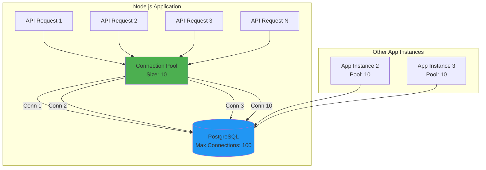
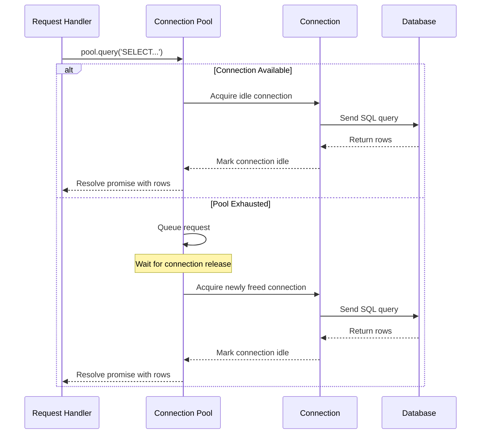
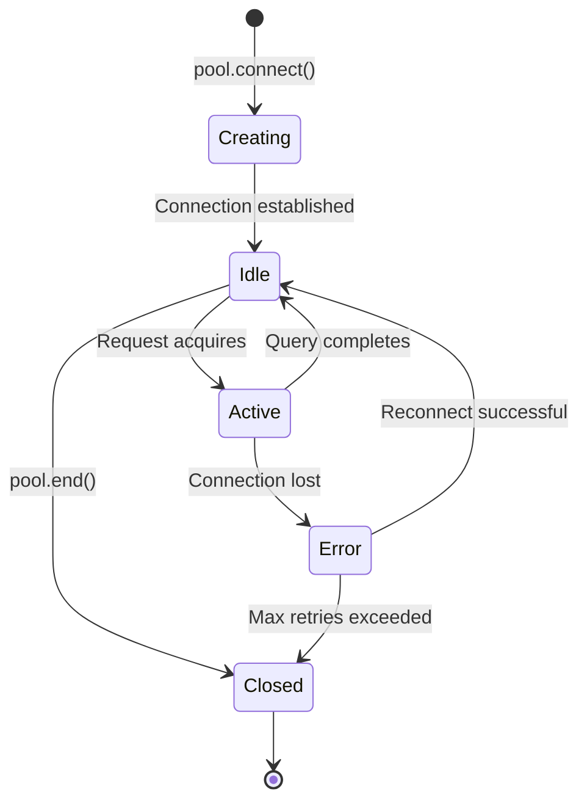
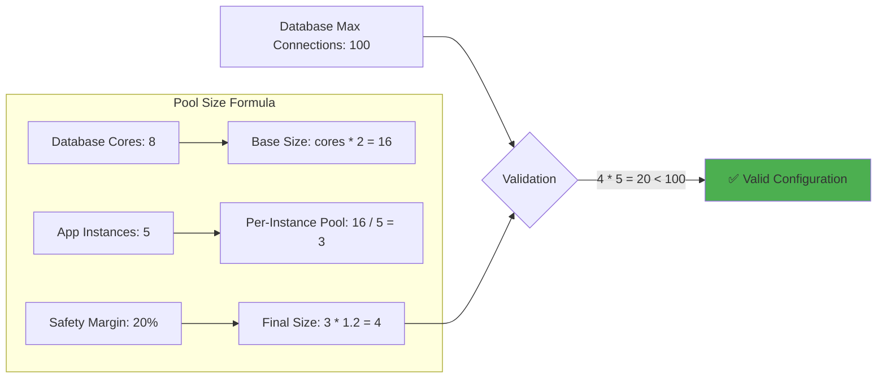

# Connection pooling

## 1. Why this exists (Real-world problem first)

Imagine you're running a SaaS analytics platform. Every API request needs database access—fetching user data, writing events, querying dashboards. Without connection pooling, each request creates a new database connection, uses it, and closes it.

What breaks:
- **Connection overhead kills latency**: TCP handshake, SSL negotiation, authentication—each connection takes 50-200ms before the first query even runs
- **Database connection exhaustion**: PostgreSQL defaults to 100 connections. With 1000 concurrent requests, 900 fail with "too many connections"
- **Resource waste**: Each connection consumes memory on both app and database servers (typically 5-10MB per connection)
- **Thundering herd on recovery**: After a brief database restart, all app instances try to reconnect simultaneously, overwhelming the database

Real pain: An e-commerce site during Black Friday sees response times spike from 100ms to 3 seconds because every checkout request creates a fresh database connection. The database CPU is at 80% just handling connection churn, not actual queries.

**Another scenario**: A fintech API handles 50,000 requests/second. Without pooling, creating 50,000 connections/second would require 2.5-10 seconds of pure connection overhead per second—physically impossible. The database would crash within minutes.

## 2. Mental model (build imagination)

Think of a restaurant with a kitchen (database) and waiters (connections).

**Without pooling**: Every customer who walks in must hire a new waiter, train them on the menu, show them where the kitchen is, and fire them after the meal. Absurd.

**With pooling**: The restaurant maintains 10 trained waiters. Customers are seated and assigned an available waiter. When done, the waiter returns to the pool, ready for the next customer. If all waiters are busy, customers wait in line.

In technical terms:
1. **Pool initialization**: App starts, creates N database connections, keeps them open
2. **Request arrives**: App needs to query the database
3. **Acquire connection**: Grab an idle connection from the pool (or wait if all are busy)
4. **Execute query**: Use the connection
5. **Release connection**: Return it to the pool (don't close it)
6. **Reuse**: Next request uses the same physical connection

The connection stays alive between requests. No setup cost, no teardown cost.

**Key insight**: The pool is a queue manager. When all connections are busy, new requests wait in a JavaScript queue (in memory, not blocking the event loop). When a connection becomes available, the next queued request gets it.

## 3. How Node.js implements this internally

Node.js doesn't implement connection pooling—database client libraries do (`pg`, `mysql2`, `ioredis`). But understanding how it integrates with Node.js internals matters.

**Key insight**: Connection pooling is about managing I/O resources, not CPU.

When you call `pool.query()`:
1. **Synchronous phase**: JavaScript code runs on the event loop, checks if an idle connection exists in the pool (a simple array/queue)
2. **No connection available**: Request is queued (in-memory queue, not database-side)
3. **Connection available**: The query is handed off to libuv's thread pool or uses non-blocking I/O
4. **Async execution**: The actual network I/O (sending SQL, receiving rows) happens asynchronously
5. **Callback/Promise resolution**: When the query completes, the connection is marked idle and returned to the pool

**Common misunderstanding**: Developers think pooling creates threads. It doesn't. It manages persistent TCP connections. The event loop still handles concurrency.

**Critical detail**: If your pool size is 10 and you have 100 concurrent requests, 90 requests wait in JavaScript memory (not blocking the event loop) until a connection becomes available. This is why pool size tuning matters.

### Advanced pool configuration

```javascript
const { Pool } = require('pg');

const pool = new Pool({
  host: 'localhost',
  port: 5432,
  database: 'myapp',
  user: 'postgres',
  password: 'secret',
  
  // Pool sizing
  max: 20, // Maximum number of connections in the pool
  min: 5,  // Minimum number of connections to maintain
  
  // Timeouts
  connectionTimeoutMillis: 5000, // Max wait time for a connection from the pool
  idleTimeoutMillis: 30000,      // Close idle connections after 30s
  maxUses: 7500,                 // Close connection after 7500 uses (prevent memory leaks)
  
  // Connection lifecycle
  allowExitOnIdle: true,         // Allow process to exit if all connections are idle
  
  // Error handling
  application_name: 'myapp-api', // Identify this app in database logs
});

// Monitor pool events
pool.on('connect', (client) => {
  console.log('New client connected to pool');
});

pool.on('acquire', (client) => {
  console.log('Client acquired from pool');
});

pool.on('remove', (client) => {
  console.log('Client removed from pool');
});

pool.on('error', (err, client) => {
  console.error('Unexpected error on idle client', err);
  process.exit(-1);
});
```

### Pool metrics and monitoring

```javascript
// Production monitoring
function logPoolMetrics() {
  console.log({
    totalCount: pool.totalCount,     // Total connections (idle + active)
    idleCount: pool.idleCount,       // Idle connections available
    waitingCount: pool.waitingCount, // Requests waiting for a connection
  });
}

setInterval(logPoolMetrics, 10000); // Log every 10 seconds

// Alert on pool exhaustion
if (pool.waitingCount > 10) {
  console.error('Pool exhausted! 10+ requests waiting for connections');
  // Send alert to monitoring system
}
```

## 4. Multiple diagrams (MANDATORY)

### High-level system diagram



### Internal flow diagram



### Pool lifecycle diagram



### Pool sizing calculation



## 5. Where this is used in real projects

### API layer with comprehensive error handling

```javascript
const express = require('express');
const { Pool } = require('pg');

const pool = new Pool({ max: 20 });

// Middleware to track pool metrics
app.use((req, res, next) => {
  req.poolMetrics = {
    totalCount: pool.totalCount,
    idleCount: pool.idleCount,
    waitingCount: pool.waitingCount,
  };
  next();
});

// Express route handler with retry logic
app.get('/users/:id', async (req, res) => {
  const maxRetries = 3;
  let lastError;
  
  for (let attempt = 1; attempt <= maxRetries; attempt++) {
    try {
      const user = await pool.query('SELECT * FROM users WHERE id = $1', [req.params.id]);
      
      if (!user.rows[0]) {
        return res.status(404).json({ error: 'User not found' });
      }
      
      return res.json(user.rows[0]);
    } catch (err) {
      lastError = err;
      
      if (err.code === 'ECONNREFUSED' || err.code === '57P03') {
        // Database down or shutting down, retry
        console.log(`Retry ${attempt}/${maxRetries} due to: ${err.message}`);
        await new Promise(resolve => setTimeout(resolve, 100 * attempt)); // Exponential backoff
        continue;
      }
      
      // Non-retryable error
      break;
    }
  }
  
  console.error('Query failed after retries:', lastError);
  res.status(500).json({ error: 'Database error' });
});

// Health check endpoint
app.get('/health', async (req, res) => {
  try {
    await pool.query('SELECT 1');
    res.json({
      status: 'healthy',
      pool: {
        total: pool.totalCount,
        idle: pool.idleCount,
        waiting: pool.waitingCount,
      },
    });
  } catch (err) {
    res.status(503).json({
      status: 'unhealthy',
      error: err.message,
    });
  }
});
```

### Background jobs with dedicated pool

```javascript
const { Queue, Worker } = require('bullmq');
const { Pool } = require('pg');

// Separate pool for background jobs (lower priority)
const jobPool = new Pool({
  max: 5, // Smaller pool for background work
  connectionTimeoutMillis: 10000, // Longer timeout acceptable
});

const worker = new Worker('email-queue', async (job) => {
  const client = await jobPool.connect();
  
  try {
    await client.query('BEGIN');
    
    const user = await client.query('SELECT email, name FROM users WHERE id = $1', [job.data.userId]);
    
    if (!user.rows[0]) {
      throw new Error('User not found');
    }
    
    await sendEmail(user.rows[0].email, job.data.template);
    
    await client.query('INSERT INTO email_log (user_id, template, sent_at) VALUES ($1, $2, NOW())', 
      [job.data.userId, job.data.template]);
    
    await client.query('COMMIT');
  } catch (err) {
    await client.query('ROLLBACK');
    throw err;
  } finally {
    client.release();
  }
}, {
  connection: { host: 'localhost', port: 6379 },
  concurrency: 5, // Match pool size
});
```

### Real-time systems with connection validation

```javascript
const io = require('socket.io')(server);
const { Pool } = require('pg');

const pool = new Pool({
  max: 30,
  // Validate connections before use
  connectionTimeoutMillis: 2000,
});

// Connection validation
pool.on('connect', async (client) => {
  try {
    await client.query('SELECT 1');
    console.log('Connection validated');
  } catch (err) {
    console.error('Connection validation failed:', err);
    client.release(true); // Force remove from pool
  }
});

io.on('connection', (socket) => {
  socket.on('get-dashboard', async (userId) => {
    try {
      const data = await pool.query(`
        SELECT * FROM dashboards 
        WHERE user_id = $1 
        AND updated_at > NOW() - INTERVAL '1 hour'
      `, [userId]);
      
      socket.emit('dashboard-data', data.rows);
    } catch (err) {
      console.error('Dashboard query failed:', err);
      socket.emit('error', { message: 'Failed to load dashboard' });
    }
  });
  
  socket.on('disconnect', () => {
    // Connections are returned to pool automatically
    console.log('Socket disconnected, connections remain pooled');
  });
});
```

### Multi-tenant application with pool per tenant

```javascript
const tenantPools = new Map();

function getPoolForTenant(tenantId) {
  if (!tenantPools.has(tenantId)) {
    const pool = new Pool({
      host: getTenantDatabaseHost(tenantId),
      max: 10,
      idleTimeoutMillis: 60000, // Close idle connections after 1 minute
    });
    
    tenantPools.set(tenantId, pool);
  }
  
  return tenantPools.get(tenantId);
}

app.get('/api/:tenantId/data', async (req, res) => {
  const pool = getPoolForTenant(req.params.tenantId);
  
  try {
    const data = await pool.query('SELECT * FROM data WHERE tenant_id = $1', [req.params.tenantId]);
    res.json(data.rows);
  } catch (err) {
    res.status(500).json({ error: err.message });
  }
});

// Cleanup idle tenant pools
setInterval(() => {
  for (const [tenantId, pool] of tenantPools.entries()) {
    if (pool.idleCount === pool.totalCount && pool.totalCount > 0) {
      console.log(`Closing idle pool for tenant ${tenantId}`);
      pool.end();
      tenantPools.delete(tenantId);
    }
  }
}, 300000); // Every 5 minutes
```

### Decision criteria (how senior engineers think)
- **Pool size = number of concurrent database operations you expect**, not total concurrent requests
- If you have 1000 concurrent HTTP requests but only 10% hit the database, pool size of 100 is reasonable
- If every request needs the database, pool size should match your database's connection limit divided by number of app instances
- **Formula**: `pool_size = (database_max_connections / app_instances) * 0.8` (80% to leave headroom)
- **Minimum**: Never go below 2-3 connections (even for low-traffic apps)
- **Maximum**: Never exceed database's max connections across all app instances

## 6. Where this should NOT be used

### Short-lived scripts
```javascript
// BAD: One-time migration script
const pool = new Pool({ max: 20 }); // Wasteful
await pool.query('UPDATE users SET migrated = true');
await pool.end();

// GOOD: Single connection
const client = new Client();
await client.connect();
await client.query('UPDATE users SET migrated = true');
await client.end();
```

### Serverless functions (AWS Lambda)
**Problem**: Lambda freezes the container between invocations. Pooled connections appear to persist but may be in a broken state (TCP timeout, database killed the connection).

**Better approach**: Use single connections or managed connection poolers like RDS Proxy or PgBouncer.

```javascript
// BAD: Pool in Lambda
const pool = new Pool({ max: 10 });

exports.handler = async (event) => {
  // Pool persists across invocations, but connections may be stale
  const result = await pool.query('SELECT * FROM users');
  return result.rows;
};

// GOOD: RDS Proxy or single connection
const client = new Client();

exports.handler = async (event) => {
  await client.connect();
  const result = await client.query('SELECT * FROM users');
  await client.end();
  return result.rows;
};
```

### When you need transaction isolation
```javascript
// DANGEROUS: Pool might give you different connections mid-transaction
await pool.query('BEGIN');
await pool.query('UPDATE accounts SET balance = balance - 100 WHERE id = 1');
// If pool gives a different connection here, the transaction is broken
await pool.query('UPDATE accounts SET balance = balance + 100 WHERE id = 2');
await pool.query('COMMIT');

// CORRECT: Acquire a dedicated client for the transaction
const client = await pool.connect();
try {
  await client.query('BEGIN');
  await client.query('UPDATE accounts SET balance = balance - 100 WHERE id = 1');
  await client.query('UPDATE accounts SET balance = balance + 100 WHERE id = 2');
  await client.query('COMMIT');
} catch (err) {
  await client.query('ROLLBACK');
  throw err;
} finally {
  client.release(); // Return to pool
}
```

### Performance trap: Over-pooling
If you set pool size to 100 but your database can only handle 50 concurrent queries efficiently, you've just created contention. The database will queue the extra 50, and you've wasted memory on idle connections.

### Development/testing environments
```javascript
// BAD: Large pool for local development
const pool = new Pool({ max: 50 }); // Overkill for localhost

// GOOD: Small pool for development
const pool = new Pool({
  max: process.env.NODE_ENV === 'production' ? 20 : 5,
});
```

## 7. Failure modes & edge cases

### Connection leaks
**Scenario**: Developer forgets to release a connection.
```javascript
const client = await pool.connect();
await client.query('SELECT * FROM users');
// Forgot client.release()
```
**Result**: Pool slowly exhausts. After N requests, all connections are "in use" but idle. New requests hang forever.

**Detection**: Monitor `pool.totalCount` vs `pool.idleCount`. If idle count stays at 0, you have leaks.

**Production fix**:
```javascript
// Automatic leak detection
setInterval(() => {
  if (pool.idleCount === 0 && pool.totalCount === pool.max) {
    console.error('POOL LEAK DETECTED: All connections in use');
    // Alert monitoring system
  }
}, 30000);

// Always use try/finally
async function safeQuery() {
  const client = await pool.connect();
  try {
    return await client.query('SELECT * FROM users');
  } finally {
    client.release(); // Always released, even on error
  }
}
```

### Database restart
**What happens**:
1. Database goes down
2. All pooled connections break
3. Next query attempt fails
4. Pool detects dead connection, removes it, creates a new one
5. If database is still down, pool retries until `connectionTimeoutMillis` is exceeded

**Production impact**: If you don't handle this gracefully, users see 500 errors. You need circuit breakers or retry logic.

**Mitigation**:
```javascript
const CircuitBreaker = require('opossum');

const breaker = new CircuitBreaker(async (query, params) => {
  return await pool.query(query, params);
}, {
  timeout: 3000,
  errorThresholdPercentage: 50,
  resetTimeout: 30000,
});

breaker.fallback(() => ({ rows: [] })); // Fallback response

app.get('/users', async (req, res) => {
  try {
    const result = await breaker.fire('SELECT * FROM users');
    res.json(result.rows);
  } catch (err) {
    res.status(503).json({ error: 'Service temporarily unavailable' });
  }
});
```

### Thundering herd on reconnect
**Scenario**: Database restarts. 100 app instances, each with a pool of 10, all try to reconnect simultaneously (1000 connections).

**Result**: Database is overwhelmed, rejects connections, app instances keep retrying, database never stabilizes.

**Mitigation**: Jittered backoff
```javascript
const pool = new Pool({
  max: 10,
  connectionTimeoutMillis: 5000 + Math.random() * 5000, // 5-10s jitter
});

// Retry with exponential backoff
async function queryWithBackoff(query, params, maxRetries = 5) {
  for (let i = 0; i < maxRetries; i++) {
    try {
      return await pool.query(query, params);
    } catch (err) {
      if (i === maxRetries - 1) throw err;
      
      const delay = Math.min(1000 * Math.pow(2, i), 10000) + Math.random() * 1000;
      console.log(`Retry ${i + 1}/${maxRetries} after ${delay}ms`);
      await new Promise(resolve => setTimeout(resolve, delay));
    }
  }
}
```

### Slow query blocking the pool
**Scenario**: One query takes 30 seconds (bad index, lock contention). If your pool size is 10 and you get 20 requests/second, the pool exhausts in 0.5 seconds.

**Result**: All subsequent requests wait, latency spikes across the entire application.

**Mitigation**: Query timeouts and separate pools
```javascript
// Fast query pool
const fastPool = new Pool({
  max: 15,
  statement_timeout: 5000, // 5-second timeout
});

// Slow query pool (analytics, reports)
const slowPool = new Pool({
  max: 5,
  statement_timeout: 60000, // 60-second timeout
});

app.get('/users/:id', async (req, res) => {
  const user = await fastPool.query('SELECT * FROM users WHERE id = $1', [req.params.id]);
  res.json(user.rows[0]);
});

app.get('/reports/monthly', async (req, res) => {
  const report = await slowPool.query('SELECT * FROM generate_monthly_report()');
  res.json(report.rows);
});
```

### Idle connection timeout
**Scenario**: Firewall or database kills idle connections after 5 minutes. Pool doesn't detect this until the next query.

**Impact**: First query after idle period fails, subsequent queries succeed.

**Solution**: Keepalive queries
```javascript
const pool = new Pool({
  max: 10,
  idleTimeoutMillis: 240000, // 4 minutes (less than firewall timeout)
});

// Or use keepalive at TCP level
const pool = new Pool({
  max: 10,
  keepAlive: true,
  keepAliveInitialDelayMillis: 10000,
});
```

## 8. Trade-offs & alternatives

### What you gain
- **Massive latency reduction**: 50-200ms saved per request (no connection setup)
- **Database protection**: Limits concurrent load, prevents connection exhaustion
- **Resource efficiency**: Reusing connections saves memory and CPU
- **Predictable performance**: Connection acquisition time is consistent

### What you sacrifice
- **Memory overhead**: Each connection consumes memory even when idle (5-10MB per connection)
- **Complexity**: Need to tune pool size, handle connection lifecycle, monitor leaks
- **Stale connections**: Idle connections may be killed by firewalls or database idle timeouts (mitigated with `idleTimeoutMillis` and keepalive)
- **Configuration burden**: Must tune per environment (dev, staging, production)

### Alternatives

**PgBouncer / RDS Proxy (connection pooler)**
- **Use case**: When you have many app instances and want to centralize pooling
- **How it works**: App instances connect to PgBouncer, which maintains a pool to the database
- **Benefit**: 1000 app connections can share 100 database connections
- **Trade-off**: Extra network hop (1-5ms latency), single point of failure

```javascript
// App connects to PgBouncer instead of database
const pool = new Pool({
  host: 'pgbouncer.example.com', // PgBouncer host
  port: 6432,                     // PgBouncer port
  max: 50,                        // Can be higher since PgBouncer pools
});
```

**Single connection per request**
- **Use case**: Low-traffic applications, admin tools, cron jobs
- **Benefit**: Simpler, no pool management
- **Trade-off**: High latency, can't handle concurrency

**Serverless-specific solutions (RDS Proxy, Supabase Pooler)**
- **Use case**: AWS Lambda, Vercel Functions
- **How it works**: Managed service handles connection pooling and reuse across invocations
- **Benefit**: No cold start connection overhead
- **Trade-off**: Vendor lock-in, additional cost ($0.015/hour per vCPU)

**Read replicas with separate pools**
- **Use case**: Read-heavy workloads
- **Benefit**: Distribute load, scale reads independently
- **Trade-off**: Eventual consistency, more complexity

```javascript
const primaryPool = new Pool({ host: 'primary.db.com', max: 10 });
const replicaPool = new Pool({ host: 'replica.db.com', max: 20 });

// Writes go to primary
async function createUser(data) {
  return primaryPool.query('INSERT INTO users ...', [data]);
}

// Reads go to replica
async function getUser(id) {
  return replicaPool.query('SELECT * FROM users WHERE id = $1', [id]);
}
```

## 9. Interview-level articulation

**Question**: "Why do we need connection pooling?"

**Weak answer**: "To reuse database connections."

**Strong answer**: "Creating a database connection is expensive—TCP handshake, SSL negotiation, authentication. In a high-traffic API, doing this per request adds 50-200ms of latency and can exhaust the database's connection limit. Connection pooling maintains a set of persistent connections that are reused across requests, eliminating setup overhead and protecting the database from connection churn. The key trade-off is tuning pool size: too small and requests queue, too large and you waste memory or overwhelm the database."

**Follow-up**: "How do you size a connection pool?"

**Answer**: "Start with the formula: `pool_size = (core_count * 2) + effective_spindle_count`. For SSDs, this simplifies to `core_count * 2`. But the real answer is: measure. Monitor database CPU, connection count, and query queue depth under load. If the database is underutilized and requests are queuing, increase pool size. If the database is saturated, adding more connections won't help—you need to optimize queries or scale the database. Also, divide the database's max connections by the number of app instances to avoid exhaustion. For example, if PostgreSQL allows 100 connections and you have 5 app instances, each instance should have a pool of at most 20 connections."

**Follow-up**: "What happens if a connection in the pool dies?"

**Answer**: "Most libraries detect this on the next query attempt. The query fails, the pool removes the dead connection, and creates a new one. The request that triggered the detection fails, but subsequent requests succeed. To minimize user impact, you can enable connection validation (`pool.on('connect', validateConnection)`) or use keepalive queries. In production, you'd wrap database calls in retry logic with exponential backoff. I'd also monitor pool metrics—if `idleCount` drops to zero and stays there, it indicates either pool exhaustion or connection leaks."

**Follow-up**: "How do you handle connection leaks?"

**Answer**: "Connection leaks happen when you acquire a connection but forget to release it. To prevent them, I always use try/finally blocks to ensure `client.release()` is called even on errors. For detection, I monitor `pool.totalCount` vs `pool.idleCount`. If all connections are in use but the app isn't under load, that's a leak. I'd also set `maxUses` in the pool config to automatically close connections after N uses, which limits the impact of leaks. In production, I'd add alerting when `waitingCount` exceeds a threshold, indicating pool exhaustion."

## 10. Key takeaways (engineer mindset)

**What to remember**:
- Connection pooling is about **reusing expensive resources**, not creating threads
- Pool size is a **tuning parameter**, not a magic number—measure and adjust
- **Leaks are silent killers**—always release connections, especially in error paths
- **Transactions need dedicated connections**—don't mix pooled queries with multi-statement transactions
- **Monitor pool metrics**—`totalCount`, `idleCount`, `waitingCount` are critical for diagnosing issues

**What decisions this enables**:
- Choosing between in-app pooling (pg Pool) vs external pooling (PgBouncer)
- Sizing pools based on database capacity and request patterns
- Designing retry and circuit breaker logic for connection failures
- Deciding when to use read replicas or sharding to scale beyond a single pool
- Separating fast and slow query pools to prevent blocking

**How it connects to other Node.js concepts**:
- **Event loop**: Pooling doesn't block the event loop; it queues requests in JavaScript memory
- **Backpressure**: A full pool is a form of backpressure—it signals the database is the bottleneck
- **Observability**: Pool metrics (idle count, wait time) are critical for diagnosing performance issues
- **Graceful shutdown**: Must drain the pool (`pool.end()`) to close connections cleanly before process exit
- **Error handling**: Connection failures require retry logic, circuit breakers, and fallback strategies
