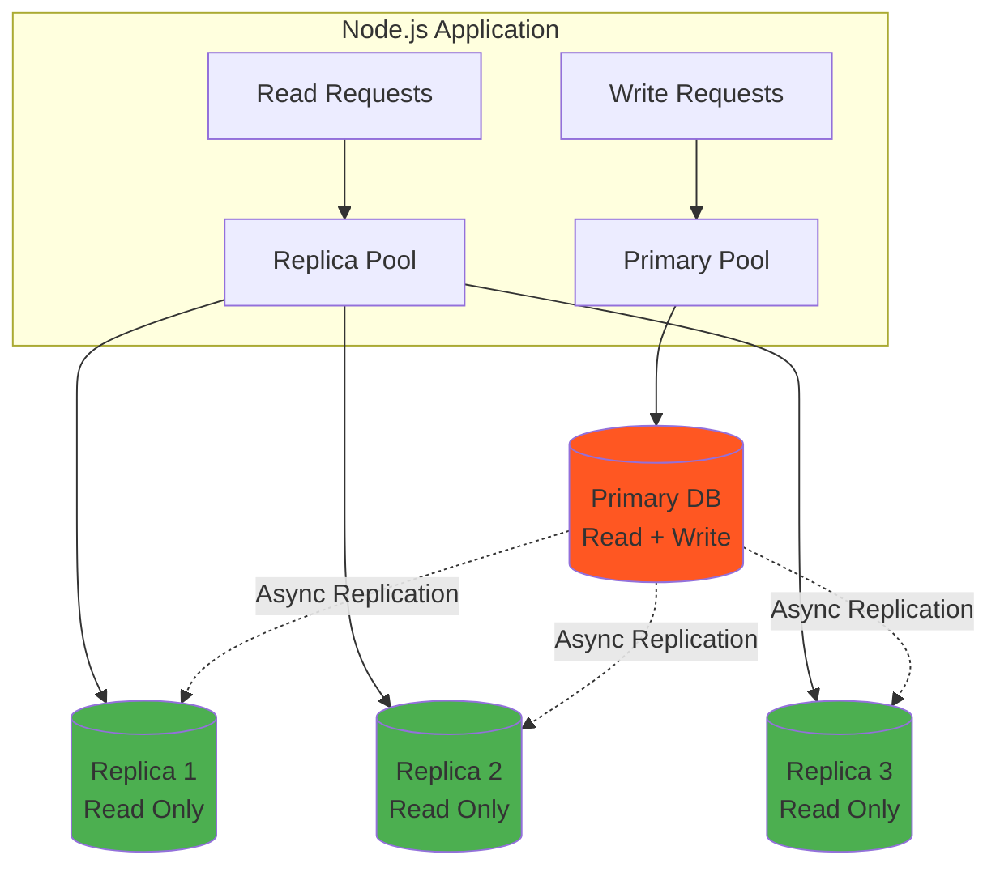
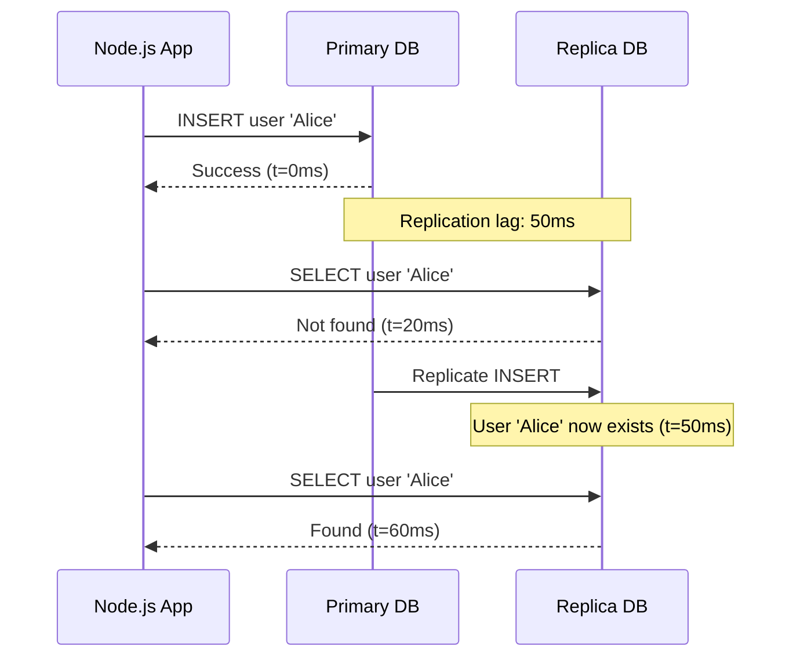
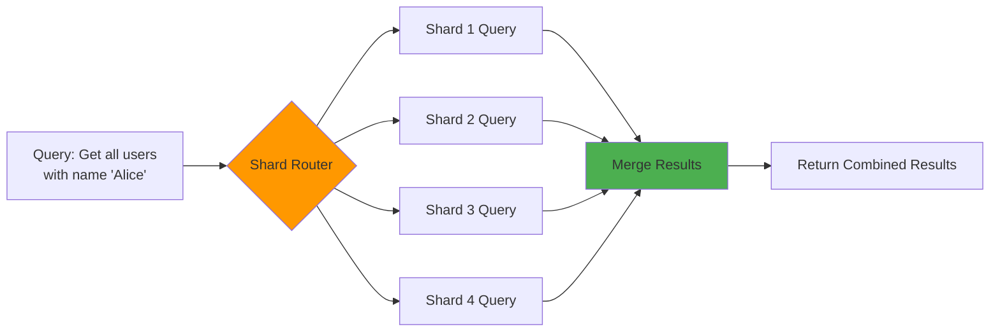

# Read replicas & sharding

## 1. Why this exists (Real-world problem first)

You're running a global SaaS platform for project management. Your PostgreSQL database handles everything: user authentication, project data, comments, file metadata, analytics queries. Traffic grows from 1,000 to 100,000 daily active users.

What breaks:
- **Read/write contention**: Analytics dashboards run heavy `SELECT` queries that lock tables, blocking `INSERT`/`UPDATE` operations from users creating tasks
- **Single point of failure**: One database server means one region's latency for global users, and if it goes down, everything stops
- **Vertical scaling limits**: You've maxed out the largest database instance (96 cores, 768GB RAM), but queries are still slow
- **Hot spots**: 80% of queries hit the same 20% of data (recent projects), overwhelming the database even though total data is small

Real pain: A fintech company's transaction history table grows to 500GB. Every user dashboard query scans millions of rows. The database CPU is pegged at 100%, and write operations (new transactions) start timing out. They can't add more resources to a single server.

## 2. Mental model (build imagination)

### Read replicas: The library analogy

Imagine a library with one copy of each book. During exam season, 100 students want the same textbook. They queue, each reading for an hour. The 100th student waits 99 hours.

**Solution**: Make 10 photocopies (read replicas). Now 10 students can read simultaneously. The original book (primary) is only used for updates (new editions). Reads are distributed across replicas.

**Key insight**: Replicas are **eventually consistent**. If the author updates page 50 of the original, it takes time to photocopy and distribute. Some students might read the old version.

### Sharding: The hospital analogy

A single hospital serves 10 million people. Wait times are absurd. **Solution**: Build 10 hospitals, each serving 1 million people based on zip code.

**Sharding** splits data across multiple databases. Each database (shard) owns a subset of data. Users in zip codes 10000-19999 go to Shard 1, 20000-29999 to Shard 2, etc.

**Key insight**: You can't easily query across shards. If you need data from multiple zip codes, you must query multiple databases and merge results in your application.

## 3. How Node.js implements this internally

Node.js doesn't implement replication or sharding—the database does. But your Node.js app must **route queries** correctly.

### Read replicas in Node.js

```javascript
const { Pool } = require('pg');

const primaryPool = new Pool({ host: 'primary.db.com', max: 10 });
const replicaPool = new Pool({ host: 'replica.db.com', max: 20 });

// Write operations go to primary
async function createUser(name) {
  return primaryPool.query('INSERT INTO users (name) VALUES ($1)', [name]);
}

// Read operations go to replica
async function getUser(id) {
  return replicaPool.query('SELECT * FROM users WHERE id = $1', [id]);
}
```

**What happens**:
1. Write query hits primary pool → primary database
2. Database replicates change to replica (asynchronously, typically <100ms lag)
3. Read query hits replica pool → replica database
4. If the replica hasn't caught up, you might read stale data

**Common mistake**: Reading immediately after writing from the replica.
```javascript
await createUser('Alice'); // Writes to primary
const user = await getUser(123); // Reads from replica
// user might not exist yet if replication lag is high
```

### Sharding in Node.js

```javascript
const shard1 = new Pool({ host: 'shard1.db.com' });
const shard2 = new Pool({ host: 'shard2.db.com' });

function getShardForUser(userId) {
  return userId % 2 === 0 ? shard1 : shard2; // Simple modulo sharding
}

async function getUser(userId) {
  const shard = getShardForUser(userId);
  return shard.query('SELECT * FROM users WHERE id = $1', [userId]);
}
```

**What happens**:
1. Application calculates which shard owns the data (shard key = `userId`)
2. Routes query to that specific shard
3. If you need data from multiple shards, you query each and merge in-memory

**Event loop impact**: Sharding doesn't change how Node.js handles I/O. Each shard query is still async. But querying 10 shards sequentially is slow—you'd use `Promise.all()` to parallelize.

## 4. Multiple diagrams (MANDATORY)

### Read replica architecture



### Sharding architecture

```mermaid
graph TB
    subgraph "Node.js Application"
        REQ[User Request<br/>userId: 12345] --> ROUTER[Shard Router]
    end
    
    ROUTER --> |hash(userId) % 4 = 0| S1[(Shard 1<br/>Users 0-249999)]
    ROUTER --> |hash(userId) % 4 = 1| S2[(Shard 2<br/>Users 250000-499999)]
    ROUTER --> |hash(userId) % 4 = 2| S3[(Shard 3<br/>Users 500000-749999)]
    ROUTER --> |hash(userId) % 4 = 3| S4[(Shard 4<br/>Users 750000-999999)]
    
    style ROUTER fill:#2196F3
    style S1 fill:#9C27B0
    style S2 fill:#9C27B0
    style S3 fill:#9C27B0
    style S4 fill:#9C27B0
```

### Replication lag timeline



### Cross-shard query flow



## 5. Where this is used in real projects

### Read replicas: Analytics dashboards
```javascript
// Heavy analytics query goes to replica
app.get('/dashboard/stats', async (req, res) => {
  const stats = await replicaPool.query(`
    SELECT DATE(created_at), COUNT(*)
    FROM orders
    WHERE created_at > NOW() - INTERVAL '30 days'
    GROUP BY DATE(created_at)
  `);
  res.json(stats.rows);
});

// User checkout goes to primary
app.post('/checkout', async (req, res) => {
  const order = await primaryPool.query(
    'INSERT INTO orders (user_id, total) VALUES ($1, $2) RETURNING *',
    [req.user.id, req.body.total]
  );
  res.json(order.rows[0]);
});
```

### Sharding: Multi-tenant SaaS
```javascript
// Each tenant's data is in a separate shard
function getShardForTenant(tenantId) {
  const shardIndex = tenantId % SHARD_COUNT;
  return shardPools[shardIndex];
}

app.get('/tenants/:tenantId/users', async (req, res) => {
  const shard = getShardForTenant(req.params.tenantId);
  const users = await shard.query(
    'SELECT * FROM users WHERE tenant_id = $1',
    [req.params.tenantId]
  );
  res.json(users.rows);
});
```

### Sharding: Time-series data (logs, events)
```javascript
// Shard by time range (one shard per month)
function getShardForDate(date) {
  const month = date.getMonth();
  return shardPools[month % 12]; // 12 shards, one per month
}

app.get('/logs', async (req, res) => {
  const date = new Date(req.query.date);
  const shard = getShardForDate(date);
  const logs = await shard.query(
    'SELECT * FROM logs WHERE created_at::date = $1',
    [date]
  );
  res.json(logs.rows);
});
```

### Decision criteria
- **Use read replicas when**: Reads >> writes (10:1 or higher), and you can tolerate eventual consistency
- **Use sharding when**: Single database can't handle the data volume or query load, even with replicas
- **Combine both**: Shard for horizontal scaling, replicate each shard for read scaling

## 6. Where this should NOT be used

### Read replicas: Strong consistency requirements
```javascript
// BAD: Read-after-write from replica
await primaryPool.query('UPDATE users SET email = $1 WHERE id = $2', [newEmail, userId]);
const user = await replicaPool.query('SELECT * FROM users WHERE id = $1', [userId]);
// user.email might still be the old value due to replication lag
```

**Solution**: Read from primary after writes, or use sticky sessions to route reads to primary for a short window.

### Sharding: Cross-shard transactions
```javascript
// IMPOSSIBLE: Transfer money between users on different shards
const shard1 = getShardForUser(user1Id);
const shard2 = getShardForUser(user2Id);

// Can't do atomic transaction across shards
await shard1.query('UPDATE accounts SET balance = balance - 100 WHERE user_id = $1', [user1Id]);
await shard2.query('UPDATE accounts SET balance = balance + 100 WHERE user_id = $1', [user2Id]);
// If second query fails, first is already committed—data inconsistency
```

**Solution**: Use distributed transactions (2PC, Saga pattern), or redesign schema to avoid cross-shard operations.

### Sharding: Small datasets
If your entire database is 10GB and fits comfortably on one server, sharding adds complexity for no benefit. Use read replicas or vertical scaling first.

### Over-sharding
Creating 100 shards for 1 million users (10,000 users per shard) is overkill. Each shard adds operational overhead (backups, monitoring, schema migrations). Start with 4-8 shards and re-shard when necessary.

## 7. Failure modes & edge cases

### Replica lag spike
**Scenario**: Primary handles a massive bulk insert (1 million rows). Replication lag jumps from 50ms to 30 seconds.

**Impact**: Users see stale data. A user updates their profile, refreshes the page, and sees the old data.

**Detection**: Monitor `pg_stat_replication` (PostgreSQL) or equivalent. Alert when lag > threshold.

**Mitigation**: 
- Route critical reads to primary
- Use read-your-writes consistency (session-based routing)
- Increase replica resources

### Replica failure
**What happens**: One replica crashes. If your app round-robins across replicas, 33% of read requests fail.

**Solution**: Health checks. Remove unhealthy replicas from the pool.
```javascript
const replicas = [replica1Pool, replica2Pool, replica3Pool];

async function getHealthyReplica() {
  for (const replica of replicas) {
    try {
      await replica.query('SELECT 1'); // Health check
      return replica;
    } catch (err) {
      continue; // Try next replica
    }
  }
  throw new Error('No healthy replicas');
}
```

### Shard rebalancing
**Scenario**: You start with 4 shards. Data grows, you add 4 more (8 total). Now `userId % 4` doesn't match `userId % 8`. All data is in the wrong shard.

**Solution**: Consistent hashing or virtual shards. Or, accept downtime and migrate data.

### Hot shard
**Scenario**: You shard by `tenantId`. One tenant (a huge enterprise customer) generates 80% of traffic. Their shard is overwhelmed.

**Solution**: 
- Shard by a more granular key (e.g., `userId` instead of `tenantId`)
- Isolate large tenants to dedicated shards
- Use range-based sharding instead of hash-based

### Cross-shard joins
**Scenario**: You need to join `users` (sharded by `userId`) with `orders` (sharded by `orderId`).

**Problem**: You can't run a SQL `JOIN` across databases.

**Solution**: 
- Denormalize data (duplicate `user` info in `orders` table)
- Query both shards and join in application code (slow)
- Redesign schema to co-locate related data

## 8. Trade-offs & alternatives

### Read replicas

**What you gain**:
- **Read scalability**: Add replicas to handle more read traffic
- **Geographic distribution**: Place replicas near users for low latency
- **Disaster recovery**: Replicas can be promoted to primary if primary fails

**What you sacrifice**:
- **Eventual consistency**: Reads may be stale
- **Operational complexity**: More databases to monitor, backup, and maintain
- **Cost**: Each replica is another database instance

### Sharding

**What you gain**:
- **Horizontal scalability**: Distribute data and load across multiple databases
- **Isolation**: One tenant's traffic doesn't affect others (if sharded by tenant)

**What you sacrifice**:
- **Query complexity**: No cross-shard joins, aggregations require scatter-gather
- **Operational nightmare**: Schema migrations across 100 shards, rebalancing, monitoring
- **Application logic**: Shard routing must be implemented in every query

### Alternatives

**Vertical scaling (bigger database)**
- **Use case**: When you're not at the limit yet
- **Benefit**: Simplicity, no code changes
- **Limit**: Eventually you hit the largest instance size

**Caching (Redis, Memcached)**
- **Use case**: Read-heavy workloads with cacheable data
- **Benefit**: Offload reads without replication lag
- **Trade-off**: Cache invalidation complexity

**NewSQL databases (CockroachDB, Spanner)**
- **Use case**: Need sharding without manual shard management
- **Benefit**: Automatic sharding, distributed transactions
- **Trade-off**: Different query semantics, potential vendor lock-in

**Read-only materialized views**
- **Use case**: Complex analytics queries
- **Benefit**: Pre-computed results, no replica needed
- **Trade-off**: Staleness, refresh overhead

## 9. Interview-level articulation

**Question**: "When would you use read replicas vs sharding?"

**Weak answer**: "Read replicas for reads, sharding for writes."

**Strong answer**: "Read replicas scale read traffic by distributing queries across multiple copies of the same data. They're ideal when you have a read-heavy workload (10:1 read/write ratio) and can tolerate eventual consistency—think analytics dashboards or product catalogs. Sharding, on the other hand, splits data across multiple databases to scale both reads and writes. You use it when a single database can't handle the data volume or query load, even with replicas. The key trade-off: replicas are operationally simpler but don't help with write scaling or storage limits. Sharding scales everything but adds complexity—cross-shard queries, rebalancing, and distributed transactions become your problem."

**Follow-up**: "How do you handle replication lag?"

**Answer**: "First, measure it. Monitor the lag metric (e.g., `pg_stat_replication.replay_lag` in PostgreSQL). If it's consistently under 100ms, most apps can tolerate it. For critical read-after-write scenarios—like a user updating their profile and immediately viewing it—route those reads to the primary for a short window (session-based routing). For analytics or dashboards, eventual consistency is fine. If lag spikes (e.g., during bulk inserts), you can throttle writes, increase replica resources, or use multiple replicas to distribute load. The worst approach is ignoring it and letting users see stale data without understanding why."

**Follow-up**: "What's the hardest part of sharding?"

**Answer**: "Choosing the shard key. It determines data distribution and query patterns. A bad shard key creates hot shards (uneven load) or forces cross-shard queries. For example, sharding by `tenantId` in a SaaS app works if tenants are similar in size, but if one tenant is 100x larger, their shard becomes a bottleneck. Sharding by `userId` distributes load evenly but makes tenant-level queries (e.g., 'get all users in tenant X') require querying all shards. The second hardest part is rebalancing—adding shards means rehashing keys and migrating data, which is risky and slow. That's why I'd use consistent hashing or virtual shards from the start, even if it's overkill initially."

## 10. Key takeaways (engineer mindset)

**What to remember**:
- **Read replicas = eventual consistency**. If you can't tolerate stale reads, route to primary.
- **Sharding = no cross-shard joins**. Design your schema to minimize cross-shard queries.
- **Replication lag is not a bug, it's physics**. Plan for it, measure it, handle it.
- **Shard key is forever**. Changing it requires migrating all data. Choose wisely.

**What decisions this enables**:
- Scaling reads without scaling writes (replicas)
- Scaling beyond a single database's limits (sharding)
- Balancing consistency vs. performance (primary vs. replica routing)
- Designing schemas that align with shard boundaries

**How it connects to other Node.js concepts**:
- **Connection pooling**: Each replica and shard needs its own pool
- **Backpressure**: If all replicas are slow, your app must queue or reject requests
- **Observability**: Track which queries hit which shard/replica, measure lag and latency per shard
- **Graceful degradation**: If replicas fail, fall back to primary (accept slower reads over no reads)
