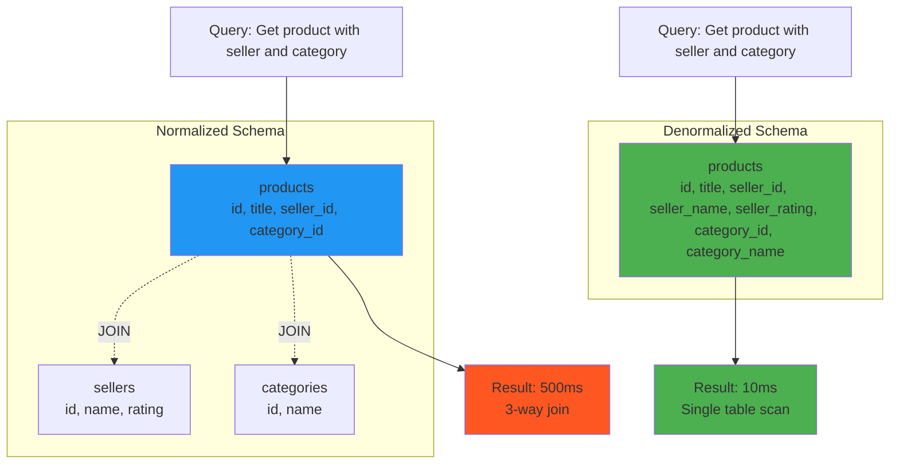
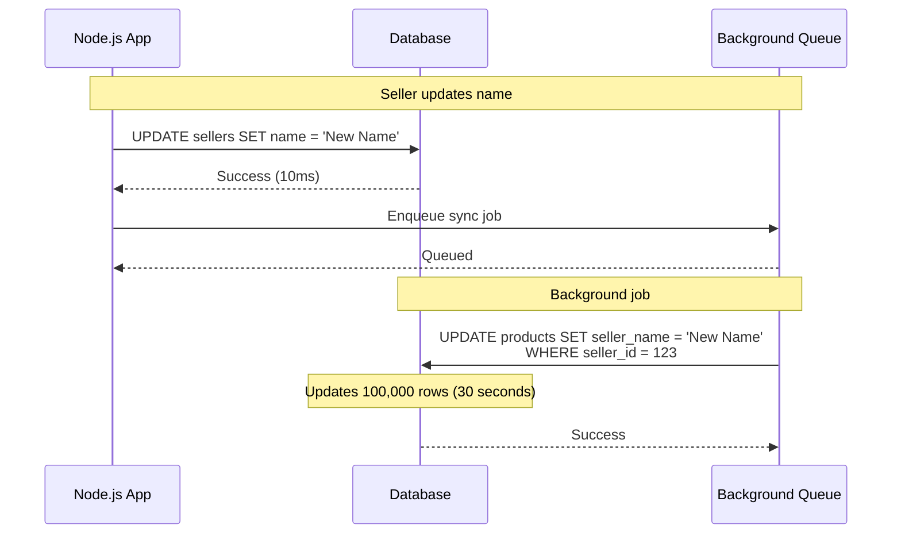
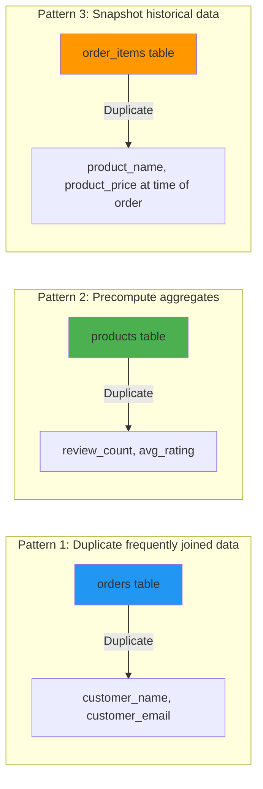
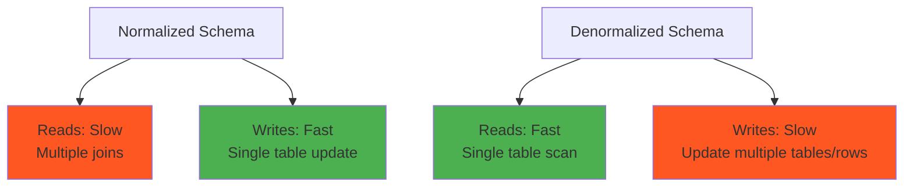

# Data denormalization

## 1. Why this exists (Real-world problem first)

You're running an e-commerce platform. Every product page needs to display: product details, seller name, seller rating, category name, and review count. Your normalized schema has 5 tables: `products`, `sellers`, `categories`, `reviews`, and `ratings`.

What breaks:
- **Join hell**: Every product page query joins 5 tables. With 10 million products, these joins take 500ms each.
- **Database CPU saturation**: 1000 concurrent product page views = 1000 five-way joins. Database CPU hits 100%.
- **Slow queries block connections**: With a connection pool of 20, slow joins exhaust the pool in seconds.
- **Caching complexity**: You cache the joined result, but when a seller updates their name, you must invalidate all product caches for that seller (thousands of cache keys).

Real pain: A SaaS analytics platform had a normalized schema with 12 tables for a single dashboard query. The query took 8 seconds. They denormalized by duplicating user names and team names into the `events` table. Query time dropped to 200ms. The trade-off: when a user changes their name, they must update millions of event records (handled via background jobs).

## 2. Mental model (build imagination)

Think of a library catalog system.

**Normalized (relational)**: 
- `books` table: book_id, title, author_id
- `authors` table: author_id, name, bio
- To display a book with author name, you join two tables.

**Denormalized**: 
- `books` table: book_id, title, author_id, **author_name** (duplicated)
- To display a book with author name, you read one table. No join.

**Trade-off**: If an author changes their name, you must update all their books. In the normalized version, you update one row in `authors`. In the denormalized version, you update thousands of rows in `books`.

**Key insight**: Denormalization trades **write complexity** for **read performance**. You duplicate data to avoid joins.

## 3. How Node.js implements this internally

Node.js doesn't enforce normalization—your schema design does. But your Node.js code must **maintain** denormalized data.

### Example: Denormalized product schema

```javascript
// Normalized schema (slow reads)
const product = await pool.query(`
  SELECT p.*, s.name AS seller_name, c.name AS category_name
  FROM products p
  JOIN sellers s ON p.seller_id = s.id
  JOIN categories c ON p.category_id = c.id
  WHERE p.id = $1
`, [productId]);
// 3-way join, slow

// Denormalized schema (fast reads)
const product = await pool.query('SELECT * FROM products WHERE id = $1', [productId]);
// Single table, fast (seller_name and category_name are duplicated in products table)
```

**What happens**:
- Normalized: Database performs two joins (hash joins or nested loops), reads from 3 tables
- Denormalized: Database reads one row from one table

**Event loop impact**: Faster queries = faster async resolution = more throughput.

### Maintaining denormalized data

```javascript
// When seller updates their name, update all their products
async function updateSellerName(sellerId, newName) {
  await pool.query('BEGIN');
  try {
    await pool.query('UPDATE sellers SET name = $1 WHERE id = $2', [newName, sellerId]);
    await pool.query('UPDATE products SET seller_name = $1 WHERE seller_id = $2', [newName, sellerId]);
    await pool.query('COMMIT');
  } catch (err) {
    await pool.query('ROLLBACK');
    throw err;
  }
}
```

**Problem**: If a seller has 100,000 products, this update is slow and locks rows.

**Better approach**: Background job
```javascript
async function updateSellerName(sellerId, newName) {
  await pool.query('UPDATE sellers SET name = $1 WHERE id = $2', [newName, sellerId]);
  queue.add('sync-seller-name', { sellerId, newName }); // Async
}

queue.process('sync-seller-name', async (job) => {
  await pool.query('UPDATE products SET seller_name = $1 WHERE seller_id = $2', 
    [job.data.newName, job.data.sellerId]);
});
```

## 4. Multiple diagrams (MANDATORY)

### Normalized vs denormalized schema



### Write amplification from denormalization



### Denormalization patterns



### Read vs write trade-off



## 5. Where this is used in real projects

### E-commerce product listings
```javascript
// Denormalized: Duplicate seller and category info in products table
app.get('/products/:id', async (req, res) => {
  const product = await pool.query(`
    SELECT id, title, price, seller_name, seller_rating, category_name, review_count
    FROM products
    WHERE id = $1
  `, [req.params.id]);
  res.json(product.rows[0]); // No joins, fast
});

// Update seller name (background job)
queue.process('update-seller-name', async (job) => {
  await pool.query('UPDATE products SET seller_name = $1 WHERE seller_id = $2',
    [job.data.newName, job.data.sellerId]);
});
```

### Social media feeds
```javascript
// Denormalized: Duplicate user name and avatar in posts table
app.get('/feed', async (req, res) => {
  const posts = await pool.query(`
    SELECT id, content, user_name, user_avatar, created_at
    FROM posts
    WHERE user_id IN (SELECT following_id FROM follows WHERE follower_id = $1)
    ORDER BY created_at DESC
    LIMIT 20
  `, [req.user.id]);
  res.json(posts.rows); // No join with users table
});
```

### Order history (snapshot pattern)
```javascript
// Denormalized: Snapshot product name and price at time of order
app.post('/orders', async (req, res) => {
  const product = await pool.query('SELECT name, price FROM products WHERE id = $1', [req.body.productId]);
  
  const order = await pool.query(`
    INSERT INTO orders (user_id, product_id, product_name, product_price, quantity)
    VALUES ($1, $2, $3, $4, $5)
    RETURNING *
  `, [req.user.id, req.body.productId, product.rows[0].name, product.rows[0].price, req.body.quantity]);
  
  res.json(order.rows[0]);
  // Even if product name/price changes later, order history shows original values
});
```

### Decision criteria
- **Denormalize when**: Reads >> writes (100:1 ratio), join performance is a bottleneck
- **Keep normalized when**: Writes are frequent, data changes often, storage is constrained

## 6. Where this should NOT be used

### Frequently changing data
```javascript
// BAD: Denormalizing stock levels
// products table: id, name, stock (duplicated from inventory table)
// If stock changes 1000 times/sec, you must update products table 1000 times/sec
```

**Solution**: Keep stock in a separate table, join when needed, or cache.

### Large text fields
```javascript
// BAD: Duplicating product descriptions in order_items
// order_items table: id, product_id, product_description (5KB per row)
// If a product has 100,000 orders, you've duplicated 500MB of text
```

**Solution**: Store only product_id, join when displaying order details.

### When storage is constrained
Denormalization increases storage by 2-10x. If you're on a tight storage budget, normalization is cheaper.

### When consistency is critical
```javascript
// BAD: Denormalizing account balances
// transactions table: id, account_id, account_balance (duplicated)
// If balance updates fail to sync, you have inconsistent data
```

**Solution**: Keep balances in a single source of truth, use transactions.

## 7. Failure modes & edge cases

### Data drift
**Scenario**: Seller updates their name. Background job fails halfway through (database crash). Half the products have the new name, half have the old name.

**Impact**: Inconsistent data. Some product pages show the old seller name, some show the new name.

**Detection**: Periodic reconciliation jobs that compare `sellers.name` with `products.seller_name`.

**Mitigation**: Idempotent background jobs, retry logic, monitoring.

### Write amplification
**Scenario**: A category has 1 million products. Category name changes. You must update 1 million rows.

**Impact**: Database locks, slow writes, replication lag.

**Solution**: Batch updates, or accept eventual consistency (update asynchronously over hours).

### Storage explosion
**Scenario**: You denormalize by duplicating a 10KB JSON field into 10 million rows.

**Impact**: 100GB of duplicated data, slow backups, high storage costs.

**Solution**: Denormalize only small, frequently accessed fields (names, IDs, counts).

### Stale cache
**Scenario**: You cache denormalized product data. Seller name changes, but cache isn't invalidated.

**Impact**: Users see stale seller names for hours.

**Solution**: Cache invalidation strategy (TTL, event-driven invalidation).

## 8. Trade-offs & alternatives

### What you gain
- **Massive read speedup**: No joins, single table scans
- **Reduced database load**: Fewer complex queries
- **Simpler queries**: No need to understand join semantics

### What you sacrifice
- **Write complexity**: Must update multiple tables/rows
- **Storage overhead**: Data duplication (2-10x storage)
- **Consistency risk**: Denormalized data can drift from source of truth

### Alternatives

**Materialized views**
- **Use case**: Complex aggregations (e.g., daily sales totals)
- **Benefit**: Database maintains the denormalized view automatically
- **Trade-off**: Refresh overhead, staleness

**Caching (Redis)**
- **Use case**: Frequently accessed joined data
- **Benefit**: Sub-millisecond latency, no schema changes
- **Trade-off**: Cache invalidation complexity, memory cost

**Read replicas**
- **Use case**: Offload read traffic without denormalization
- **Benefit**: No schema changes, no data duplication
- **Trade-off**: Eventual consistency, doesn't solve join performance

**NoSQL databases (MongoDB)**
- **Use case**: Document-oriented data (e.g., user profiles with nested comments)
- **Benefit**: Native support for denormalized, nested data
- **Trade-off**: No joins, eventual consistency, different query model

## 9. Interview-level articulation

**Question**: "What is denormalization and when would you use it?"

**Weak answer**: "It's when you duplicate data to avoid joins."

**Strong answer**: "Denormalization is the process of duplicating data across tables to optimize read performance by eliminating joins. For example, instead of joining `products` and `sellers` tables to display a product page, I'd duplicate the seller name into the `products` table. This trades write complexity for read speed—reads become a single table scan, but writes must update multiple tables. I'd use it when reads vastly outnumber writes (e.g., 100:1 ratio) and join performance is a bottleneck. The key trade-offs are storage overhead (data duplication) and consistency risk (denormalized data can drift). To mitigate, I'd use background jobs to sync denormalized data and periodic reconciliation to detect drift."

**Follow-up**: "How do you maintain denormalized data?"

**Answer**: "There are two approaches: synchronous and asynchronous. Synchronous means updating all denormalized copies in the same transaction—this guarantees consistency but can be slow if you're updating thousands of rows. Asynchronous means updating the source of truth immediately and syncing denormalized copies via background jobs—this is faster but introduces temporary inconsistency. I'd choose based on the use case: for critical data like account balances, I'd use synchronous updates or avoid denormalization entirely. For non-critical data like seller names, I'd use asynchronous updates and accept brief inconsistency. I'd also implement idempotent jobs and retry logic to handle failures."

**Follow-up**: "What's the difference between denormalization and caching?"

**Answer**: "Both optimize read performance, but they work differently. Denormalization duplicates data in the database schema—it's persistent and always available, but requires schema changes and increases storage. Caching stores computed results in memory (e.g., Redis)—it's faster (sub-millisecond) but ephemeral and requires cache invalidation logic. I'd use denormalization when I need persistent, always-available data and can tolerate the storage overhead. I'd use caching when I need extreme speed and can tolerate cache misses. Often, I'd combine both: denormalize to avoid joins, then cache the denormalized result for maximum performance."

## 10. Key takeaways (engineer mindset)

**What to remember**:
- **Denormalization = read speed at the cost of write complexity**
- **Only denormalize frequently read, infrequently written data**
- **Data drift is inevitable**—plan for reconciliation
- **Storage overhead is real**—denormalize only small, critical fields

**What decisions this enables**:
- Choosing between normalized and denormalized schemas per use case
- Designing background jobs to sync denormalized data
- Balancing read performance vs write complexity
- Deciding when to use denormalization vs caching vs materialized views

**How it connects to other Node.js concepts**:
- **Connection pooling**: Faster queries = less pool contention
- **Background jobs**: Async denormalization updates via queues (Bull, BullMQ)
- **Observability**: Monitor data drift, sync job failures, storage growth
- **Graceful degradation**: If denormalized data is stale, fall back to joins (accept slower reads over incorrect data)
