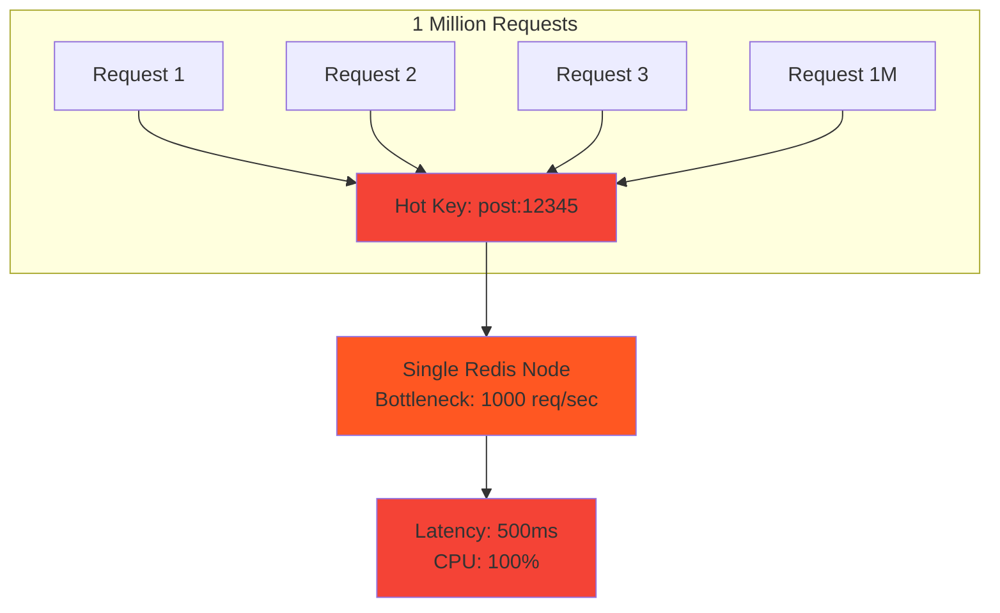
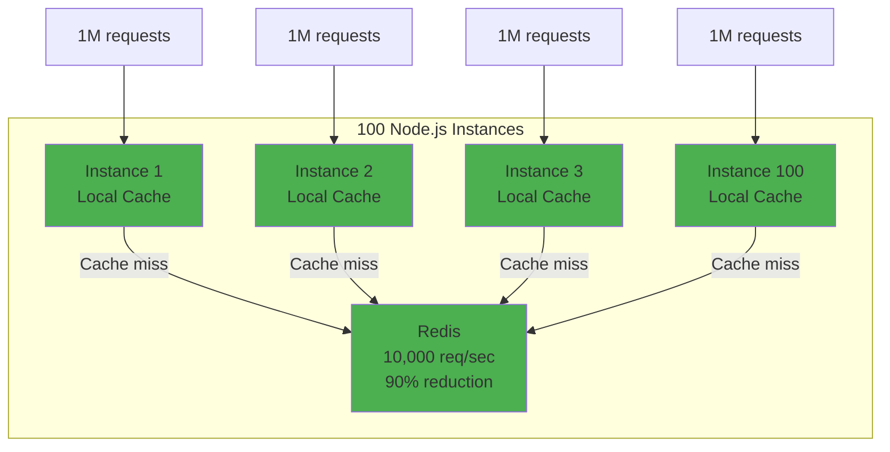
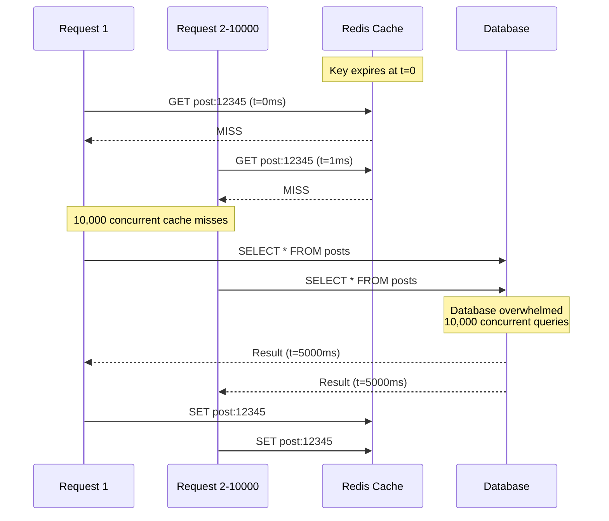
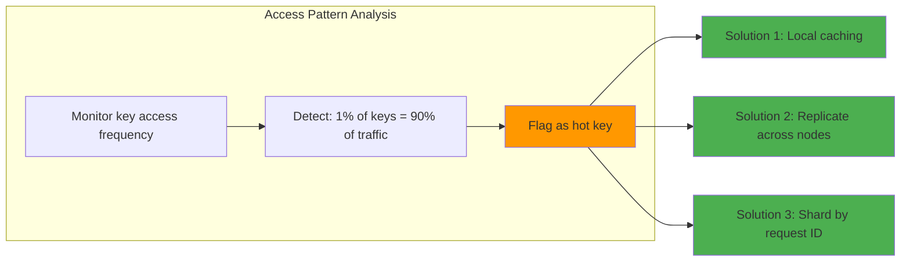

# Handling hot keys

## 1. Why this exists (Real-world problem first)

You're running a viral social media platform. A celebrity with 100 million followers posts a photo. Within seconds, millions of users try to view it. Your Redis cache has the post data stored at key `post:12345`.

What breaks:
- **Single Redis node overwhelmed**: All 1 million requests/second hit the same Redis instance, same key. CPU spikes to 100%, latency jumps from 1ms to 500ms.
- **Cache stampede**: The key expires. 10,000 concurrent requests all miss the cache, all query the database simultaneously. Database crashes.
- **Network saturation**: Even if Redis can handle the load, the network link to that Redis node saturates (10 Gbps maxed out).
- **Uneven load distribution**: You have 10 Redis nodes, but 90% of traffic hits one node because of a single hot key.

Real pain: A live sports streaming platform had a "current score" key that was read 500,000 times per second during a championship game. The Redis node handling that key became a bottleneck. They solved it by replicating the key across multiple nodes and load balancing reads.

## 2. Mental model (build imagination)

Think of a library with 1 million books, but everyone wants the same bestseller.

**Without hot key handling**: The library has one copy of the bestseller. 1000 people queue for it. The librarian is overwhelmed, the queue grows, people leave.

**With hot key handling**:
1. **Replication**: The library buys 100 copies of the bestseller. Now 100 people can read simultaneously.
2. **Local caching**: Each person makes a photocopy and reads from that. No one touches the original.
3. **Load balancing**: The library puts copies in 10 branches. People go to the nearest branch.

In technical terms:
- **Hot key**: A key accessed far more frequently than others (e.g., 1% of keys get 90% of traffic)
- **Cold key**: A key accessed infrequently

The challenge: Distributed systems assume uniform load. Hot keys break this assumption.

## 3. How Node.js implements this internally

Node.js doesn't detect hot keys—your application and caching layer do. But your Node.js code must **handle** them.

### Example: Hot key causing bottleneck

```javascript
const redis = new Redis();

// Viral post: 1 million reads/sec to the same key
app.get('/posts/:id', async (req, res) => {
  const cached = await redis.get(`post:${req.params.id}`);
  if (cached) {
    return res.json(JSON.parse(cached));
  }
  
  const post = await pool.query('SELECT * FROM posts WHERE id = $1', [req.params.id]);
  await redis.set(`post:${req.params.id}`, JSON.stringify(post.rows[0]), 'EX', 3600);
  res.json(post.rows[0]);
});
```

**What happens**:
1. 1 million requests/sec all hit the same Redis key
2. Redis is single-threaded, processes requests sequentially
3. Even at 1ms per request, max throughput is 1000 req/sec
4. Requests queue up, latency spikes

**Event loop impact**: Each `await redis.get()` is async, but if Redis is slow, the event loop is blocked waiting for responses.

### Solution 1: In-memory caching (local cache)

```javascript
const NodeCache = require('node-cache');
const localCache = new NodeCache({ stdTTL: 60 }); // 60-second TTL

app.get('/posts/:id', async (req, res) => {
  // Check local cache first
  const localCached = localCache.get(`post:${req.params.id}`);
  if (localCached) {
    return res.json(localCached);
  }
  
  // Check Redis
  const redisCached = await redis.get(`post:${req.params.id}`);
  if (redisCached) {
    const post = JSON.parse(redisCached);
    localCache.set(`post:${req.params.id}`, post); // Cache locally
    return res.json(post);
  }
  
  // Query database
  const post = await pool.query('SELECT * FROM posts WHERE id = $1', [req.params.id]);
  await redis.set(`post:${req.params.id}`, JSON.stringify(post.rows[0]), 'EX', 3600);
  localCache.set(`post:${req.params.id}`, post.rows[0]);
  res.json(post.rows[0]);
});
```

**Why it works**: Each Node.js instance has its own local cache. 1 million requests across 100 instances = 10,000 requests/instance. Most are served from local memory (sub-millisecond), only cache misses hit Redis.

### Solution 2: Probabilistic early expiration

```javascript
async function getWithProbabilisticExpiration(key, ttl = 3600) {
  const cached = await redis.get(key);
  if (cached) {
    const data = JSON.parse(cached);
    const age = Date.now() - data.cachedAt;
    const beta = 1; // Tuning parameter
    
    // Probabilistically refresh before expiration
    const shouldRefresh = Math.random() < beta * age / ttl;
    if (shouldRefresh) {
      // Refresh in background
      refreshCache(key).catch(console.error);
    }
    
    return data.value;
  }
  
  // Cache miss, fetch and cache
  const value = await fetchFromDatabase(key);
  await redis.set(key, JSON.stringify({ value, cachedAt: Date.now() }), 'EX', ttl);
  return value;
}
```

**Why it works**: Prevents cache stampede by refreshing the cache before expiration, spreading the load over time.

## 4. Multiple diagrams (MANDATORY)

### Hot key bottleneck



### Local caching solution



### Cache stampede timeline



### Hot key detection



## 5. Where this is used in real projects

### Viral content (social media)
```javascript
// Hot key: Viral post viewed 1M times/sec
const LRU = require('lru-cache');
const localCache = new LRU({ max: 1000, ttl: 60000 }); // 1000 items, 60s TTL

app.get('/posts/:id', async (req, res) => {
  const key = `post:${req.params.id}`;
  
  // Local cache (in-memory)
  let post = localCache.get(key);
  if (post) return res.json(post);
  
  // Redis cache
  const cached = await redis.get(key);
  if (cached) {
    post = JSON.parse(cached);
    localCache.set(key, post);
    return res.json(post);
  }
  
  // Database
  post = await pool.query('SELECT * FROM posts WHERE id = $1', [req.params.id]);
  await redis.set(key, JSON.stringify(post.rows[0]), 'EX', 3600);
  localCache.set(key, post.rows[0]);
  res.json(post.rows[0]);
});
```

### Live event scores
```javascript
// Hot key: Current score for live game
// Solution: Replicate across multiple Redis nodes
const redisNodes = [new Redis({ host: 'redis1' }), new Redis({ host: 'redis2' }), new Redis({ host: 'redis3' })];

function getRandomRedis() {
  return redisNodes[Math.floor(Math.random() * redisNodes.length)];
}

app.get('/scores/:gameId', async (req, res) => {
  const redis = getRandomRedis(); // Load balance reads
  const score = await redis.get(`score:${req.params.gameId}`);
  res.json(JSON.parse(score));
});

// Update score on all nodes
async function updateScore(gameId, score) {
  await Promise.all(redisNodes.map(redis => redis.set(`score:${gameId}`, JSON.stringify(score), 'EX', 3600)));
}
```

### Rate limiting (global counter)
```javascript
// Hot key: Global rate limit counter
// Solution: Shard by user ID
function getRateLimitKey(userId) {
  const shard = userId % 10; // 10 shards
  return `ratelimit:${shard}:${userId}`;
}

app.use(async (req, res, next) => {
  const key = getRateLimitKey(req.user.id);
  const count = await redis.incr(key);
  if (count === 1) await redis.expire(key, 60); // 1-minute window
  
  if (count > 100) {
    return res.status(429).json({ error: 'Rate limit exceeded' });
  }
  next();
});
```

### Decision criteria
- **Use local caching when**: Hot keys are read-heavy, staleness is acceptable (seconds)
- **Use replication when**: Hot keys are read-heavy, need low latency across regions
- **Use sharding when**: Hot keys are write-heavy (counters, rate limits)

## 6. Where this should NOT be used

### Frequently changing data
```javascript
// BAD: Local caching for real-time stock prices
localCache.set(`stock:AAPL`, price, 60); // 60-second TTL
// Users might see stale prices for up to 60 seconds
```

**Solution**: Use shorter TTLs (1-5 seconds) or skip local caching.

### Small datasets
```javascript
// BAD: Local caching for 100 config keys
// Each instance caches all 100 keys = wasted memory
```

**Solution**: Only cache hot keys, not all keys.

### Write-heavy hot keys
```javascript
// BAD: Local caching for a counter incremented 1000 times/sec
localCache.set('pageviews', count);
// Each instance has a different count, no global view
```

**Solution**: Use Redis with sharding or atomic operations.

## 7. Failure modes & edge cases

### Cache stampede
**Scenario**: Hot key expires. 10,000 concurrent requests all miss the cache, all query the database.

**Impact**: Database is overwhelmed, crashes or becomes very slow.

**Solution**: Probabilistic early expiration, or use a lock to ensure only one request refreshes the cache.

```javascript
async function getWithLock(key) {
  const cached = await redis.get(key);
  if (cached) return JSON.parse(cached);
  
  // Try to acquire lock
  const lockAcquired = await redis.set(`lock:${key}`, '1', 'NX', 'EX', 10);
  if (lockAcquired) {
    // This request refreshes the cache
    const value = await fetchFromDatabase(key);
    await redis.set(key, JSON.stringify(value), 'EX', 3600);
    await redis.del(`lock:${key}`);
    return value;
  } else {
    // Wait for the lock holder to refresh the cache
    await new Promise(resolve => setTimeout(resolve, 100));
    return getWithLock(key); // Retry
  }
}
```

### Stale local cache
**Scenario**: Hot key is updated in Redis, but local caches still have the old value.

**Impact**: Users see stale data for up to the local cache TTL (e.g., 60 seconds).

**Solution**: Use shorter TTLs, or implement cache invalidation (pub/sub).

```javascript
// Invalidate local cache when key is updated
redis.subscribe('cache-invalidation');
redis.on('message', (channel, key) => {
  localCache.del(key);
});

async function updatePost(postId, newContent) {
  await pool.query('UPDATE posts SET content = $1 WHERE id = $2', [newContent, postId]);
  await redis.set(`post:${postId}`, JSON.stringify({ content: newContent }), 'EX', 3600);
  await redis.publish('cache-invalidation', `post:${postId}`); // Invalidate local caches
}
```

### Uneven sharding
**Scenario**: You shard by user ID, but one user generates 90% of traffic (celebrity account).

**Impact**: One shard is overwhelmed, others are idle.

**Solution**: Detect hot users, isolate them to dedicated shards or use local caching.

### Memory exhaustion
**Scenario**: Local cache grows unbounded, consuming all memory.

**Impact**: Node.js process crashes with OOM (out of memory).

**Solution**: Use LRU cache with a max size limit.

```javascript
const LRU = require('lru-cache');
const localCache = new LRU({ max: 10000, maxSize: 100 * 1024 * 1024 }); // 10k items or 100MB
```

## 8. Trade-offs & alternatives

### What you gain
- **Massive throughput**: Local caching can handle millions of requests/sec
- **Low latency**: In-memory reads are sub-millisecond
- **Reduced load on Redis/database**: Offload 90%+ of traffic

### What you sacrifice
- **Staleness**: Local cache can be seconds behind Redis
- **Memory overhead**: Each instance caches the same data
- **Complexity**: Must handle cache invalidation, TTLs, eviction

### Alternatives

**CDN (Content Delivery Network)**
- **Use case**: Static content (images, videos, HTML)
- **Benefit**: Global distribution, handles millions of requests/sec
- **Trade-off**: Only works for static content, not dynamic data

**Redis Cluster with replication**
- **Use case**: Hot keys that need low latency globally
- **Benefit**: Automatic replication, load balancing
- **Trade-off**: Operational complexity, eventual consistency

**Consistent hashing**
- **Use case**: Distribute hot keys across multiple nodes
- **Benefit**: Even load distribution
- **Trade-off**: Doesn't help if a single key is hot

**Bloom filters**
- **Use case**: Detect cache misses before querying database
- **Benefit**: Prevents unnecessary database queries
- **Trade-off**: Probabilistic (false positives possible)

## 9. Interview-level articulation

**Question**: "What is a hot key and how do you handle it?"

**Weak answer**: "A hot key is a key that's accessed a lot. You cache it."

**Strong answer**: "A hot key is a key accessed far more frequently than others—for example, a viral social media post read 1 million times per second. The problem is that even fast caches like Redis are single-threaded and can only handle ~100k requests/sec per node. Hot keys create bottlenecks, causing latency spikes and uneven load distribution. I'd handle it with local caching: each Node.js instance caches the hot key in memory (using LRU cache), so most requests are served locally without hitting Redis. This can reduce Redis load by 90%+. The trade-off is staleness—local caches can be seconds behind Redis. For critical data, I'd use shorter TTLs or implement cache invalidation via pub/sub."

**Follow-up**: "What's a cache stampede and how do you prevent it?"

**Answer**: "A cache stampede happens when a hot key expires and thousands of concurrent requests all miss the cache simultaneously, all querying the database. This can overwhelm the database and cause it to crash. I'd prevent it with probabilistic early expiration: instead of waiting for the key to expire, I'd refresh it probabilistically before expiration based on its age. For example, if the TTL is 1 hour and the key is 50 minutes old, there's a 50% chance each request will refresh it. This spreads the refresh load over time. Alternatively, I'd use a lock: the first request to miss the cache acquires a lock, refreshes the cache, and releases the lock. Other requests wait for the lock holder to finish, then read the refreshed cache."

**Follow-up**: "How do you detect hot keys in production?"

**Answer**: "I'd monitor key access frequency using Redis's `MONITOR` command or by instrumenting my application to log cache hits/misses. I'd look for keys where 1% of keys account for 90% of traffic—that's a hot key. In production, I'd use tools like Redis Insights or custom metrics (e.g., Prometheus) to track access patterns. Once detected, I'd apply local caching or replication. For proactive detection, I'd use a sliding window counter: track access frequency per key over the last 5 minutes, flag keys exceeding a threshold (e.g., 10,000 requests/sec)."

## 10. Key takeaways (engineer mindset)

**What to remember**:
- **Hot keys break the assumption of uniform load**
- **Local caching is the easiest win**—offload 90%+ of traffic
- **Cache stampedes are inevitable**—design for them
- **Staleness is the trade-off**—balance freshness vs performance

**What decisions this enables**:
- Choosing between local caching, replication, and sharding
- Designing cache invalidation strategies (TTL, pub/sub)
- Detecting hot keys in production (monitoring, metrics)
- Preventing cache stampedes (locks, probabilistic expiration)

**How it connects to other Node.js concepts**:
- **Event loop**: Slow cache lookups block the event loop—local caching reduces latency
- **Memory management**: Local caches consume memory—use LRU with size limits
- **Observability**: Monitor cache hit rate, hot key access frequency, stampede events
- **Graceful degradation**: If local cache is stale, fall back to Redis (accept slower reads over incorrect data)
