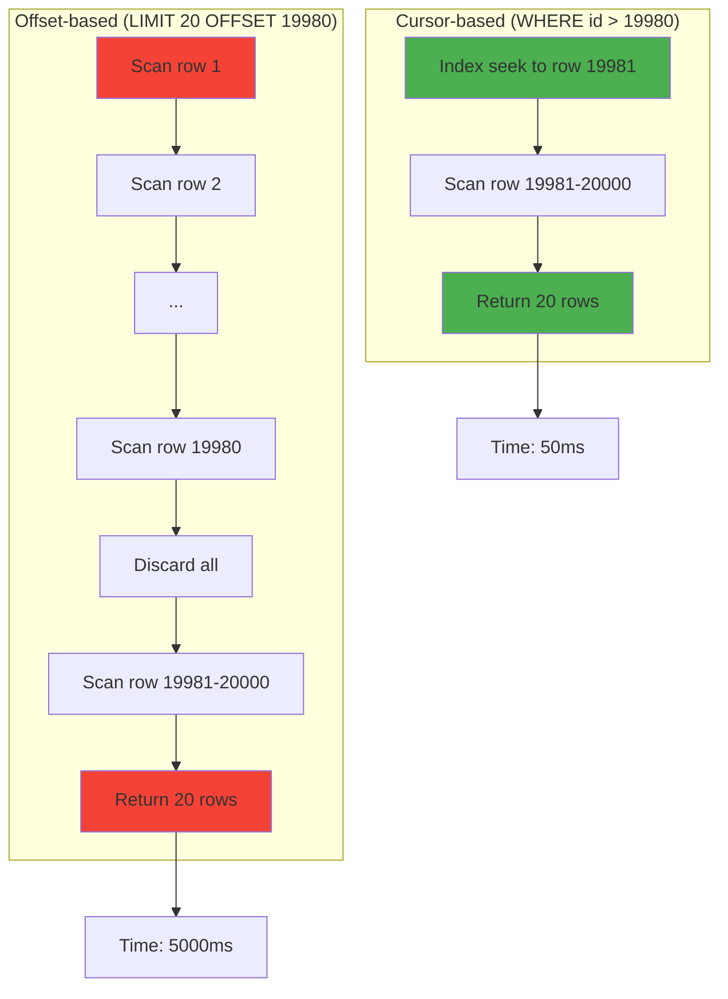
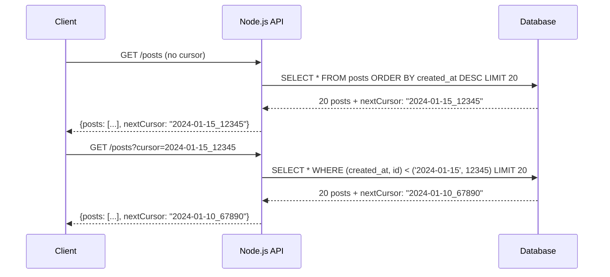
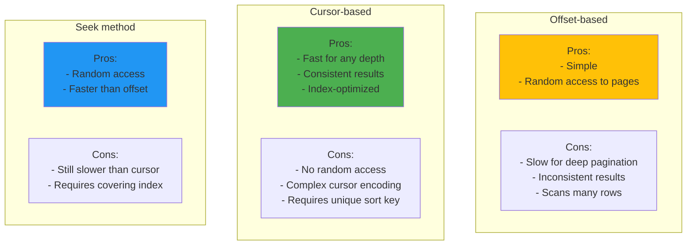
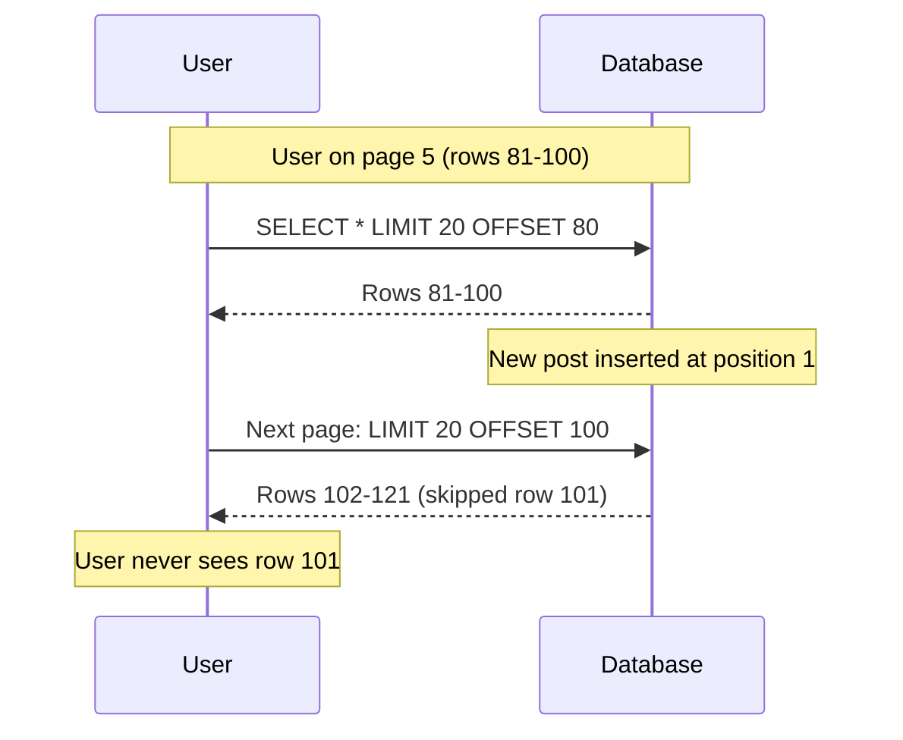

# Pagination strategies

## 1. Why this exists (Real-world problem first)

You're running a social media platform with 100 million posts. A user opens their feed, which should show the latest 20 posts. Your query: `SELECT * FROM posts ORDER BY created_at DESC LIMIT 20`.

What breaks:
- **Offset-based pagination kills performance**: User scrolls to page 1000 (`LIMIT 20 OFFSET 19980`). The database scans 20,000 rows, discards 19,980, returns 20. Query time: 5 seconds.
- **Inconsistent results**: User is on page 5. A new post is created. User clicks "next page". They see a post they already saw on page 5 (because the offset shifted).
- **Memory exhaustion**: You try to load all 100 million posts into memory to paginate client-side. Your Node.js process crashes with OOM.
- **Database CPU saturation**: 1000 users all paginating through different pages. Each query scans millions of rows. Database CPU hits 100%.

Real pain: An e-commerce platform had a product listing with 10 million products. Users could paginate to page 10,000. Each page load took 30 seconds because the database scanned 200,000 rows. They switched to cursor-based pagination (keyset pagination) and query time dropped to 50ms.

## 2. Mental model (build imagination)

Think of a library with 1 million books sorted by publication date.

**Offset-based pagination (LIMIT/OFFSET)**:
- To get page 1000 (books 19,981-20,000), you count 19,980 books from the start, then take the next 20.
- Every time you want a new page, you count from the start again. Slow.

**Cursor-based pagination (keyset)**:
- You remember the last book you saw (e.g., "Published on 2024-01-15, ID 12345").
- To get the next page, you say: "Give me 20 books published after 2024-01-15, or if the same date, ID > 12345."
- No counting, you jump directly to where you left off. Fast.

**Seek method**:
- You have an index of publication dates. You look up "2024-01-15" in the index, jump to that section, take 20 books.
- Much faster than counting from the start.

## 3. How Node.js implements this internally

Node.js doesn't implement pagination—your application logic does. But your Node.js code determines **which pagination strategy** is used.

### Offset-based pagination (slow)

```javascript
app.get('/posts', async (req, res) => {
  const page = parseInt(req.query.page) || 1;
  const limit = 20;
  const offset = (page - 1) * limit;
  
  const posts = await pool.query('SELECT * FROM posts ORDER BY created_at DESC LIMIT $1 OFFSET $2', [limit, offset]);
  res.json(posts.rows);
});
```

**What happens**:
1. Database scans `offset + limit` rows (e.g., 19,980 + 20 = 20,000 rows for page 1000)
2. Discards the first `offset` rows
3. Returns the next `limit` rows

**Event loop impact**: Slow queries block connections in the pool. If query takes 5 seconds, that connection is unavailable for 5 seconds.

### Cursor-based pagination (fast)

```javascript
app.get('/posts', async (req, res) => {
  const limit = 20;
  const cursor = req.query.cursor; // e.g., "2024-01-15T10:30:00Z_12345"
  
  let query, params;
  if (cursor) {
    const [timestamp, id] = cursor.split('_');
    query = 'SELECT * FROM posts WHERE (created_at, id) < ($1, $2) ORDER BY created_at DESC, id DESC LIMIT $3';
    params = [timestamp, id, limit];
  } else {
    query = 'SELECT * FROM posts ORDER BY created_at DESC, id DESC LIMIT $1';
    params = [limit];
  }
  
  const posts = await pool.query(query, params);
  
  const nextCursor = posts.rows.length === limit
    ? `${posts.rows[limit - 1].created_at.toISOString()}_${posts.rows[limit - 1].id}`
    : null;
  
  res.json({ posts: posts.rows, nextCursor });
});
```

**What happens**:
1. Database uses index on `(created_at, id)` to jump directly to the cursor position
2. Scans only `limit` rows (20 rows, not 20,000)
3. Returns results

**Why it's faster**: No offset scanning. Uses index seek (O(log n)) instead of sequential scan (O(n)).

### Seek method (for random access)

```javascript
// For jumping to arbitrary pages (e.g., page 500)
app.get('/posts/page/:page', async (req, res) => {
  const page = parseInt(req.params.page);
  const limit = 20;
  
  // Use a covering index to count efficiently
  const offset = (page - 1) * limit;
  
  const posts = await pool.query(`
    SELECT * FROM posts
    WHERE id > (SELECT id FROM posts ORDER BY created_at DESC LIMIT 1 OFFSET $1)
    ORDER BY created_at DESC
    LIMIT $2
  `, [offset, limit]);
  
  res.json(posts.rows);
});
```

**Why it's better than plain OFFSET**: The subquery uses an index-only scan, which is faster than scanning the full table.

## 4. Multiple diagrams (MANDATORY)

### Offset-based vs cursor-based pagination



### Cursor-based pagination flow



### Pagination strategies comparison



### Inconsistent results with offset



## 5. Where this is used in real projects

### Infinite scroll (cursor-based)
```javascript
app.get('/feed', async (req, res) => {
  const limit = 20;
  const cursor = req.query.cursor;
  
  let query, params;
  if (cursor) {
    const [timestamp, id] = cursor.split('_');
    query = `
      SELECT * FROM posts
      WHERE user_id IN (SELECT following_id FROM follows WHERE follower_id = $1)
        AND (created_at, id) < ($2, $3)
      ORDER BY created_at DESC, id DESC
      LIMIT $4
    `;
    params = [req.user.id, timestamp, id, limit];
  } else {
    query = `
      SELECT * FROM posts
      WHERE user_id IN (SELECT following_id FROM follows WHERE follower_id = $1)
      ORDER BY created_at DESC, id DESC
      LIMIT $2
    `;
    params = [req.user.id, limit];
  }
  
  const posts = await pool.query(query, params);
  const nextCursor = posts.rows.length === limit
    ? `${posts.rows[limit - 1].created_at.toISOString()}_${posts.rows[limit - 1].id}`
    : null;
  
  res.json({ posts: posts.rows, nextCursor });
});
```

### Search results (offset-based with limit)
```javascript
// Limit deep pagination to prevent abuse
app.get('/search', async (req, res) => {
  const page = Math.min(parseInt(req.query.page) || 1, 100); // Max page 100
  const limit = 20;
  const offset = (page - 1) * limit;
  
  const results = await pool.query(`
    SELECT * FROM products
    WHERE name ILIKE $1
    ORDER BY relevance DESC
    LIMIT $2 OFFSET $3
  `, [`%${req.query.q}%`, limit, offset]);
  
  res.json(results.rows);
});
```

### Admin dashboards (seek method)
```javascript
// Allow random access for admins
app.get('/admin/users', async (req, res) => {
  const page = parseInt(req.query.page) || 1;
  const limit = 50;
  const offset = (page - 1) * limit;
  
  // Use covering index for efficient offset
  const users = await pool.query(`
    SELECT u.*
    FROM users u
    WHERE u.id > (
      SELECT id FROM users ORDER BY id LIMIT 1 OFFSET $1
    )
    ORDER BY id
    LIMIT $2
  `, [offset, limit]);
  
  res.json(users.rows);
});
```

### Decision criteria
- **Use cursor-based when**: Infinite scroll, real-time feeds, deep pagination
- **Use offset-based when**: Small datasets, shallow pagination (< 100 pages), need random access
- **Use seek method when**: Need random access but dataset is large

## 6. Where this should NOT be used

### Cursor-based for random access
```javascript
// BAD: Trying to jump to page 500 with cursor-based pagination
// You'd need to fetch 499 pages sequentially to get the cursor for page 500
```

**Solution**: Use offset-based or seek method for random access.

### Offset-based for deep pagination
```javascript
// BAD: Allowing users to paginate to page 10,000
app.get('/posts', async (req, res) => {
  const page = parseInt(req.query.page); // No limit
  const offset = (page - 1) * 20;
  // Query scans millions of rows, takes 30 seconds
});
```

**Solution**: Limit max page (e.g., 100), or use cursor-based pagination.

### Cursor-based without unique sort key
```javascript
// BAD: Cursor only on created_at (not unique)
const cursor = posts.rows[limit - 1].created_at;
// If multiple posts have the same created_at, pagination breaks
```

**Solution**: Always include a unique column (e.g., `id`) in the cursor.

## 7. Failure modes & edge cases

### Cursor invalidation
**Scenario**: User has cursor `2024-01-15_12345`. Post 12345 is deleted. User requests next page with that cursor.

**Impact**: Query returns unexpected results or errors.

**Solution**: Handle gracefully—if cursor is invalid, return empty results or reset to first page.

### Timezone issues
**Scenario**: Cursor includes timestamp `2024-01-15T10:30:00Z`. Database stores timestamps in different timezone.

**Impact**: Pagination breaks, skips or duplicates rows.

**Solution**: Always use UTC for timestamps, encode timezone in cursor.

### Large offsets
**Scenario**: User tries to access page 1,000,000 (`OFFSET 19,999,980`).

**Impact**: Database scans 20 million rows, query times out or crashes.

**Solution**: Limit max page, or return error for deep pagination.

### Cursor encoding
**Scenario**: Cursor contains special characters (e.g., `2024-01-15T10:30:00+00:00_12345`).

**Impact**: URL encoding breaks, cursor is corrupted.

**Solution**: Base64-encode cursors.

```javascript
const cursor = Buffer.from(`${timestamp}_${id}`).toString('base64');
const [timestamp, id] = Buffer.from(cursor, 'base64').toString().split('_');
```

## 8. Trade-offs & alternatives

### What you gain (cursor-based)
- **Consistent performance**: O(log n) regardless of page depth
- **Consistent results**: No skipped or duplicated rows
- **Index-optimized**: Uses index seeks, not scans

### What you sacrifice
- **No random access**: Can't jump to page 500 directly
- **Complex implementation**: Cursor encoding, decoding, validation
- **Requires unique sort key**: Must include `id` or similar

### Alternatives

**GraphQL Relay-style pagination**
- **Use case**: GraphQL APIs
- **Benefit**: Standardized cursor format, built-in support
- **Trade-off**: Requires GraphQL

**Elasticsearch scroll API**
- **Use case**: Large result sets (millions of rows)
- **Benefit**: Efficient deep pagination
- **Trade-off**: Stateful (scroll context), not suitable for real-time data

**Time-based pagination**
- **Use case**: Time-series data (logs, events)
- **Benefit**: Natural cursor (timestamp)
- **Trade-off**: Requires timestamp index

**Materialized views**
- **Use case**: Pre-computed pagination for common queries
- **Benefit**: Extremely fast
- **Trade-off**: Staleness, refresh overhead

## 9. Interview-level articulation

**Question**: "What's the difference between offset-based and cursor-based pagination?"

**Weak answer**: "Offset uses LIMIT/OFFSET, cursor uses a cursor."

**Strong answer**: "Offset-based pagination uses `LIMIT` and `OFFSET` to skip rows. For example, page 1000 with 20 items per page uses `LIMIT 20 OFFSET 19980`, which scans 20,000 rows, discards 19,980, and returns 20. This is slow for deep pagination and causes inconsistent results if data changes between requests. Cursor-based pagination uses a cursor (e.g., the last row's timestamp and ID) to mark where you left off. The next page query is `WHERE (created_at, id) < (cursor_timestamp, cursor_id) LIMIT 20`, which uses an index seek to jump directly to the cursor position. This is O(log n) regardless of depth, consistent, and fast. The trade-off is you can't jump to arbitrary pages—you must paginate sequentially."

**Follow-up**: "How do you handle cursor invalidation?"

**Answer**: "Cursor invalidation happens when the row referenced by the cursor is deleted or modified. For example, if the cursor is `2024-01-15_12345` and post 12345 is deleted, the query `WHERE (created_at, id) < ('2024-01-15', 12345)` still works—it just starts from the next available row. The user won't notice. However, if the cursor format is invalid (e.g., corrupted during URL encoding), I'd return an error or reset to the first page. To prevent corruption, I'd Base64-encode cursors. For extra robustness, I'd include a checksum in the cursor to detect tampering."

**Follow-up**: "When would you use offset-based pagination?"

**Answer**: "I'd use offset-based pagination when the dataset is small (< 10,000 rows), pagination depth is shallow (< 100 pages), or I need random access (e.g., jumping to page 50). For example, search results where users rarely go past page 10, or admin dashboards where admins need to jump to specific pages. I'd always limit the max page to prevent abuse—for example, cap at page 100 and return an error for deeper pagination. For large datasets or infinite scroll, I'd use cursor-based pagination."

## 10. Key takeaways (engineer mindset)

**What to remember**:
- **Offset-based = simple but slow for deep pagination**
- **Cursor-based = fast but no random access**
- **Always include a unique column in the cursor** (e.g., `id`)
- **Limit max page for offset-based** to prevent abuse

**What decisions this enables**:
- Choosing between offset-based and cursor-based pagination
- Designing cursor encoding/decoding logic
- Balancing random access vs performance
- Limiting pagination depth to protect the database

**How it connects to other Node.js concepts**:
- **Connection pooling**: Slow pagination queries hold connections longer
- **Indexing**: Cursor-based pagination requires composite indexes on sort columns
- **Observability**: Monitor pagination query times, cursor invalidation rate
- **Graceful degradation**: If cursor is invalid, fall back to first page (accept reset over error)
