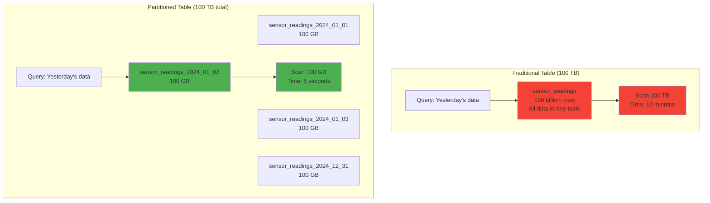
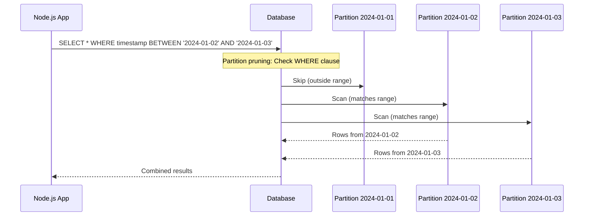
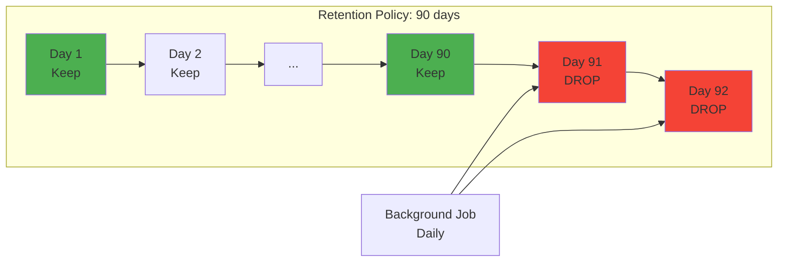
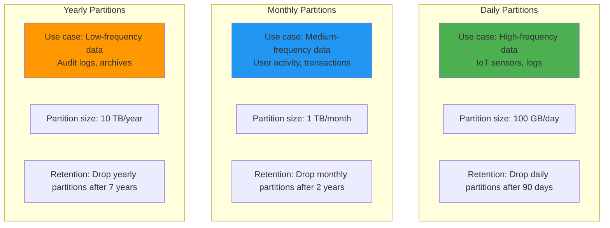

# Time-based data modeling

## 1. Why this exists (Real-world problem first)

You're running an IoT platform that collects sensor data from 1 million devices. Each device sends temperature readings every 10 seconds. That's 100 million data points per second, 8.6 trillion per day.

What breaks with traditional modeling:
- **Table bloat**: A single `sensor_readings` table grows to 100 TB in a year. Queries slow to a crawl, backups take days.
- **Index explosion**: Indexes on `(device_id, timestamp)` grow to 50 TB. Every insert updates the index, write throughput collapses.
- **Inefficient queries**: "Show me yesterday's data" scans the entire 100 TB table, even though yesterday's data is only 100 GB.
- **Retention nightmares**: Deleting old data (`DELETE FROM sensor_readings WHERE timestamp < NOW() - INTERVAL '90 days'`) locks the table for hours, blocking all writes.

Real pain: A financial trading platform stored tick data (price updates) in a single table. After 6 months, the table had 500 billion rows and was 200 TB. Queries for recent data (last hour) took 10 minutes because the database scanned the entire table. They switched to time-based partitioning (one partition per day) and query time dropped to 5 seconds.

## 2. Mental model (build imagination)

Think of a library that receives 1000 new books every day.

**Traditional model**: All books go on the same shelf. After 10 years, you have 3.6 million books on one shelf. Finding today's books requires scanning the entire shelf.

**Time-based model**: 
- Create a new shelf for each day (daily partitions).
- Today's books go on today's shelf.
- To find today's books, you only check today's shelf (1000 books, not 3.6 million).
- After 90 days, you remove the old shelf entirely (no need to scan and delete individual books).

In databases:
- **Partition**: A physical subdivision of a table. Each partition is a separate file on disk.
- **Time-based partitioning**: Partitions are organized by time (e.g., one partition per day, week, or month).
- **Partition pruning**: The database skips irrelevant partitions when querying (e.g., querying yesterday's data only reads yesterday's partition).

## 3. How Node.js implements this internally

Node.js doesn't implement partitioning—the database does. But your Node.js code must **write to the correct partition** and **query efficiently**.

### Example: Writing to partitioned table

```javascript
// PostgreSQL: Table partitioned by day
// CREATE TABLE sensor_readings (
//   device_id INT,
//   temperature FLOAT,
//   timestamp TIMESTAMPTZ
// ) PARTITION BY RANGE (timestamp);
//
// CREATE TABLE sensor_readings_2024_01_01 PARTITION OF sensor_readings
//   FOR VALUES FROM ('2024-01-01') TO ('2024-01-02');

app.post('/readings', async (req, res) => {
  await pool.query(
    'INSERT INTO sensor_readings (device_id, temperature, timestamp) VALUES ($1, $2, $3)',
    [req.body.deviceId, req.body.temperature, new Date()]
  );
  // PostgreSQL automatically routes to the correct partition based on timestamp
  res.sendStatus(201);
});
```

**What happens**:
1. PostgreSQL checks the `timestamp` value
2. Routes the insert to the correct partition (e.g., `sensor_readings_2024_01_01`)
3. Inserts the row into that partition

**Event loop impact**: Same as a regular insert—async, non-blocking.

### Example: Querying with partition pruning

```javascript
// Query yesterday's data
app.get('/readings/yesterday', async (req, res) => {
  const yesterday = new Date();
  yesterday.setDate(yesterday.getDate() - 1);
  
  const readings = await pool.query(`
    SELECT * FROM sensor_readings
    WHERE timestamp >= $1 AND timestamp < $2
  `, [yesterday, new Date()]);
  
  // PostgreSQL only scans yesterday's partition, not the entire table
  res.json(readings.rows);
});
```

**Why it's fast**: PostgreSQL uses partition pruning—it checks the `WHERE` clause, determines only yesterday's partition is relevant, and skips all other partitions.

### Example: Dropping old partitions

```javascript
// Background job: Drop partitions older than 90 days
async function dropOldPartitions() {
  const cutoff = new Date();
  cutoff.setDate(cutoff.getDate() - 90);
  
  const partitions = await pool.query(`
    SELECT tablename FROM pg_tables
    WHERE schemaname = 'public'
      AND tablename LIKE 'sensor_readings_%'
      AND tablename < $1
  `, [`sensor_readings_${cutoff.toISOString().split('T')[0].replace(/-/g, '_')}`]);
  
  for (const partition of partitions.rows) {
    await pool.query(`DROP TABLE ${partition.tablename}`);
    console.log(`Dropped partition: ${partition.tablename}`);
  }
}

// Run daily
setInterval(dropOldPartitions, 24 * 60 * 60 * 1000);
```

**Why it's fast**: Dropping a partition is instant (just removes the file), unlike `DELETE` which scans and removes rows individually.

## 4. Multiple diagrams (MANDATORY)

### Traditional vs partitioned table



### Partition pruning



### Time-based retention



### Partitioning strategies



## 5. Where this is used in real projects

### IoT sensor data
```javascript
// Daily partitions for sensor readings
app.post('/sensors/:deviceId/readings', async (req, res) => {
  await pool.query(`
    INSERT INTO sensor_readings (device_id, temperature, humidity, timestamp)
    VALUES ($1, $2, $3, NOW())
  `, [req.params.deviceId, req.body.temperature, req.body.humidity]);
  
  res.sendStatus(201);
});

// Query recent data (partition pruning)
app.get('/sensors/:deviceId/recent', async (req, res) => {
  const readings = await pool.query(`
    SELECT * FROM sensor_readings
    WHERE device_id = $1
      AND timestamp > NOW() - INTERVAL '24 hours'
    ORDER BY timestamp DESC
  `, [req.params.deviceId]);
  
  res.json(readings.rows);
});
```

### Application logs
```javascript
// Monthly partitions for logs
app.post('/logs', async (req, res) => {
  await pool.query(`
    INSERT INTO application_logs (level, message, metadata, timestamp)
    VALUES ($1, $2, $3, NOW())
  `, [req.body.level, req.body.message, req.body.metadata]);
  
  res.sendStatus(201);
});

// Background job: Drop logs older than 6 months
async function dropOldLogs() {
  const cutoff = new Date();
  cutoff.setMonth(cutoff.getMonth() - 6);
  
  const partitions = await pool.query(`
    SELECT tablename FROM pg_tables
    WHERE tablename LIKE 'application_logs_%'
      AND tablename < $1
  `, [`application_logs_${cutoff.getFullYear()}_${String(cutoff.getMonth() + 1).padStart(2, '0')}`]);
  
  for (const partition of partitions.rows) {
    await pool.query(`DROP TABLE ${partition.tablename}`);
  }
}
```

### Financial transactions
```javascript
// Yearly partitions for transaction history
app.post('/transactions', async (req, res) => {
  await pool.query(`
    INSERT INTO transactions (user_id, amount, type, timestamp)
    VALUES ($1, $2, $3, NOW())
  `, [req.user.id, req.body.amount, req.body.type]);
  
  res.sendStatus(201);
});

// Query this year's transactions (partition pruning)
app.get('/transactions', async (req, res) => {
  const transactions = await pool.query(`
    SELECT * FROM transactions
    WHERE user_id = $1
      AND timestamp >= DATE_TRUNC('year', NOW())
    ORDER BY timestamp DESC
  `, [req.user.id]);
  
  res.json(transactions.rows);
});
```

### Decision criteria
- **Use daily partitions when**: Data volume is high (> 10 GB/day), retention is short (< 90 days)
- **Use monthly partitions when**: Data volume is medium (> 100 GB/month), retention is medium (< 2 years)
- **Use yearly partitions when**: Data volume is low, retention is long (> 5 years)

## 6. Where this should NOT be used

### Small datasets
```javascript
// BAD: Partitioning a table with 1 GB total
// Overhead of managing partitions > benefit
```

**Solution**: Only partition tables with > 100 GB of data.

### Frequently queried across partitions
```javascript
// BAD: Query spans all partitions
SELECT * FROM sensor_readings WHERE device_id = 123;
// If device_id is not in the partition key, database scans all partitions
```

**Solution**: Include the partition key (timestamp) in queries, or use a different partitioning strategy.

### Write-heavy tables with small partitions
```javascript
// BAD: Hourly partitions for low-volume data
// Creates 8760 partitions per year, high overhead
```

**Solution**: Use larger partitions (daily or monthly).

### Tables with complex queries
```javascript
// BAD: Partitioning a table with many joins
SELECT * FROM sensor_readings sr
JOIN devices d ON sr.device_id = d.id
JOIN locations l ON d.location_id = l.id
WHERE sr.timestamp > NOW() - INTERVAL '1 hour';
// Partition pruning works, but joins are still complex
```

**Solution**: Denormalize or use materialized views.

## 7. Failure modes & edge cases

### Partition not created
**Scenario**: Data arrives for 2024-01-15, but partition `sensor_readings_2024_01_15` doesn't exist.

**Impact**: Insert fails with error: `no partition of relation "sensor_readings" found for row`.

**Solution**: Auto-create partitions.

```javascript
async function ensurePartitionExists(date) {
  const partitionName = `sensor_readings_${date.toISOString().split('T')[0].replace(/-/g, '_')}`;
  
  await pool.query(`
    CREATE TABLE IF NOT EXISTS ${partitionName}
    PARTITION OF sensor_readings
    FOR VALUES FROM ('${date.toISOString().split('T')[0]}') TO ('${new Date(date.getTime() + 86400000).toISOString().split('T')[0]}')
  `);
}

app.post('/readings', async (req, res) => {
  await ensurePartitionExists(new Date());
  await pool.query('INSERT INTO sensor_readings ...', [...]);
  res.sendStatus(201);
});
```

### Query doesn't use partition key
**Scenario**: Query filters by `device_id` but not `timestamp`.

```javascript
SELECT * FROM sensor_readings WHERE device_id = 123;
```

**Impact**: Database scans all partitions, no pruning benefit.

**Solution**: Always include the partition key in queries.

```javascript
SELECT * FROM sensor_readings
WHERE device_id = 123
  AND timestamp > NOW() - INTERVAL '7 days';
```

### Partition size imbalance
**Scenario**: Some days have 10x more data than others (e.g., Black Friday).

**Impact**: Some partitions are 1 TB, others are 100 GB. Queries on large partitions are slow.

**Solution**: Use sub-partitioning (e.g., partition by day, sub-partition by hour).

### Retention job fails
**Scenario**: Background job to drop old partitions crashes. Partitions accumulate, disk fills up.

**Impact**: Database runs out of disk space, crashes.

**Solution**: Monitor partition count, alert if it exceeds threshold.

## 8. Trade-offs & alternatives

### What you gain
- **Massive query speedup**: Partition pruning reduces scan size by 100x
- **Efficient retention**: Drop partitions instantly, no row-by-row deletion
- **Parallel queries**: Database can scan multiple partitions in parallel

### What you sacrifice
- **Operational complexity**: Must create/drop partitions, monitor partition count
- **Query constraints**: Must include partition key in queries for pruning
- **Schema rigidity**: Changing partition strategy requires table rebuild

### Alternatives

**TimescaleDB (PostgreSQL extension)**
- **Use case**: Time-series data
- **Benefit**: Automatic partitioning, compression, retention policies
- **Trade-off**: Requires extension, vendor-specific features

**InfluxDB / Prometheus**
- **Use case**: Metrics, monitoring data
- **Benefit**: Optimized for time-series, built-in retention
- **Trade-off**: Different query language, eventual consistency

**Elasticsearch**
- **Use case**: Logs, full-text search
- **Benefit**: Index-per-day pattern, automatic rollover
- **Trade-off**: Eventual consistency, operational complexity

**Data archival (S3 + Athena)**
- **Use case**: Cold data (rarely queried)
- **Benefit**: Cheap storage, serverless queries
- **Trade-off**: High query latency (seconds to minutes)

## 9. Interview-level articulation

**Question**: "What is time-based partitioning and when would you use it?"

**Weak answer**: "It's when you partition a table by time."

**Strong answer**: "Time-based partitioning divides a table into smaller, independent partitions based on a time column (e.g., one partition per day). For example, a sensor data table with 100 TB of data might have 365 partitions, each containing one day's data. When you query yesterday's data, the database uses partition pruning to scan only yesterday's partition (100 GB), not the entire table (100 TB). This makes queries 100x faster. I'd use it for high-volume time-series data—IoT sensors, logs, financial transactions—where queries typically filter by time range. The key trade-offs are operational complexity (must create/drop partitions) and query constraints (must include the time column in WHERE clauses for pruning to work)."

**Follow-up**: "How do you handle data retention with partitioning?"

**Answer**: "Instead of deleting rows individually (`DELETE FROM sensor_readings WHERE timestamp < cutoff`), which is slow and locks the table, I'd drop entire partitions. For example, if my retention policy is 90 days, I'd run a daily background job that drops partitions older than 90 days using `DROP TABLE sensor_readings_2023_10_01`. This is instant—just removes the partition file—and doesn't block writes. I'd also monitor partition count to ensure the job is running successfully. If partitions accumulate, it's a sign the job failed, and I'd alert on it."

**Follow-up**: "What happens if you query without the partition key?"

**Answer**: "If I query `SELECT * FROM sensor_readings WHERE device_id = 123` without filtering by timestamp, the database can't prune partitions. It scans all 365 partitions, defeating the purpose of partitioning. To fix this, I'd always include the partition key in queries: `WHERE device_id = 123 AND timestamp > NOW() - INTERVAL '7 days'`. This limits the scan to 7 partitions. If I frequently query by device_id alone, I'd consider a different partitioning strategy (e.g., partition by device_id range) or use a composite partition key (time + device_id)."

## 10. Key takeaways (engineer mindset)

**What to remember**:
- **Partitioning = divide large tables into smaller, independent chunks**
- **Partition pruning = skip irrelevant partitions, massive speedup**
- **Retention = drop partitions, not delete rows**
- **Always include partition key in queries** for pruning to work

**What decisions this enables**:
- Choosing partition granularity (daily, monthly, yearly)
- Designing retention policies (drop old partitions)
- Optimizing queries to leverage partition pruning
- Balancing partition size vs partition count

**How it connects to other Node.js concepts**:
- **Connection pooling**: Faster queries = less pool contention
- **Background jobs**: Auto-create partitions, drop old partitions
- **Observability**: Monitor partition count, query performance, retention job status
- **Graceful degradation**: If partition creation fails, queue writes and retry (accept delayed writes over data loss)
