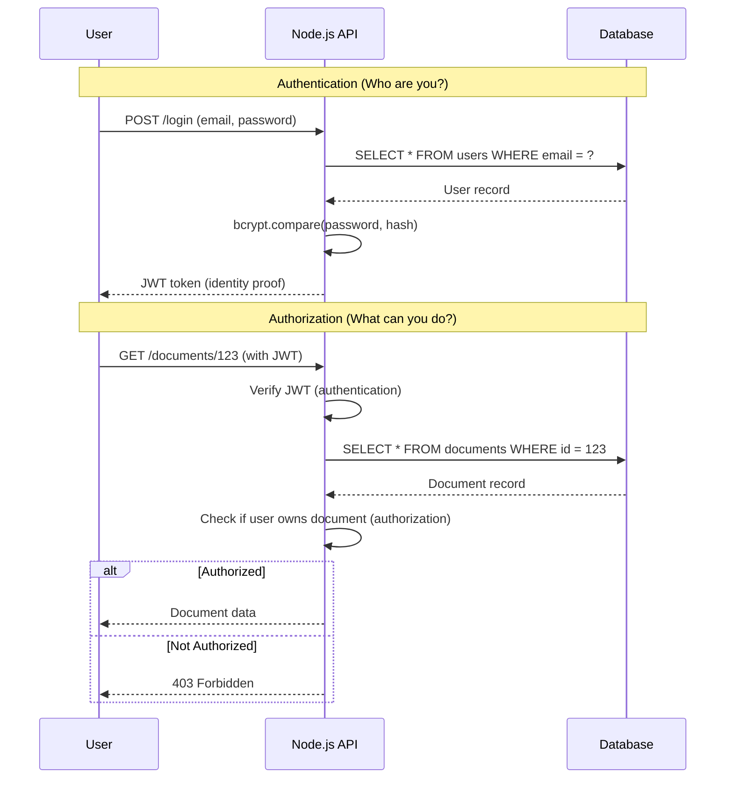
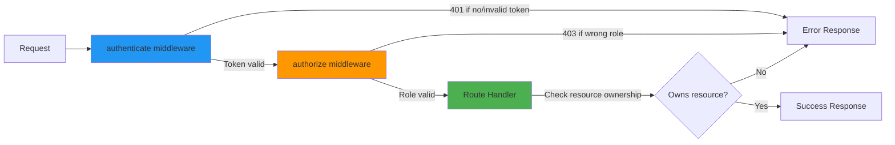
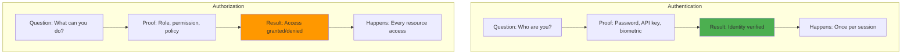
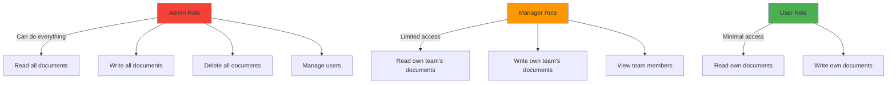

# Authentication vs Authorization

## 1. Why this exists (Real-world problem first)

You're running a healthcare SaaS platform. A doctor logs in to view patient records. Without proper authentication and authorization, several catastrophic failures occur:

What breaks:
- **Authentication failure**: An attacker guesses a weak password, logs in as the doctor, and accesses all patient records. HIPAA violation, $50M fine.
- **Authorization failure**: The doctor is authenticated, but the system doesn't check if they're authorized to view a specific patient's records. They access records of patients they don't treat. Privacy breach, lawsuit.
- **Confused deputy**: The system authenticates the doctor but uses their credentials to perform actions they didn't request (e.g., deleting records). The doctor is blamed for system bugs.
- **Privilege escalation**: A nurse logs in (authenticated) but exploits a bug to gain admin privileges (authorization bypass). They can now delete audit logs.

Real pain: A fintech API had authentication (API keys) but no authorization checks. Any authenticated user could access any account's transaction history by changing the `account_id` parameter in the URL. A security researcher discovered this and reported it. The company had to notify 2 million users of a potential data breach.

**Another scenario**: A SaaS platform confused authentication with authorization. They checked if a user was logged in (authentication) but didn't verify if the user owned the resource they were accessing (authorization). Result: User A could view User B's dashboard by guessing the dashboard ID.

## 2. Mental model (build imagination)

Think of a corporate office building.

**Authentication** = **"Who are you?"**
- You show your employee badge at the entrance.
- Security guard verifies your identity (checks photo, name, employee ID).
- You're allowed into the building.
- **You've proven you are who you claim to be.**

**Authorization** = **"What are you allowed to do?"**
- You're inside the building (authenticated).
- You try to enter the CEO's office.
- Your badge is scanned. It shows you're a junior developer, not authorized for the CEO's office.
- Access denied.
- **Your identity is verified, but you don't have permission for this specific action.**

In technical terms:
- **Authentication**: Verifying identity (username/password, API key, biometrics)
- **Authorization**: Verifying permissions (roles, scopes, policies)

**Key insight**: Authentication happens **once** (login). Authorization happens **every time** you access a resource.

### The flow

1. **User logs in** → Authentication (verify credentials)
2. **System issues token** → Token contains user identity
3. **User requests resource** → Authorization (check if user can access this specific resource)
4. **System grants/denies access** → Based on user's permissions

## 3. How Node.js implements this internally

Node.js doesn't implement authentication or authorization—your application does. But understanding how middleware and request flow work matters.

### Authentication flow in Node.js

```javascript
const express = require('express');
const jwt = require('jsonwebtoken');
const bcrypt = require('bcrypt');

const app = express();

// Authentication: Verify identity
app.post('/login', async (req, res) => {
  const { email, password } = req.body;
  
  // 1. Find user by email
  const user = await db.query('SELECT * FROM users WHERE email = $1', [email]);
  
  if (!user.rows[0]) {
    return res.status(401).json({ error: 'Invalid credentials' });
  }
  
  // 2. Verify password (authentication)
  const validPassword = await bcrypt.compare(password, user.rows[0].password_hash);
  
  if (!validPassword) {
    return res.status(401).json({ error: 'Invalid credentials' });
  }
  
  // 3. User is authenticated, issue token
  const token = jwt.sign(
    { userId: user.rows[0].id, role: user.rows[0].role },
    process.env.JWT_SECRET,
    { expiresIn: '1h' }
  );
  
  res.json({ token });
});
```

**What happens**:
1. User sends credentials (synchronous HTTP request)
2. Database query (async I/O, event loop hands off to libuv)
3. Password comparison (CPU-bound, runs on event loop or thread pool)
4. JWT signing (CPU-bound, synchronous)
5. Response sent

**Event loop impact**: Password hashing is CPU-intensive. If you're hashing on the event loop, it blocks other requests. Use `bcrypt` with async methods or offload to worker threads.

### Authorization flow in Node.js

```javascript
// Middleware: Verify token (authentication)
function authenticate(req, res, next) {
  const token = req.headers.authorization?.split(' ')[1];
  
  if (!token) {
    return res.status(401).json({ error: 'No token provided' });
  }
  
  try {
    const decoded = jwt.verify(token, process.env.JWT_SECRET);
    req.user = decoded; // Attach user to request
    next();
  } catch (err) {
    return res.status(401).json({ error: 'Invalid token' });
  }
}

// Middleware: Check permissions (authorization)
function authorize(requiredRole) {
  return (req, res, next) => {
    if (req.user.role !== requiredRole) {
      return res.status(403).json({ error: 'Forbidden' });
    }
    next();
  };
}

// Protected route
app.get('/admin/users', authenticate, authorize('admin'), async (req, res) => {
  // User is authenticated (we know who they are)
  // User is authorized (they have admin role)
  const users = await db.query('SELECT * FROM users');
  res.json(users.rows);
});
```

**What happens**:
1. Request arrives with JWT token
2. `authenticate` middleware verifies token (synchronous JWT verification)
3. `authorize` middleware checks role (synchronous comparison)
4. If both pass, route handler executes
5. If either fails, 401 (authentication) or 403 (authorization) is returned

**Common misunderstanding**: Developers think JWT verification is async. It's not—it's synchronous CPU work. For high-traffic APIs, this can block the event loop.

### Resource-level authorization

```javascript
// Authorization: Check if user owns the resource
app.get('/documents/:id', authenticate, async (req, res) => {
  const document = await db.query('SELECT * FROM documents WHERE id = $1', [req.params.id]);
  
  if (!document.rows[0]) {
    return res.status(404).json({ error: 'Document not found' });
  }
  
  // Authorization check: Does this user own this document?
  if (document.rows[0].owner_id !== req.user.userId) {
    return res.status(403).json({ error: 'Forbidden' });
  }
  
  res.json(document.rows[0]);
});
```

**Critical detail**: Authorization must check **every resource access**, not just route access. A user might be authorized to access `/documents` but not authorized to access document ID 123.

## 4. Multiple diagrams (MANDATORY)

### Authentication vs Authorization flow



### Middleware chain



### Authentication vs Authorization comparison



### Role-based authorization hierarchy



## 5. Where this is used in real projects

### API authentication with JWT

```javascript
const express = require('express');
const jwt = require('jsonwebtoken');
const bcrypt = require('bcrypt');
const rateLimit = require('express-rate-limit');

const app = express();

// Rate limit login attempts
const loginLimiter = rateLimit({
  windowMs: 15 * 60 * 1000, // 15 minutes
  max: 5, // 5 attempts
  message: 'Too many login attempts, please try again later',
});

// Authentication endpoint
app.post('/login', loginLimiter, async (req, res) => {
  const { email, password } = req.body;
  
  try {
    const user = await db.query('SELECT * FROM users WHERE email = $1', [email]);
    
    if (!user.rows[0]) {
      // Don't reveal if email exists
      return res.status(401).json({ error: 'Invalid credentials' });
    }
    
    const validPassword = await bcrypt.compare(password, user.rows[0].password_hash);
    
    if (!validPassword) {
      // Log failed attempt
      await db.query('INSERT INTO login_attempts (user_id, success, ip) VALUES ($1, false, $2)', 
        [user.rows[0].id, req.ip]);
      return res.status(401).json({ error: 'Invalid credentials' });
    }
    
    // Log successful login
    await db.query('INSERT INTO login_attempts (user_id, success, ip) VALUES ($1, true, $2)', 
      [user.rows[0].id, req.ip]);
    
    const token = jwt.sign(
      { 
        userId: user.rows[0].id, 
        role: user.rows[0].role,
        email: user.rows[0].email 
      },
      process.env.JWT_SECRET,
      { expiresIn: '1h', issuer: 'myapp' }
    );
    
    res.json({ token, expiresIn: 3600 });
  } catch (err) {
    console.error('Login error:', err);
    res.status(500).json({ error: 'Internal server error' });
  }
});
```

### Resource-level authorization

```javascript
// Middleware: Authenticate user
function authenticate(req, res, next) {
  const token = req.headers.authorization?.split(' ')[1];
  
  if (!token) {
    return res.status(401).json({ error: 'Authentication required' });
  }
  
  try {
    const decoded = jwt.verify(token, process.env.JWT_SECRET);
    req.user = decoded;
    next();
  } catch (err) {
    if (err.name === 'TokenExpiredError') {
      return res.status(401).json({ error: 'Token expired' });
    }
    return res.status(401).json({ error: 'Invalid token' });
  }
}

// Authorization: Check resource ownership
app.get('/api/projects/:id', authenticate, async (req, res) => {
  try {
    const project = await db.query(`
      SELECT p.*, pm.role as user_role
      FROM projects p
      LEFT JOIN project_members pm ON p.id = pm.project_id AND pm.user_id = $1
      WHERE p.id = $2
    `, [req.user.userId, req.params.id]);
    
    if (!project.rows[0]) {
      return res.status(404).json({ error: 'Project not found' });
    }
    
    // Authorization: User must be a member of the project
    if (!project.rows[0].user_role) {
      return res.status(403).json({ error: 'Access denied' });
    }
    
    res.json(project.rows[0]);
  } catch (err) {
    console.error('Project fetch error:', err);
    res.status(500).json({ error: 'Internal server error' });
  }
});

// Authorization: Check specific permission
app.delete('/api/projects/:id', authenticate, async (req, res) => {
  try {
    const project = await db.query(`
      SELECT pm.role
      FROM project_members pm
      WHERE pm.project_id = $1 AND pm.user_id = $2
    `, [req.params.id, req.user.userId]);
    
    if (!project.rows[0]) {
      return res.status(404).json({ error: 'Project not found' });
    }
    
    // Authorization: Only project owners can delete
    if (project.rows[0].role !== 'owner') {
      return res.status(403).json({ error: 'Only project owners can delete projects' });
    }
    
    await db.query('DELETE FROM projects WHERE id = $1', [req.params.id]);
    res.json({ message: 'Project deleted' });
  } catch (err) {
    console.error('Project delete error:', err);
    res.status(500).json({ error: 'Internal server error' });
  }
});
```

### Role-based access control (RBAC)

```javascript
// Define permissions per role
const PERMISSIONS = {
  admin: ['read:all', 'write:all', 'delete:all', 'manage:users'],
  manager: ['read:team', 'write:team', 'read:reports'],
  user: ['read:own', 'write:own'],
};

// Middleware: Check if user has required permission
function requirePermission(permission) {
  return (req, res, next) => {
    const userPermissions = PERMISSIONS[req.user.role] || [];
    
    if (!userPermissions.includes(permission)) {
      return res.status(403).json({ 
        error: 'Forbidden', 
        required: permission,
        userRole: req.user.role 
      });
    }
    
    next();
  };
}

// Protected routes
app.get('/api/users', authenticate, requirePermission('read:all'), async (req, res) => {
  const users = await db.query('SELECT id, email, role FROM users');
  res.json(users.rows);
});

app.post('/api/users', authenticate, requirePermission('manage:users'), async (req, res) => {
  const { email, password, role } = req.body;
  const hashedPassword = await bcrypt.hash(password, 10);
  
  const user = await db.query(
    'INSERT INTO users (email, password_hash, role) VALUES ($1, $2, $3) RETURNING id, email, role',
    [email, hashedPassword, role]
  );
  
  res.status(201).json(user.rows[0]);
});
```

### API key authentication for machine-to-machine

```javascript
// Middleware: Authenticate with API key
function authenticateAPIKey(req, res, next) {
  const apiKey = req.headers['x-api-key'];
  
  if (!apiKey) {
    return res.status(401).json({ error: 'API key required' });
  }
  
  // In production, hash API keys and store hashed versions
  db.query('SELECT * FROM api_keys WHERE key_hash = $1 AND revoked = false', [hashAPIKey(apiKey)])
    .then(result => {
      if (!result.rows[0]) {
        return res.status(401).json({ error: 'Invalid API key' });
      }
      
      // Check if API key is expired
      if (result.rows[0].expires_at < new Date()) {
        return res.status(401).json({ error: 'API key expired' });
      }
      
      // Attach API key metadata to request
      req.apiKey = result.rows[0];
      
      // Log API key usage
      db.query('UPDATE api_keys SET last_used_at = NOW(), usage_count = usage_count + 1 WHERE id = $1', 
        [result.rows[0].id]);
      
      next();
    })
    .catch(err => {
      console.error('API key verification error:', err);
      res.status(500).json({ error: 'Internal server error' });
    });
}

// API endpoint with API key auth
app.get('/api/data', authenticateAPIKey, async (req, res) => {
  // Authorization: Check API key scopes
  if (!req.apiKey.scopes.includes('read:data')) {
    return res.status(403).json({ error: 'API key does not have read:data scope' });
  }
  
  const data = await db.query('SELECT * FROM data WHERE tenant_id = $1', [req.apiKey.tenant_id]);
  res.json(data.rows);
});
```

### Decision criteria
- **Use authentication** for every protected endpoint (verify identity)
- **Use authorization** for every resource access (verify permissions)
- **Never skip authorization** even if user is authenticated
- **Log both** authentication attempts and authorization failures for security audits

## 6. Where this should NOT be used

### Confusing authentication with authorization

```javascript
// BAD: Only checking if user is logged in
app.get('/api/documents/:id', authenticate, async (req, res) => {
  const document = await db.query('SELECT * FROM documents WHERE id = $1', [req.params.id]);
  res.json(document.rows[0]); // Any authenticated user can access any document!
});

// GOOD: Check both authentication and authorization
app.get('/api/documents/:id', authenticate, async (req, res) => {
  const document = await db.query('SELECT * FROM documents WHERE id = $1 AND owner_id = $2', 
    [req.params.id, req.user.userId]);
  
  if (!document.rows[0]) {
    return res.status(404).json({ error: 'Document not found' });
  }
  
  res.json(document.rows[0]);
});
```

### Client-side authorization

```javascript
// BAD: Trusting client-side role
app.get('/api/admin/users', authenticate, async (req, res) => {
  // Client sends role in request body
  if (req.body.role === 'admin') {
    const users = await db.query('SELECT * FROM users');
    return res.json(users.rows);
  }
  res.status(403).json({ error: 'Forbidden' });
});

// GOOD: Role comes from verified JWT or database
app.get('/api/admin/users', authenticate, async (req, res) => {
  // req.user.role comes from JWT (server-verified)
  if (req.user.role !== 'admin') {
    return res.status(403).json({ error: 'Forbidden' });
  }
  
  const users = await db.query('SELECT * FROM users');
  res.json(users.rows);
});
```

### Storing sensitive data in JWT

```javascript
// BAD: Storing sensitive data in JWT
const token = jwt.sign({
  userId: user.id,
  email: user.email,
  password: user.password, // NEVER!
  ssn: user.ssn,           // NEVER!
  creditCard: user.creditCard // NEVER!
}, process.env.JWT_SECRET);

// GOOD: Only store non-sensitive identifiers
const token = jwt.sign({
  userId: user.id,
  role: user.role,
  email: user.email // OK if not sensitive
}, process.env.JWT_SECRET);
```

### Using GET requests for authentication

```javascript
// BAD: Sending credentials in URL
app.get('/login', async (req, res) => {
  const { email, password } = req.query; // Credentials in URL, logged everywhere!
  // ...
});

// GOOD: Use POST with body
app.post('/login', async (req, res) => {
  const { email, password } = req.body; // Credentials in body, not logged
  // ...
});
```

## 7. Failure modes & edge cases

### Token expiration during request

**Scenario**: User starts a long file upload. Token expires mid-upload.

**Impact**: Upload fails with 401 error after 30 minutes of uploading.

**Solution**: Refresh tokens or extend expiration for long-running operations.

```javascript
// Middleware: Extend token expiration for long operations
function extendTokenForLongOps(req, res, next) {
  const token = req.headers.authorization?.split(' ')[1];
  const decoded = jwt.verify(token, process.env.JWT_SECRET);
  
  // If token expires in < 5 minutes, issue a new one
  const expiresIn = decoded.exp - Math.floor(Date.now() / 1000);
  if (expiresIn < 300) {
    const newToken = jwt.sign(
      { userId: decoded.userId, role: decoded.role },
      process.env.JWT_SECRET,
      { expiresIn: '1h' }
    );
    res.setHeader('X-New-Token', newToken);
  }
  
  next();
}
```

### Race condition in authorization checks

**Scenario**: User A shares document with User B. User B's request arrives before the database transaction commits.

**Impact**: User B gets 403 Forbidden even though they should have access.

**Solution**: Use read-committed isolation or retry logic.

### Privilege escalation via parameter tampering

**Scenario**: User changes `role=user` to `role=admin` in request body.

**Impact**: If server trusts client-provided role, user gains admin access.

**Solution**: Never trust client input for authorization. Always fetch role from database or verified token.

```javascript
// BAD
app.post('/api/users', authenticate, async (req, res) => {
  if (req.body.role === 'admin') { // Client can set this!
    // Admin action
  }
});

// GOOD
app.post('/api/users', authenticate, async (req, res) => {
  const user = await db.query('SELECT role FROM users WHERE id = $1', [req.user.userId]);
  if (user.rows[0].role === 'admin') {
    // Admin action
  }
});
```

### Session fixation

**Scenario**: Attacker tricks user into using a known session ID. User logs in with that session ID. Attacker now has access to authenticated session.

**Impact**: Account takeover.

**Solution**: Regenerate session ID after login.

```javascript
app.post('/login', async (req, res) => {
  // ... authenticate user ...
  
  // Regenerate session ID
  req.session.regenerate((err) => {
    if (err) return res.status(500).json({ error: 'Session error' });
    
    req.session.userId = user.id;
    res.json({ message: 'Logged in' });
  });
});
```

### Authorization bypass via direct object reference

**Scenario**: User accesses `/api/documents/123`. System checks if user is authenticated but not if they own document 123.

**Impact**: Insecure Direct Object Reference (IDOR) vulnerability. User can access any document by guessing IDs.

**Solution**: Always check resource ownership.

## 8. Trade-offs & alternatives

### What you gain
- **Security**: Only authenticated users can access protected resources
- **Auditability**: Know who did what (authentication provides identity)
- **Fine-grained control**: Authorization allows per-resource permissions
- **Compliance**: Meet regulatory requirements (HIPAA, GDPR, SOC 2)

### What you sacrifice
- **Performance**: Every request requires authentication and authorization checks
- **Complexity**: Must manage tokens, sessions, roles, permissions
- **User friction**: Users must log in, remember passwords, handle token expiration

### Alternatives

**Session-based authentication**
- **Use case**: Traditional web apps with server-side rendering
- **Benefit**: Server controls session lifecycle, can revoke instantly
- **Trade-off**: Requires session storage (Redis), doesn't scale horizontally as easily

**OAuth 2.0 / OpenID Connect**
- **Use case**: Third-party authentication (Login with Google)
- **Benefit**: Offload authentication to identity provider
- **Trade-off**: Dependency on external service, more complex flow

**API keys**
- **Use case**: Machine-to-machine authentication
- **Benefit**: Simple, no user interaction
- **Trade-off**: Hard to rotate, often long-lived

**Mutual TLS (mTLS)**
- **Use case**: Service-to-service authentication
- **Benefit**: Strong cryptographic authentication
- **Trade-off**: Complex certificate management

## 9. Interview-level articulation

**Question**: "What's the difference between authentication and authorization?"

**Weak answer**: "Authentication is logging in, authorization is permissions."

**Strong answer**: "Authentication verifies identity—it answers 'who are you?' by validating credentials like passwords or API keys. Authorization verifies permissions—it answers 'what are you allowed to do?' by checking roles, scopes, or policies. Authentication happens once per session, but authorization happens on every resource access. For example, in a healthcare app, a doctor authenticates with their credentials, but authorization checks if they're allowed to view a specific patient's records. A common mistake is only checking authentication—just because a user is logged in doesn't mean they can access every resource."

**Follow-up**: "How do you implement authorization in a Node.js API?"

**Answer**: "I use middleware for both authentication and authorization. The authentication middleware verifies the JWT token and attaches the user to the request object. The authorization middleware checks if the user has the required role or permission. For resource-level authorization, I query the database to verify ownership—for example, checking if `document.owner_id === req.user.userId`. I never trust client-provided roles or permissions; they must come from the verified token or database. For complex permissions, I use RBAC (role-based access control) or ABAC (attribute-based access control) with a policy engine."

**Follow-up**: "What's an IDOR vulnerability and how do you prevent it?"

**Answer**: "IDOR (Insecure Direct Object Reference) is when an attacker can access resources by manipulating IDs in the URL, like changing `/api/documents/123` to `/api/documents/124`. It happens when you check authentication but not authorization—you verify the user is logged in but don't verify they own the resource. To prevent it, I always check resource ownership in the database query: `SELECT * FROM documents WHERE id = $1 AND owner_id = $2`. I also use UUIDs instead of sequential IDs to make guessing harder, and I return 404 (not 403) for unauthorized resources to avoid leaking information about which resources exist."

## 10. Key takeaways (engineer mindset)

**What to remember**:
- **Authentication = identity verification** (who are you?)
- **Authorization = permission verification** (what can you do?)
- **Authentication happens once**, authorization happens **every resource access**
- **Never trust client input** for authorization decisions
- **Always check resource ownership**, not just route access

**What decisions this enables**:
- Choosing between JWT, sessions, or API keys for authentication
- Designing role-based or attribute-based authorization
- Implementing resource-level access control
- Preventing IDOR and privilege escalation vulnerabilities

**How it connects to other Node.js concepts**:
- **Middleware**: Authentication and authorization are implemented as Express middleware
- **Event loop**: JWT verification is synchronous CPU work—can block event loop under high load
- **Error handling**: Must distinguish 401 (authentication failed) from 403 (authorization failed)
- **Observability**: Log authentication attempts and authorization failures for security audits
- **Rate limiting**: Protect authentication endpoints from brute force attacks
