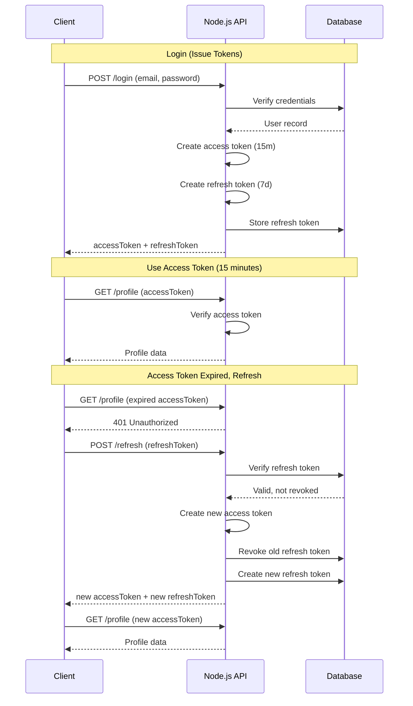
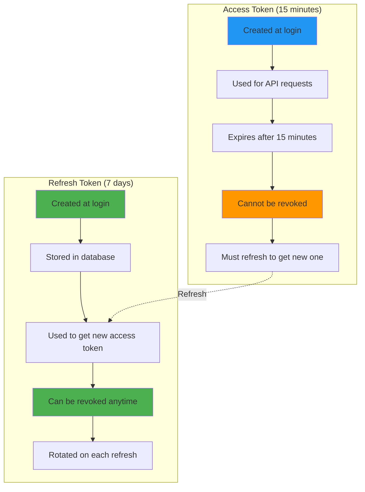
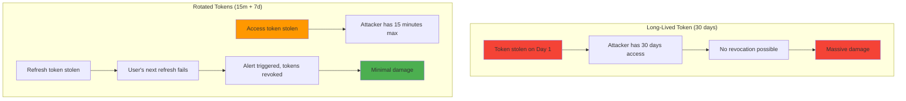
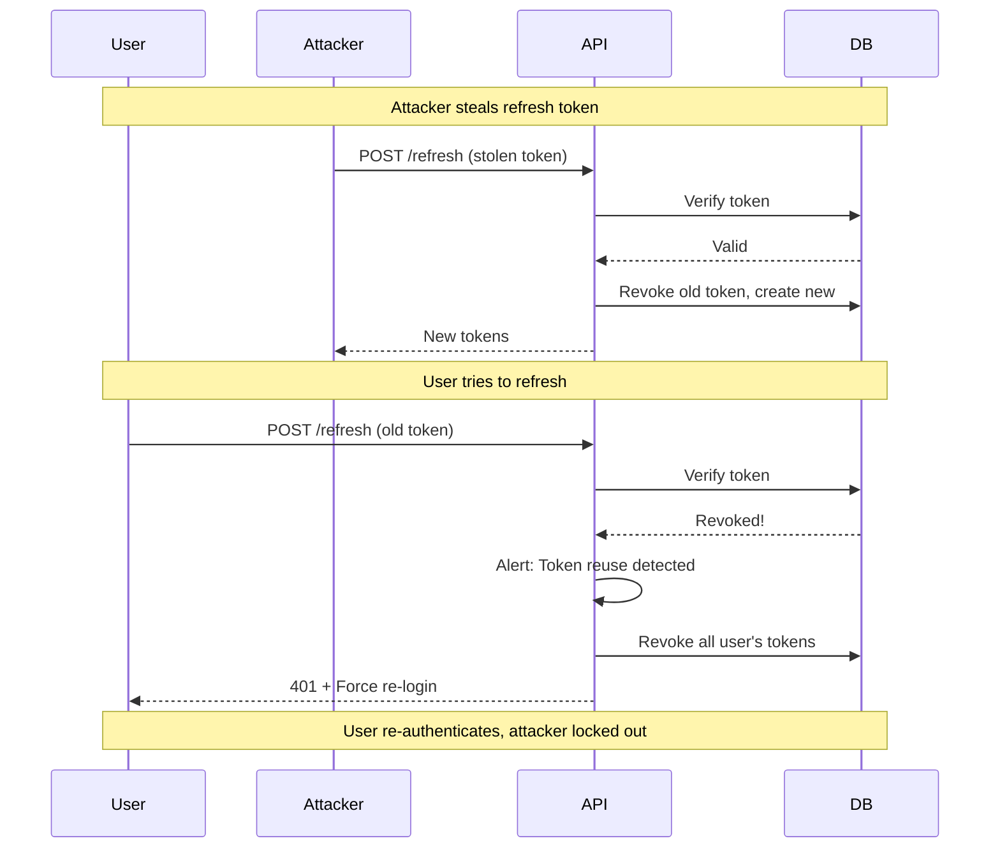

# Token rotation

## 1. Why this exists (Real-world problem first)

You're running a mobile banking app. Users log in once and stay logged in for weeks. You issue a JWT with 30-day expiration for convenience. What breaks:

- **Token theft**: Attacker steals token from compromised device. Token is valid for 30 days. Attacker has 30 days to drain accounts.
- **No revocation**: User reports suspicious activity. You delete their session from database, but JWT is still valid. Attacker continues accessing account.
- **Stale permissions**: User is demoted from admin to user. Their 30-day token still has admin role. They have admin access for 30 days.
- **Credential change ignored**: User changes password. Old tokens are still valid. Attacker who stole token before password change still has access.

Real pain: A SaaS platform issued 7-day JWTs. An employee's laptop was stolen. The attacker used the stolen token to exfiltrate customer data for 7 days before the token expired. The fix: implement token rotation with 15-minute access tokens and 7-day refresh tokens.

**Another scenario**: A fintech API used long-lived tokens (90 days). When they discovered a security breach, they couldn't revoke tokens without shutting down the entire system. They had to force all users to re-login, causing massive customer support load.

## 2. Mental model (build imagination)

Think of a hotel with room keys.

**Without rotation (long-lived token)**:
- You check in, get a key card valid for 30 days
- You lose the key card on day 5
- Thief has 25 days to access your room
- Hotel can't deactivate the key without your cooperation

**With rotation (access + refresh tokens)**:
- You check in, get two keys:
  - **Room key (access token)**: Valid for 1 hour, opens your room
  - **Master key (refresh token)**: Valid for 30 days, gets you a new room key
- Every hour, you go to the front desk, show master key, get a new room key
- You lose the room key: Thief has 1 hour max before it expires
- You lose the master key: You report it, hotel deactivates it, thief can't get new room keys

**Key insight**: Short-lived access tokens limit damage from theft. Long-lived refresh tokens enable convenience. Refresh tokens can be revoked.

## 3. How Node.js implements this internally

Token rotation involves two tokens: **access token** (short-lived, 15 minutes) and **refresh token** (long-lived, 7 days).

### Login flow (issue both tokens)

```javascript
const jwt = require('jsonwebtoken');
const crypto = require('crypto');

app.post('/login', async (req, res) => {
  const { email, password } = req.body;
  
  // Authenticate user
  const user = await db.query('SELECT * FROM users WHERE email = $1', [email]);
  const validPassword = await bcrypt.compare(password, user.rows[0].password_hash);
  
  if (!validPassword) {
    return res.status(401).json({ error: 'Invalid credentials' });
  }
  
  // Create access token (short-lived)
  const accessToken = jwt.sign(
    { userId: user.rows[0].id, role: user.rows[0].role },
    process.env.JWT_SECRET,
    { expiresIn: '15m' } // 15 minutes
  );
  
  // Create refresh token (long-lived)
  const refreshToken = crypto.randomBytes(64).toString('hex');
  
  // Store refresh token in database
  await db.query(`
    INSERT INTO refresh_tokens (user_id, token, expires_at)
    VALUES ($1, $2, NOW() + INTERVAL '7 days')
  `, [user.rows[0].id, refreshToken]);
  
  res.json({
    accessToken,
    refreshToken,
    expiresIn: 900, // 15 minutes in seconds
  });
});
```

**What happens**:
1. User authenticates with credentials
2. Server creates short-lived JWT (15 minutes)
3. Server creates random refresh token (opaque string)
4. Refresh token stored in database with expiration
5. Both tokens sent to client

**Event loop impact**: Database insert is async I/O. JWT signing is synchronous CPU work.

### Refresh flow (rotate access token)

```javascript
app.post('/refresh', async (req, res) => {
  const { refreshToken } = req.body;
  
  if (!refreshToken) {
    return res.status(401).json({ error: 'Refresh token required' });
  }
  
  // Verify refresh token exists and is not expired
  const tokenRecord = await db.query(`
    SELECT rt.*, u.role
    FROM refresh_tokens rt
    JOIN users u ON rt.user_id = u.id
    WHERE rt.token = $1 AND rt.expires_at > NOW() AND rt.revoked = false
  `, [refreshToken]);
  
  if (!tokenRecord.rows[0]) {
    return res.status(401).json({ error: 'Invalid or expired refresh token' });
  }
  
  // Create new access token
  const accessToken = jwt.sign(
    { userId: tokenRecord.rows[0].user_id, role: tokenRecord.rows[0].role },
    process.env.JWT_SECRET,
    { expiresIn: '15m' }
  );
  
  // Optional: Rotate refresh token (create new one, revoke old one)
  const newRefreshToken = crypto.randomBytes(64).toString('hex');
  
  await db.query('BEGIN');
  
  // Revoke old refresh token
  await db.query('UPDATE refresh_tokens SET revoked = true WHERE token = $1', [refreshToken]);
  
  // Create new refresh token
  await db.query(`
    INSERT INTO refresh_tokens (user_id, token, expires_at)
    VALUES ($1, $2, NOW() + INTERVAL '7 days')
  `, [tokenRecord.rows[0].user_id, newRefreshToken]);
  
  await db.query('COMMIT');
  
  res.json({
    accessToken,
    refreshToken: newRefreshToken,
    expiresIn: 900,
  });
});
```

**What happens**:
1. Client sends refresh token
2. Server verifies refresh token in database
3. Server creates new access token
4. Server optionally rotates refresh token (revoke old, create new)
5. New tokens sent to client

**Critical detail**: Refresh token rotation (revoking old, creating new) prevents replay attacks. If attacker steals refresh token and uses it, legitimate user's next refresh will fail, alerting them.

### Automatic token refresh in client

```javascript
// Client-side (React/Vue/etc.)
let accessToken = localStorage.getItem('accessToken');
let refreshToken = localStorage.getItem('refreshToken');

async function apiCall(url, options = {}) {
  // Add access token to request
  options.headers = {
    ...options.headers,
    Authorization: `Bearer ${accessToken}`,
  };
  
  let response = await fetch(url, options);
  
  // If access token expired, refresh it
  if (response.status === 401) {
    const refreshResponse = await fetch('/refresh', {
      method: 'POST',
      headers: { 'Content-Type': 'application/json' },
      body: JSON.stringify({ refreshToken }),
    });
    
    if (refreshResponse.ok) {
      const data = await refreshResponse.json();
      accessToken = data.accessToken;
      refreshToken = data.refreshToken;
      
      localStorage.setItem('accessToken', accessToken);
      localStorage.setItem('refreshToken', refreshToken);
      
      // Retry original request with new access token
      options.headers.Authorization = `Bearer ${accessToken}`;
      response = await fetch(url, options);
    } else {
      // Refresh token invalid, redirect to login
      window.location.href = '/login';
    }
  }
  
  return response;
}
```

## 4. Multiple diagrams (MANDATORY)

### Token rotation flow



### Access vs refresh token lifecycle



### Token theft scenarios



### Refresh token rotation



## 5. Where this is used in real projects

### Production token rotation implementation

```javascript
const express = require('express');
const jwt = require('jsonwebtoken');
const crypto = require('crypto');
const Redis = require('ioredis');

const app = express();
const redis = new Redis();

// Login: Issue access + refresh tokens
app.post('/login', async (req, res) => {
  const { email, password } = req.body;
  
  try {
    const user = await db.query('SELECT * FROM users WHERE email = $1', [email]);
    
    if (!user.rows[0]) {
      return res.status(401).json({ error: 'Invalid credentials' });
    }
    
    const validPassword = await bcrypt.compare(password, user.rows[0].password_hash);
    
    if (!validPassword) {
      return res.status(401).json({ error: 'Invalid credentials' });
    }
    
    // Create access token (15 minutes)
    const accessToken = jwt.sign(
      { 
        userId: user.rows[0].id, 
        role: user.rows[0].role,
        tokenVersion: user.rows[0].token_version, // For instant revocation
      },
      process.env.JWT_SECRET,
      { expiresIn: '15m', jwtid: crypto.randomUUID() }
    );
    
    // Create refresh token (opaque, random)
    const refreshToken = crypto.randomBytes(64).toString('hex');
    
    // Store refresh token in Redis (faster than database)
    await redis.setex(
      `refresh:${refreshToken}`,
      7 * 24 * 60 * 60, // 7 days in seconds
      JSON.stringify({
        userId: user.rows[0].id,
        createdAt: Date.now(),
        userAgent: req.headers['user-agent'],
        ip: req.ip,
      })
    );
    
    // Also store in database for audit
    await db.query(`
      INSERT INTO refresh_tokens (user_id, token, expires_at, user_agent, ip)
      VALUES ($1, $2, NOW() + INTERVAL '7 days', $3, $4)
    `, [user.rows[0].id, refreshToken, req.headers['user-agent'], req.ip]);
    
    res.json({
      accessToken,
      refreshToken,
      expiresIn: 900, // 15 minutes
      tokenType: 'Bearer',
    });
  } catch (err) {
    console.error('Login error:', err);
    res.status(500).json({ error: 'Internal server error' });
  }
});

// Refresh: Rotate tokens
app.post('/refresh', async (req, res) => {
  const { refreshToken } = req.body;
  
  if (!refreshToken) {
    return res.status(401).json({ error: 'Refresh token required' });
  }
  
  try {
    // Check Redis for refresh token
    const tokenData = await redis.get(`refresh:${refreshToken}`);
    
    if (!tokenData) {
      // Token reuse detected! Possible attack
      await logSecurityEvent('REFRESH_TOKEN_REUSE', { token: refreshToken, ip: req.ip });
      return res.status(401).json({ error: 'Invalid refresh token' });
    }
    
    const { userId, userAgent, ip } = JSON.parse(tokenData);
    
    // Verify user agent and IP (optional, for extra security)
    if (userAgent !== req.headers['user-agent'] || ip !== req.ip) {
      await logSecurityEvent('REFRESH_TOKEN_MISMATCH', { userId, ip: req.ip });
      // Optionally revoke all tokens
    }
    
    // Get user data
    const user = await db.query('SELECT id, role, token_version FROM users WHERE id = $1', [userId]);
    
    if (!user.rows[0]) {
      return res.status(401).json({ error: 'User not found' });
    }
    
    // Create new access token
    const newAccessToken = jwt.sign(
      { 
        userId: user.rows[0].id, 
        role: user.rows[0].role,
        tokenVersion: user.rows[0].token_version,
      },
      process.env.JWT_SECRET,
      { expiresIn: '15m', jwtid: crypto.randomUUID() }
    );
    
    // Rotate refresh token
    const newRefreshToken = crypto.randomBytes(64).toString('hex');
    
    // Revoke old refresh token (delete from Redis)
    await redis.del(`refresh:${refreshToken}`);
    
    // Store new refresh token
    await redis.setex(
      `refresh:${newRefreshToken}`,
      7 * 24 * 60 * 60,
      JSON.stringify({
        userId: user.rows[0].id,
        createdAt: Date.now(),
        userAgent: req.headers['user-agent'],
        ip: req.ip,
      })
    );
    
    // Update database
    await db.query('UPDATE refresh_tokens SET revoked = true WHERE token = $1', [refreshToken]);
    await db.query(`
      INSERT INTO refresh_tokens (user_id, token, expires_at, user_agent, ip)
      VALUES ($1, $2, NOW() + INTERVAL '7 days', $3, $4)
    `, [user.rows[0].id, newRefreshToken, req.headers['user-agent'], req.ip]);
    
    res.json({
      accessToken: newAccessToken,
      refreshToken: newRefreshToken,
      expiresIn: 900,
      tokenType: 'Bearer',
    });
  } catch (err) {
    console.error('Refresh error:', err);
    res.status(500).json({ error: 'Internal server error' });
  }
});

// Logout: Revoke refresh token
app.post('/logout', authenticate, async (req, res) => {
  const { refreshToken } = req.body;
  
  if (refreshToken) {
    await redis.del(`refresh:${refreshToken}`);
    await db.query('UPDATE refresh_tokens SET revoked = true WHERE token = $1', [refreshToken]);
  }
  
  res.json({ message: 'Logged out' });
});

// Revoke all tokens (e.g., on password change)
app.post('/revoke-all', authenticate, async (req, res) => {
  // Increment token version
  await db.query('UPDATE users SET token_version = token_version + 1 WHERE id = $1', [req.user.userId]);
  
  // Revoke all refresh tokens
  const tokens = await db.query('SELECT token FROM refresh_tokens WHERE user_id = $1 AND revoked = false', [req.user.userId]);
  
  for (const token of tokens.rows) {
    await redis.del(`refresh:${token.token}`);
  }
  
  await db.query('UPDATE refresh_tokens SET revoked = true WHERE user_id = $1', [req.user.userId]);
  
  res.json({ message: 'All tokens revoked' });
});
```

### Middleware with token version check

```javascript
function authenticate(req, res, next) {
  const token = req.headers.authorization?.substring(7);
  
  if (!token) {
    return res.status(401).json({ error: 'No token provided' });
  }
  
  try {
    const decoded = jwt.verify(token, process.env.JWT_SECRET);
    
    // Check token version (for instant revocation)
    db.query('SELECT token_version FROM users WHERE id = $1', [decoded.userId])
      .then(user => {
        if (!user.rows[0] || user.rows[0].token_version !== decoded.tokenVersion) {
          return res.status(401).json({ error: 'Token revoked' });
        }
        
        req.user = decoded;
        next();
      });
  } catch (err) {
    return res.status(401).json({ error: 'Invalid token' });
  }
}
```

### Sliding session (extend expiration on activity)

```javascript
app.post('/refresh', async (req, res) => {
  const { refreshToken } = req.body;
  
  const tokenData = await redis.get(`refresh:${refreshToken}`);
  
  if (!tokenData) {
    return res.status(401).json({ error: 'Invalid refresh token' });
  }
  
  const { userId, createdAt } = JSON.parse(tokenData);
  
  // Sliding session: Extend refresh token expiration if used recently
  const tokenAge = Date.now() - createdAt;
  const sevenDays = 7 * 24 * 60 * 60 * 1000;
  
  if (tokenAge < sevenDays) {
    // Extend expiration by 7 days from now
    await redis.expire(`refresh:${refreshToken}`, 7 * 24 * 60 * 60);
  }
  
  // Create new access token
  const user = await db.query('SELECT id, role FROM users WHERE id = $1', [userId]);
  const newAccessToken = jwt.sign(
    { userId: user.rows[0].id, role: user.rows[0].role },
    process.env.JWT_SECRET,
    { expiresIn: '15m' }
  );
  
  res.json({
    accessToken: newAccessToken,
    refreshToken, // Same refresh token, extended expiration
    expiresIn: 900,
  });
});
```

## 6. Where this should NOT be used

### Rotating tokens on every request

```javascript
// BAD: Rotating access token on every request
app.use((req, res, next) => {
  const token = req.headers.authorization?.substring(7);
  const decoded = jwt.verify(token, secret);
  
  // Create new token on every request
  const newToken = jwt.sign({ userId: decoded.userId }, secret, { expiresIn: '15m' });
  res.setHeader('X-New-Token', newToken);
  
  next();
});

// Problems:
// - Massive CPU overhead (signing tokens on every request)
// - Client must handle token updates on every response
// - Race conditions if multiple requests in flight
```

### Storing refresh tokens in localStorage

```javascript
// BAD: Refresh token in localStorage (vulnerable to XSS)
localStorage.setItem('refreshToken', refreshToken);

// GOOD: Refresh token in HttpOnly cookie
res.cookie('refreshToken', refreshToken, {
  httpOnly: true, // Not accessible via JavaScript
  secure: true,   // HTTPS only
  sameSite: 'strict',
  maxAge: 7 * 24 * 60 * 60 * 1000, // 7 days
});
```

### Not rotating refresh tokens

```javascript
// BAD: Reusing same refresh token forever
app.post('/refresh', async (req, res) => {
  const { refreshToken } = req.body;
  const valid = await verifyRefreshToken(refreshToken);
  
  if (valid) {
    const newAccessToken = createAccessToken(valid.userId);
    res.json({ accessToken: newAccessToken, refreshToken }); // Same refresh token!
  }
});

// Problem: If refresh token is stolen, attacker can use it indefinitely
```

### Very short access tokens (< 5 minutes)

```javascript
// BAD: 1-minute access token
const accessToken = jwt.sign({ userId: 123 }, secret, { expiresIn: '1m' });

// Problems:
// - Client must refresh every minute (high load on server)
// - Poor user experience (frequent interruptions)
// - Doesn't significantly improve security vs 15 minutes
```

## 7. Failure modes & edge cases

### Refresh token reuse (replay attack)

**Scenario**: Attacker steals refresh token, uses it to get new tokens. Legitimate user also uses the same refresh token.

**Impact**: Both attacker and user have valid tokens.

**Solution**: Rotate refresh tokens. When refresh token is used, revoke it and issue a new one. If old token is used again, detect reuse and revoke all user's tokens.

### Clock skew between servers

**Scenario**: Server A issues access token at 12:00:00 with 15-minute expiration. Server B's clock is 12:00:30 (30 seconds ahead). Token appears expired to Server B.

**Impact**: User gets 401 errors intermittently.

**Solution**: Use `clockTolerance` in JWT verification, or use NTP to sync server clocks.

### Concurrent refresh requests

**Scenario**: Client makes two API requests simultaneously. Both get 401 (token expired). Both send refresh requests.

**Impact**: First refresh succeeds, rotates token. Second refresh fails (old token revoked).

**Solution**: Implement refresh token grace period or use locking.

```javascript
// Grace period: Allow old refresh token for 30 seconds after rotation
await redis.setex(`refresh:${oldRefreshToken}:grace`, 30, newRefreshToken);

// On refresh, check if token is in grace period
const graceToken = await redis.get(`refresh:${refreshToken}:grace`);
if (graceToken) {
  // Old token used during grace period, return the new token
  return res.json({ accessToken, refreshToken: graceToken });
}
```

### Token version increment race condition

**Scenario**: User changes password (increments token version). Concurrent request uses old access token with old version.

**Impact**: Request fails even though it was initiated before password change.

**Solution**: Use eventual consistency—allow old token version for a short grace period (30 seconds).

### Refresh token not revoked on logout

**Scenario**: User logs out, but refresh token is not revoked. Attacker who stole refresh token can still get new access tokens.

**Impact**: Logout doesn't actually log user out.

**Solution**: Always revoke refresh token on logout.

## 8. Trade-offs & alternatives

### What you gain
- **Security**: Short-lived access tokens limit damage from theft
- **Revocation**: Refresh tokens can be revoked instantly
- **Auditability**: Track refresh token usage (IP, user agent, timestamps)

### What you sacrifice
- **Complexity**: Must implement refresh endpoint, token rotation, storage
- **Performance**: Refresh requests add load (database/Redis lookups)
- **State**: Refresh tokens require storage (not stateless like pure JWT)

### Alternatives

**Sliding sessions**
- **Use case**: Extend session on activity
- **Benefit**: User stays logged in as long as they're active
- **Trade-off**: Can't revoke without blacklist

**Short-lived tokens without refresh**
- **Use case**: High-security apps (banking)
- **Benefit**: Simpler, no refresh mechanism
- **Trade-off**: User must re-login frequently (poor UX)

**Long-lived tokens with blacklist**
- **Use case**: Low-security apps
- **Benefit**: Simpler, no refresh mechanism
- **Trade-off**: Blacklist grows unbounded, can't scale

**OAuth 2.0 refresh tokens**
- **Use case**: Third-party authentication
- **Benefit**: Standard protocol, well-tested
- **Trade-off**: More complex flow

## 9. Interview-level articulation

**Question**: "What is token rotation and why is it important?"

**Weak answer**: "Token rotation is when you change tokens periodically."

**Strong answer**: "Token rotation is a security pattern where you use two tokens: a short-lived access token (15 minutes) and a long-lived refresh token (7 days). The access token is used for API requests. When it expires, the client uses the refresh token to get a new access token. Critically, the refresh token is also rotated—when used, it's revoked and a new one is issued. This limits damage from token theft: if an access token is stolen, the attacker has 15 minutes max. If a refresh token is stolen and used, the legitimate user's next refresh will fail, alerting them. I implement this with JWT for access tokens and opaque tokens stored in Redis for refresh tokens."

**Follow-up**: "How do you detect refresh token reuse?"

**Answer**: "When a refresh token is used, I immediately revoke it and issue a new one. If the old token is used again, it's a sign of token theft—either the attacker or the legitimate user is using a revoked token. When I detect reuse, I revoke all the user's tokens and force re-authentication. To handle legitimate concurrent requests, I implement a 30-second grace period where the old token can be used once more, returning the new token. This prevents false positives from race conditions."

**Follow-up**: "Where do you store refresh tokens and why?"

**Answer**: "I store refresh tokens in Redis for fast lookups and automatic expiration via TTL. I also log them to the database for audit trails. On the client, I store refresh tokens in HttpOnly cookies to prevent XSS attacks—JavaScript can't access them. Access tokens can be in memory or localStorage since they're short-lived. The key is that refresh tokens are more sensitive (long-lived, can get new access tokens) so they need stronger protection."

## 10. Key takeaways (engineer mindset)

**What to remember**:
- **Access tokens: short-lived (15m), stateless, used for API requests**
- **Refresh tokens: long-lived (7d), stateful, used to get new access tokens**
- **Always rotate refresh tokens** when used (revoke old, issue new)
- **Detect token reuse** as a sign of theft
- **Revoke all tokens on password change** or suspicious activity

**What decisions this enables**:
- Choosing access token expiration time (balance security vs UX)
- Implementing refresh token storage (Redis vs database)
- Designing token revocation strategies
- Handling concurrent refresh requests

**How it connects to other Node.js concepts**:
- **Redis**: Fast storage for refresh tokens with automatic expiration
- **Database transactions**: Atomic token rotation (revoke old, create new)
- **Middleware**: Access token verification in every protected route
- **Error handling**: Distinguish 401 (expired token) from 403 (revoked token)
- **Observability**: Log refresh token usage, detect anomalies (IP changes, user agent changes)
