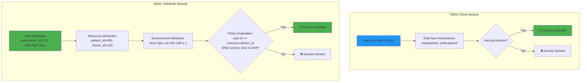
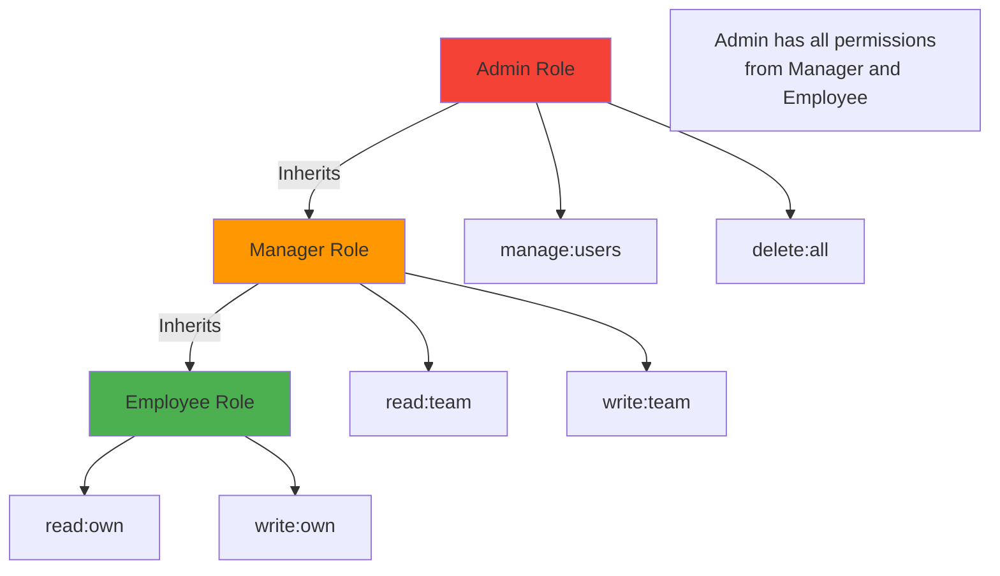
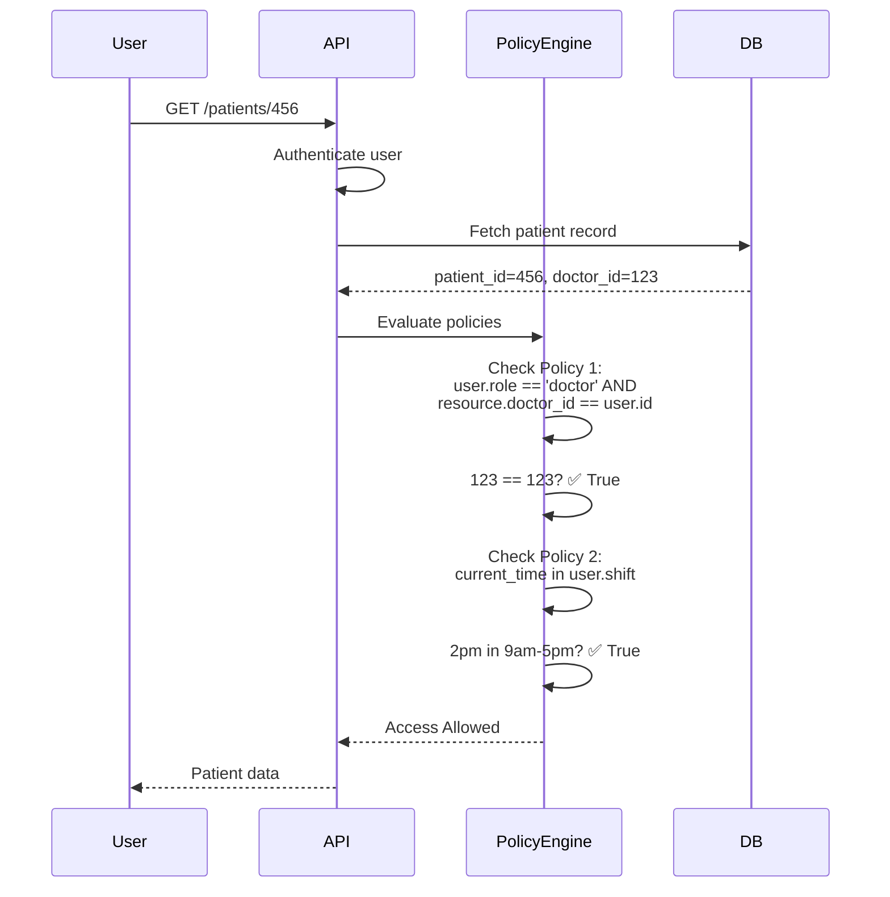
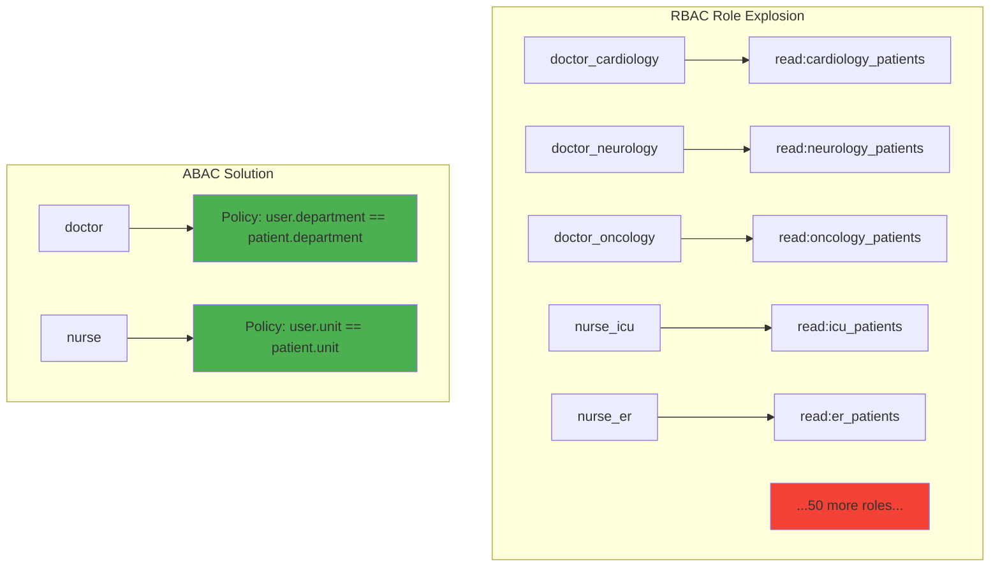

# RBAC vs ABAC

## 1. Why this exists (Real-world problem first)

You're running a healthcare platform with doctors, nurses, patients, and admins. Without proper access control:
- **Doctor accesses wrong patient**: Doctor can view any patient's records, not just their own patients. HIPAA violation, $50M fine.
- **Nurse deletes critical data**: Nurse has same permissions as doctor, accidentally deletes patient records.
- **Patient edits medical history**: Patient can modify their own diagnosis, creating liability issues.
- **Admin can't audit access**: No way to track who accessed what, when, and why.

**Role-Based Access Control (RBAC)** breaks when:
- **Role explosion**: You need 50 roles (doctor_cardiology, doctor_neurology, nurse_icu, nurse_er, etc.). Managing 50 roles is a nightmare.
- **Context-dependent access**: Doctor can view patient records, but only during their shift, only for patients in their department, only if patient consented.
- **Dynamic permissions**: Patient can share records with specific doctors for 30 days. RBAC can't handle time-based or relationship-based permissions.

**Attribute-Based Access Control (ABAC)** solves this but adds complexity:
- **Policy evaluation overhead**: Every request evaluates complex policies (user attributes, resource attributes, environment attributes). Slow.
- **Policy conflicts**: Two policies contradict each other. Which takes precedence?
- **Debugging nightmares**: "Why can't I access this file?" requires tracing through 20 policies.

Real pain: A fintech platform used RBAC with 100+ roles. Adding a new permission required updating 20 roles. They switched to ABAC with policies like "user.department == resource.department AND user.clearance >= resource.sensitivity". Policy count dropped from 100 to 10.

## 2. Mental model (build imagination)

Think of a corporate office building.

**RBAC (Role-Based Access Control)**:
- **Roles**: Employee, Manager, Executive, Security Guard
- **Permissions**: Each role has fixed permissions
  - Employee: Enter office, use meeting rooms
  - Manager: Enter office, use meeting rooms, access manager lounge
  - Executive: Enter office, use meeting rooms, access manager lounge, access executive suite
- **Simple**: Check badge, see role, grant access
- **Limitation**: Can't handle "Employee can access meeting room only if they booked it"

**ABAC (Attribute-Based Access Control)**:
- **Attributes**: User (department, clearance level), Resource (sensitivity, owner), Environment (time, location)
- **Policies**: Access granted if attributes match
  - "User can access file if user.department == file.department AND user.clearance >= file.sensitivity"
  - "User can access meeting room if user.id == booking.user_id AND current_time >= booking.start_time"
- **Flexible**: Handles complex, context-dependent access
- **Limitation**: Complex to implement, slower to evaluate

**Key insight**: RBAC is simple but rigid. ABAC is flexible but complex. Choose based on your needs.

## 3. How Node.js implements this internally

### RBAC implementation

```javascript
const express = require('express');
const app = express();

// Define roles and permissions
const ROLES = {
  admin: ['read:all', 'write:all', 'delete:all', 'manage:users'],
  manager: ['read:team', 'write:team', 'read:reports'],
  employee: ['read:own', 'write:own'],
};

// Middleware: Check if user has required permission
function requirePermission(permission) {
  return (req, res, next) => {
    const userPermissions = ROLES[req.user.role] || [];
    
    if (!userPermissions.includes(permission)) {
      return res.status(403).json({ 
        error: 'Forbidden', 
        required: permission,
        userRole: req.user.role,
        userPermissions,
      });
    }
    
    next();
  };
}

// Routes
app.get('/api/users', authenticate, requirePermission('read:all'), async (req, res) => {
  const users = await db.query('SELECT * FROM users');
  res.json(users.rows);
});

app.delete('/api/users/:id', authenticate, requirePermission('delete:all'), async (req, res) => {
  await db.query('DELETE FROM users WHERE id = $1', [req.params.id]);
  res.json({ message: 'User deleted' });
});
```

**What happens**:
1. User makes request with JWT (contains role)
2. `authenticate` middleware verifies JWT, attaches `req.user`
3. `requirePermission` middleware checks if user's role has required permission
4. If yes, route handler executes. If no, 403 Forbidden.

**Event loop impact**: Permission check is synchronous (array lookup). Fast.

### ABAC implementation

```javascript
// Define policies
const policies = [
  {
    name: 'DoctorCanViewOwnPatients',
    effect: 'allow',
    actions: ['read:patient'],
    condition: (user, resource, env) => {
      return user.role === 'doctor' && resource.doctor_id === user.id;
    },
  },
  {
    name: 'DoctorCanViewDuringShift',
    effect: 'allow',
    actions: ['read:patient'],
    condition: (user, resource, env) => {
      const now = new Date();
      const shiftStart = new Date(user.shift_start);
      const shiftEnd = new Date(user.shift_end);
      return user.role === 'doctor' && now >= shiftStart && now <= shiftEnd;
    },
  },
  {
    name: 'PatientCanViewOwnRecords',
    effect: 'allow',
    actions: ['read:patient'],
    condition: (user, resource, env) => {
      return user.role === 'patient' && resource.patient_id === user.id;
    },
  },
];

// Policy engine
function evaluatePolicies(user, action, resource, env = {}) {
  for (const policy of policies) {
    if (policy.actions.includes(action)) {
      if (policy.condition(user, resource, env)) {
        return policy.effect === 'allow';
      }
    }
  }
  return false; // Deny by default
}

// Middleware: ABAC authorization
function authorizeABAC(action) {
  return async (req, res, next) => {
    // Get resource (e.g., patient record)
    const resource = await db.query('SELECT * FROM patients WHERE id = $1', [req.params.id]);
    
    if (!resource.rows[0]) {
      return res.status(404).json({ error: 'Resource not found' });
    }
    
    // Evaluate policies
    const allowed = evaluatePolicies(req.user, action, resource.rows[0], { ip: req.ip, time: new Date() });
    
    if (!allowed) {
      return res.status(403).json({ error: 'Access denied by policy' });
    }
    
    req.resource = resource.rows[0];
    next();
  };
}

// Route
app.get('/api/patients/:id', authenticate, authorizeABAC('read:patient'), async (req, res) => {
  res.json(req.resource);
});
```

**What happens**:
1. User makes request
2. `authenticate` middleware verifies JWT
3. `authorizeABAC` middleware fetches resource from database
4. Policy engine evaluates all policies, checking conditions
5. If any policy allows, access granted. Otherwise, 403 Forbidden.

**Event loop impact**: Database query (async I/O), policy evaluation (synchronous). Slower than RBAC due to database lookup.

## 4. Multiple diagrams (MANDATORY)

### RBAC vs ABAC comparison



### RBAC permission hierarchy



### ABAC policy evaluation flow



### RBAC role explosion problem



## 5. Where this is used in real projects

### RBAC with hierarchical roles

```javascript
const express = require('express');
const app = express();

// Role hierarchy (admin inherits from manager, manager inherits from employee)
const ROLE_HIERARCHY = {
  admin: ['admin', 'manager', 'employee'],
  manager: ['manager', 'employee'],
  employee: ['employee'],
};

// Permissions per role
const PERMISSIONS = {
  admin: ['manage:users', 'delete:all', 'read:all', 'write:all'],
  manager: ['read:team', 'write:team', 'read:reports'],
  employee: ['read:own', 'write:own'],
};

// Get all permissions for a user (including inherited)
function getUserPermissions(userRole) {
  const roles = ROLE_HIERARCHY[userRole] || [userRole];
  const permissions = new Set();
  
  for (const role of roles) {
    const rolePermissions = PERMISSIONS[role] || [];
    rolePermissions.forEach(p => permissions.add(p));
  }
  
  return Array.from(permissions);
}

// Middleware
function requirePermission(permission) {
  return (req, res, next) => {
    const userPermissions = getUserPermissions(req.user.role);
    
    if (!userPermissions.includes(permission)) {
      return res.status(403).json({ error: 'Forbidden' });
    }
    
    next();
  };
}

// Routes
app.get('/api/users', authenticate, requirePermission('read:all'), async (req, res) => {
  const users = await db.query('SELECT * FROM users');
  res.json(users.rows);
});
```

### ABAC with policy engine

```javascript
const { Enforcer } = require('casbin');

// Load policies from file or database
const enforcer = await Enforcer.newEnforcer('model.conf', 'policy.csv');

// model.conf (ABAC model)
// [request_definition]
// r = sub, obj, act
//
// [policy_definition]
// p = sub_rule, obj_rule, act_rule
//
// [policy_effect]
// e = some(where (p.eft == allow))
//
// [matchers]
// m = eval(p.sub_rule) && eval(p.obj_rule) && eval(p.act_rule)

// policy.csv (policies)
// p, r.sub.role == "doctor" && r.sub.id == r.obj.doctor_id, r.obj.type == "patient", r.act == "read"
// p, r.sub.role == "patient" && r.sub.id == r.obj.patient_id, r.obj.type == "patient", r.act == "read"

// Middleware
async function authorizeABAC(action) {
  return async (req, res, next) => {
    const resource = await db.query('SELECT * FROM patients WHERE id = $1', [req.params.id]);
    
    if (!resource.rows[0]) {
      return res.status(404).json({ error: 'Not found' });
    }
    
    const allowed = await enforcer.enforce(
      { role: req.user.role, id: req.user.id }, // subject
      { type: 'patient', ...resource.rows[0] },  // object
      action                                      // action
    );
    
    if (!allowed) {
      return res.status(403).json({ error: 'Access denied' });
    }
    
    req.resource = resource.rows[0];
    next();
  };
}

app.get('/api/patients/:id', authenticate, authorizeABAC('read'), async (req, res) => {
  res.json(req.resource);
});
```

### Hybrid RBAC + ABAC

```javascript
// Use RBAC for coarse-grained access, ABAC for fine-grained
function authorize(action) {
  return async (req, res, next) => {
    // Step 1: RBAC check (fast, coarse-grained)
    const userPermissions = getUserPermissions(req.user.role);
    const basePermission = action.split(':')[0] + ':*'; // e.g., 'read:*'
    
    if (!userPermissions.includes(action) && !userPermissions.includes(basePermission)) {
      return res.status(403).json({ error: 'Forbidden: insufficient role permissions' });
    }
    
    // Step 2: ABAC check (slower, fine-grained)
    const resource = await db.query('SELECT * FROM resources WHERE id = $1', [req.params.id]);
    
    if (!resource.rows[0]) {
      return res.status(404).json({ error: 'Not found' });
    }
    
    // Check resource-specific policies
    const allowed = evaluatePolicies(req.user, action, resource.rows[0]);
    
    if (!allowed) {
      return res.status(403).json({ error: 'Access denied by policy' });
    }
    
    req.resource = resource.rows[0];
    next();
  };
}
```

### Time-based access with ABAC

```javascript
const policies = [
  {
    name: 'DoctorDuringShift',
    effect: 'allow',
    actions: ['read:patient', 'write:patient'],
    condition: (user, resource, env) => {
      if (user.role !== 'doctor') return false;
      
      const now = env.time || new Date();
      const shiftStart = new Date(user.shift_start);
      const shiftEnd = new Date(user.shift_end);
      
      return now >= shiftStart && now <= shiftEnd;
    },
  },
  {
    name: 'EmergencyOverride',
    effect: 'allow',
    actions: ['read:patient', 'write:patient'],
    condition: (user, resource, env) => {
      // Emergency personnel can access during emergencies
      return user.role === 'emergency' && resource.status === 'emergency';
    },
  },
];
```

### Department-based access

```javascript
const policies = [
  {
    name: 'SameDepartmentAccess',
    effect: 'allow',
    actions: ['read:document'],
    condition: (user, resource, env) => {
      return user.department === resource.department;
    },
  },
  {
    name: 'ManagerCrossDepartment',
    effect: 'allow',
    actions: ['read:document'],
    condition: (user, resource, env) => {
      return user.role === 'manager' && user.clearance >= resource.sensitivity;
    },
  },
];
```

## 6. Where this should NOT be used

### RBAC for complex, context-dependent access

```javascript
// BAD: Creating 100 roles for every combination
const ROLES = {
  doctor_cardiology_morning: [...],
  doctor_cardiology_evening: [...],
  doctor_neurology_morning: [...],
  // 100 more roles...
};

// GOOD: Use ABAC with policies
const policies = [
  {
    condition: (user, resource, env) => {
      return user.role === 'doctor' && 
             user.department === resource.department &&
             isWithinShift(user, env.time);
    },
  },
];
```

### ABAC for simple, static permissions

```javascript
// BAD: Using ABAC for simple admin check
const policies = [
  {
    condition: (user, resource, env) => {
      return user.role === 'admin';
    },
  },
];

// GOOD: Use RBAC
if (req.user.role !== 'admin') {
  return res.status(403).json({ error: 'Forbidden' });
}
```

### Evaluating policies on every request without caching

```javascript
// BAD: Fetching resource and evaluating policies on every request
app.get('/api/documents/:id', async (req, res) => {
  const resource = await db.query('SELECT * FROM documents WHERE id = $1', [req.params.id]);
  const allowed = evaluatePolicies(req.user, 'read', resource.rows[0]);
  // Slow: database query + policy evaluation on every request
});

// GOOD: Cache policy decisions
const policyCache = new LRU({ max: 10000, ttl: 60000 }); // 1-minute TTL

app.get('/api/documents/:id', async (req, res) => {
  const cacheKey = `${req.user.id}:${req.params.id}:read`;
  let allowed = policyCache.get(cacheKey);
  
  if (allowed === undefined) {
    const resource = await db.query('SELECT * FROM documents WHERE id = $1', [req.params.id]);
    allowed = evaluatePolicies(req.user, 'read', resource.rows[0]);
    policyCache.set(cacheKey, allowed);
  }
  
  if (!allowed) {
    return res.status(403).json({ error: 'Forbidden' });
  }
  
  // Proceed...
});
```

## 7. Failure modes & edge cases

### Policy conflicts

**Scenario**: Two policies contradict each other. Policy 1 allows, Policy 2 denies.

**Impact**: Unclear which policy takes precedence.

**Solution**: Define policy precedence (e.g., deny always wins, or first match wins).

```javascript
function evaluatePolicies(user, action, resource, env) {
  let allowPolicies = [];
  let denyPolicies = [];
  
  for (const policy of policies) {
    if (policy.actions.includes(action) && policy.condition(user, resource, env)) {
      if (policy.effect === 'allow') {
        allowPolicies.push(policy);
      } else if (policy.effect === 'deny') {
        denyPolicies.push(policy);
      }
    }
  }
  
  // Deny takes precedence
  if (denyPolicies.length > 0) return false;
  if (allowPolicies.length > 0) return true;
  
  return false; // Default deny
}
```

### Role hierarchy loops

**Scenario**: Admin inherits from Manager, Manager inherits from Admin (circular dependency).

**Impact**: Infinite loop when resolving permissions.

**Solution**: Detect cycles in role hierarchy.

```javascript
function getUserPermissions(userRole, visited = new Set()) {
  if (visited.has(userRole)) {
    throw new Error(`Circular role dependency detected: ${userRole}`);
  }
  
  visited.add(userRole);
  
  const roles = ROLE_HIERARCHY[userRole] || [userRole];
  const permissions = new Set();
  
  for (const role of roles) {
    const rolePermissions = PERMISSIONS[role] || [];
    rolePermissions.forEach(p => permissions.add(p));
  }
  
  return Array.from(permissions);
}
```

### Attribute staleness

**Scenario**: User's department changes in database. ABAC policy still uses old department from JWT.

**Impact**: User has access to old department's resources.

**Solution**: Use short-lived JWTs, or fetch fresh attributes from database.

```javascript
async function authorizeABAC(action) {
  return async (req, res, next) => {
    // Fetch fresh user attributes from database
    const user = await db.query('SELECT * FROM users WHERE id = $1', [req.user.userId]);
    
    const resource = await db.query('SELECT * FROM resources WHERE id = $1', [req.params.id]);
    
    const allowed = evaluatePolicies(user.rows[0], action, resource.rows[0]);
    
    if (!allowed) {
      return res.status(403).json({ error: 'Forbidden' });
    }
    
    next();
  };
}
```

### Performance degradation with many policies

**Scenario**: 1000 policies, each evaluated on every request.

**Impact**: Policy evaluation takes 100ms, slowing down all requests.

**Solution**: Index policies by action, use early termination.

```javascript
// Index policies by action
const policyIndex = {};
for (const policy of policies) {
  for (const action of policy.actions) {
    if (!policyIndex[action]) policyIndex[action] = [];
    policyIndex[action].push(policy);
  }
}

function evaluatePolicies(user, action, resource, env) {
  const relevantPolicies = policyIndex[action] || [];
  
  for (const policy of relevantPolicies) {
    if (policy.condition(user, resource, env)) {
      return policy.effect === 'allow'; // Early termination
    }
  }
  
  return false;
}
```

## 8. Trade-offs & alternatives

### What you gain (RBAC)
- **Simplicity**: Easy to understand and implement
- **Performance**: Fast permission checks (array lookup)
- **Auditability**: Clear role assignments

### What you sacrifice (RBAC)
- **Flexibility**: Can't handle context-dependent access
- **Role explosion**: Need many roles for complex permissions
- **Maintenance**: Updating permissions requires updating roles

### What you gain (ABAC)
- **Flexibility**: Handles complex, context-dependent access
- **Granularity**: Fine-grained control (user, resource, environment attributes)
- **Scalability**: Fewer policies than RBAC roles

### What you sacrifice (ABAC)
- **Complexity**: Harder to implement and debug
- **Performance**: Slower (database lookups, policy evaluation)
- **Auditability**: Harder to trace why access was granted/denied

### Alternatives

**ACL (Access Control Lists)**
- **Use case**: Simple, resource-specific permissions
- **Benefit**: Easy to understand (list of users per resource)
- **Trade-off**: Doesn't scale (must update ACL for every resource)

**ReBAC (Relationship-Based Access Control)**
- **Use case**: Social networks, collaborative apps
- **Benefit**: Permissions based on relationships (friend, follower, team member)
- **Trade-off**: Complex graph queries

**PBAC (Policy-Based Access Control)**
- **Use case**: Similar to ABAC, but policies are more declarative
- **Benefit**: Policies can be stored in database, updated dynamically
- **Trade-off**: Requires policy engine (e.g., Open Policy Agent)

## 9. Interview-level articulation

**Question**: "What's the difference between RBAC and ABAC?"

**Weak answer**: "RBAC uses roles, ABAC uses attributes."

**Strong answer**: "RBAC (Role-Based Access Control) assigns permissions to roles, and users are assigned roles. For example, an 'admin' role has 'delete:all' permission. It's simple and fast—just check if the user's role has the required permission. ABAC (Attribute-Based Access Control) evaluates policies based on user attributes, resource attributes, and environment attributes. For example, 'user can access document if user.department == document.department AND user.clearance >= document.sensitivity'. ABAC is more flexible—it handles context-dependent access like time, location, or relationships. The trade-off is complexity and performance. I use RBAC for coarse-grained access (admin vs user) and ABAC for fine-grained access (department-specific, time-based)."

**Follow-up**: "When would you use ABAC over RBAC?"

**Answer**: "I'd use ABAC when permissions depend on context or relationships. For example, in a healthcare app, a doctor can view patient records only if the patient is assigned to them, only during their shift, and only if the patient consented. RBAC can't handle this—you'd need thousands of roles. With ABAC, I'd write policies like 'user.role == doctor AND resource.doctor_id == user.id AND current_time in user.shift'. Another use case is multi-tenant SaaS: users can only access resources in their tenant. ABAC policy: 'user.tenant_id == resource.tenant_id'. The trade-off is performance—ABAC requires fetching resource attributes from the database, which is slower than RBAC's in-memory role check."

**Follow-up**: "How do you handle policy conflicts in ABAC?"

**Answer**: "Policy conflicts happen when one policy allows and another denies the same action. I use a precedence rule: deny always wins. If any policy denies access, access is denied, even if other policies allow it. This is the principle of least privilege—err on the side of security. I also implement policy ordering: policies are evaluated in order, and the first matching policy's effect is used. For complex systems, I use a policy engine like Casbin or Open Policy Agent, which has built-in conflict resolution. I also log policy evaluations for debugging—if access is denied unexpectedly, I can trace which policy denied it."

## 10. Key takeaways (engineer mindset)

**What to remember**:
- **RBAC = simple, fast, rigid** (good for coarse-grained access)
- **ABAC = flexible, slow, complex** (good for fine-grained access)
- **Use RBAC for static permissions** (admin, manager, user)
- **Use ABAC for context-dependent permissions** (department, time, relationships)
- **Hybrid approach**: RBAC for coarse-grained, ABAC for fine-grained

**What decisions this enables**:
- Choosing between RBAC, ABAC, or hybrid
- Designing role hierarchies and permission structures
- Implementing policy engines and caching strategies
- Handling policy conflicts and attribute staleness

**How it connects to other Node.js concepts**:
- **Middleware**: Authorization checks are implemented as middleware
- **Database**: ABAC requires fetching resource attributes (async I/O)
- **Caching**: Cache policy decisions to improve performance
- **Error handling**: Distinguish 403 (forbidden) from 404 (not found)
- **Observability**: Log authorization decisions for auditing and debugging
