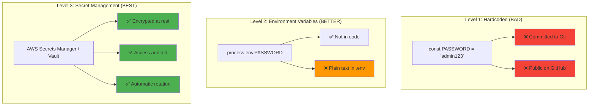
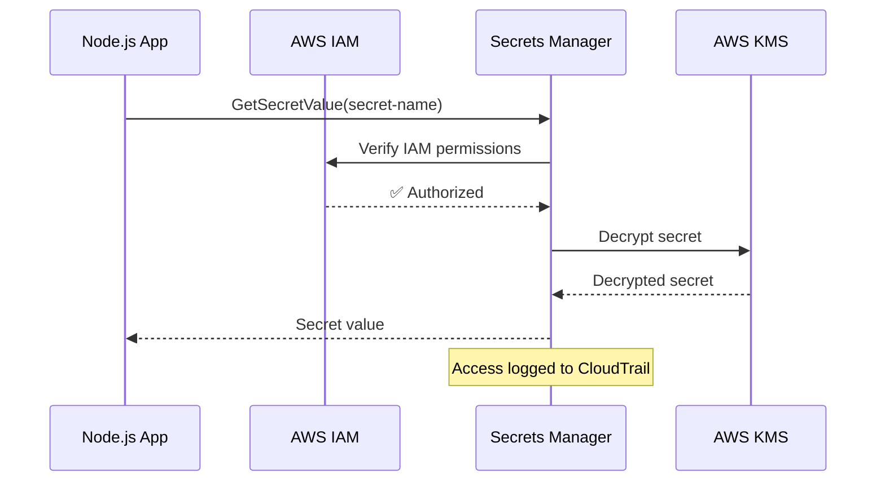
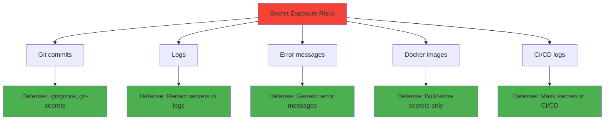

# Secrets management

## 1. Why this exists (Real-world problem first)

You're deploying a Node.js app that needs database credentials, API keys, and JWT secrets. What breaks:

- **Hardcoded secrets**: `const DB_PASSWORD = 'admin123'` in code. Committed to GitHub. Anyone can access your database.
- **Environment variables in logs**: `console.log(process.env)` logs all secrets. Attacker reads logs, gets credentials.
- **Secrets in Docker images**: `ENV DB_PASSWORD=admin123` in Dockerfile. Image pushed to Docker Hub. Secrets exposed.
- **Secrets in CI/CD logs**: GitHub Actions logs show `DB_PASSWORD=admin123`. Public repo = public secrets.
- **No rotation**: Database password hasn't changed in 3 years. Former employee still has access.

Real pain: A startup hardcoded AWS keys in their codebase. Keys were committed to a public GitHub repo. Within 24 hours, attackers spun up 100 EC2 instances for crypto mining. AWS bill: $50,000. The fix: AWS Secrets Manager + key rotation + never commit secrets.

**Another scenario**: A SaaS company stored API keys in `.env` file, committed it to Git. A security researcher found it, reported it. Company had to rotate all API keys, notify customers. The fix: `.gitignore` for `.env`, use secret management service.

## 2. Mental model (build imagination)

Think of secrets as **keys to your house**.

**Bad practice (hardcoded)**:
- You write your house key code on a sticky note, leave it on your front door
- Anyone can copy it and enter your house

**Better practice (environment variables)**:
- You keep the key in your pocket
- Only you have access
- **Problem**: If you lose your jacket, key is gone. If you write it down, it might be found.

**Best practice (secret management service)**:
- You keep the key in a safe deposit box at a bank
- Only you can access it with your ID and fingerprint
- Bank logs every access
- You can change the key anytime, old keys are revoked

**Key insight**: Secrets should be **stored separately** from code, **encrypted at rest**, **rotated regularly**, and **access should be audited**.

## 3. How Node.js implements this internally

### Environment variables (basic)

```javascript
// .env file (NOT committed to Git)
DB_HOST=localhost
DB_PASSWORD=secret123
JWT_SECRET=supersecret

// Load with dotenv
require('dotenv').config();

const dbPassword = process.env.DB_PASSWORD;
const jwtSecret = process.env.JWT_SECRET;
```

**What happens**:
1. `dotenv` reads `.env` file
2. Parses key-value pairs
3. Sets `process.env.DB_PASSWORD`, `process.env.JWT_SECRET`
4. Application reads from `process.env`

**Limitation**: Secrets are in plain text in `.env` file. If file is leaked, secrets are exposed.

### AWS Secrets Manager (production)

```javascript
const AWS = require('aws-sdk');
const secretsManager = new AWS.SecretsManager({ region: 'us-east-1' });

async function getSecret(secretName) {
  try {
    const data = await secretsManager.getSecretValue({ SecretId: secretName }).promise();
    
    if ('SecretString' in data) {
      return JSON.parse(data.SecretString);
    } else {
      const buff = Buffer.from(data.SecretBinary, 'base64');
      return JSON.parse(buff.toString('ascii'));
    }
  } catch (err) {
    console.error('Error retrieving secret:', err);
    throw err;
  }
}

// Usage
(async () => {
  const dbCreds = await getSecret('prod/db/credentials');
  const db = new Pool({
    host: dbCreds.host,
    user: dbCreds.username,
    password: dbCreds.password,
  });
})();
```

**What happens**:
1. Application requests secret from AWS Secrets Manager
2. AWS verifies IAM permissions
3. AWS returns encrypted secret
4. Application decrypts secret (AWS SDK handles this)
5. Application uses secret

**Benefit**: Secrets are encrypted at rest, access is audited, rotation is automated.

### HashiCorp Vault (advanced)

```javascript
const vault = require('node-vault')({
  endpoint: 'http://vault:8200',
  token: process.env.VAULT_TOKEN,
});

async function getSecret(path) {
  try {
    const result = await vault.read(path);
    return result.data;
  } catch (err) {
    console.error('Vault error:', err);
    throw err;
  }
}

// Usage
(async () => {
  const dbCreds = await getSecret('secret/data/database');
  console.log(dbCreds.data.password);
})();
```

## 4. Multiple diagrams (MANDATORY)

### Secrets management evolution



### AWS Secrets Manager flow



### Secret rotation


### Secret exposure risks



## 5. Where this is used in real projects

### Production secrets management with AWS

```javascript
const AWS = require('aws-sdk');
const NodeCache = require('node-cache');

const secretsManager = new AWS.SecretsManager({ region: process.env.AWS_REGION });
const cache = new NodeCache({ stdTTL: 300 }); // 5-minute cache

async function getSecret(secretName) {
  // Check cache first
  const cached = cache.get(secretName);
  if (cached) return cached;
  
  try {
    const data = await secretsManager.getSecretValue({ SecretId: secretName }).promise();
    const secret = JSON.parse(data.SecretString);
    
    // Cache for 5 minutes
    cache.set(secretName, secret);
    
    return secret;
  } catch (err) {
    console.error(`Failed to retrieve secret ${secretName}:`, err);
    throw new Error('Secret retrieval failed');
  }
}

// Initialize app with secrets
(async () => {
  const dbCreds = await getSecret('prod/database/credentials');
  const apiKeys = await getSecret('prod/api/keys');
  
  const db = new Pool({
    host: dbCreds.host,
    user: dbCreds.username,
    password: dbCreds.password,
    port: dbCreds.port,
  });
  
  const app = express();
  app.locals.apiKeys = apiKeys;
  
  app.listen(3000);
})();
```

### Secret rotation handler

```javascript
// AWS Lambda function for secret rotation
exports.handler = async (event) => {
  const { SecretId, Token, Step } = event;
  
  switch (Step) {
    case 'createSecret':
      // Generate new password
      const newPassword = crypto.randomBytes(32).toString('hex');
      
      // Store new version in Secrets Manager
      await secretsManager.putSecretValue({
        SecretId,
        ClientRequestToken: Token,
        SecretString: JSON.stringify({ password: newPassword }),
        VersionStages: ['AWSPENDING'],
      }).promise();
      break;
      
    case 'setSecret':
      // Update database with new password
      const pendingSecret = await getSecret(SecretId, 'AWSPENDING');
      await db.query('ALTER USER myuser WITH PASSWORD $1', [pendingSecret.password]);
      break;
      
    case 'testSecret':
      // Test new password
      const testSecret = await getSecret(SecretId, 'AWSPENDING');
      const testDb = new Pool({ password: testSecret.password });
      await testDb.query('SELECT 1');
      await testDb.end();
      break;
      
    case 'finishSecret':
      // Mark new version as current
      await secretsManager.updateSecretVersionStage({
        SecretId,
        VersionStage: 'AWSCURRENT',
        MoveToVersionId: Token,
        RemoveFromVersionId: event.CurrentVersion,
      }).promise();
      break;
  }
};
```

### Redacting secrets from logs

```javascript
const winston = require('winston');

// Custom format to redact secrets
const redactSecrets = winston.format((info) => {
  const secretKeys = ['password', 'apiKey', 'token', 'secret'];
  
  function redact(obj) {
    if (typeof obj !== 'object' || obj === null) return obj;
    
    for (const key in obj) {
      if (secretKeys.some(sk => key.toLowerCase().includes(sk))) {
        obj[key] = '[REDACTED]';
      } else if (typeof obj[key] === 'object') {
        redact(obj[key]);
      }
    }
    
    return obj;
  }
  
  return redact(info);
});

const logger = winston.createLogger({
  format: winston.format.combine(
    redactSecrets(),
    winston.format.json()
  ),
  transports: [new winston.transports.Console()],
});

// Usage
logger.info('User login', { email: 'user@example.com', password: 'secret123' });
// Output: {"level":"info","message":"User login","email":"user@example.com","password":"[REDACTED]"}
```

### Docker secrets (Docker Swarm)

```dockerfile
# Dockerfile
FROM node:18
WORKDIR /app
COPY package*.json ./
RUN npm install
COPY . .

# Don't hardcode secrets!
# Use Docker secrets instead

CMD ["node", "index.js"]
```

```javascript
// Read Docker secret
const fs = require('fs');

function getDockerSecret(secretName) {
  try {
    return fs.readFileSync(`/run/secrets/${secretName}`, 'utf8').trim();
  } catch (err) {
    console.error(`Failed to read secret ${secretName}:`, err);
    return null;
  }
}

const dbPassword = getDockerSecret('db_password');
```

### Kubernetes secrets

```yaml
# secret.yaml
apiVersion: v1
kind: Secret
metadata:
  name: db-credentials
type: Opaque
data:
  password: YWRtaW4xMjM= # base64 encoded
```

```javascript
// Read from Kubernetes secret (mounted as file)
const fs = require('fs');

const dbPassword = fs.readFileSync('/etc/secrets/password', 'utf8');
```

## 6. Where this should NOT be used

### Committing secrets to Git

```javascript
// BAD: Hardcoded secret
const JWT_SECRET = 'supersecret123';

// BAD: .env file committed to Git
// .env
DB_PASSWORD=admin123

// GOOD: .env in .gitignore
// .gitignore
.env
```

### Logging secrets

```javascript
// BAD: Logging entire process.env
console.log('Environment:', process.env);

// BAD: Logging request with password
console.log('Login attempt:', req.body); // { email, password }

// GOOD: Redact secrets
console.log('Login attempt:', { email: req.body.email });
```

### Exposing secrets in error messages

```javascript
// BAD: Exposing secret in error
throw new Error(`Database connection failed with password: ${dbPassword}`);

// GOOD: Generic error
throw new Error('Database connection failed');
```

### Storing secrets in client-side code

```javascript
// BAD: API key in frontend JavaScript
const API_KEY = 'sk_live_abc123';
fetch('https://api.example.com/data', {
  headers: { 'Authorization': `Bearer ${API_KEY}` },
});

// GOOD: API key on backend only
// Frontend calls backend, backend uses API key
```

## 7. Failure modes & edge cases

### Secret rotation during deployment

**Scenario**: Secret is rotated while app is deploying. Old instances use old secret, new instances use new secret.

**Impact**: Old instances can't connect to database.

**Solution**: Grace period where both old and new secrets are valid.

### Secrets Manager outage

**Scenario**: AWS Secrets Manager is down. App can't retrieve secrets.

**Impact**: App can't start or crashes.

**Solution**: Cache secrets, fallback to environment variables (with logging).

```javascript
async function getSecretWithFallback(secretName) {
  try {
    return await getSecret(secretName);
  } catch (err) {
    console.error('Secrets Manager unavailable, using fallback');
    return {
      password: process.env.DB_PASSWORD_FALLBACK,
    };
  }
}
```

### Secret leaked in logs

**Scenario**: Developer accidentally logs `process.env`, exposing all secrets.

**Impact**: Secrets in log files, accessible to anyone with log access.

**Solution**: Automated log scanning, redaction, secret rotation.

### Expired secrets

**Scenario**: Secret has expiration date. App doesn't refresh it.

**Impact**: App can't authenticate after expiration.

**Solution**: Automatic refresh before expiration.

```javascript
setInterval(async () => {
  const newCreds = await getSecret('prod/database/credentials');
  db.updateCredentials(newCreds);
}, 3600000); // Refresh every hour
```

## 8. Trade-offs & alternatives

### What you gain
- **Security**: Secrets encrypted at rest, access audited
- **Rotation**: Automatic secret rotation
- **Auditability**: Know who accessed what secret when

### What you sacrifice
- **Complexity**: Must integrate with secret management service
- **Latency**: Fetching secrets adds startup time (100-500ms)
- **Cost**: AWS Secrets Manager costs $0.40/secret/month + $0.05/10,000 API calls

### Alternatives

**Environment variables**
- **Use case**: Simple apps, local development
- **Benefit**: Simple, no external dependencies
- **Trade-off**: No encryption, no rotation, no audit

**HashiCorp Vault**
- **Use case**: Multi-cloud, complex secret management
- **Benefit**: Dynamic secrets, fine-grained access control
- **Trade-off**: Self-hosted, complex setup

**Azure Key Vault**
- **Use case**: Azure-hosted apps
- **Benefit**: Integrated with Azure services
- **Trade-off**: Vendor lock-in

**Google Secret Manager**
- **Use case**: GCP-hosted apps
- **Benefit**: Integrated with GCP services
- **Trade-off**: Vendor lock-in

## 9. Interview-level articulation

**Question**: "How do you manage secrets in a Node.js application?"

**Weak answer**: "I use environment variables."

**Strong answer**: "For production, I use AWS Secrets Manager or HashiCorp Vault. Secrets are encrypted at rest, access is audited via CloudTrail, and rotation is automated. I never hardcode secrets or commit them to Git—I use .gitignore for .env files. I cache secrets in memory for 5 minutes to reduce API calls. For local development, I use .env files with dotenv. I redact secrets from logs using custom Winston formatters. I also implement secret rotation with grace periods—both old and new secrets are valid during rotation to prevent downtime. For Docker, I use Docker secrets or Kubernetes secrets mounted as files."

**Follow-up**: "What happens if AWS Secrets Manager is down?"

**Answer**: "I implement a fallback strategy. First, I cache secrets in memory with a 5-minute TTL, so if Secrets Manager is briefly unavailable, the app continues working. Second, I have fallback environment variables for critical secrets like database passwords. If Secrets Manager is down during startup, the app uses fallback env vars and logs an alert. I also monitor Secrets Manager health and set up alerts for failures. For high-availability apps, I use Secrets Manager in multiple regions with automatic failover."

**Follow-up**: "How do you rotate secrets without downtime?"

**Answer**: "I use a multi-step rotation process. First, I create the new secret version in Secrets Manager with the AWSPENDING stage. Second, I update the database or service with the new secret—for example, creating a new database user or updating a password. Third, I test the new secret to ensure it works. Fourth, I promote the new secret to AWSCURRENT. During rotation, both old and new secrets are valid for a grace period (e.g., 24 hours), so rolling deployments don't break. After all instances are using the new secret, I revoke the old one. I also implement automatic refresh in the app—every hour, it fetches the latest secret from Secrets Manager."

## 10. Key takeaways (engineer mindset)

**What to remember**:
- **Never commit secrets to Git**—use .gitignore
- **Use secret management services** (AWS Secrets Manager, Vault) for production
- **Encrypt secrets at rest**, audit access, rotate regularly
- **Redact secrets from logs** and error messages
- **Cache secrets** to reduce API calls and handle outages

**What decisions this enables**:
- Choosing secret management strategy (env vars vs Secrets Manager vs Vault)
- Designing secret rotation policies
- Implementing secret caching and fallback strategies
- Handling secret exposure incidents

**How it connects to other Node.js concepts**:
- **Environment variables**: Basic secret management with `process.env`
- **Error handling**: Never expose secrets in error messages
- **Logging**: Redact secrets from logs
- **Docker/Kubernetes**: Use Docker secrets or Kubernetes secrets
- **Observability**: Audit secret access, monitor for leaks
