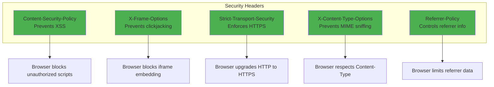
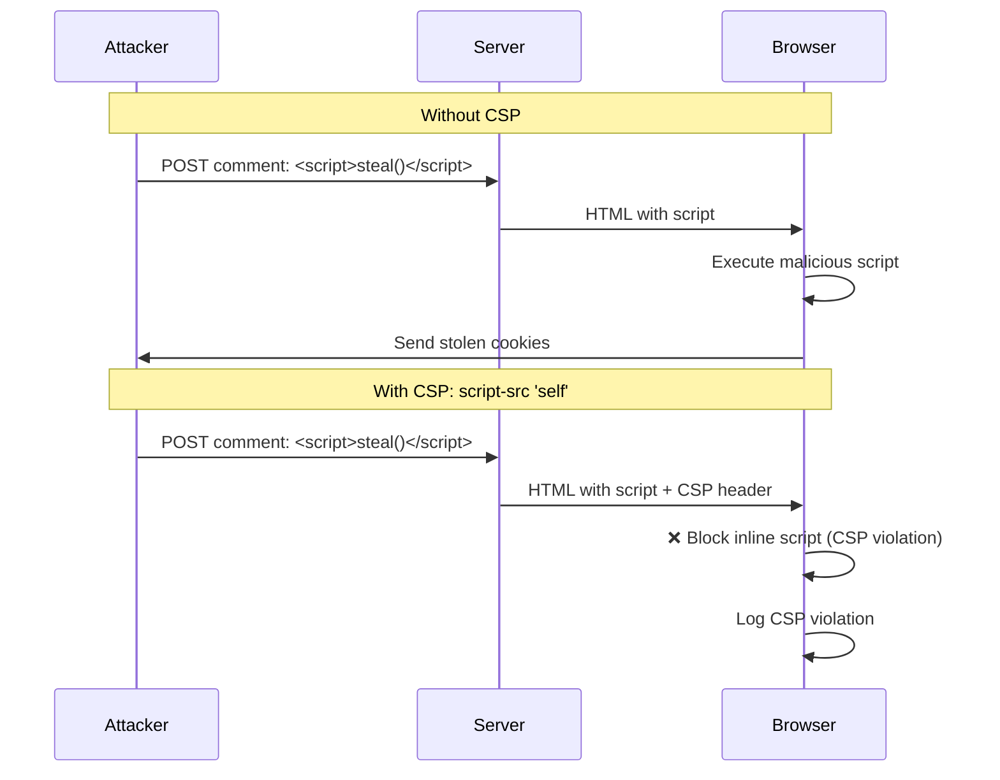
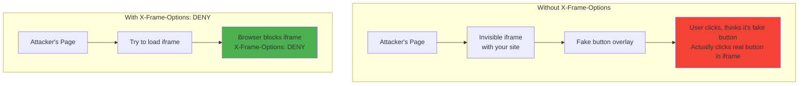
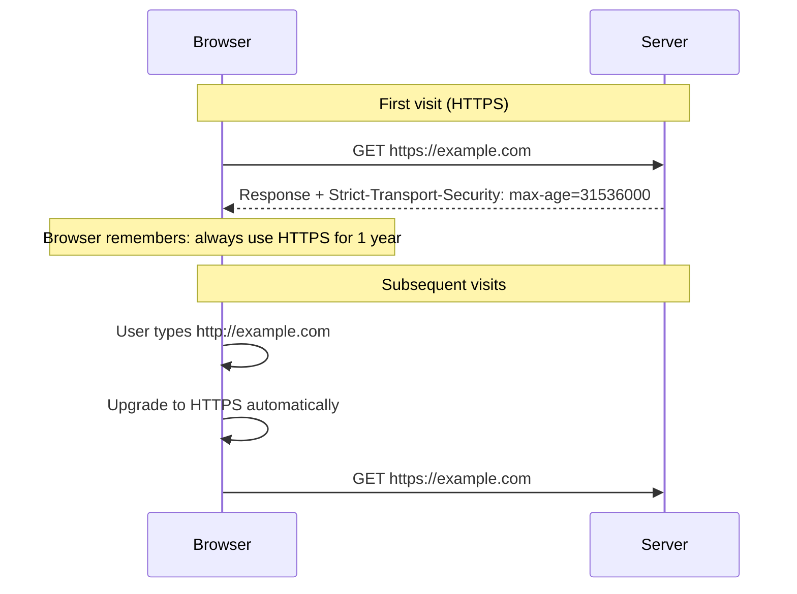

# Secure headers

## 1. Why this exists (Real-world problem first)

You deploy a Node.js web app. Without secure headers, attackers exploit browser vulnerabilities. What breaks:

- **XSS (Cross-Site Scripting)**: Attacker injects `<script>alert('hacked')</script>` in a comment. Browser executes it, steals user's session cookie.
- **Clickjacking**: Attacker embeds your site in an iframe, overlays invisible buttons. User thinks they're clicking "Like" but actually clicking "Transfer $1000".
- **MIME sniffing**: Browser misinterprets `text/plain` as `text/html`, executes malicious script.
- **Mixed content**: HTTPS page loads HTTP script. Man-in-the-middle attacker injects malicious code.
- **Referrer leakage**: User clicks link from your site. Destination sees full URL including sensitive query params (`?token=abc123`).

Real pain: A social media site didn't set `X-Frame-Options`. Attackers created clickjacking pages, tricked users into liking malicious pages. 100,000 users affected. The fix: `X-Frame-Options: DENY`.

**Another scenario**: An e-commerce site didn't set `Content-Security-Policy`. Attacker injected malicious script via product review. Script stole credit card numbers during checkout. The fix: CSP with `script-src 'self'`.

## 2. Mental model (build imagination)

Think of HTTP headers as **security guards** at different checkpoints.

**Without secure headers**:
- No guards, anyone can enter
- Attackers can inject scripts, embed your site in iframes, sniff content types

**With secure headers**:
- **X-Frame-Options**: Guard at the door—"No one can put this building inside another building (iframe)"
- **Content-Security-Policy**: Guard checking bags—"Only scripts from our domain allowed, no inline scripts"
- **Strict-Transport-Security**: Guard at entrance—"HTTPS only, no HTTP allowed"
- **X-Content-Type-Options**: Guard checking IDs—"If it says text/plain, it's text/plain, not HTML"

**Key insight**: Secure headers tell the browser **how to behave** to prevent attacks.

## 3. How Node.js implements this internally

### Helmet (comprehensive security headers)

```javascript
const express = require('express');
const helmet = require('helmet');

const app = express();

// Apply all helmet defaults
app.use(helmet());

// Equivalent to:
app.use(helmet.contentSecurityPolicy());
app.use(helmet.crossOriginEmbedderPolicy());
app.use(helmet.crossOriginOpenerPolicy());
app.use(helmet.crossOriginResourcePolicy());
app.use(helmet.dnsPrefetchControl());
app.use(helmet.frameguard());
app.use(helmet.hidePoweredBy());
app.use(helmet.hsts());
app.use(helmet.ieNoOpen());
app.use(helmet.noSniff());
app.use(helmet.originAgentCluster());
app.use(helmet.permittedCrossDomainPolicies());
app.use(helmet.referrerPolicy());
app.use(helmet.xssFilter());
```

**What happens**:
1. Request arrives
2. Helmet middleware runs
3. Sets multiple security headers in response
4. Response sent to browser
5. Browser enforces security policies

### Individual header configuration

```javascript
// Content Security Policy
app.use(helmet.contentSecurityPolicy({
  directives: {
    defaultSrc: ["'self'"],
    scriptSrc: ["'self'", "'unsafe-inline'", "cdn.example.com"],
    styleSrc: ["'self'", "'unsafe-inline'"],
    imgSrc: ["'self'", "data:", "https:"],
    connectSrc: ["'self'", "api.example.com"],
    fontSrc: ["'self'", "fonts.gstatic.com"],
    objectSrc: ["'none'"],
    mediaSrc: ["'self'"],
    frameSrc: ["'none'"],
  },
}));

// Strict Transport Security (HSTS)
app.use(helmet.hsts({
  maxAge: 31536000, // 1 year
  includeSubDomains: true,
  preload: true,
}));

// X-Frame-Options
app.use(helmet.frameguard({ action: 'deny' }));

// X-Content-Type-Options
app.use(helmet.noSniff());

// Referrer-Policy
app.use(helmet.referrerPolicy({ policy: 'strict-origin-when-cross-origin' }));
```

## 4. Multiple diagrams (MANDATORY)

### Security headers overview



### XSS attack with and without CSP



### Clickjacking attack



### HSTS flow



## 5. Where this is used in real projects

### Production security headers with Helmet

```javascript
const express = require('express');
const helmet = require('helmet');

const app = express();

// Comprehensive security headers
app.use(helmet({
  contentSecurityPolicy: {
    directives: {
      defaultSrc: ["'self'"],
      scriptSrc: ["'self'", "cdn.jsdelivr.net", "cdnjs.cloudflare.com"],
      styleSrc: ["'self'", "'unsafe-inline'", "fonts.googleapis.com"],
      fontSrc: ["'self'", "fonts.gstatic.com"],
      imgSrc: ["'self'", "data:", "https:"],
      connectSrc: ["'self'", "api.example.com"],
      frameSrc: ["'none'"],
      objectSrc: ["'none'"],
      upgradeInsecureRequests: [],
    },
  },
  hsts: {
    maxAge: 31536000,
    includeSubDomains: true,
    preload: true,
  },
  frameguard: {
    action: 'deny',
  },
  referrerPolicy: {
    policy: 'strict-origin-when-cross-origin',
  },
}));

app.get('/', (req, res) => {
  res.send('<h1>Secure App</h1>');
});

app.listen(3000);
```

### CSP violation reporting

```javascript
app.use(helmet.contentSecurityPolicy({
  directives: {
    defaultSrc: ["'self'"],
    scriptSrc: ["'self'"],
    reportUri: '/csp-violation-report',
  },
}));

// CSP violation report endpoint
app.post('/csp-violation-report', express.json({ type: 'application/csp-report' }), (req, res) => {
  console.error('CSP Violation:', req.body);
  
  // Log to monitoring service
  logger.error('CSP violation detected', {
    documentUri: req.body['csp-report']['document-uri'],
    violatedDirective: req.body['csp-report']['violated-directive'],
    blockedUri: req.body['csp-report']['blocked-uri'],
  });
  
  res.status(204).end();
});
```

### Nonce-based CSP for inline scripts

```javascript
const crypto = require('crypto');

app.use((req, res, next) => {
  // Generate nonce for this request
  res.locals.nonce = crypto.randomBytes(16).toString('base64');
  next();
});

app.use(helmet.contentSecurityPolicy({
  directives: {
    scriptSrc: ["'self'", (req, res) => `'nonce-${res.locals.nonce}'`],
  },
}));

app.get('/', (req, res) => {
  res.send(`
    <html>
      <head>
        <script nonce="${res.locals.nonce}">
          console.log('This inline script is allowed');
        </script>
      </head>
      <body>
        <h1>Secure Page</h1>
      </body>
    </html>
  `);
});
```

### Custom security headers

```javascript
app.use((req, res, next) => {
  // Custom headers
  res.setHeader('X-Permitted-Cross-Domain-Policies', 'none');
  res.setHeader('X-Download-Options', 'noopen');
  res.setHeader('X-DNS-Prefetch-Control', 'off');
  res.setHeader('Permissions-Policy', 'geolocation=(), microphone=(), camera=()');
  
  next();
});
```

## 6. Where this should NOT be used

### Overly restrictive CSP

```javascript
// BAD: Blocks all scripts, including your own
app.use(helmet.contentSecurityPolicy({
  directives: {
    scriptSrc: ["'none'"], // No scripts allowed at all!
  },
}));

// GOOD: Allow scripts from self and trusted CDNs
app.use(helmet.contentSecurityPolicy({
  directives: {
    scriptSrc: ["'self'", "cdn.example.com"],
  },
}));
```

### Using 'unsafe-inline' everywhere

```javascript
// BAD: Defeats the purpose of CSP
app.use(helmet.contentSecurityPolicy({
  directives: {
    scriptSrc: ["'self'", "'unsafe-inline'", "'unsafe-eval'"],
  },
}));

// GOOD: Use nonces or hashes for inline scripts
app.use(helmet.contentSecurityPolicy({
  directives: {
    scriptSrc: ["'self'", (req, res) => `'nonce-${res.locals.nonce}'`],
  },
}));
```

### HSTS without HTTPS

```javascript
// BAD: HSTS on HTTP site (doesn't work)
// HSTS only works when served over HTTPS

// GOOD: HSTS on HTTPS site
app.use(helmet.hsts({ maxAge: 31536000 }));
```

## 7. Failure modes & edge cases

### CSP breaks third-party scripts

**Scenario**: You add Google Analytics, but CSP blocks it.

**Impact**: Analytics don't work.

**Solution**: Add Google Analytics domain to CSP.

```javascript
app.use(helmet.contentSecurityPolicy({
  directives: {
    scriptSrc: ["'self'", "www.google-analytics.com"],
    connectSrc: ["'self'", "www.google-analytics.com"],
  },
}));
```

### HSTS preload issues

**Scenario**: You enable HSTS preload, then need to disable HTTPS.

**Impact**: Site is inaccessible for users who visited before (browser enforces HTTPS for 1 year).

**Solution**: Don't enable preload unless you're 100% committed to HTTPS forever.

### Referrer-Policy breaks analytics

**Scenario**: You set `Referrer-Policy: no-referrer`. Analytics can't track referrers.

**Impact**: Lost analytics data.

**Solution**: Use `strict-origin-when-cross-origin` instead.

## 8. Trade-offs & alternatives

### What you gain
- **XSS protection**: CSP blocks unauthorized scripts
- **Clickjacking protection**: X-Frame-Options blocks iframe embedding
- **HTTPS enforcement**: HSTS upgrades HTTP to HTTPS
- **MIME sniffing protection**: X-Content-Type-Options prevents misinterpretation

### What you sacrifice
- **Compatibility**: Strict CSP may break third-party scripts
- **Development friction**: Must whitelist every CDN, inline script
- **Debugging complexity**: CSP violations can be hard to trace

### Alternatives

**Subresource Integrity (SRI)**
- **Use case**: Verify integrity of CDN scripts
- **Benefit**: Prevents CDN compromise
- **Trade-off**: Must update hash when script changes

```html
<script src="https://cdn.example.com/script.js" 
        integrity="sha384-abc123..." 
        crossorigin="anonymous"></script>
```

## 9. Interview-level articulation

**Question**: "What are secure headers and why are they important?"

**Weak answer**: "They make the site more secure."

**Strong answer**: "Secure headers are HTTP response headers that tell the browser how to behave to prevent attacks. Content-Security-Policy prevents XSS by whitelisting allowed script sources. X-Frame-Options prevents clickjacking by blocking iframe embedding. Strict-Transport-Security enforces HTTPS. X-Content-Type-Options prevents MIME sniffing. Referrer-Policy controls what referrer information is sent. I use Helmet in Node.js to set all these headers. For CSP, I use nonces for inline scripts instead of 'unsafe-inline'. I also implement CSP violation reporting to detect attacks."

**Follow-up**: "What's the difference between X-Frame-Options and CSP frame-ancestors?"

**Answer**: "Both prevent clickjacking, but CSP frame-ancestors is more flexible. X-Frame-Options has three values: DENY (no iframes), SAMEORIGIN (same domain only), ALLOW-FROM (specific domain). CSP frame-ancestors can whitelist multiple domains and supports wildcards. X-Frame-Options is older and more widely supported, but CSP frame-ancestors is the modern standard. I use both for defense in depth."

## 10. Key takeaways (engineer mindset)

**What to remember**:
- **Use Helmet** for comprehensive security headers
- **CSP prevents XSS**—whitelist script sources, use nonces
- **X-Frame-Options prevents clickjacking**—set to DENY or SAMEORIGIN
- **HSTS enforces HTTPS**—set max-age to 1 year
- **Monitor CSP violations** to detect attacks

**What decisions this enables**:
- Choosing CSP directives (script-src, style-src, etc.)
- Implementing nonce-based CSP for inline scripts
- Setting HSTS max-age and preload
- Configuring referrer policy

**How it connects to other Node.js concepts**:
- **Middleware**: Security headers set via Express middleware
- **Error handling**: CSP violations logged and monitored
- **Observability**: Track CSP violations, HSTS upgrades
- **Performance**: CSP can block slow third-party scripts
