# Input validation at scale

## 1. Why this exists (Real-world problem first)

You're running an API that accepts user input. Without validation, attackers exploit your system. What breaks:

- **SQL injection**: User sends `'; DROP TABLE users; --` in email field. Database executes it, deletes all users.
- **NoSQL injection**: User sends `{ $ne: null }` in password field. MongoDB query returns all users.
- **Command injection**: User sends `; rm -rf /` in filename field. Server executes it, deletes all files.
- **Path traversal**: User sends `../../etc/passwd` in file path. Server reads sensitive files.
- **XSS**: User sends `<script>steal()</script>` in comment. Browser executes it, steals cookies.
- **Prototype pollution**: User sends `{"__proto__": {"isAdmin": true}}`. All objects now have `isAdmin: true`.

Real pain: A fintech API didn't validate transaction amounts. User sent `amount: -1000`. System transferred $1000 FROM the merchant TO the user. The fix: validate `amount > 0`.

**Another scenario**: An e-commerce site didn't validate product IDs. User changed `productId=123` to `productId=abc`. Server crashed trying to parse `abc` as integer. The fix: validate `productId` is a number.

## 2. Mental model (build imagination)

Think of input validation as **airport security**.

**Without validation**:
- Anyone can board with anything
- Weapons, explosives, contraband allowed
- Disaster waiting to happen

**With validation**:
- **Type checking**: Is this a valid passport? (Is this a number?)
- **Range checking**: Is age between 0 and 120? (Is amount > 0?)
- **Format checking**: Is email valid? (Does it match regex?)
- **Sanitization**: Remove dangerous items (Strip HTML tags)
- **Whitelist**: Only allow known-good values (Enum validation)

**Key insight**: **Never trust user input**. Validate everything.

## 3. How Node.js implements this internally

### Basic validation with Joi

```javascript
const Joi = require('joi');

const userSchema = Joi.object({
  email: Joi.string().email().required(),
  password: Joi.string().min(8).required(),
  age: Joi.number().integer().min(0).max(120),
  role: Joi.string().valid('user', 'admin'),
});

app.post('/register', async (req, res) => {
  try {
    const validated = await userSchema.validateAsync(req.body);
    
    // validated is safe to use
    const user = await createUser(validated);
    res.json(user);
  } catch (err) {
    res.status(400).json({ error: err.details[0].message });
  }
});
```

**What happens**:
1. User sends JSON body
2. Joi validates against schema
3. If invalid, throws error with details
4. If valid, returns validated data
5. Application uses validated data

### SQL injection prevention

```javascript
// BAD: String concatenation (vulnerable)
const email = req.body.email;
const query = `SELECT * FROM users WHERE email = '${email}'`;
// User sends: ' OR '1'='1
// Query becomes: SELECT * FROM users WHERE email = '' OR '1'='1'
// Returns all users!

// GOOD: Parameterized queries
const email = req.body.email;
const query = 'SELECT * FROM users WHERE email = $1';
const result = await db.query(query, [email]);
// Email is escaped, SQL injection prevented
```

### NoSQL injection prevention

```javascript
// BAD: Direct use of user input
const email = req.body.email;
const user = await db.collection('users').findOne({ email });
// User sends: { $ne: null }
// Query becomes: findOne({ email: { $ne: null } })
// Returns first user!

// GOOD: Validate input type
const email = req.body.email;
if (typeof email !== 'string') {
  return res.status(400).json({ error: 'Invalid email' });
}
const user = await db.collection('users').findOne({ email });
```

### XSS prevention

```javascript
const sanitizeHtml = require('sanitize-html');

app.post('/comment', async (req, res) => {
  const comment = req.body.comment;
  
  // Sanitize HTML
  const clean = sanitizeHtml(comment, {
    allowedTags: ['b', 'i', 'em', 'strong'],
    allowedAttributes: {},
  });
  
  await db.query('INSERT INTO comments (content) VALUES ($1)', [clean]);
  res.json({ message: 'Comment posted' });
});
```

## 4. Multiple diagrams (MANDATORY)

### Input validation flow

```mermaid
sequenceDiagram
    participant User
    participant API
    participant Validator
    participant DB
    
    User->>API: POST /register {email, password}
    API->>Validator: Validate input
    
    alt Valid Input
        Validator-->>API: ✅ Validated data
        API->>DB: INSERT user
        DB-->>API: User created
        API-->>User: 201 Created
    else Invalid Input
        Validator-->>API: ❌ Validation error
        API-->>User: 400 Bad Request
    end
```



### SQL injection attack

```mermaid
graph TB
    subgraph "Vulnerable Code"
        V1[User input: ' OR '1'='1] --> V2[String concatenation]
        V2 --> V3[Query: SELECT * WHERE email = '' OR '1'='1']
        V3 --> V4[❌ Returns all users!]
    end
    
    subgraph "Secure Code"
        S1[User input: ' OR '1'='1] --> S2[Parameterized query]
        S2 --> S3[Query: SELECT * WHERE email = $1]
        S3 --> S4[Param: ' OR '1'='1]
        S4 --> S5[✅ No users found]
    end
    
    style V4 fill:#F44336
    style S5 fill:#4CAF50
```



### Validation layers

```mermaid
graph TB
    A[User Input] --> B[Layer 1: Type Validation]
    B --> C[Layer 2: Format Validation]
    C --> D[Layer 3: Range Validation]
    D --> E[Layer 4: Business Logic Validation]
    E --> F[Layer 5: Sanitization]
    F --> G[Safe to Use]
    
    B --> |Invalid type| X[❌ Reject]
    C --> |Invalid format| X
    D --> |Out of range| X
    E --> |Business rule violated| X
    
    style G fill:#4CAF50
    style X fill:#F44336
```



### Attack vectors


## 5. Where this is used in real projects

### Production validation with Joi

```javascript
const Joi = require('joi');

// Define schemas
const schemas = {
  register: Joi.object({
    email: Joi.string().email().required(),
    password: Joi.string().min(8).pattern(/^(?=.*[a-z])(?=.*[A-Z])(?=.*\d)/).required(),
    name: Joi.string().min(2).max(50).required(),
    age: Joi.number().integer().min(18).max(120),
  }),
  
  login: Joi.object({
    email: Joi.string().email().required(),
    password: Joi.string().required(),
  }),
  
  updateProfile: Joi.object({
    name: Joi.string().min(2).max(50),
    age: Joi.number().integer().min(18).max(120),
    bio: Joi.string().max(500),
  }),
};

// Validation middleware
function validate(schemaName) {
  return async (req, res, next) => {
    try {
      const validated = await schemas[schemaName].validateAsync(req.body, {
        abortEarly: false, // Return all errors
        stripUnknown: true, // Remove unknown fields
      });
      
      req.body = validated; // Replace with validated data
      next();
    } catch (err) {
      const errors = err.details.map(d => ({
        field: d.path.join('.'),
        message: d.message,
      }));
      
      res.status(400).json({ errors });
    }
  };
}

// Routes
app.post('/register', validate('register'), async (req, res) => {
  const user = await createUser(req.body);
  res.json(user);
});

app.post('/login', validate('login'), async (req, res) => {
  const token = await authenticateUser(req.body);
  res.json({ token });
});
```

### SQL injection prevention

```javascript
const { Pool } = require('pg');
const pool = new Pool();

app.get('/users/:id', async (req, res) => {
  const userId = parseInt(req.params.id, 10);
  
  // Validate ID is a number
  if (isNaN(userId)) {
    return res.status(400).json({ error: 'Invalid user ID' });
  }
  
  // Parameterized query
  const result = await pool.query('SELECT * FROM users WHERE id = $1', [userId]);
  
  if (!result.rows[0]) {
    return res.status(404).json({ error: 'User not found' });
  }
  
  res.json(result.rows[0]);
});
```

### File upload validation

```javascript
const multer = require('multer');
const path = require('path');

const storage = multer.diskStorage({
  destination: './uploads/',
  filename: (req, file, cb) => {
    // Generate safe filename
    const uniqueSuffix = Date.now() + '-' + Math.round(Math.random() * 1E9);
    cb(null, file.fieldname + '-' + uniqueSuffix + path.extname(file.originalname));
  },
});

const upload = multer({
  storage,
  limits: {
    fileSize: 5 * 1024 * 1024, // 5MB
  },
  fileFilter: (req, file, cb) => {
    // Whitelist allowed extensions
    const allowedExtensions = ['.jpg', '.jpeg', '.png', '.pdf'];
    const ext = path.extname(file.originalname).toLowerCase();
    
    if (!allowedExtensions.includes(ext)) {
      return cb(new Error('Invalid file type'));
    }
    
    // Validate MIME type
    const allowedMimeTypes = ['image/jpeg', 'image/png', 'application/pdf'];
    if (!allowedMimeTypes.includes(file.mimetype)) {
      return cb(new Error('Invalid MIME type'));
    }
    
    cb(null, true);
  },
});

app.post('/upload', upload.single('file'), (req, res) => {
  res.json({ filename: req.file.filename });
});
```

### Prototype pollution prevention

```javascript
// Vulnerable code
function merge(target, source) {
  for (let key in source) {
    target[key] = source[key];
  }
  return target;
}

const user = {};
merge(user, JSON.parse('{"__proto__": {"isAdmin": true}}'));
console.log({}.isAdmin); // true - all objects polluted!

// Secure code
function safeMerge(target, source) {
  for (let key in source) {
    if (key === '__proto__' || key === 'constructor' || key === 'prototype') {
      continue; // Skip dangerous keys
    }
    target[key] = source[key];
  }
  return target;
}

// Or use Object.freeze
const user = Object.freeze({});
```

### Rate limiting + validation

```javascript
const rateLimit = require('express-rate-limit');

// Stricter rate limit for endpoints with user input
const inputLimiter = rateLimit({
  windowMs: 60 * 1000,
  max: 10, // 10 requests per minute
  message: 'Too many requests',
});

app.post('/comment', inputLimiter, validate('comment'), async (req, res) => {
  const clean = sanitizeHtml(req.body.comment);
  await db.query('INSERT INTO comments (content) VALUES ($1)', [clean]);
  res.json({ message: 'Comment posted' });
});
```

## 6. Where this should NOT be used

### Client-side validation only

```javascript
// BAD: Only validating on client
// <form onsubmit="return validateForm()">
// Attacker bypasses client validation with curl

// GOOD: Always validate on server
app.post('/register', validate('register'), async (req, res) => {
  // Server-side validation
});
```

### Trusting Content-Type header

```javascript
// BAD: Trusting Content-Type
if (req.headers['content-type'] === 'application/json') {
  // Attacker can set any Content-Type
}

// GOOD: Validate actual content
const parsed = JSON.parse(req.body);
const validated = await schema.validateAsync(parsed);
```

### Blacklist instead of whitelist

```javascript
// BAD: Blacklist (incomplete)
const blacklist = ['<script>', 'DROP TABLE', 'rm -rf'];
if (blacklist.some(b => input.includes(b))) {
  throw new Error('Invalid input');
}
// Attacker uses <ScRiPt> or DROP/**/TABLE

// GOOD: Whitelist
const allowedChars = /^[a-zA-Z0-9\s]+$/;
if (!allowedChars.test(input)) {
  throw new Error('Invalid input');
}
```

## 7. Failure modes & edge cases

### Unicode normalization bypass

**Scenario**: Attacker sends `ℝ𝕄 -𝕣𝕗 /` (Unicode mathematical alphanumeric symbols).

**Impact**: Bypasses blacklist, executes command.

**Solution**: Normalize Unicode before validation.

```javascript
const normalized = input.normalize('NFKC');
```

### Type coercion bypass

**Scenario**: Attacker sends `amount: "0"` (string). JavaScript coerces to number.

**Impact**: Bypasses `typeof amount === 'number'` check.

**Solution**: Use strict validation.

```javascript
if (typeof amount !== 'number' || isNaN(amount)) {
  throw new Error('Invalid amount');
}
```

### Large payload DoS

**Scenario**: Attacker sends 1GB JSON payload.

**Impact**: Server runs out of memory.

**Solution**: Limit payload size.

```javascript
app.use(express.json({ limit: '1mb' }));
```

## 8. Trade-offs & alternatives

### What you gain
- **Security**: Prevents injection attacks, XSS, etc.
- **Data integrity**: Ensures data is in expected format
- **Error handling**: Catches invalid input early

### What you sacrifice
- **Performance**: Validation adds latency (1-10ms)
- **Complexity**: Must define schemas, handle errors
- **User friction**: Strict validation may reject valid edge cases

### Alternatives

**Zod (TypeScript-first)**
- **Use case**: TypeScript projects
- **Benefit**: Type inference, better DX
- **Trade-off**: Newer, smaller ecosystem

**Yup**
- **Use case**: Similar to Joi
- **Benefit**: Smaller bundle size
- **Trade-off**: Less feature-rich

**Class-validator (TypeScript)**
- **Use case**: NestJS, TypeScript classes
- **Benefit**: Decorator-based validation
- **Trade-off**: Requires TypeScript

## 9. Interview-level articulation

**Question**: "How do you prevent SQL injection in Node.js?"

**Weak answer**: "Use parameterized queries."

**Strong answer**: "I prevent SQL injection by using parameterized queries with placeholders ($1, $2) instead of string concatenation. The database driver escapes user input automatically. For example, `db.query('SELECT * FROM users WHERE email = $1', [email])` instead of `db.query(\`SELECT * FROM users WHERE email = '${email}'\`)`. I also validate input types—if expecting a number, I check `typeof id === 'number'`. For ORMs like Sequelize or TypeORM, I use their query builders which automatically parameterize queries. I never trust user input and always validate before using it in queries."

**Follow-up**: "What's the difference between validation and sanitization?"

**Answer**: "Validation checks if input meets criteria and rejects it if not. For example, checking if email matches a regex. Sanitization modifies input to make it safe. For example, stripping HTML tags from a comment. I use both: validate first to reject obviously bad input, then sanitize to remove potentially dangerous content. For example, I validate that a comment is a string and under 500 characters, then sanitize it with sanitize-html to remove script tags. Validation is about saying 'no', sanitization is about making it safe."

**Follow-up**: "How do you handle file upload validation?"

**Answer**: "I validate file uploads at multiple layers. First, I limit file size with Multer's `limits` option (e.g., 5MB). Second, I whitelist allowed extensions by checking `path.extname(file.originalname)`. Third, I validate MIME type with `file.mimetype`. Fourth, I generate a safe filename using timestamps and random strings to prevent path traversal. Fifth, I scan uploaded files with antivirus (e.g., ClamAV) for malware. I never trust the original filename or MIME type from the client—attackers can spoof both. I also store uploads outside the web root to prevent direct access."

## 10. Key takeaways (engineer mindset)

**What to remember**:
- **Never trust user input**—validate everything
- **Use parameterized queries** to prevent SQL injection
- **Validate types** to prevent NoSQL injection
- **Sanitize HTML** to prevent XSS
- **Whitelist, don't blacklist**—only allow known-good values

**What decisions this enables**:
- Choosing validation library (Joi, Zod, Yup)
- Designing validation schemas
- Implementing sanitization strategies
- Handling validation errors gracefully

**How it connects to other Node.js concepts**:
- **Middleware**: Validation implemented as Express middleware
- **Error handling**: Validation errors returned as 400 Bad Request
- **Database**: Parameterized queries prevent injection
- **Security**: Input validation is first line of defense
- **Performance**: Validation adds latency, must be optimized
