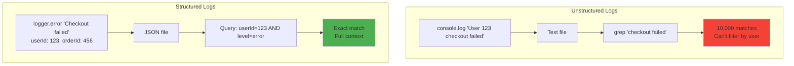
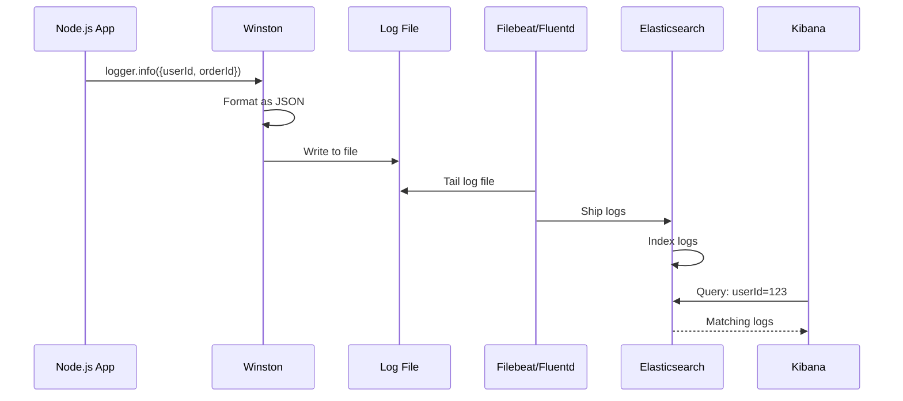
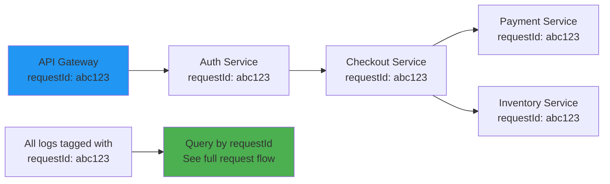
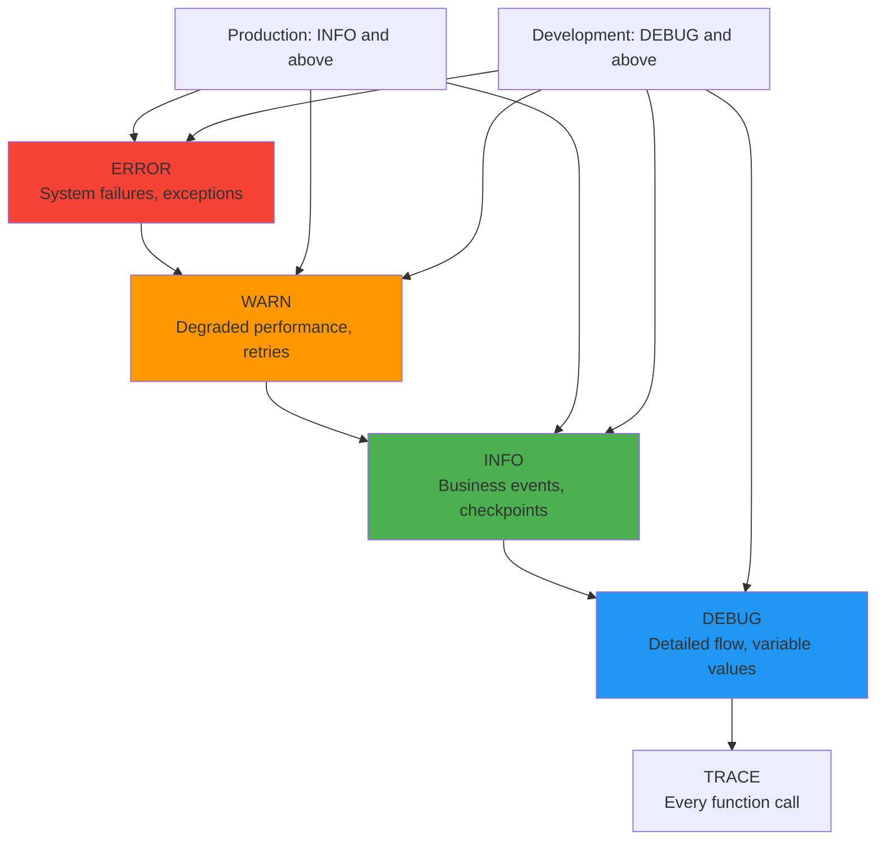

# Logging strategy (structured logs)

## 1. Why this exists (Real-world problem first)

You're running a microservices platform with 50 services. A user reports "checkout failed". You check logs. What breaks:

- **Unstructured logs**: `console.log('User checkout failed')` - Which user? Which order? Which service? No context.
- **Grep hell**: Searching through 100GB of logs for "checkout failed" returns 10,000 matches. Can't filter by user ID, order ID, or timestamp.
- **No correlation**: Request spans 5 services. Each service logs separately. Can't trace the request flow.
- **Performance debugging impossible**: Logs don't include latency, memory usage, or error codes. Can't identify bottlenecks.
- **Alert fatigue**: Generic logs trigger false alarms. "Error occurred" fires 1000 times/day, team ignores it.

Real pain: An e-commerce site had unstructured logs. During Black Friday, checkout started failing. Engineers spent 4 hours grepping logs, couldn't find the root cause. Lost $500K in sales. The fix: structured logging with request IDs, user IDs, and error codes.

**Another scenario**: A SaaS platform logged `console.log('Database error')` without query details. When the database slowed down, they couldn't identify which queries were slow. The fix: structured logs with query text, duration, and affected tables.

## 2. Mental model (build imagination)

Think of logs as **evidence at a crime scene**.

**Unstructured logs (bad)**:
- Detective finds note: "Something happened here"
- No timestamp, no location, no suspect description
- Useless for investigation

**Structured logs (good)**:
- Detective finds detailed report:
  - **When**: 2024-01-15 14:30:00
  - **Where**: 123 Main St, Room 5
  - **Who**: Suspect ID 456
  - **What**: Theft of item XYZ
  - **How**: Broken window
- Can search by time, location, suspect, item type
- Can correlate with other evidence

**Key insight**: Structured logs are **queryable data**, not just text. You can filter, aggregate, and analyze them.

## 3. How Node.js implements this internally

### Structured logging with Winston

```javascript
const winston = require('winston');

const logger = winston.createLogger({
  level: 'info',
  format: winston.format.combine(
    winston.format.timestamp(),
    winston.format.errors({ stack: true }),
    winston.format.json() // Structured JSON format
  ),
  defaultMeta: { service: 'checkout-service' },
  transports: [
    new winston.transports.File({ filename: 'error.log', level: 'error' }),
    new winston.transports.File({ filename: 'combined.log' }),
  ],
});

// Log with structured data
logger.info('Checkout completed', {
  userId: 123,
  orderId: 456,
  amount: 99.99,
  duration: 250, // ms
});

// Output: {"level":"info","message":"Checkout completed","userId":123,"orderId":456,"amount":99.99,"duration":250,"timestamp":"2024-01-15T14:30:00.000Z","service":"checkout-service"}
```

**What happens**:
1. `logger.info()` called with message and metadata
2. Winston formats log as JSON
3. Adds timestamp, service name
4. Writes to file or stdout
5. Log aggregation service (ELK, Datadog) ingests JSON
6. Logs are queryable by any field

**Event loop impact**: File I/O is async, doesn't block event loop. But excessive logging (1000 logs/sec) can slow down I/O.

### Request correlation with middleware

```javascript
const { v4: uuidv4 } = require('uuid');

// Middleware: Add request ID to all logs
app.use((req, res, next) => {
  req.id = uuidv4();
  req.logger = logger.child({ requestId: req.id });
  next();
});

app.get('/checkout', async (req, res) => {
  req.logger.info('Checkout started', { userId: req.user.id });
  
  try {
    const order = await createOrder(req.user.id);
    req.logger.info('Order created', { orderId: order.id });
    
    const payment = await processPayment(order);
    req.logger.info('Payment processed', { paymentId: payment.id });
    
    res.json({ orderId: order.id });
  } catch (err) {
    req.logger.error('Checkout failed', { error: err.message, stack: err.stack });
    res.status(500).json({ error: 'Checkout failed' });
  }
});
```

**What happens**:
1. Request arrives, middleware generates unique request ID
2. Child logger created with request ID
3. All logs in this request include same request ID
4. Can trace entire request flow by searching for request ID

## 4. Multiple diagrams (MANDATORY)

### Unstructured vs structured logs



### Log aggregation flow



### Request correlation across services



### Log levels hierarchy



## 5. Where this is used in real projects

### Production structured logging with Winston

```javascript
const winston = require('winston');
const { ElasticsearchTransport } = require('winston-elasticsearch');

const logger = winston.createLogger({
  level: process.env.LOG_LEVEL || 'info',
  format: winston.format.combine(
    winston.format.timestamp(),
    winston.format.errors({ stack: true }),
    winston.format.metadata(),
    winston.format.json()
  ),
  defaultMeta: {
    service: process.env.SERVICE_NAME,
    environment: process.env.NODE_ENV,
    version: process.env.APP_VERSION,
  },
  transports: [
    // Console for local development
    new winston.transports.Console({
      format: winston.format.combine(
        winston.format.colorize(),
        winston.format.simple()
      ),
    }),
    
    // Elasticsearch for production
    new ElasticsearchTransport({
      level: 'info',
      clientOpts: { node: process.env.ELASTICSEARCH_URL },
      index: 'logs',
    }),
  ],
});

// Add request context
app.use((req, res, next) => {
  req.logger = logger.child({
    requestId: req.id,
    userId: req.user?.id,
    ip: req.ip,
    userAgent: req.headers['user-agent'],
  });
  next();
});

// Log with context
app.post('/checkout', async (req, res) => {
  const startTime = Date.now();
  
  req.logger.info('Checkout started', {
    cartItems: req.body.items.length,
    totalAmount: req.body.total,
  });
  
  try {
    const order = await createOrder(req.body);
    
    req.logger.info('Checkout completed', {
      orderId: order.id,
      duration: Date.now() - startTime,
      paymentMethod: order.paymentMethod,
    });
    
    res.json({ orderId: order.id });
  } catch (err) {
    req.logger.error('Checkout failed', {
      error: err.message,
      stack: err.stack,
      duration: Date.now() - startTime,
    });
    
    res.status(500).json({ error: 'Checkout failed' });
  }
});
```

### Performance logging

```javascript
// Log slow queries
async function queryWithLogging(query, params) {
  const startTime = Date.now();
  
  try {
    const result = await db.query(query, params);
    const duration = Date.now() - startTime;
    
    if (duration > 1000) {
      logger.warn('Slow query detected', {
        query,
        duration,
        rowCount: result.rows.length,
      });
    }
    
    return result;
  } catch (err) {
    logger.error('Query failed', {
      query,
      error: err.message,
      duration: Date.now() - startTime,
    });
    throw err;
  }
}
```

### Error tracking with Sentry integration

```javascript
const Sentry = require('@sentry/node');

Sentry.init({ dsn: process.env.SENTRY_DSN });

// Log errors to both Winston and Sentry
logger.on('error', (error) => {
  Sentry.captureException(error);
});

app.use((err, req, res, next) => {
  req.logger.error('Unhandled error', {
    error: err.message,
    stack: err.stack,
    requestId: req.id,
  });
  
  Sentry.captureException(err, {
    tags: {
      requestId: req.id,
      userId: req.user?.id,
    },
  });
  
  res.status(500).json({ error: 'Internal server error' });
});
```

### Audit logging

```javascript
// Log all sensitive operations
async function auditLog(action, userId, resource, metadata = {}) {
  logger.info('Audit log', {
    action, // 'CREATE', 'UPDATE', 'DELETE'
    userId,
    resource, // 'user', 'order', 'payment'
    resourceId: metadata.resourceId,
    changes: metadata.changes,
    ip: metadata.ip,
    timestamp: new Date().toISOString(),
  });
}

app.delete('/users/:id', authenticate, authorize('admin'), async (req, res) => {
  const user = await db.query('SELECT * FROM users WHERE id = $1', [req.params.id]);
  
  await db.query('DELETE FROM users WHERE id = $1', [req.params.id]);
  
  await auditLog('DELETE', req.user.id, 'user', {
    resourceId: req.params.id,
    changes: { deleted: user.rows[0] },
    ip: req.ip,
  });
  
  res.json({ message: 'User deleted' });
});
```

### Distributed tracing with OpenTelemetry

```javascript
const { trace } = require('@opentelemetry/api');

app.get('/checkout', async (req, res) => {
  const span = trace.getActiveSpan();
  
  req.logger.info('Checkout started', {
    traceId: span.spanContext().traceId,
    spanId: span.spanContext().spanId,
  });
  
  // All logs include trace ID for correlation
});
```

## 6. Where this should NOT be used

### Logging sensitive data

```javascript
// BAD: Logging passwords, credit cards
logger.info('User login', {
  email: 'user@example.com',
  password: 'secret123', // NEVER!
});

logger.info('Payment processed', {
  creditCard: '4111111111111111', // NEVER!
});

// GOOD: Redact sensitive data
logger.info('User login', {
  email: 'user@example.com',
});

logger.info('Payment processed', {
  last4: '1111',
  paymentMethod: 'credit_card',
});
```

### Excessive logging in hot paths

```javascript
// BAD: Logging every iteration
for (let i = 0; i < 1000000; i++) {
  logger.debug('Processing item', { index: i }); // 1M logs!
}

// GOOD: Log summary
logger.info('Processing started', { totalItems: 1000000 });
// Process items
logger.info('Processing completed', { totalItems: 1000000, duration: 5000 });
```

### Synchronous logging

```javascript
// BAD: Synchronous file write
const fs = require('fs');
fs.appendFileSync('app.log', JSON.stringify(logEntry)); // Blocks event loop!

// GOOD: Async logging with Winston
logger.info('Event occurred', { data }); // Async I/O
```

## 7. Failure modes & edge cases

### Log file disk space exhaustion

**Scenario**: Application logs 1GB/day. Disk fills up after 30 days.

**Impact**: Application crashes when disk is full.

**Solution**: Log rotation with size and time limits.

```javascript
const winston = require('winston');
require('winston-daily-rotate-file');

const transport = new winston.transports.DailyRotateFile({
  filename: 'application-%DATE%.log',
  datePattern: 'YYYY-MM-DD',
  maxSize: '100m', // 100MB per file
  maxFiles: '30d', // Keep 30 days
});

const logger = winston.createLogger({
  transports: [transport],
});
```

### Lost logs during crash

**Scenario**: Application crashes. Logs in memory buffer not flushed to disk.

**Impact**: Missing logs for crash investigation.

**Solution**: Flush logs on uncaught exceptions.

```javascript
process.on('uncaughtException', (err) => {
  logger.error('Uncaught exception', {
    error: err.message,
    stack: err.stack,
  });
  
  // Flush logs before exit
  logger.on('finish', () => {
    process.exit(1);
  });
  
  logger.end();
});
```

### High cardinality fields

**Scenario**: Logging user IDs (millions of unique values). Elasticsearch struggles to index.

**Impact**: Slow queries, high memory usage.

**Solution**: Use keyword fields, not analyzed text.

```javascript
// Elasticsearch mapping
{
  "mappings": {
    "properties": {
      "userId": { "type": "keyword" }, // Not analyzed
      "message": { "type": "text" }     // Analyzed
    }
  }
}
```

## 8. Trade-offs & alternatives

### What you gain
- **Debuggability**: Can trace requests, filter by any field
- **Observability**: Understand system behavior in production
- **Alerting**: Query logs for specific patterns, trigger alerts

### What you sacrifice
- **Performance**: JSON serialization adds CPU overhead (1-5ms per log)
- **Storage**: Structured logs are larger than plain text (2-3x)
- **Complexity**: Must set up log aggregation (ELK, Datadog)

### Alternatives

**Pino (faster than Winston)**
- **Use case**: High-performance logging
- **Benefit**: 5-10x faster than Winston
- **Trade-off**: Less feature-rich

**Bunyan**
- **Use case**: JSON logging
- **Benefit**: Simple, fast
- **Trade-off**: Less actively maintained

**Console.log (development only)**
- **Use case**: Local development
- **Benefit**: Simple, no setup
- **Trade-off**: Not structured, not queryable

## 9. Interview-level articulation

**Question**: "How do you implement logging in a production Node.js application?"

**Weak answer**: "I use console.log."

**Strong answer**: "I use structured logging with Winston, formatting logs as JSON with fields like timestamp, level, message, requestId, userId, and service name. I add request correlation by generating a unique request ID in middleware and attaching it to all logs. For distributed systems, I integrate OpenTelemetry for trace IDs. Logs are shipped to Elasticsearch via Filebeat, where I can query by any field. I implement log rotation to prevent disk exhaustion and flush logs on uncaught exceptions. I also redact sensitive data like passwords and credit cards. For performance, I use async logging and avoid logging in hot paths."

**Follow-up**: "What's the difference between log levels?"

**Answer**: "ERROR is for system failures that require immediate attention—database down, unhandled exceptions. WARN is for degraded performance or retries—slow queries, API timeouts. INFO is for business events—user login, checkout completed. DEBUG is for detailed flow—function entry/exit, variable values. TRACE is for every function call. In production, I set level to INFO to reduce noise. In development, I use DEBUG. I never use TRACE in production—it generates too many logs and impacts performance."

**Follow-up**: "How do you handle log aggregation at scale?"

**Answer**: "I use the ELK stack—Elasticsearch for storage and querying, Logstash or Filebeat for shipping, Kibana for visualization. Each service logs to stdout in JSON format. A sidecar container (Filebeat) tails logs and ships them to Elasticsearch. I use index patterns to separate logs by service and date. For high volume, I use Kafka as a buffer between Filebeat and Elasticsearch to handle spikes. I also implement sampling—log 100% of errors, 10% of INFO, 1% of DEBUG. This reduces storage costs while maintaining debuggability."

## 10. Key takeaways (engineer mindset)

**What to remember**:
- **Structured logs are queryable data**, not just text
- **Always include request ID** for correlation
- **Log at appropriate levels**: ERROR for failures, INFO for events, DEBUG for details
- **Redact sensitive data**: passwords, credit cards, tokens
- **Use async logging** to avoid blocking event loop

**What decisions this enables**:
- Choosing logging library (Winston, Pino, Bunyan)
- Designing log schema (what fields to include)
- Setting up log aggregation (ELK, Datadog, Splunk)
- Implementing log rotation and retention policies

**How it connects to other Node.js concepts**:
- **Event loop**: Async logging doesn't block
- **Middleware**: Request correlation via middleware
- **Error handling**: Log errors with full context
- **Observability**: Logs are one pillar (logs, metrics, traces)
- **Performance**: Excessive logging impacts throughput
