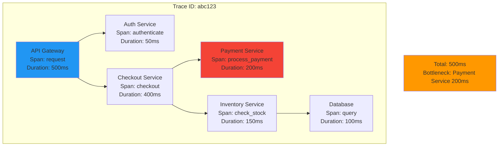
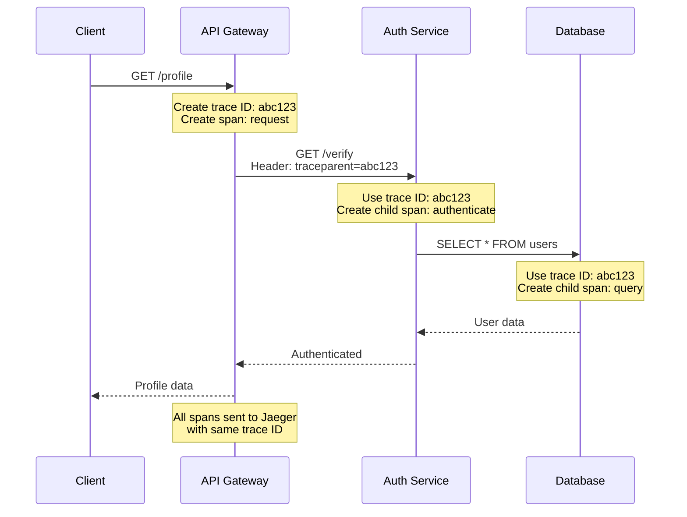
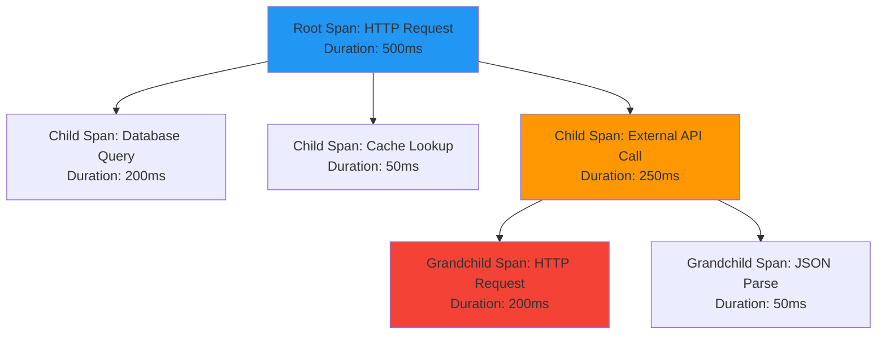
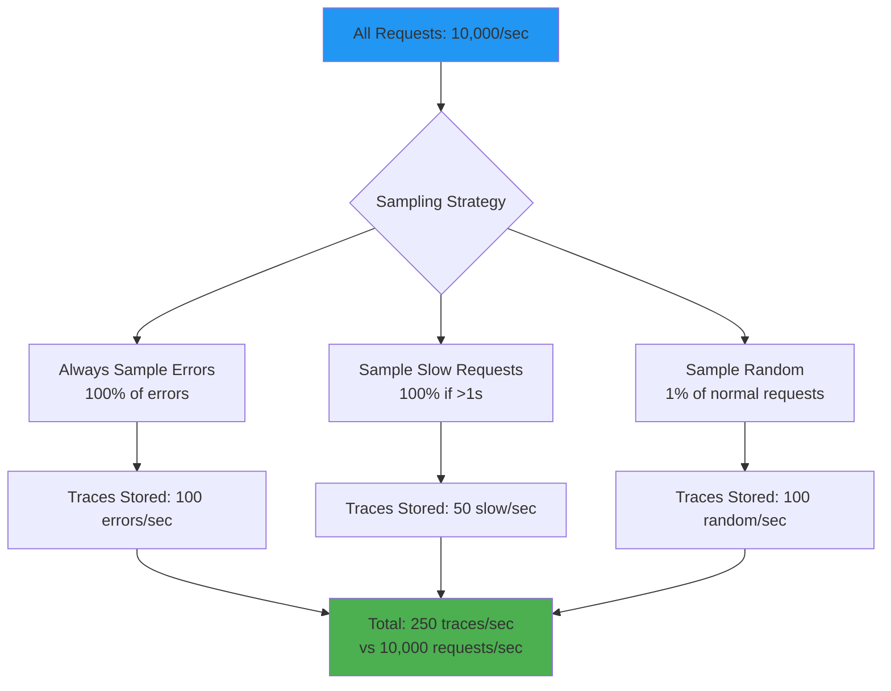

# Distributed tracing

## 1. Why this exists (Real-world problem first)

You're running a microservices architecture with 20 services. A user reports "search is slow". You check logs. What breaks:

- **No end-to-end visibility**: Request touches API Gateway → Auth → Search → Database → Cache. Each service logs separately. Can't see the full path.
- **Can't identify bottleneck**: Search took 5 seconds total. Which service was slow? Database query? Cache miss? Network latency?
- **Lost context across services**: Each service has different request ID format. Can't correlate logs.
- **Debugging nightmare**: To trace one request, you grep logs in 20 services, manually correlate timestamps. Takes hours.
- **No dependency map**: Don't know which services call which. Can't understand cascading failures.

Real pain: An e-commerce platform had slow checkout during Black Friday. Engineers spent 6 hours manually correlating logs across 15 services. Found the bottleneck was a slow database query in the inventory service. Lost $1M in sales. The fix: distributed tracing with OpenTelemetry.

**Another scenario**: A payment service started failing. Logs showed "timeout error" but didn't indicate which downstream service timed out. With distributed tracing, they immediately saw the fraud detection service was slow.

## 2. Mental model (build imagination)

Think of distributed tracing as **GPS tracking for requests**.

**Without tracing**:
- Package shipped, no tracking
- Customer asks "Where's my package?"
- You have no idea—could be at warehouse, in transit, or delivered

**With tracing**:
- Package has GPS tracker
- See exact path: Warehouse → Truck → Distribution Center → Local Post Office → Delivered
- Know exactly where it is and how long each step took

**In technical terms**:
- **Trace**: The entire journey of a request (like tracking number)
- **Span**: One step in the journey (like "in transit")
- **Parent-child relationship**: Spans form a tree (API Gateway calls Auth, Auth calls Database)

**Key insight**: Distributed tracing shows **where time is spent** in a distributed system.

## 3. How Node.js implements this internally

### OpenTelemetry implementation

```javascript
const { NodeTracerProvider } = require('@opentelemetry/sdk-trace-node');
const { registerInstrumentations } = require('@opentelemetry/instrumentation');
const { HttpInstrumentation } = require('@opentelemetry/instrumentation-http');
const { ExpressInstrumentation } = require('@opentelemetry/instrumentation-express');
const { JaegerExporter } = require('@opentelemetry/exporter-jaeger');
const { Resource } = require('@opentelemetry/resources');
const { SemanticResourceAttributes } = require('@opentelemetry/semantic-conventions');

// Create tracer provider
const provider = new NodeTracerProvider({
  resource: new Resource({
    [SemanticResourceAttributes.SERVICE_NAME]: 'checkout-service',
  }),
});

// Configure exporter (Jaeger)
const exporter = new JaegerExporter({
  endpoint: 'http://jaeger:14268/api/traces',
});

provider.addSpanProcessor(new BatchSpanProcessor(exporter));
provider.register();

// Auto-instrument HTTP and Express
registerInstrumentations({
  instrumentations: [
    new HttpInstrumentation(),
    new ExpressInstrumentation(),
  ],
});

// Now all HTTP requests are automatically traced
app.get('/checkout', async (req, res) => {
  // Automatically creates span for this request
  const order = await createOrder(); // Automatically creates child span
  res.json({ orderId: order.id });
});
```

**What happens**:
1. Request arrives at API Gateway
2. Tracer creates root span with unique trace ID
3. Trace ID propagated via HTTP headers (`traceparent`)
4. Each service creates child spans
5. Spans sent to Jaeger/Zipkin
6. UI shows full trace tree

**Event loop impact**: Span creation is synchronous (fast), span export is async (batched).

### Manual span creation

```javascript
const { trace } = require('@opentelemetry/api');

app.get('/search', async (req, res) => {
  const tracer = trace.getTracer('search-service');
  
  // Create custom span
  const span = tracer.startSpan('search.query');
  span.setAttribute('query', req.query.q);
  span.setAttribute('userId', req.user.id);
  
  try {
    const results = await searchDatabase(req.query.q);
    span.setAttribute('resultCount', results.length);
    span.setStatus({ code: SpanStatusCode.OK });
    
    res.json(results);
  } catch (err) {
    span.recordException(err);
    span.setStatus({ code: SpanStatusCode.ERROR, message: err.message });
    throw err;
  } finally {
    span.end();
  }
});
```

### Context propagation across services

```javascript
const axios = require('axios');
const { context, propagation } = require('@opentelemetry/api');

// Service A calls Service B
app.get('/checkout', async (req, res) => {
  // Current trace context
  const currentContext = context.active();
  
  // Inject trace context into HTTP headers
  const headers = {};
  propagation.inject(currentContext, headers);
  
  // Call Service B with trace context
  const response = await axios.get('http://payment-service/process', {
    headers, // Contains traceparent header
  });
  
  res.json(response.data);
});
```

## 4. Multiple diagrams (MANDATORY)

### Distributed trace visualization



### Trace context propagation



### Span hierarchy



### Trace sampling strategies



## 5. Where this is used in real projects

### Production OpenTelemetry setup

```javascript
const { NodeTracerProvider } = require('@opentelemetry/sdk-trace-node');
const { BatchSpanProcessor } = require('@opentelemetry/sdk-trace-base');
const { JaegerExporter } = require('@opentelemetry/exporter-jaeger');
const { registerInstrumentations } = require('@opentelemetry/instrumentation');
const { HttpInstrumentation } = require('@opentelemetry/instrumentation-http');
const { ExpressInstrumentation } = require('@opentelemetry/instrumentation-express');
const { PgInstrumentation } = require('@opentelemetry/instrumentation-pg');
const { RedisInstrumentation } = require('@opentelemetry/instrumentation-redis');

const provider = new NodeTracerProvider({
  resource: new Resource({
    [SemanticResourceAttributes.SERVICE_NAME]: process.env.SERVICE_NAME,
    [SemanticResourceAttributes.SERVICE_VERSION]: process.env.APP_VERSION,
    [SemanticResourceAttributes.DEPLOYMENT_ENVIRONMENT]: process.env.NODE_ENV,
  }),
});

// Jaeger exporter
const exporter = new JaegerExporter({
  endpoint: process.env.JAEGER_ENDPOINT,
});

provider.addSpanProcessor(new BatchSpanProcessor(exporter, {
  maxQueueSize: 2048,
  maxExportBatchSize: 512,
  scheduledDelayMillis: 5000,
}));

provider.register();

// Auto-instrument libraries
registerInstrumentations({
  instrumentations: [
    new HttpInstrumentation(),
    new ExpressInstrumentation(),
    new PgInstrumentation(),
    new RedisInstrumentation(),
  ],
});

console.log('OpenTelemetry tracing initialized');
```

### Custom business logic tracing

```javascript
const { trace, SpanStatusCode } = require('@opentelemetry/api');

async function processOrder(orderId) {
  const tracer = trace.getTracer('order-service');
  const span = tracer.startSpan('process_order');
  
  span.setAttribute('order.id', orderId);
  
  try {
    // Step 1: Validate order
    const validateSpan = tracer.startSpan('validate_order', {
      parent: span,
    });
    await validateOrder(orderId);
    validateSpan.end();
    
    // Step 2: Process payment
    const paymentSpan = tracer.startSpan('process_payment', {
      parent: span,
    });
    const payment = await processPayment(orderId);
    paymentSpan.setAttribute('payment.amount', payment.amount);
    paymentSpan.end();
    
    // Step 3: Update inventory
    const inventorySpan = tracer.startSpan('update_inventory', {
      parent: span,
    });
    await updateInventory(orderId);
    inventorySpan.end();
    
    span.setStatus({ code: SpanStatusCode.OK });
  } catch (err) {
    span.recordException(err);
    span.setStatus({ code: SpanStatusCode.ERROR, message: err.message });
    throw err;
  } finally {
    span.end();
  }
}
```

### Sampling configuration

```javascript
const { TraceIdRatioBasedSampler, ParentBasedSampler } = require('@opentelemetry/sdk-trace-base');

// Sample 1% of requests
const sampler = new ParentBasedSampler({
  root: new TraceIdRatioBasedSampler(0.01),
});

const provider = new NodeTracerProvider({
  sampler,
});

// Custom sampler: Always sample errors and slow requests
class CustomSampler {
  shouldSample(context, traceId, spanName, spanKind, attributes, links) {
    // Always sample if error
    if (attributes['error']) {
      return { decision: SamplingDecision.RECORD_AND_SAMPLED };
    }
    
    // Always sample if slow (>1s)
    if (attributes['duration'] > 1000) {
      return { decision: SamplingDecision.RECORD_AND_SAMPLED };
    }
    
    // Otherwise, sample 1%
    return Math.random() < 0.01
      ? { decision: SamplingDecision.RECORD_AND_SAMPLED }
      : { decision: SamplingDecision.NOT_RECORD };
  }
}
```

### Trace correlation with logs

```javascript
const { trace } = require('@opentelemetry/api');
const winston = require('winston');

// Add trace context to logs
const logger = winston.createLogger({
  format: winston.format.combine(
    winston.format((info) => {
      const span = trace.getActiveSpan();
      if (span) {
        const context = span.spanContext();
        info.traceId = context.traceId;
        info.spanId = context.spanId;
      }
      return info;
    })(),
    winston.format.json()
  ),
});

app.get('/checkout', async (req, res) => {
  logger.info('Checkout started'); // Includes traceId and spanId
  
  const order = await createOrder();
  
  logger.info('Order created', { orderId: order.id }); // Same traceId
  
  res.json({ orderId: order.id });
});
```

## 6. Where this should NOT be used

### Tracing every function call

```javascript
// BAD: Creating spans for every tiny function
function add(a, b) {
  const span = tracer.startSpan('add');
  const result = a + b;
  span.end();
  return result;
}

// GOOD: Trace meaningful operations
async function processOrder(orderId) {
  const span = tracer.startSpan('process_order');
  // ... business logic
  span.end();
}
```

### Storing sensitive data in spans

```javascript
// BAD: Storing passwords in span attributes
span.setAttribute('password', req.body.password); // NEVER!

// GOOD: Only store non-sensitive metadata
span.setAttribute('userId', req.user.id);
span.setAttribute('orderId', order.id);
```

### 100% sampling in production

```javascript
// BAD: Sampling 100% of requests
const sampler = new TraceIdRatioBasedSampler(1.0); // Too much data!

// GOOD: Sample 1-10% of requests
const sampler = new TraceIdRatioBasedSampler(0.01);
```

## 7. Failure modes & edge cases

### Trace context lost

**Scenario**: Service A calls Service B via message queue. Trace context not propagated.

**Impact**: Trace breaks, can't see full request flow.

**Solution**: Propagate trace context in message metadata.

```javascript
// Publish message with trace context
const currentContext = context.active();
const headers = {};
propagation.inject(currentContext, headers);

await queue.publish('order.created', {
  orderId: 123,
  _traceContext: headers, // Include trace context
});

// Consume message and restore context
queue.subscribe('order.created', (message) => {
  const extractedContext = propagation.extract(context.active(), message._traceContext);
  
  context.with(extractedContext, () => {
    // Process message with trace context
    processOrder(message.orderId);
  });
});
```

### High cardinality attributes

**Scenario**: Adding user ID to every span. Millions of unique user IDs.

**Impact**: Trace backend struggles to index, slow queries.

**Solution**: Use tags sparingly, avoid high-cardinality fields.

### Sampling bias

**Scenario**: Sampling 1% of requests. Miss rare errors that only happen 0.1% of the time.

**Impact**: Can't debug rare issues.

**Solution**: Always sample errors and slow requests.

## 8. Trade-offs & alternatives

### What you gain
- **End-to-end visibility**: See full request path across services
- **Performance debugging**: Identify bottlenecks instantly
- **Dependency mapping**: Understand service relationships

### What you sacrifice
- **Performance overhead**: Span creation adds 1-5ms per request
- **Storage costs**: Traces consume significant storage (1-10GB/day)
- **Complexity**: Must set up trace backend (Jaeger, Zipkin)

### Alternatives

**Jaeger**
- **Use case**: Open-source distributed tracing
- **Benefit**: Free, self-hosted
- **Trade-off**: Must manage infrastructure

**Zipkin**
- **Use case**: Alternative to Jaeger
- **Benefit**: Simpler, lighter
- **Trade-off**: Fewer features

**Datadog APM**
- **Use case**: Managed tracing
- **Benefit**: No infrastructure, integrated with metrics/logs
- **Trade-off**: Cost ($15/host/month)

**AWS X-Ray**
- **Use case**: AWS-native tracing
- **Benefit**: Integrated with AWS services
- **Trade-off**: Vendor lock-in

## 9. Interview-level articulation

**Question**: "What is distributed tracing and why is it important?"

**Weak answer**: "It tracks requests across services."

**Strong answer**: "Distributed tracing provides end-to-end visibility into request flow across microservices. Each request gets a unique trace ID that's propagated via HTTP headers. Each service creates spans representing operations like database queries or API calls. Spans form a tree showing parent-child relationships. The trace backend (Jaeger, Zipkin) aggregates spans and visualizes the full request path with timing information. This lets you identify bottlenecks—for example, if checkout takes 5 seconds, you can see that 4 seconds were spent in the payment service. I implement it with OpenTelemetry, which auto-instruments HTTP, Express, and database clients. I use sampling to reduce overhead—1% of normal requests, 100% of errors and slow requests."

**Follow-up**: "How do you propagate trace context across services?"

**Answer**: "Trace context is propagated via HTTP headers using the W3C Trace Context standard. The `traceparent` header contains the trace ID, parent span ID, and sampling decision. When Service A calls Service B, OpenTelemetry automatically injects the traceparent header. Service B extracts it and creates child spans with the same trace ID. For asynchronous communication like message queues, I manually propagate context by including it in message metadata. I use `propagation.inject()` to serialize context and `propagation.extract()` to deserialize it."

**Follow-up**: "How do you handle trace sampling?"

**Answer**: "I use adaptive sampling to balance observability and cost. I always sample errors (100%) and slow requests (>1 second). For normal requests, I sample 1-10% based on traffic volume. I use parent-based sampling—if the root span is sampled, all child spans are sampled. This ensures complete traces. For high-traffic endpoints, I use lower sampling rates. I also implement tail-based sampling—sample traces after they complete, based on criteria like error rate or latency. This is more accurate but requires buffering traces in memory."

## 10. Key takeaways (engineer mindset)

**What to remember**:
- **Distributed tracing shows where time is spent** in a distributed system
- **Trace ID propagated via HTTP headers** (traceparent)
- **Spans form a tree** showing parent-child relationships
- **Sample strategically**: 100% of errors, 1-10% of normal requests
- **Correlate traces with logs** using trace ID

**What decisions this enables**:
- Choosing trace backend (Jaeger, Zipkin, Datadog APM)
- Designing sampling strategy
- Implementing custom instrumentation
- Debugging performance bottlenecks

**How it connects to other Node.js concepts**:
- **Event loop**: Span creation is synchronous, export is async
- **Middleware**: Auto-instrumentation via middleware
- **Logging**: Correlate traces with logs via trace ID
- **Observability**: Tracing is one pillar (logs, metrics, traces)
- **Performance**: Tracing adds 1-5ms overhead per request
