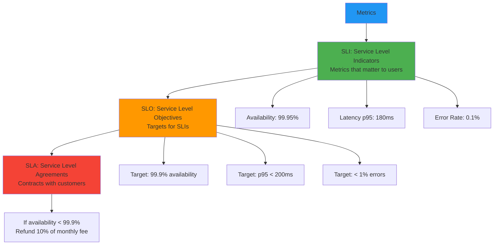
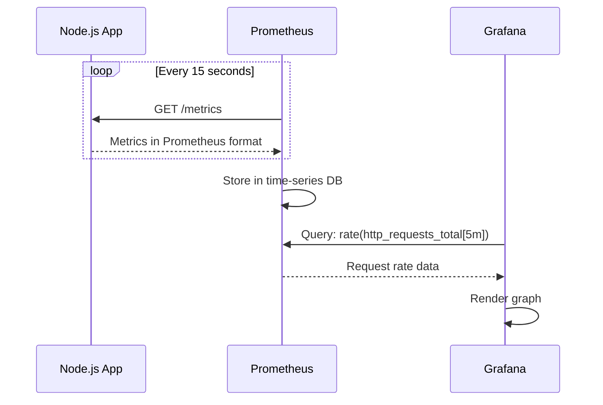
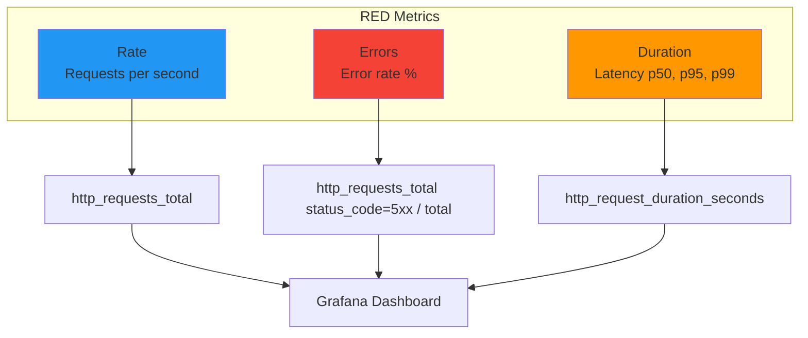
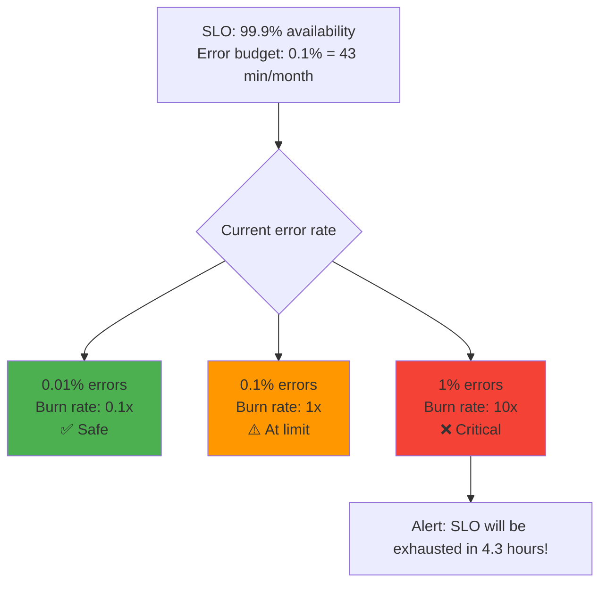

# Metrics and SLIs/SLOs

## 1. Why this exists (Real-world problem first)

You're running a SaaS platform. Your CEO asks "Is the system healthy?" You check logs. What breaks:

- **No quantitative health measure**: Logs show errors, but how many? 10 errors/day is fine, 10,000 is disaster. No way to know.
- **Reactive, not proactive**: System is slow. Users complain. You investigate. By then, you've lost customers.
- **No SLA enforcement**: You promise 99.9% uptime. Are you meeting it? No idea—no metrics tracking availability.
- **Can't prioritize fixes**: 5 bugs reported. Which impacts users most? No data on error rates, latency, or user impact.
- **No capacity planning**: Traffic growing. When will you need more servers? No metrics on CPU, memory, request rate.

Real pain: A fintech API promised 99.9% uptime (43 minutes downtime/month). They had 2 hours of downtime. Customers sued for SLA breach. They had no metrics proving uptime. Lost $2M. The fix: Prometheus metrics tracking uptime, error rate, latency.

**Another scenario**: An e-commerce site had slow checkout. Users complained. Engineers didn't know if it was database, cache, or network. With metrics, they saw database query latency spiked from 50ms to 5 seconds.

## 2. Mental model (build imagination)

Think of metrics as **vital signs** for your system.

**Without metrics**:
- Doctor asks "How do you feel?"
- Patient says "Not great"
- Doctor has no data—no temperature, blood pressure, heart rate
- Can't diagnose or treat

**With metrics**:
- Doctor measures temperature (102°F), blood pressure (140/90), heart rate (110)
- Knows patient has fever and high blood pressure
- Can diagnose and prescribe treatment

**In technical terms**:
- **Metrics**: Quantitative measurements (request rate, error rate, latency)
- **SLI (Service Level Indicator)**: Metric that matters to users (API latency, uptime)
- **SLO (Service Level Objective)**: Target for SLI (99.9% uptime, p95 latency < 200ms)
- **SLA (Service Level Agreement)**: Contract with customers (if SLO violated, refund)

**Key insight**: Metrics turn subjective feelings ("system is slow") into objective data ("p95 latency is 2 seconds").

## 3. How Node.js implements this internally

### Prometheus metrics with prom-client

```javascript
const express = require('express');
const client = require('prom-client');

const app = express();

// Create a Registry
const register = new client.Registry();

// Add default metrics (CPU, memory, event loop lag)
client.collectDefaultMetrics({ register });

// Custom metrics
const httpRequestDuration = new client.Histogram({
  name: 'http_request_duration_seconds',
  help: 'Duration of HTTP requests in seconds',
  labelNames: ['method', 'route', 'status_code'],
  buckets: [0.1, 0.5, 1, 2, 5], // Latency buckets
});

const httpRequestTotal = new client.Counter({
  name: 'http_requests_total',
  help: 'Total number of HTTP requests',
  labelNames: ['method', 'route', 'status_code'],
});

const activeConnections = new client.Gauge({
  name: 'active_connections',
  help: 'Number of active connections',
});

register.registerMetric(httpRequestDuration);
register.registerMetric(httpRequestTotal);
register.registerMetric(activeConnections);

// Middleware to track metrics
app.use((req, res, next) => {
  const start = Date.now();
  
  res.on('finish', () => {
    const duration = (Date.now() - start) / 1000; // seconds
    
    httpRequestDuration.observe(
      { method: req.method, route: req.route?.path || req.path, status_code: res.statusCode },
      duration
    );
    
    httpRequestTotal.inc({
      method: req.method,
      route: req.route?.path || req.path,
      status_code: res.statusCode,
    });
  });
  
  next();
});

// Expose metrics endpoint
app.get('/metrics', async (req, res) => {
  res.set('Content-Type', register.contentType);
  res.end(await register.metrics());
});

app.listen(3000);
```

**What happens**:
1. Request arrives
2. Middleware records start time
3. Request processed
4. On response finish, calculate duration
5. Record metrics (histogram for latency, counter for total requests)
6. Prometheus scrapes `/metrics` endpoint every 15 seconds
7. Metrics stored in Prometheus time-series database

**Event loop impact**: Metric recording is synchronous but very fast (<1ms). Prometheus scraping is HTTP request (async).

### SLI/SLO calculation

```javascript
// SLI: Availability (% of successful requests)
const availability = new client.Gauge({
  name: 'sli_availability',
  help: 'Percentage of successful requests (2xx, 3xx status codes)',
});

// SLI: Latency (% of requests under 200ms)
const latencySLI = new client.Gauge({
  name: 'sli_latency',
  help: 'Percentage of requests with latency < 200ms',
});

// Calculate SLI every minute
setInterval(async () => {
  // Query Prometheus for success rate
  const totalRequests = await getMetric('http_requests_total');
  const successfulRequests = await getMetric('http_requests_total{status_code=~"2..|3.."}');
  
  const availabilitySLI = (successfulRequests / totalRequests) * 100;
  availability.set(availabilitySLI);
  
  // SLO: 99.9% availability
  if (availabilitySLI < 99.9) {
    console.error('SLO violated: Availability is', availabilitySLI);
    // Alert on-call engineer
  }
}, 60000);
```

## 4. Multiple diagrams (MANDATORY)

### Metrics hierarchy



### Prometheus scraping flow



### RED metrics (Rate, Errors, Duration)



### SLO burn rate



## 5. Where this is used in real projects

### Production Prometheus setup

```javascript
const express = require('express');
const client = require('prom-client');

const app = express();
const register = new client.Registry();

// Default metrics (CPU, memory, event loop lag)
client.collectDefaultMetrics({ register, prefix: 'nodejs_' });

// HTTP metrics
const httpDuration = new client.Histogram({
  name: 'http_request_duration_seconds',
  help: 'Duration of HTTP requests in seconds',
  labelNames: ['method', 'route', 'status_code'],
  buckets: [0.001, 0.01, 0.1, 0.5, 1, 2, 5, 10],
});

const httpTotal = new client.Counter({
  name: 'http_requests_total',
  help: 'Total HTTP requests',
  labelNames: ['method', 'route', 'status_code'],
});

// Database metrics
const dbQueryDuration = new client.Histogram({
  name: 'db_query_duration_seconds',
  help: 'Database query duration',
  labelNames: ['query_type'],
  buckets: [0.001, 0.01, 0.1, 0.5, 1, 5],
});

// Business metrics
const checkoutTotal = new client.Counter({
  name: 'checkout_total',
  help: 'Total checkouts',
  labelNames: ['status'], // success, failed
});

const revenue = new client.Counter({
  name: 'revenue_total',
  help: 'Total revenue in cents',
});

register.registerMetric(httpDuration);
register.registerMetric(httpTotal);
register.registerMetric(dbQueryDuration);
register.registerMetric(checkoutTotal);
register.registerMetric(revenue);

// Middleware
app.use((req, res, next) => {
  const start = Date.now();
  
  res.on('finish', () => {
    const duration = (Date.now() - start) / 1000;
    httpDuration.observe({ method: req.method, route: req.route?.path || 'unknown', status_code: res.statusCode }, duration);
    httpTotal.inc({ method: req.method, route: req.route?.path || 'unknown', status_code: res.statusCode });
  });
  
  next();
});

// Track database queries
async function queryWithMetrics(queryType, query, params) {
  const start = Date.now();
  
  try {
    const result = await db.query(query, params);
    const duration = (Date.now() - start) / 1000;
    dbQueryDuration.observe({ query_type: queryType }, duration);
    return result;
  } catch (err) {
    const duration = (Date.now() - start) / 1000;
    dbQueryDuration.observe({ query_type: queryType }, duration);
    throw err;
  }
}

// Track business metrics
app.post('/checkout', async (req, res) => {
  try {
    const order = await createOrder(req.body);
    checkoutTotal.inc({ status: 'success' });
    revenue.inc(order.amount); // Amount in cents
    res.json({ orderId: order.id });
  } catch (err) {
    checkoutTotal.inc({ status: 'failed' });
    res.status(500).json({ error: 'Checkout failed' });
  }
});

app.get('/metrics', async (req, res) => {
  res.set('Content-Type', register.contentType);
  res.end(await register.metrics());
});
```

### SLI/SLO monitoring

```javascript
// Define SLOs
const SLOs = {
  availability: {
    target: 99.9, // 99.9% of requests should succeed
    window: '30d', // Over 30 days
  },
  latency: {
    target: 200, // p95 latency should be < 200ms
    percentile: 95,
    window: '30d',
  },
  errorRate: {
    target: 1, // < 1% error rate
    window: '30d',
  },
};

// Calculate SLI
async function calculateAvailabilitySLI() {
  const query = `
    sum(rate(http_requests_total{status_code=~"2..|3.."}[30d])) /
    sum(rate(http_requests_total[30d])) * 100
  `;
  
  const result = await prometheusQuery(query);
  return result.value;
}

// Check SLO compliance
async function checkSLOs() {
  const availability = await calculateAvailabilitySLI();
  
  if (availability < SLOs.availability.target) {
    console.error(`SLO violated: Availability is ${availability}%, target is ${SLOs.availability.target}%`);
    // Alert on-call engineer
    await sendAlert('SLO Violation', `Availability: ${availability}%`);
  } else {
    console.log(`SLO met: Availability is ${availability}%`);
  }
}

// Run every hour
setInterval(checkSLOs, 3600000);
```

### Error budget calculation

```javascript
// Error budget: How much downtime is allowed
function calculateErrorBudget(sloTarget, windowDays) {
  const totalMinutes = windowDays * 24 * 60;
  const allowedDowntime = totalMinutes * (1 - sloTarget / 100);
  return allowedDowntime;
}

// SLO: 99.9% over 30 days
const errorBudget = calculateErrorBudget(99.9, 30);
console.log(`Error budget: ${errorBudget} minutes`); // 43.2 minutes

// Track error budget consumption
async function trackErrorBudget() {
  const query = `
    sum(rate(http_requests_total{status_code=~"5.."}[30d])) /
    sum(rate(http_requests_total[30d])) * 100
  `;
  
  const errorRate = await prometheusQuery(query);
  const budgetConsumed = (errorRate / (100 - 99.9)) * 100;
  
  console.log(`Error budget consumed: ${budgetConsumed}%`);
  
  if (budgetConsumed > 80) {
    console.warn('Error budget 80% consumed! Slow down deployments.');
  }
}
```

## 6. Where this should NOT be used

### High-cardinality labels

```javascript
// BAD: Using user ID as label (millions of unique values)
const requests = new client.Counter({
  name: 'requests_total',
  labelNames: ['userId'], // High cardinality!
});

requests.inc({ userId: '123' });
requests.inc({ userId: '456' });
// ... millions of unique time series

// GOOD: Use low-cardinality labels
const requests = new client.Counter({
  name: 'requests_total',
  labelNames: ['method', 'status_code'], // Low cardinality
});
```

### Metrics for debugging

```javascript
// BAD: Using metrics to debug specific requests
const requestDetails = new client.Gauge({
  name: 'request_details',
  labelNames: ['requestId', 'userId', 'payload'],
});

// GOOD: Use logs for debugging, metrics for aggregation
logger.info('Request received', { requestId, userId, payload });
```

## 7. Failure modes & edge cases

### Prometheus scrape timeout

**Scenario**: `/metrics` endpoint takes 30 seconds to generate. Prometheus times out after 10 seconds.

**Impact**: Missing metrics.

**Solution**: Optimize metrics generation, use caching.

```javascript
let cachedMetrics = '';
let lastUpdate = 0;

app.get('/metrics', async (req, res) => {
  const now = Date.now();
  
  // Cache for 5 seconds
  if (now - lastUpdate > 5000) {
    cachedMetrics = await register.metrics();
    lastUpdate = now;
  }
  
  res.set('Content-Type', register.contentType);
  res.end(cachedMetrics);
});
```

### Memory leak from unbounded metrics

**Scenario**: Creating new metrics for every unique user ID. Memory grows indefinitely.

**Impact**: Out of memory crash.

**Solution**: Use low-cardinality labels.

## 8. Trade-offs & alternatives

### What you gain
- **Quantitative health**: Know exactly how system is performing
- **Proactive alerts**: Detect issues before users complain
- **SLA enforcement**: Prove you're meeting commitments

### What you sacrifice
- **Storage costs**: Prometheus stores metrics (1-10GB/day)
- **Complexity**: Must set up Prometheus, Grafana
- **Performance**: Metric recording adds 0.1-1ms per request

### Alternatives

**Datadog**
- **Use case**: Managed metrics
- **Benefit**: No infrastructure, integrated with logs/traces
- **Trade-off**: Cost ($15/host/month)

**InfluxDB**
- **Use case**: Time-series database
- **Benefit**: More flexible than Prometheus
- **Trade-off**: More complex setup

**CloudWatch (AWS)**
- **Use case**: AWS-native metrics
- **Benefit**: Integrated with AWS services
- **Trade-off**: Vendor lock-in

## 9. Interview-level articulation

**Question**: "What are SLIs, SLOs, and SLAs?"

**Weak answer**: "SLI is a metric, SLO is a target, SLA is a contract."

**Strong answer**: "SLI (Service Level Indicator) is a quantitative metric that matters to users—like availability, latency, or error rate. SLO (Service Level Objective) is a target for an SLI—for example, 99.9% availability or p95 latency under 200ms. SLA (Service Level Agreement) is a contract with customers that includes consequences if SLOs are violated—like refunds. I implement SLIs with Prometheus metrics, calculate them using PromQL queries, and alert when SLOs are at risk. For example, if availability drops below 99.9%, I alert the on-call engineer. I also track error budgets—if we have 99.9% SLO, we have 43 minutes of downtime per month. If we consume 80% of the error budget, we slow down deployments."

**Follow-up**: "What metrics do you track in a Node.js application?"

**Answer**: "I track RED metrics—Rate (requests per second), Errors (error rate), and Duration (latency percentiles). I use prom-client to create Prometheus metrics: a Counter for total requests, a Histogram for latency with buckets, and a Gauge for active connections. I also track business metrics like checkout success rate and revenue. I expose a `/metrics` endpoint that Prometheus scrapes every 15 seconds. I visualize metrics in Grafana with dashboards showing request rate, error rate, p50/p95/p99 latency, and SLO compliance. I set up alerts for SLO violations—if error rate exceeds 1% or p95 latency exceeds 200ms, PagerDuty alerts the on-call engineer."

## 10. Key takeaways (engineer mindset)

**What to remember**:
- **SLI = metric that matters to users** (availability, latency, error rate)
- **SLO = target for SLI** (99.9% availability, p95 < 200ms)
- **SLA = contract with consequences** (refund if SLO violated)
- **Track RED metrics**: Rate, Errors, Duration
- **Avoid high-cardinality labels** (user ID, request ID)

**What decisions this enables**:
- Defining SLOs for your service
- Choosing metrics to track
- Setting up alerting thresholds
- Calculating error budgets

**How it connects to other Node.js concepts**:
- **Event loop**: Metric recording is synchronous (fast)
- **Middleware**: Metrics tracked via middleware
- **Observability**: Metrics are one pillar (logs, metrics, traces)
- **Performance**: Metrics add 0.1-1ms overhead per request
