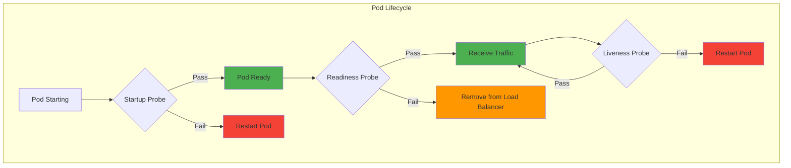
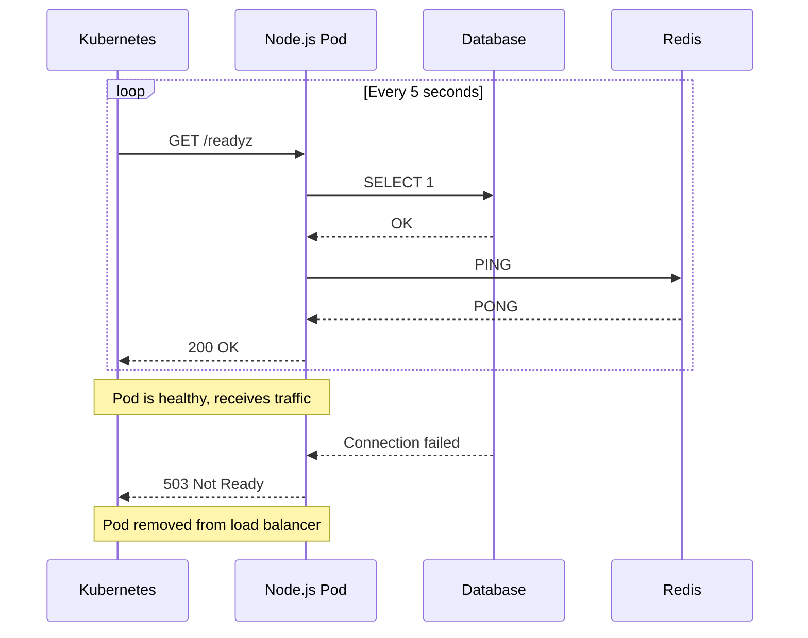
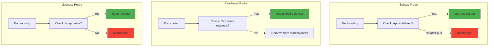
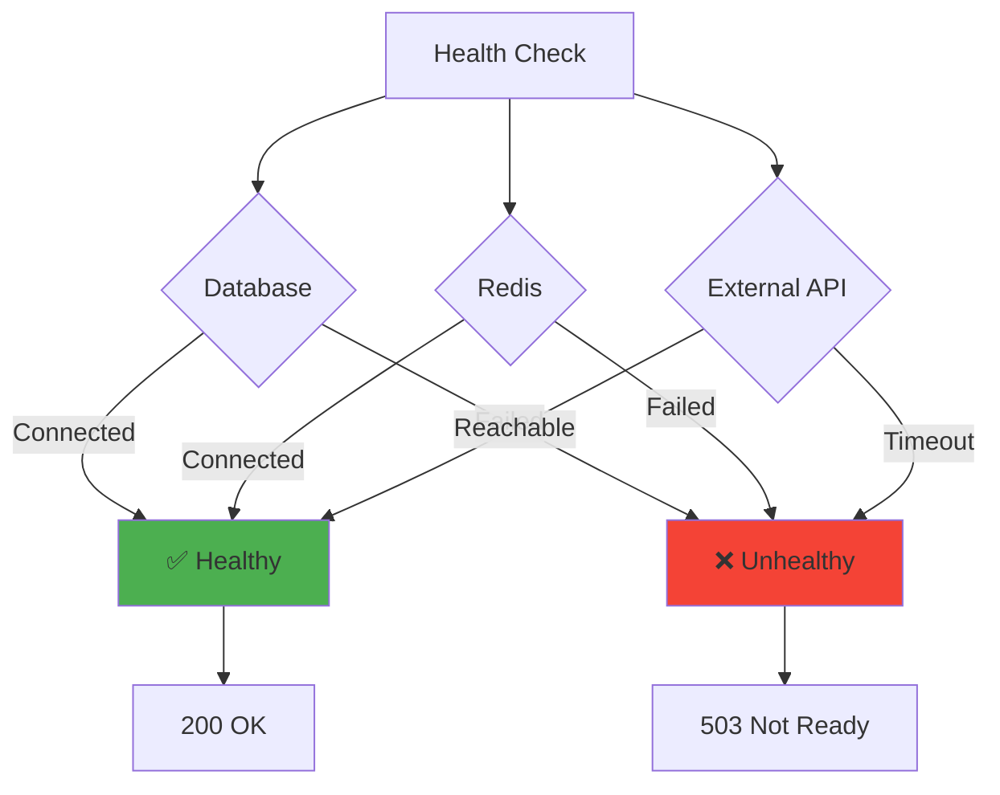

# Health checks

## 1. Why this exists (Real-world problem first)

You're running a Kubernetes cluster with 10 Node.js pods. One pod's database connection pool is exhausted. What breaks:

- **Load balancer sends traffic to dead pod**: Pod is running but can't serve requests. Load balancer doesn't know, keeps sending traffic. Users get 500 errors.
- **No automatic recovery**: Pod is unhealthy but not restarted. Sits there failing requests for hours.
- **Cascading failures**: Unhealthy pod slows down, other pods pick up slack, they become overloaded, entire system fails.
- **Can't deploy safely**: New deployment has bug. All pods become unhealthy. No rollback, entire service down.
- **No visibility**: Don't know which pods are healthy. Can't debug why some users see errors.

Real pain: An e-commerce site deployed a new version. Database migration failed on startup. Kubernetes thought pods were healthy (process running), sent traffic. All requests failed. Site was down for 2 hours. Lost $500K. The fix: readiness probe checking database connectivity.

**Another scenario**: A payment service had memory leak. After 2 hours, pod ran out of memory, became slow. Load balancer kept sending traffic. Users experienced 30-second timeouts. With liveness probe, Kubernetes would have restarted the pod.

## 2. Mental model (build imagination)

Think of health checks as **doctor checkups** for your application.

**Without health checks**:
- Person looks fine (standing, breathing)
- But has internal issues (heart problem, infection)
- No one knows until they collapse

**With health checks**:
- **Liveness check**: Is the person alive? (Is the process running?)
- **Readiness check**: Can the person work? (Can the app serve requests?)
- **Startup check**: Did the person wake up properly? (Did the app initialize?)

**In Kubernetes**:
- **Liveness probe**: If fails, restart pod
- **Readiness probe**: If fails, remove from load balancer
- **Startup probe**: If fails during startup, don't mark as ready

**Key insight**: Health checks prevent **zombie pods**—pods that are running but can't serve requests.

## 3. How Node.js implements this internally

### Basic health check endpoint

```javascript
const express = require('express');
const app = express();

// Liveness probe: Is the process alive?
app.get('/healthz', (req, res) => {
  res.status(200).json({ status: 'ok' });
});

// Readiness probe: Can the app serve requests?
app.get('/readyz', async (req, res) => {
  try {
    // Check database connection
    await db.query('SELECT 1');
    
    // Check Redis connection
    await redis.ping();
    
    // All checks passed
    res.status(200).json({ status: 'ready' });
  } catch (err) {
    // Not ready
    res.status(503).json({ status: 'not ready', error: err.message });
  }
});

app.listen(3000);
```

**What happens**:
1. Kubernetes calls `/healthz` every 10 seconds
2. If 3 consecutive failures, restart pod
3. Kubernetes calls `/readyz` every 5 seconds
4. If fails, remove pod from service endpoints
5. No traffic sent to unhealthy pod

**Event loop impact**: Health check is HTTP request (async I/O). Database query is also async.

### Comprehensive health check

```javascript
const express = require('express');
const app = express();

let isShuttingDown = false;

// Health check with multiple dependencies
app.get('/readyz', async (req, res) => {
  if (isShuttingDown) {
    return res.status(503).json({ status: 'shutting down' });
  }
  
  const checks = {
    database: false,
    redis: false,
    externalAPI: false,
  };
  
  try {
    // Check database
    await db.query('SELECT 1');
    checks.database = true;
  } catch (err) {
    console.error('Database health check failed:', err);
  }
  
  try {
    // Check Redis
    await redis.ping();
    checks.redis = true;
  } catch (err) {
    console.error('Redis health check failed:', err);
  }
  
  try {
    // Check external API (with timeout)
    await axios.get('https://api.example.com/health', { timeout: 2000 });
    checks.externalAPI = true;
  } catch (err) {
    console.error('External API health check failed:', err);
  }
  
  // All checks must pass
  const allHealthy = Object.values(checks).every(v => v);
  
  if (allHealthy) {
    res.status(200).json({ status: 'ready', checks });
  } else {
    res.status(503).json({ status: 'not ready', checks });
  }
});

// Graceful shutdown
process.on('SIGTERM', () => {
  isShuttingDown = true;
  
  // Stop accepting new requests
  server.close(() => {
    console.log('Server closed');
    process.exit(0);
  });
});
```

## 4. Multiple diagrams (MANDATORY)

### Kubernetes health probes



### Health check flow



### Liveness vs Readiness vs Startup



### Health check dependencies



## 5. Where this is used in real projects

### Production health checks with Kubernetes

```javascript
const express = require('express');
const app = express();

let isReady = false;
let isShuttingDown = false;

// Startup probe: Check if app initialized
app.get('/startup', async (req, res) => {
  if (isReady) {
    return res.status(200).json({ status: 'started' });
  }
  
  res.status(503).json({ status: 'starting' });
});

// Liveness probe: Check if app is alive
app.get('/healthz', (req, res) => {
  if (isShuttingDown) {
    return res.status(503).json({ status: 'shutting down' });
  }
  
  // Check event loop lag
  const lag = eventLoopLag();
  if (lag > 1000) { // 1 second
    return res.status(503).json({ status: 'unhealthy', lag });
  }
  
  res.status(200).json({ status: 'ok', lag });
});

// Readiness probe: Check if app can serve requests
app.get('/readyz', async (req, res) => {
  if (isShuttingDown) {
    return res.status(503).json({ status: 'shutting down' });
  }
  
  if (!isReady) {
    return res.status(503).json({ status: 'not ready' });
  }
  
  const checks = {};
  
  // Check database
  try {
    await db.query('SELECT 1');
    checks.database = 'ok';
  } catch (err) {
    checks.database = 'failed';
    return res.status(503).json({ status: 'not ready', checks });
  }
  
  // Check Redis
  try {
    await redis.ping();
    checks.redis = 'ok';
  } catch (err) {
    checks.redis = 'failed';
    return res.status(503).json({ status: 'not ready', checks });
  }
  
  res.status(200).json({ status: 'ready', checks });
});

// Initialize app
async function initialize() {
  try {
    await db.connect();
    await redis.connect();
    isReady = true;
    console.log('App initialized');
  } catch (err) {
    console.error('Initialization failed:', err);
    process.exit(1);
  }
}

initialize();

// Graceful shutdown
process.on('SIGTERM', async () => {
  console.log('SIGTERM received, starting graceful shutdown');
  isShuttingDown = true;
  
  // Stop accepting new requests
  server.close(async () => {
    await db.end();
    await redis.quit();
    console.log('Graceful shutdown complete');
    process.exit(0);
  });
  
  // Force shutdown after 30 seconds
  setTimeout(() => {
    console.error('Forced shutdown after timeout');
    process.exit(1);
  }, 30000);
});

const server = app.listen(3000);
```

### Kubernetes deployment with probes

```yaml
apiVersion: apps/v1
kind: Deployment
metadata:
  name: nodejs-app
spec:
  replicas: 3
  template:
    spec:
      containers:
      - name: app
        image: nodejs-app:1.0.0
        ports:
        - containerPort: 3000
        
        # Startup probe: Wait for app to initialize
        startupProbe:
          httpGet:
            path: /startup
            port: 3000
          initialDelaySeconds: 0
          periodSeconds: 5
          failureThreshold: 12  # 60 seconds total
        
        # Liveness probe: Restart if unhealthy
        livenessProbe:
          httpGet:
            path: /healthz
            port: 3000
          initialDelaySeconds: 10
          periodSeconds: 10
          failureThreshold: 3
        
        # Readiness probe: Remove from load balancer if not ready
        readinessProbe:
          httpGet:
            path: /readyz
            port: 3000
          initialDelaySeconds: 5
          periodSeconds: 5
          failureThreshold: 2
```

### Event loop lag monitoring

```javascript
const eventLoopLag = require('event-loop-lag');

const lag = eventLoopLag(1000); // Sample every 1 second

app.get('/healthz', (req, res) => {
  const currentLag = lag();
  
  if (currentLag > 1000) {
    return res.status(503).json({
      status: 'unhealthy',
      reason: 'event loop lag',
      lag: currentLag,
    });
  }
  
  res.status(200).json({ status: 'ok', lag: currentLag });
});
```

### Dependency health checks

```javascript
class HealthChecker {
  constructor() {
    this.checks = new Map();
  }
  
  register(name, checkFn) {
    this.checks.set(name, checkFn);
  }
  
  async runAll() {
    const results = {};
    
    for (const [name, checkFn] of this.checks) {
      try {
        await checkFn();
        results[name] = { status: 'ok' };
      } catch (err) {
        results[name] = { status: 'failed', error: err.message };
      }
    }
    
    return results;
  }
}

const healthChecker = new HealthChecker();

// Register checks
healthChecker.register('database', async () => {
  await db.query('SELECT 1');
});

healthChecker.register('redis', async () => {
  await redis.ping();
});

healthChecker.register('s3', async () => {
  await s3.headBucket({ Bucket: 'my-bucket' }).promise();
});

app.get('/readyz', async (req, res) => {
  const results = await healthChecker.runAll();
  
  const allHealthy = Object.values(results).every(r => r.status === 'ok');
  
  if (allHealthy) {
    res.status(200).json({ status: 'ready', checks: results });
  } else {
    res.status(503).json({ status: 'not ready', checks: results });
  }
});
```

## 6. Where this should NOT be used

### Expensive health checks

```javascript
// BAD: Running expensive query on every health check
app.get('/readyz', async (req, res) => {
  const count = await db.query('SELECT COUNT(*) FROM users'); // Slow!
  res.status(200).json({ status: 'ok' });
});

// GOOD: Simple query
app.get('/readyz', async (req, res) => {
  await db.query('SELECT 1'); // Fast
  res.status(200).json({ status: 'ok' });
});
```

### Checking external dependencies in liveness probe

```javascript
// BAD: Liveness probe fails if external API is down
app.get('/healthz', async (req, res) => {
  await axios.get('https://external-api.com/health'); // External dependency!
  res.status(200).json({ status: 'ok' });
});

// GOOD: Only check internal health
app.get('/healthz', (req, res) => {
  res.status(200).json({ status: 'ok' });
});
```

## 7. Failure modes & edge cases

### Startup probe timeout

**Scenario**: App takes 2 minutes to initialize. Startup probe times out after 60 seconds.

**Impact**: Pod restarted before initialization completes.

**Solution**: Increase startup probe timeout.

```yaml
startupProbe:
  failureThreshold: 30  # 30 * 10s = 300s = 5 minutes
  periodSeconds: 10
```

### Readiness probe flapping

**Scenario**: Database connection intermittent. Readiness probe fails, passes, fails, passes.

**Impact**: Pod added/removed from load balancer repeatedly.

**Solution**: Add retry logic, increase failure threshold.

```javascript
let consecutiveFailures = 0;

app.get('/readyz', async (req, res) => {
  try {
    await db.query('SELECT 1');
    consecutiveFailures = 0;
    res.status(200).json({ status: 'ready' });
  } catch (err) {
    consecutiveFailures++;
    
    if (consecutiveFailures >= 3) {
      res.status(503).json({ status: 'not ready' });
    } else {
      res.status(200).json({ status: 'ready' }); // Still ready
    }
  }
});
```

## 8. Trade-offs & alternatives

### What you gain
- **Automatic recovery**: Unhealthy pods restarted automatically
- **Safe deployments**: Bad deployments don't receive traffic
- **High availability**: Traffic only sent to healthy pods

### What you sacrifice
- **Complexity**: Must implement health check endpoints
- **False positives**: Overly strict checks cause unnecessary restarts
- **Overhead**: Health checks add load (every 5-10 seconds)

### Alternatives

**TCP probes**
- **Use case**: Simple check if port is open
- **Benefit**: No HTTP endpoint needed
- **Trade-off**: Can't check dependencies

**Exec probes**
- **Use case**: Run command in container
- **Benefit**: Flexible
- **Trade-off**: Slower than HTTP

## 9. Interview-level articulation

**Question**: "What's the difference between liveness and readiness probes?"

**Weak answer**: "Liveness checks if the app is alive, readiness checks if it's ready."

**Strong answer**: "Liveness probe checks if the application is alive and should be restarted if it fails. For example, if the event loop is blocked or the process is deadlocked, the liveness probe fails and Kubernetes restarts the pod. Readiness probe checks if the application can serve requests and should be removed from the load balancer if it fails. For example, if the database connection is down, the readiness probe fails and Kubernetes stops sending traffic to that pod. The key difference is the action: liveness probe triggers a restart, readiness probe triggers removal from load balancer. I implement liveness as a simple endpoint that checks event loop lag, and readiness as an endpoint that checks database and Redis connectivity."

**Follow-up**: "How do you implement graceful shutdown with health checks?"

**Answer**: "On SIGTERM signal, I set a flag `isShuttingDown = true`. The readiness probe checks this flag and returns 503, which tells Kubernetes to remove the pod from the load balancer. Then I stop accepting new requests with `server.close()`, wait for in-flight requests to complete (with a 30-second timeout), close database connections, and exit. This ensures no requests are dropped during shutdown. I also implement a startup probe that waits for database initialization before marking the pod as ready."

## 10. Key takeaways (engineer mindset)

**What to remember**:
- **Liveness probe**: Restart if fails (checks if app is alive)
- **Readiness probe**: Remove from load balancer if fails (checks if app can serve requests)
- **Startup probe**: Wait for initialization (checks if app started successfully)
- **Keep health checks fast**: < 1 second
- **Don't check external dependencies in liveness probe**

**What decisions this enables**:
- Designing health check endpoints
- Configuring Kubernetes probes
- Implementing graceful shutdown
- Handling dependency failures

**How it connects to other Node.js concepts**:
- **Event loop**: Check event loop lag in liveness probe
- **Graceful shutdown**: Coordinate with readiness probe
- **Database**: Check connection in readiness probe
- **Observability**: Health checks are part of monitoring
