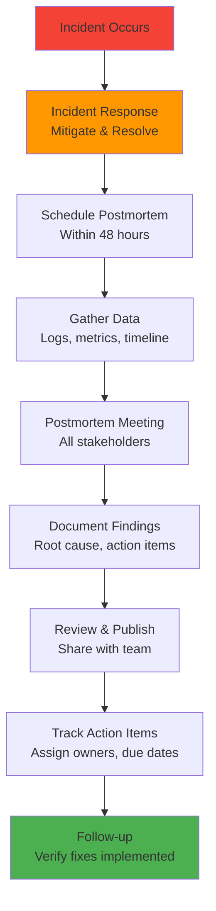
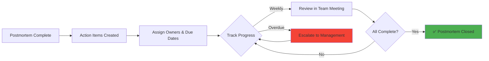
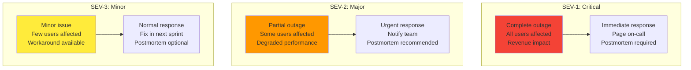

# Postmortem culture

## 1. Why this exists (Real-world problem first)

Your production system goes down for 2 hours. What breaks without postmortem culture:

- **Same failures repeat**: Database connection pool exhausted. Fix it. Happens again 3 months later. No documentation of root cause or prevention.
- **Blame culture**: Outage happens. Management blames engineer who deployed. Engineer becomes risk-averse, stops innovating.
- **No learning**: Outage cost $1M. Team doesn't analyze what went wrong. Misses opportunity to prevent future outages.
- **Hidden systemic issues**: 10 small outages in 6 months. Each treated as isolated incident. Don't realize they all have same root cause (poor monitoring).
- **No process improvement**: Incident response was chaotic. Took 30 minutes to find on-call engineer. No one documents or fixes the process.

Real pain: A payment service had 5 database outages in 6 months. Each time, they restarted the database and moved on. No postmortem. On the 6th outage, they finally did a postmortem and discovered all outages were caused by a slow query that locked tables. One code fix prevented all future outages. The fix: blameless postmortems after every incident.

**Another scenario**: A social media platform had a 4-hour outage. No postmortem. 2 months later, same issue caused another 4-hour outage. With postmortems, they would have documented the root cause and prevented the second outage.

## 2. Mental model (build imagination)

Think of postmortems as **airplane crash investigations**.

**Without postmortem**:
- Plane crashes
- "Pilot error", blame pilot
- No investigation
- Same type of crash happens again

**With postmortem**:
- Plane crashes
- Investigate: black box, flight data, maintenance records
- Find root cause: faulty sensor
- Fix: replace sensors on all planes
- Prevent future crashes

**In technical terms**:
- **Incident**: Production outage, SLO violation, data loss
- **Postmortem**: Document what happened, why, how to prevent
- **Blameless**: Focus on systems, not people
- **Action items**: Concrete steps to prevent recurrence

**Key insight**: Postmortems turn **failures into learning opportunities**.

## 3. How Node.js implements this internally

### Postmortem template

```markdown
# Postmortem: Database Connection Pool Exhausted

**Date**: 2024-01-15
**Duration**: 2 hours (14:00-16:00 UTC)
**Severity**: SEV-1 (Complete outage)
**Impact**: 100% of API requests failed, $500K revenue lost

## Summary
Database connection pool was exhausted, causing all API requests to timeout. System was down for 2 hours until connection pool size was increased.

## Timeline (UTC)
- 14:00: First alerts for high error rate
- 14:05: On-call engineer paged
- 14:10: Engineer investigates logs, sees "connection pool exhausted"
- 14:30: Engineer increases pool size from 10 to 50
- 14:35: System starts recovering
- 16:00: All metrics back to normal

## Root Cause
Connection pool size was set to 10. During traffic spike (Black Friday sale), 10 connections were insufficient. Requests waited for available connection, timed out after 30 seconds.

## Contributing Factors
1. No monitoring on connection pool usage
2. Connection pool size not load-tested
3. No auto-scaling of connection pool

## What Went Well
- Alerts fired within 5 minutes
- On-call engineer responded quickly
- Fix was simple (increase pool size)

## What Went Poorly
- Took 30 minutes to identify root cause (poor logging)
- No runbook for connection pool issues
- No load testing before Black Friday

## Action Items
1. [P0] Add monitoring for connection pool usage (Owner: Alice, Due: 2024-01-20)
2. [P0] Increase connection pool size to 100 (Owner: Bob, Due: 2024-01-16)
3. [P1] Create runbook for connection pool exhaustion (Owner: Charlie, Due: 2024-01-25)
4. [P1] Load test before next major sale (Owner: Dave, Due: 2024-02-01)
5. [P2] Implement auto-scaling connection pool (Owner: Eve, Due: 2024-03-01)

## Lessons Learned
- Always monitor resource usage (connections, memory, CPU)
- Load test before traffic spikes
- Document common failure modes in runbooks
```

### Automated postmortem creation

```javascript
const fs = require('fs');

class PostmortemGenerator {
  constructor() {
    this.template = fs.readFileSync('./postmortem-template.md', 'utf8');
  }
  
  generate(incident) {
    let postmortem = this.template;
    
    // Replace placeholders
    postmortem = postmortem.replace('{{TITLE}}', incident.title);
    postmortem = postmortem.replace('{{DATE}}', incident.date);
    postmortem = postmortem.replace('{{DURATION}}', incident.duration);
    postmortem = postmortem.replace('{{SEVERITY}}', incident.severity);
    postmortem = postmortem.replace('{{IMPACT}}', incident.impact);
    postmortem = postmortem.replace('{{SUMMARY}}', incident.summary);
    
    // Generate timeline
    const timeline = incident.events
      .map(e => `- ${e.time}: ${e.description}`)
      .join('\n');
    postmortem = postmortem.replace('{{TIMELINE}}', timeline);
    
    // Save to file
    const filename = `postmortems/${incident.date}-${incident.slug}.md`;
    fs.writeFileSync(filename, postmortem);
    
    console.log(`Postmortem created: ${filename}`);
    return filename;
  }
}

// Usage
const generator = new PostmortemGenerator();

const incident = {
  title: 'Database Connection Pool Exhausted',
  date: '2024-01-15',
  duration: '2 hours',
  severity: 'SEV-1',
  impact: '100% of API requests failed',
  summary: 'Connection pool exhausted during traffic spike',
  slug: 'db-pool-exhausted',
  events: [
    { time: '14:00', description: 'First alerts for high error rate' },
    { time: '14:05', description: 'On-call engineer paged' },
    { time: '14:30', description: 'Pool size increased from 10 to 50' },
    { time: '16:00', description: 'All metrics back to normal' },
  ],
};

generator.generate(incident);
```

## 4. Multiple diagrams (MANDATORY)

### Postmortem process flow



### Blameless culture

```mermaid
graph TB
    subgraph "Blame Culture"
        BC1[Incident occurs] --> BC2[Find who caused it]
        BC2 --> BC3[Blame individual]
        BC3 --> BC4[Engineer punished]
        BC4 --> BC5[Team becomes risk-averse<br/>Stops innovating]
    end
    
    subgraph "Blameless Culture"
        BL1[Incident occurs] --> BL2[Analyze system failures]
        BL2 --> BL3[Identify root causes]
        BL3 --> BL4[Fix systems & processes]
        BL4 --> BL5[Team learns & improves<br/>Continues innovating]
    end
    
    style BC5 fill:#F44336
    style BL5 fill:#4CAF50
```



### Action item tracking



### Incident severity levels



## 5. Where this is used in real projects

### Production postmortem workflow

```javascript
const express = require('express');
const app = express();

// Incident tracking
const incidents = [];

class Incident {
  constructor(data) {
    this.id = Date.now();
    this.title = data.title;
    this.severity = data.severity; // SEV-1, SEV-2, SEV-3
    this.startTime = new Date();
    this.endTime = null;
    this.status = 'ACTIVE'; // ACTIVE, RESOLVED, POSTMORTEM_PENDING, CLOSED
    this.timeline = [];
    this.actionItems = [];
  }
  
  addEvent(description) {
    this.timeline.push({
      time: new Date(),
      description,
    });
  }
  
  resolve() {
    this.endTime = new Date();
    this.status = 'RESOLVED';
    this.addEvent('Incident resolved');
    
    // Schedule postmortem for SEV-1 and SEV-2
    if (this.severity === 'SEV-1' || this.severity === 'SEV-2') {
      this.status = 'POSTMORTEM_PENDING';
      this.schedulePostmortem();
    }
  }
  
  schedulePostmortem() {
    // Schedule postmortem meeting within 48 hours
    const postmortemDate = new Date(Date.now() + 48 * 60 * 60 * 1000);
    console.log(`Postmortem scheduled for ${postmortemDate}`);
    
    // Send calendar invite
    // Create postmortem document
  }
  
  addActionItem(item) {
    this.actionItems.push({
      id: this.actionItems.length + 1,
      description: item.description,
      owner: item.owner,
      dueDate: item.dueDate,
      priority: item.priority, // P0, P1, P2
      status: 'OPEN', // OPEN, IN_PROGRESS, DONE
    });
  }
  
  getDuration() {
    if (!this.endTime) return null;
    return (this.endTime - this.startTime) / 1000 / 60; // minutes
  }
}

// Create incident
app.post('/incidents', (req, res) => {
  const incident = new Incident({
    title: req.body.title,
    severity: req.body.severity,
  });
  
  incidents.push(incident);
  
  incident.addEvent('Incident created');
  
  res.json(incident);
});

// Resolve incident
app.post('/incidents/:id/resolve', (req, res) => {
  const incident = incidents.find(i => i.id === parseInt(req.params.id));
  
  if (!incident) {
    return res.status(404).json({ error: 'Incident not found' });
  }
  
  incident.resolve();
  
  res.json(incident);
});

// Add action item
app.post('/incidents/:id/action-items', (req, res) => {
  const incident = incidents.find(i => i.id === parseInt(req.params.id));
  
  if (!incident) {
    return res.status(404).json({ error: 'Incident not found' });
  }
  
  incident.addActionItem({
    description: req.body.description,
    owner: req.body.owner,
    dueDate: req.body.dueDate,
    priority: req.body.priority,
  });
  
  res.json(incident);
});

// Get all incidents
app.get('/incidents', (req, res) => {
  res.json(incidents);
});
```

## 6. Where this should NOT be used

### Minor issues

```javascript
// BAD: Postmortem for every small bug
// Bug: Typo in error message
// Postmortem: 2-hour meeting, 10-page document

// GOOD: Postmortems for SEV-1 and SEV-2 incidents only
// SEV-3 incidents: optional postmortem or quick retrospective
```

### Blame-focused postmortems

```markdown
# BAD Postmortem

## Root Cause
Bob deployed buggy code without testing.

## Action Items
- Fire Bob
- Make everyone afraid to deploy

# GOOD Postmortem

## Root Cause
Deployment pipeline lacked automated tests. Buggy code passed manual review.

## Action Items
- Add automated integration tests
- Implement canary deployments
- Improve code review checklist
```

## 7. Failure modes & edge cases

### Action items not tracked

**Scenario**: Postmortem creates 10 action items. No one tracks them. None get done.

**Impact**: Same incident repeats.

**Solution**: Assign owners, due dates, track in weekly meetings.

### Postmortem fatigue

**Scenario**: 20 incidents/month. 20 postmortems. Team spends all time in postmortem meetings.

**Impact**: No time for actual work.

**Solution**: Only do postmortems for SEV-1 and SEV-2. Group similar incidents.

## 8. Trade-offs & alternatives

### What you gain
- **Learning from failures**: Turn incidents into improvement opportunities
- **Prevent recurrence**: Document root causes, implement fixes
- **Blameless culture**: Focus on systems, not people

### What you sacrifice
- **Time**: Postmortems take 2-4 hours (meeting + documentation)
- **Overhead**: Must track action items, follow up
- **Fatigue**: Too many postmortems can overwhelm team

### Alternatives

**Quick retrospectives**
- **Use case**: Minor incidents (SEV-3)
- **Benefit**: Faster, less formal
- **Trade-off**: Less thorough

**No postmortems**
- **Use case**: Very small teams, low-risk systems
- **Benefit**: No overhead
- **Trade-off**: Don't learn from failures

## 9. Interview-level articulation

**Question**: "What is a postmortem and why is it important?"

**Weak answer**: "It's a document you write after an outage."

**Strong answer**: "A postmortem is a blameless analysis of an incident to understand what happened, why, and how to prevent it. After a SEV-1 or SEV-2 incident, we schedule a postmortem meeting within 48 hours. We gather data—logs, metrics, timeline—and document the root cause, contributing factors, what went well, what went poorly, and action items. The key is blameless—we focus on system failures, not individual mistakes. For example, instead of 'Bob deployed buggy code', we say 'Deployment pipeline lacked automated tests'. Action items have owners and due dates, and we track them in weekly meetings. Postmortems turn failures into learning opportunities and prevent recurrence."

**Follow-up**: "How do you ensure action items get completed?"

**Answer**: "I assign each action item an owner, due date, and priority (P0, P1, P2). P0 items must be done within a week, P1 within a month, P2 within a quarter. We track action items in a shared document or issue tracker. In weekly team meetings, we review overdue action items and escalate to management if needed. We also do a follow-up review 1 month after the postmortem to verify all P0 and P1 items are complete. If action items aren't getting done, it's a sign the team is overloaded or the items aren't actually important."

## 10. Key takeaways (engineer mindset)

**What to remember**:
- **Postmortems are blameless**—focus on systems, not people
- **Do postmortems for SEV-1 and SEV-2 incidents**
- **Action items must have owners and due dates**
- **Track action items in weekly meetings**
- **Postmortems prevent recurrence**—document root causes and fixes

**What decisions this enables**:
- When to do postmortems (SEV-1/SEV-2 vs SEV-3)
- How to structure postmortem documents
- How to track and prioritize action items
- How to build a blameless culture

**How it connects to other Node.js concepts**:
- **Observability**: Postmortems rely on logs, metrics, traces
- **Error budgets**: Incidents consume error budget
- **Deployment**: Postmortems often lead to deployment process improvements
- **Monitoring**: Postmortems identify gaps in monitoring
