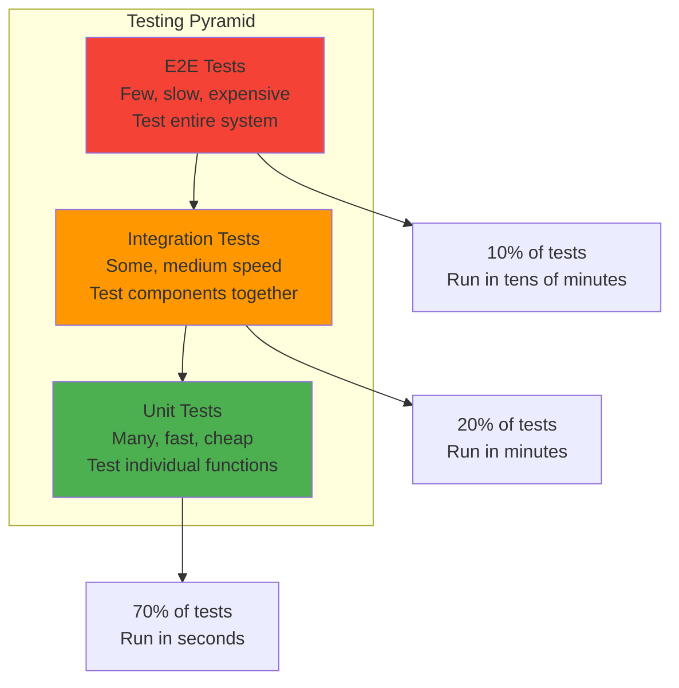
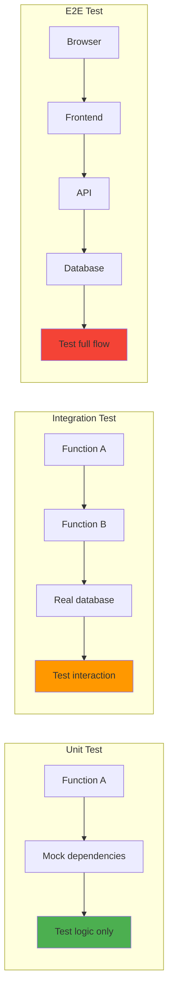
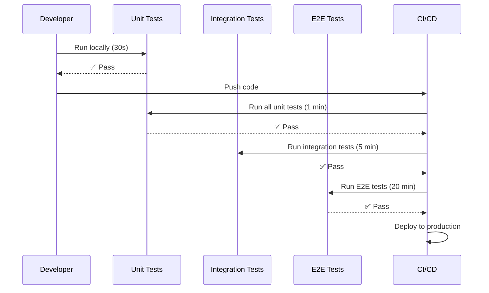
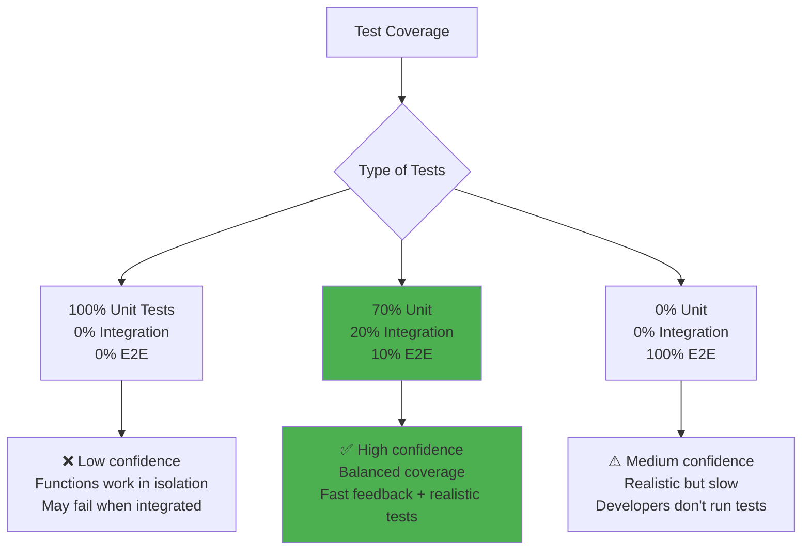

# Unit vs Integration vs E2E

## 1. Why this exists (Real-world problem first)

You're building an e-commerce API. You write code, deploy to production. What breaks without proper testing:

- **No unit tests**: Function to calculate tax has bug. Returns negative tax. Discovered in production. Lost $50K before fix.
- **No integration tests**: Payment service integration works in isolation. Fails when combined with order service. Users can't checkout.
- **No E2E tests**: Entire checkout flow works in staging. Breaks in production because production database has different schema.
- **Only unit tests**: Each function works perfectly. When combined, system fails. Unit tests give false confidence.
- **Only E2E tests**: E2E tests are slow (5 minutes). Developers don't run them locally. Bugs discovered late in CI/CD pipeline.

Real pain: A payment service had 90% unit test coverage. Felt confident. Deployed to production. Payment gateway integration failed—never tested integration with real gateway. Lost $1M in transactions. The fix: add integration tests with payment gateway sandbox.

**Another scenario**: A social media platform had comprehensive E2E tests. Tests took 2 hours to run. Developers stopped running them. Bugs slipped through. With fast unit tests (30 seconds) + selective integration tests (5 minutes), developers caught bugs early.

## 2. Mental model (build imagination)

Think of testing as **quality control in a car factory**.

**Unit tests = Testing individual parts**:
- Test engine separately
- Test brakes separately
- Test steering separately
- Fast, isolated, many tests

**Integration tests = Testing parts together**:
- Test engine + transmission
- Test brakes + ABS system
- Test steering + suspension
- Medium speed, some dependencies

**E2E tests = Test driving the car**:
- Start car, drive, brake, turn, park
- Tests entire system together
- Slow, realistic, few tests

**Key insight**: You need **all three levels**. Unit tests catch logic bugs fast. Integration tests catch interface bugs. E2E tests catch workflow bugs.

## 3. How Node.js implements this internally

### Unit test with Jest

```javascript
// src/tax-calculator.js
function calculateTax(amount, rate) {
  if (amount < 0) {
    throw new Error('Amount cannot be negative');
  }
  return amount * rate;
}

module.exports = { calculateTax };

// tests/tax-calculator.test.js
const { calculateTax } = require('../src/tax-calculator');

describe('calculateTax', () => {
  it('should calculate tax correctly', () => {
    expect(calculateTax(100, 0.1)).toBe(10);
  });
  
  it('should throw error for negative amount', () => {
    expect(() => calculateTax(-100, 0.1)).toThrow('Amount cannot be negative');
  });
  
  it('should handle zero amount', () => {
    expect(calculateTax(0, 0.1)).toBe(0);
  });
});
```

**What happens**:
1. Jest runs test file
2. Imports function
3. Calls function with test inputs
4. Asserts output matches expected
5. No external dependencies (database, API)

**Event loop impact**: Unit tests are synchronous, very fast (<1ms per test).

### Integration test with Supertest

```javascript
// src/app.js
const express = require('express');
const app = express();

app.post('/orders', async (req, res) => {
  const order = await createOrder(req.body);
  const payment = await processPayment(order);
  res.json({ orderId: order.id, paymentId: payment.id });
});

module.exports = app;

// tests/orders.integration.test.js
const request = require('supertest');
const app = require('../src/app');

describe('POST /orders', () => {
  it('should create order and process payment', async () => {
    const response = await request(app)
      .post('/orders')
      .send({ items: [{ id: 1, quantity: 2 }], total: 100 })
      .expect(200);
    
    expect(response.body).toHaveProperty('orderId');
    expect(response.body).toHaveProperty('paymentId');
  });
  
  it('should return 400 for invalid order', async () => {
    await request(app)
      .post('/orders')
      .send({ items: [] })
      .expect(400);
  });
});
```

**What happens**:
1. Supertest starts Express app
2. Makes HTTP request to endpoint
3. Tests entire request/response flow
4. May use real database (or test database)
5. Tests integration between layers

### E2E test with Playwright

```javascript
// tests/checkout.e2e.test.js
const { test, expect } = require('@playwright/test');

test('complete checkout flow', async ({ page }) => {
  // Navigate to homepage
  await page.goto('http://localhost:3000');
  
  // Add item to cart
  await page.click('button[data-testid="add-to-cart"]');
  
  // Go to cart
  await page.click('a[href="/cart"]');
  await expect(page.locator('.cart-item')).toHaveCount(1);
  
  // Proceed to checkout
  await page.click('button[data-testid="checkout"]');
  
  // Fill shipping info
  await page.fill('input[name="address"]', '123 Main St');
  await page.fill('input[name="city"]', 'New York');
  
  // Fill payment info
  await page.fill('input[name="cardNumber"]', '4111111111111111');
  await page.fill('input[name="cvv"]', '123');
  
  // Submit order
  await page.click('button[type="submit"]');
  
  // Verify success
  await expect(page.locator('.success-message')).toBeVisible();
  await expect(page.locator('.order-id')).toContainText('ORDER-');
});
```

**What happens**:
1. Playwright launches real browser
2. Navigates through UI like real user
3. Tests entire system (frontend + backend + database)
4. Slow but realistic

## 4. Multiple diagrams (MANDATORY)

### Testing pyramid



### Test scope comparison



### Test execution flow



### Test coverage vs confidence



## 5. Where this is used in real projects

### Production test suite structure

```javascript
// package.json
{
  "scripts": {
    "test": "npm run test:unit && npm run test:integration && npm run test:e2e",
    "test:unit": "jest --testPathPattern=\\.unit\\.test\\.js$",
    "test:integration": "jest --testPathPattern=\\.integration\\.test\\.js$ --runInBand",
    "test:e2e": "playwright test",
    "test:watch": "jest --watch --testPathPattern=\\.unit\\.test\\.js$"
  }
}

// Project structure
// tests/
//   unit/
//     tax-calculator.unit.test.js
//     discount-calculator.unit.test.js
//   integration/
//     orders.integration.test.js
//     payments.integration.test.js
//   e2e/
//     checkout.e2e.test.js
//     login.e2e.test.js
```

### Unit test: Pure function

```javascript
// src/utils/price-calculator.js
function calculateFinalPrice(basePrice, discountPercent, taxRate) {
  const discountAmount = basePrice * (discountPercent / 100);
  const priceAfterDiscount = basePrice - discountAmount;
  const taxAmount = priceAfterDiscount * taxRate;
  return priceAfterDiscount + taxAmount;
}

module.exports = { calculateFinalPrice };

// tests/unit/price-calculator.unit.test.js
const { calculateFinalPrice } = require('../../src/utils/price-calculator');

describe('calculateFinalPrice', () => {
  it('should calculate price with discount and tax', () => {
    const result = calculateFinalPrice(100, 10, 0.08);
    // 100 - 10% = 90
    // 90 + 8% tax = 97.2
    expect(result).toBe(97.2);
  });
  
  it('should handle zero discount', () => {
    const result = calculateFinalPrice(100, 0, 0.08);
    expect(result).toBe(108);
  });
  
  it('should handle zero tax', () => {
    const result = calculateFinalPrice(100, 10, 0);
    expect(result).toBe(90);
  });
});
```

### Integration test: API + Database

```javascript
// tests/integration/orders.integration.test.js
const request = require('supertest');
const app = require('../../src/app');
const db = require('../../src/db');

describe('Orders API Integration', () => {
  beforeAll(async () => {
    await db.connect();
    await db.query('CREATE TABLE IF NOT EXISTS orders (id SERIAL PRIMARY KEY, total DECIMAL)');
  });
  
  afterAll(async () => {
    await db.query('DROP TABLE orders');
    await db.close();
  });
  
  beforeEach(async () => {
    await db.query('TRUNCATE TABLE orders');
  });
  
  it('should create order and save to database', async () => {
    const response = await request(app)
      .post('/orders')
      .send({ items: [{ id: 1, price: 100, quantity: 2 }] })
      .expect(201);
    
    expect(response.body).toHaveProperty('orderId');
    
    // Verify order saved to database
    const result = await db.query('SELECT * FROM orders WHERE id = $1', [response.body.orderId]);
    expect(result.rows[0].total).toBe('200.00');
  });
  
  it('should return 400 for invalid order', async () => {
    await request(app)
      .post('/orders')
      .send({ items: [] })
      .expect(400);
    
    // Verify no order created
    const result = await db.query('SELECT COUNT(*) FROM orders');
    expect(parseInt(result.rows[0].count)).toBe(0);
  });
});
```

### E2E test: Full user flow

```javascript
// tests/e2e/checkout.e2e.test.js
const { test, expect } = require('@playwright/test');

test.describe('Checkout Flow', () => {
  test.beforeEach(async ({ page }) => {
    // Setup: Clear cart, login
    await page.goto('http://localhost:3000');
    await page.click('a[href="/login"]');
    await page.fill('input[name="email"]', 'test@example.com');
    await page.fill('input[name="password"]', 'password123');
    await page.click('button[type="submit"]');
  });
  
  test('should complete full checkout flow', async ({ page }) => {
    // Add item to cart
    await page.goto('http://localhost:3000/products/1');
    await page.click('button[data-testid="add-to-cart"]');
    
    // Verify cart badge updated
    await expect(page.locator('.cart-badge')).toHaveText('1');
    
    // Go to cart
    await page.click('a[href="/cart"]');
    await expect(page.locator('.cart-item')).toHaveCount(1);
    await expect(page.locator('.cart-total')).toContainText('$100.00');
    
    // Proceed to checkout
    await page.click('button[data-testid="checkout"]');
    
    // Fill shipping info
    await page.fill('input[name="address"]', '123 Main St');
    await page.fill('input[name="city"]', 'New York');
    await page.fill('input[name="zip"]', '10001');
    await page.click('button[data-testid="continue-to-payment"]');
    
    // Fill payment info
    await page.fill('input[name="cardNumber"]', '4111111111111111');
    await page.fill('input[name="expiry"]', '12/25');
    await page.fill('input[name="cvv"]', '123');
    
    // Submit order
    await page.click('button[data-testid="place-order"]');
    
    // Verify success
    await expect(page.locator('.success-message')).toBeVisible();
    await expect(page.locator('.order-id')).toContainText('ORDER-');
    
    // Verify email sent (check UI message)
    await expect(page.locator('.email-confirmation')).toContainText('Confirmation email sent');
  });
  
  test('should show error for invalid payment', async ({ page }) => {
    await page.goto('http://localhost:3000/cart');
    await page.click('button[data-testid="checkout"]');
    
    // Skip shipping, go to payment
    await page.click('button[data-testid="continue-to-payment"]');
    
    // Invalid card
    await page.fill('input[name="cardNumber"]', '1234567890123456');
    await page.click('button[data-testid="place-order"]');
    
    // Verify error
    await expect(page.locator('.error-message')).toContainText('Invalid card');
  });
});
```

## 6. Where this should NOT be used

### Testing implementation details

```javascript
// BAD: Unit test tests implementation, not behavior
it('should call calculateTax with correct arguments', () => {
  const spy = jest.spyOn(taxCalculator, 'calculateTax');
  processOrder({ amount: 100 });
  expect(spy).toHaveBeenCalledWith(100, 0.1);
});

// GOOD: Test behavior, not implementation
it('should include tax in order total', () => {
  const order = processOrder({ amount: 100 });
  expect(order.total).toBe(110); // 100 + 10% tax
});
```

### E2E tests for everything

```javascript
// BAD: E2E test for simple validation
test('should validate email format', async ({ page }) => {
  await page.goto('http://localhost:3000/register');
  await page.fill('input[name="email"]', 'invalid-email');
  await page.click('button[type="submit"]');
  await expect(page.locator('.error')).toContainText('Invalid email');
});

// GOOD: Unit test for validation
it('should validate email format', () => {
  expect(isValidEmail('invalid-email')).toBe(false);
  expect(isValidEmail('valid@example.com')).toBe(true);
});
```

## 7. Failure modes & edge cases

### Flaky E2E tests

**Scenario**: E2E test passes locally, fails in CI 50% of the time.

**Impact**: Developers lose trust in tests, ignore failures.

**Solution**: Add explicit waits, use data-testid attributes, avoid timing-dependent assertions.

```javascript
// BAD: Flaky test
await page.click('button');
await expect(page.locator('.result')).toBeVisible(); // May fail if slow

// GOOD: Explicit wait
await page.click('button');
await page.waitForSelector('.result', { state: 'visible', timeout: 5000 });
await expect(page.locator('.result')).toBeVisible();
```

### Slow integration tests

**Scenario**: Integration tests take 30 minutes. Developers don't run them.

**Impact**: Bugs discovered late in CI/CD.

**Solution**: Use test database, parallel execution, selective test running.

## 8. Trade-offs & alternatives

### What you gain
- **Unit tests**: Fast feedback, catch logic bugs early
- **Integration tests**: Catch interface bugs, test real interactions
- **E2E tests**: Catch workflow bugs, test like real users

### What you sacrifice
- **Time**: Writing tests takes time (30-50% of development time)
- **Maintenance**: Tests must be updated when code changes
- **Complexity**: Test infrastructure (test DB, mocks, fixtures)

### Alternatives

**TDD (Test-Driven Development)**
- **Use case**: Write tests before code
- **Benefit**: Better design, 100% coverage
- **Trade-off**: Slower initial development

**BDD (Behavior-Driven Development)**
- **Use case**: Tests written in plain English (Cucumber)
- **Benefit**: Non-technical stakeholders can read tests
- **Trade-off**: More overhead

## 9. Interview-level articulation

**Question**: "What's the difference between unit, integration, and E2E tests?"

**Weak answer**: "Unit tests test functions, integration tests test APIs, E2E tests test the UI."

**Strong answer**: "Unit tests test individual functions in isolation with mocked dependencies. They're fast (<1ms per test) and catch logic bugs. Integration tests test how components work together—for example, API endpoint + database. They're slower (seconds per test) and catch interface bugs. E2E tests test the entire system from the user's perspective using a real browser. They're slowest (minutes per test) but catch workflow bugs. I follow the testing pyramid: 70% unit tests for fast feedback, 20% integration tests for realistic scenarios, 10% E2E tests for critical user flows. Unit tests run locally in seconds, integration tests run in CI in minutes, E2E tests run in CI before deployment."

**Follow-up**: "How do you decide what to test?"

**Answer**: "I focus on business logic and critical paths. For unit tests, I test pure functions, edge cases, and error handling. For integration tests, I test API endpoints, database interactions, and third-party integrations. For E2E tests, I test critical user flows like checkout, login, and payment. I don't test implementation details—I test behavior. I also use code coverage as a guide but don't aim for 100%—80% coverage with good tests is better than 100% coverage with bad tests."

## 10. Key takeaways (engineer mindset)

**What to remember**:
- **Follow the testing pyramid**: 70% unit, 20% integration, 10% E2E
- **Unit tests are fast**, run them locally before every commit
- **Integration tests catch interface bugs**, run them in CI
- **E2E tests are slow but realistic**, run them before deployment
- **Test behavior, not implementation**

**What decisions this enables**:
- Choosing test types for different scenarios
- Balancing test coverage vs speed
- Designing testable code (dependency injection, pure functions)
- Setting up CI/CD pipeline with different test stages

**How it connects to other Node.js concepts**:
- **Async/await**: Tests must handle async operations
- **Mocking**: Unit tests mock external dependencies
- **Event loop**: E2E tests must wait for async operations
- **Error handling**: Tests verify error scenarios
