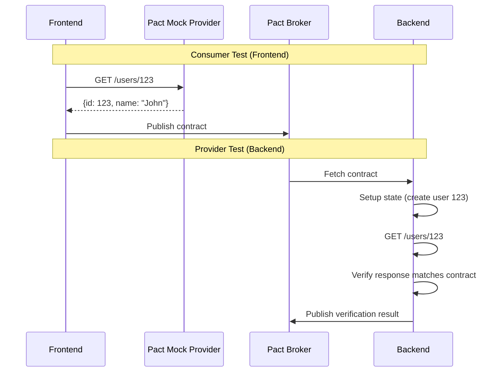
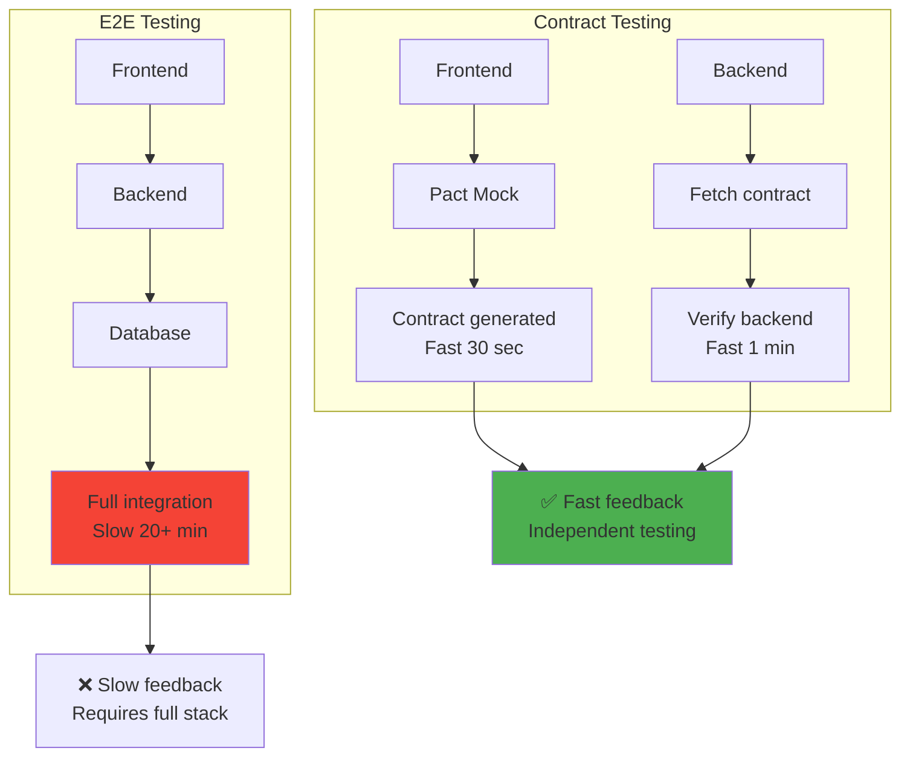
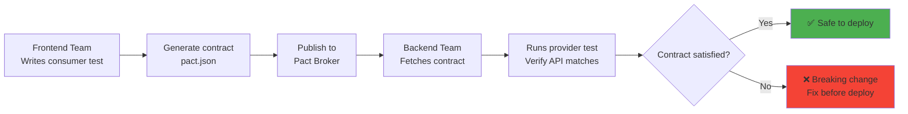
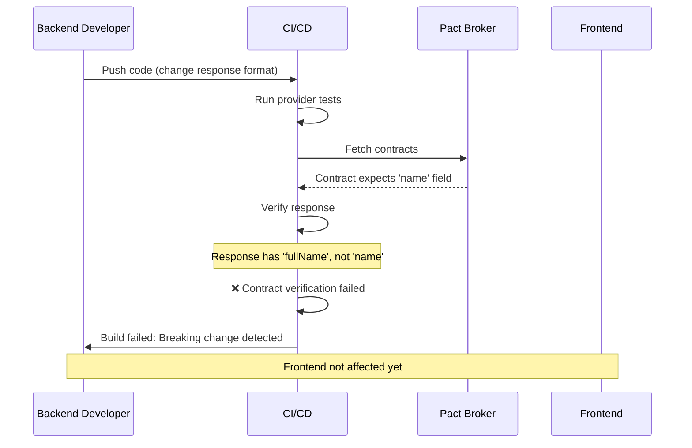

# Contract testing

## 1. Why this exists (Real-world problem first)

You're running a microservices architecture. Frontend team, backend team, mobile team work independently. What breaks without contract testing:

- **Integration breaks in production**: Frontend expects `user.name`, backend returns `user.fullName`. Frontend crashes in production.
- **No early detection**: Backend changes API response format. Frontend doesn't know until deployment. Users see errors.
- **Slow feedback loop**: Integration issues discovered during E2E tests (20 minutes). Too late, too slow.
- **Deployment coupling**: Can't deploy backend independently. Must coordinate with frontend team.
- **Breaking changes undetected**: Backend adds required field. Frontend doesn't send it. 500 errors in production.

Real pain: A payment service changed API response from `{status: 'success'}` to `{state: 'completed'}`. Mobile app still expected `status`. App crashed for all users during checkout. Lost $2M in sales. The fix: contract testing with Pact—catch breaking changes before deployment.

**Another scenario**: A frontend team built feature expecting backend API `/users/:id`. Backend team built `/api/v1/users/:id`. Integration failed in staging. With contract testing, mismatch caught in CI within minutes.

## 2. Mental model (build imagination)

Think of contract testing as **legal contracts** between services.

**Without contract**:
- Two companies work together
- No written agreement
- One company changes terms
- Other company surprised, relationship breaks

**With contract**:
- Two companies sign contract
- Contract specifies: "You will provide X, I will provide Y"
- If either party changes terms, contract violation detected
- Both parties notified before change takes effect

**In technical terms**:
- **Consumer**: Frontend/mobile app (expects certain API format)
- **Provider**: Backend API (provides data)
- **Contract**: Specification of API request/response format
- **Contract test**: Verify both sides honor the contract

**Key insight**: Contract testing catches **integration issues early** without running full E2E tests.

## 3. How Node.js implements this internally

### Pact consumer test (Frontend)

```javascript
// Frontend contract test
const { Pact } = require('@pact-foundation/pact');
const axios = require('axios');

const provider = new Pact({
  consumer: 'FrontendApp',
  provider: 'UserAPI',
  port: 1234,
});

describe('User API Contract', () => {
  beforeAll(() => provider.setup());
  afterAll(() => provider.finalize());
  afterEach(() => provider.verify());
  
  it('should get user by ID', async () => {
    // Define expected interaction
    await provider.addInteraction({
      state: 'user 123 exists',
      uponReceiving: 'a request for user 123',
      withRequest: {
        method: 'GET',
        path: '/users/123',
      },
      willRespondWith: {
        status: 200,
        headers: { 'Content-Type': 'application/json' },
        body: {
          id: 123,
          name: 'John Doe',
          email: 'john@example.com',
        },
      },
    });
    
    // Make actual request to mock provider
    const response = await axios.get('http://localhost:1234/users/123');
    
    expect(response.data.id).toBe(123);
    expect(response.data.name).toBe('John Doe');
  });
});
```

**What happens**:
1. Pact creates mock provider on port 1234
2. Frontend makes request to mock
3. Pact records interaction (request + expected response)
4. Generates contract file (pact JSON)
5. Contract published to Pact Broker

**Event loop impact**: HTTP request to mock provider is async.

### Pact provider test (Backend)

```javascript
// Backend contract test
const { Verifier } = require('@pact-foundation/pact');
const app = require('./app');

describe('User API Provider', () => {
  it('should satisfy contract with FrontendApp', async () => {
    const server = app.listen(3000);
    
    try {
      await new Verifier({
        provider: 'UserAPI',
        providerBaseUrl: 'http://localhost:3000',
        pactBrokerUrl: 'http://pact-broker:9292',
        publishVerificationResult: true,
        providerVersion: process.env.GIT_COMMIT,
        stateHandlers: {
          'user 123 exists': async () => {
            // Setup: Create user 123 in test database
            await db.query('INSERT INTO users (id, name, email) VALUES ($1, $2, $3)', 
              [123, 'John Doe', 'john@example.com']);
          },
        },
      }).verifyProvider();
    } finally {
      server.close();
    }
  });
});
```

**What happens**:
1. Verifier fetches contract from Pact Broker
2. Sets up provider state (creates user 123)
3. Makes real request to backend API
4. Compares response to contract
5. Publishes verification result

### OpenAPI contract testing

```javascript
// Alternative: OpenAPI spec as contract
const swaggerJsdoc = require('swagger-jsdoc');
const swaggerUi = require('swagger-ui-express');

const options = {
  definition: {
    openapi: '3.0.0',
    info: {
      title: 'User API',
      version: '1.0.0',
    },
  },
  apis: ['./routes/*.js'],
};

const specs = swaggerJsdoc(options);
app.use('/api-docs', swaggerUi.serve, swaggerUi.setup(specs));

// Route with OpenAPI annotations
/**
 * @openapi
 * /users/{id}:
 *   get:
 *     parameters:
 *       - in: path
 *         name: id
 *         required: true
 *         schema:
 *           type: integer
 *     responses:
 *       200:
 *         description: User found
 *         content:
 *           application/json:
 *             schema:
 *               type: object
 *               properties:
 *                 id:
 *                   type: integer
 *                 name:
 *                   type: string
 *                 email:
 *                   type: string
 */
app.get('/users/:id', async (req, res) => {
  const user = await getUser(req.params.id);
  res.json(user);
});
```

## 4. Multiple diagrams (MANDATORY)

### Contract testing flow



### Contract vs E2E testing



### Pact workflow



### Breaking change detection



## 5. Where this is used in real projects

### Production Pact setup

```javascript
// package.json
{
  "scripts": {
    "test:pact:consumer": "jest --testMatch='**/*.pact.spec.js'",
    "test:pact:provider": "jest --testMatch='**/*.pact.provider.spec.js'",
    "pact:publish": "pact-broker publish ./pacts --consumer-app-version=$GIT_COMMIT --broker-base-url=$PACT_BROKER_URL"
  }
}

// Consumer test (Frontend)
// tests/user-api.pact.spec.js
const { Pact } = require('@pact-foundation/pact');
const { getUserById } = require('../src/api/users');

const provider = new Pact({
  consumer: 'WebApp',
  provider: 'UserService',
  port: 1234,
  log: path.resolve(process.cwd(), 'logs', 'pact.log'),
  dir: path.resolve(process.cwd(), 'pacts'),
});

describe('User Service Contract', () => {
  beforeAll(() => provider.setup());
  afterEach(() => provider.verify());
  afterAll(() => provider.finalize());
  
  describe('GET /users/:id', () => {
    it('should return user when user exists', async () => {
      await provider.addInteraction({
        state: 'user 456 exists',
        uponReceiving: 'a request for user 456',
        withRequest: {
          method: 'GET',
          path: '/users/456',
          headers: {
            Accept: 'application/json',
          },
        },
        willRespondWith: {
          status: 200,
          headers: {
            'Content-Type': 'application/json',
          },
          body: {
            id: 456,
            name: 'Jane Smith',
            email: 'jane@example.com',
            createdAt: '2024-01-01T00:00:00Z',
          },
        },
      });
      
      const user = await getUserById(456);
      
      expect(user.id).toBe(456);
      expect(user.name).toBe('Jane Smith');
    });
    
    it('should return 404 when user does not exist', async () => {
      await provider.addInteraction({
        state: 'user 999 does not exist',
        uponReceiving: 'a request for non-existent user',
        withRequest: {
          method: 'GET',
          path: '/users/999',
        },
        willRespondWith: {
          status: 404,
          body: {
            error: 'User not found',
          },
        },
      });
      
      await expect(getUserById(999)).rejects.toThrow('User not found');
    });
  });
});

// Provider test (Backend)
// tests/user-service.pact.provider.spec.js
const { Verifier } = require('@pact-foundation/pact');
const app = require('../src/app');
const db = require('../src/db');

describe('User Service Provider', () => {
  let server;
  
  beforeAll(async () => {
    await db.connect();
    server = app.listen(3000);
  });
  
  afterAll(async () => {
    server.close();
    await db.close();
  });
  
  it('should verify contracts', async () => {
    await new Verifier({
      provider: 'UserService',
      providerBaseUrl: 'http://localhost:3000',
      pactBrokerUrl: process.env.PACT_BROKER_URL,
      pactBrokerToken: process.env.PACT_BROKER_TOKEN,
      publishVerificationResult: true,
      providerVersion: process.env.GIT_COMMIT,
      consumerVersionSelectors: [
        { mainBranch: true },
        { deployedOrReleased: true },
      ],
      stateHandlers: {
        'user 456 exists': async () => {
          await db.query('DELETE FROM users WHERE id = 456');
          await db.query(
            'INSERT INTO users (id, name, email, created_at) VALUES ($1, $2, $3, $4)',
            [456, 'Jane Smith', 'jane@example.com', '2024-01-01T00:00:00Z']
          );
        },
        'user 999 does not exist': async () => {
          await db.query('DELETE FROM users WHERE id = 999');
        },
      },
    }).verifyProvider();
  });
});
```

### CI/CD integration

```yaml
# .github/workflows/pact.yml
name: Contract Tests

on: [push, pull_request]

jobs:
  consumer-tests:
    runs-on: ubuntu-latest
    steps:
      - uses: actions/checkout@v2
      - name: Run consumer tests
        run: npm run test:pact:consumer
      - name: Publish contracts
        run: npm run pact:publish
        env:
          PACT_BROKER_URL: ${{ secrets.PACT_BROKER_URL }}
          GIT_COMMIT: ${{ github.sha }}
  
  provider-tests:
    runs-on: ubuntu-latest
    needs: consumer-tests
    steps:
      - uses: actions/checkout@v2
      - name: Run provider tests
        run: npm run test:pact:provider
        env:
          PACT_BROKER_URL: ${{ secrets.PACT_BROKER_URL }}
          GIT_COMMIT: ${{ github.sha }}
```

## 6. Where this should NOT be used

### Testing business logic

```javascript
// BAD: Contract test for business logic
it('should calculate discount correctly', async () => {
  await provider.addInteraction({
    // Testing calculation logic, not contract
  });
});

// GOOD: Unit test for business logic
it('should calculate discount correctly', () => {
  expect(calculateDiscount(100, 0.1)).toBe(90);
});
```

### End-to-end workflows

```javascript
// BAD: Contract test for full checkout flow
// Contract tests are for API contracts, not workflows

// GOOD: E2E test for checkout flow
test('complete checkout', async ({ page }) => {
  // Full user flow
});
```

## 7. Failure modes & edge cases

### Provider state setup fails

**Scenario**: Provider test can't create user 456 in database.

**Impact**: Contract verification fails incorrectly.

**Solution**: Ensure state handlers are idempotent, clean up before setup.

### Contract drift

**Scenario**: Frontend team updates contract, backend team doesn't notice.

**Impact**: Backend deploys, breaks frontend.

**Solution**: Can-I-Deploy tool checks if safe to deploy.

```bash
pact-broker can-i-deploy \
  --pacticipant UserService \
  --version $GIT_COMMIT \
  --to production
```

## 8. Trade-offs & alternatives

### What you gain
- **Fast feedback**: Catch integration issues in minutes, not hours
- **Independent deployment**: Deploy services independently
- **Living documentation**: Contracts document API

### What you sacrifice
- **Setup complexity**: Must run Pact Broker, write state handlers
- **Not full E2E**: Doesn't test full workflows
- **Learning curve**: Team must learn Pact

### Alternatives

**OpenAPI/Swagger**
- **Use case**: API documentation + validation
- **Benefit**: Simpler than Pact
- **Trade-off**: Not consumer-driven

**JSON Schema**
- **Use case**: Validate response format
- **Benefit**: Simple
- **Trade-off**: No request validation

## 9. Interview-level articulation

**Question**: "What is contract testing and why is it useful?"

**Weak answer**: "It tests API contracts."

**Strong answer**: "Contract testing verifies that a provider (backend API) and consumer (frontend/mobile) agree on the API contract without requiring full integration. The consumer writes tests defining expected requests and responses, generating a contract. The provider verifies it can satisfy the contract. This catches breaking changes early—if the backend changes response format, provider tests fail before deployment. I use Pact: frontend team writes consumer tests generating a contract, backend team runs provider tests verifying the API matches. Contracts are stored in Pact Broker. Before deploying, we run 'can-i-deploy' to check if all consumers are compatible. This enables independent deployment and fast feedback—contract tests run in minutes vs E2E tests in hours."

**Follow-up**: "How is contract testing different from E2E testing?"

**Answer**: "Contract testing verifies the API contract between two services, while E2E testing verifies the entire user workflow. Contract tests are fast (minutes), run independently, and catch integration issues early. E2E tests are slow (hours), require full stack, but test realistic user flows. I use both: contract tests for API compatibility, E2E tests for critical workflows. Contract tests run on every commit, E2E tests run before deployment. Contract testing also enables independent deployment—frontend and backend teams can deploy independently as long as contracts are satisfied."

## 10. Key takeaways (engineer mindset)

**What to remember**:
- **Contract testing verifies API contracts** between consumer and provider
- **Consumer-driven**: Frontend defines expected API format
- **Fast feedback**: Catch breaking changes in minutes
- **Independent deployment**: Deploy services independently
- **Use Pact Broker** to store and verify contracts

**What decisions this enables**:
- Choosing contract testing tool (Pact, OpenAPI, JSON Schema)
- Designing API contracts
- Setting up CI/CD with contract verification
- Deciding when to deploy services independently

**How it connects to other Node.js concepts**:
- **Microservices**: Contract testing essential for microservices
- **API design**: Contracts document API
- **Testing pyramid**: Contract tests sit between integration and E2E
- **CI/CD**: Contract verification gates deployment
