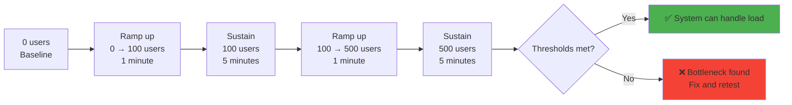
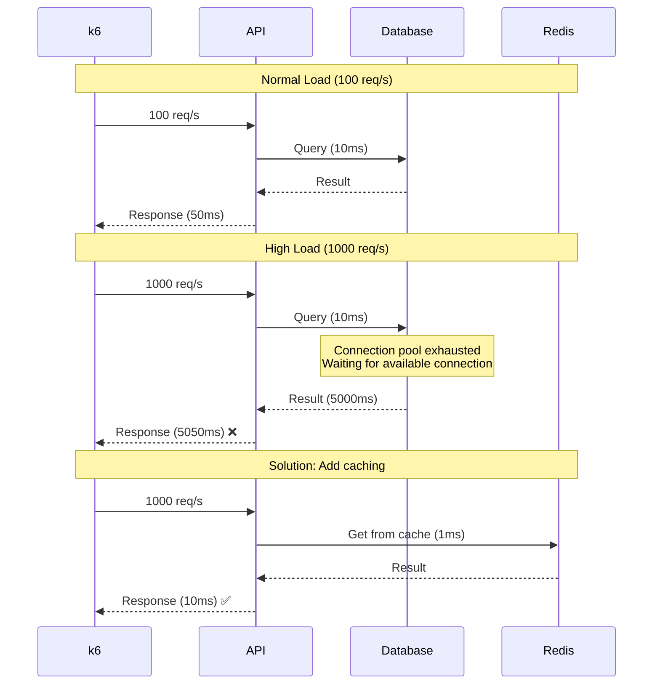
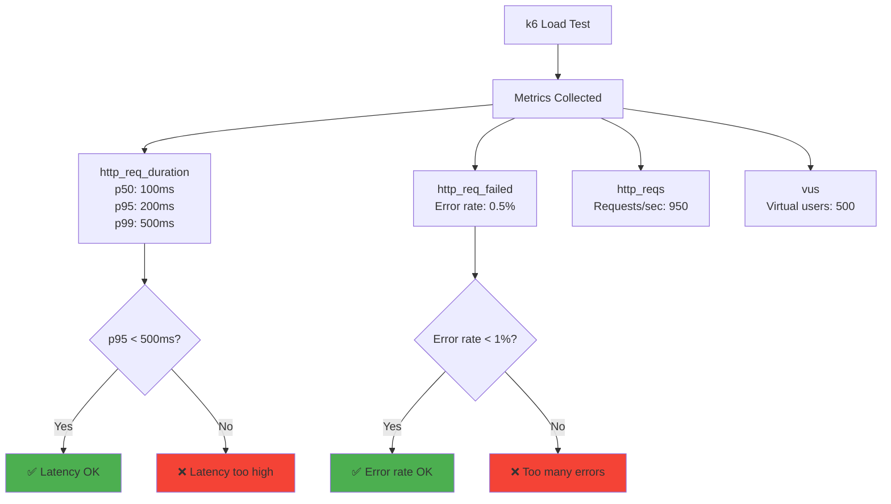

# Load testing

## 1. Why this exists (Real-world problem first)

You're launching a Black Friday sale. Expect 10x normal traffic. Deploy to production. What breaks without load testing:

- **System crashes under load**: Normal traffic: 100 req/s, works fine. Black Friday: 1000 req/s, all servers crash. Database connection pool exhausted.
- **No capacity planning**: Don't know how many servers needed. Provision 10 servers. Need 50. Site down, lost $5M in sales.
- **Hidden bottlenecks**: API works fine with 10 users. With 1000 users, one slow database query locks entire system.
- **No performance baseline**: Response time is "slow". How slow? 100ms? 10 seconds? No data to improve.
- **Cascading failures**: One service slow. Other services timeout waiting. Entire system becomes unavailable.

Real pain: A ticket sales platform launched concert tickets. Expected 10K users, got 100K. Site crashed in 2 minutes. All tickets sold by bots before site recovered. The fix: load testing with k6—simulate 100K concurrent users, identify bottlenecks, scale infrastructure.

**Another scenario**: A payment API worked fine in staging (10 req/s). In production (1000 req/s), database connection pool exhausted. With load testing, they would have caught this before launch.

## 2. Mental model (build imagination)

Think of load testing as **stress-testing a bridge**.

**Without load testing**:
- Build bridge
- Looks sturdy
- Open to traffic
- 1000 cars cross simultaneously
- Bridge collapses

**With load testing**:
- Build bridge
- Test with 100 cars (works)
- Test with 500 cars (works)
- Test with 1000 cars (bridge sways, needs reinforcement)
- Reinforce bridge before opening

**In technical terms**:
- **Load test**: Simulate expected traffic (100 req/s)
- **Stress test**: Simulate beyond expected (1000 req/s)
- **Spike test**: Simulate sudden traffic surge (0 → 1000 req/s in 10 seconds)
- **Soak test**: Simulate sustained traffic (100 req/s for 24 hours)

**Key insight**: Load testing finds **performance bottlenecks before production**.

## 3. How Node.js implements this internally

### k6 load test

```javascript
// load-test.js
import http from 'k6/http';
import { check, sleep } from 'k6';

export const options = {
  stages: [
    { duration: '1m', target: 100 },   // Ramp up to 100 users
    { duration: '5m', target: 100 },   // Stay at 100 users
    { duration: '1m', target: 500 },   // Ramp up to 500 users
    { duration: '5m', target: 500 },   // Stay at 500 users
    { duration: '1m', target: 0 },     // Ramp down to 0
  ],
  thresholds: {
    http_req_duration: ['p(95)<500'],  // 95% of requests < 500ms
    http_req_failed: ['rate<0.01'],    // Error rate < 1%
  },
};

export default function () {
  const response = http.get('http://localhost:3000/api/products');
  
  check(response, {
    'status is 200': (r) => r.status === 200,
    'response time < 500ms': (r) => r.timings.duration < 500,
  });
  
  sleep(1); // Think time
}
```

**What happens**:
1. k6 spawns virtual users (VUs)
2. Each VU makes HTTP requests
3. Measures response time, error rate
4. Reports metrics (p50, p95, p99 latency)
5. Fails if thresholds violated

**Event loop impact**: k6 runs outside Node.js (Go binary). Node.js receives HTTP requests like production.

### Artillery load test

```yaml
# load-test.yml
config:
  target: 'http://localhost:3000'
  phases:
    - duration: 60
      arrivalRate: 10  # 10 new users per second
    - duration: 300
      arrivalRate: 50  # 50 new users per second
    - duration: 60
      arrivalRate: 10  # Ramp down
  ensure:
    p95: 500  # 95th percentile < 500ms
    maxErrorRate: 1  # Error rate < 1%

scenarios:
  - name: 'Browse products'
    flow:
      - get:
          url: '/api/products'
      - think: 2  # Wait 2 seconds
      - get:
          url: '/api/products/{{ $randomNumber(1, 100) }}'
      - think: 1
      - post:
          url: '/api/cart'
          json:
            productId: '{{ $randomNumber(1, 100) }}'
            quantity: 1
```

**Run**:
```bash
artillery run load-test.yml
```

### Autocannon (Node.js native)

```javascript
const autocannon = require('autocannon');

const instance = autocannon({
  url: 'http://localhost:3000/api/products',
  connections: 100,  // Concurrent connections
  duration: 60,      // 60 seconds
  pipelining: 1,     // Requests per connection
}, (err, result) => {
  console.log('Requests per second:', result.requests.average);
  console.log('Latency p95:', result.latency.p95);
  console.log('Errors:', result.errors);
});

autocannon.track(instance);
```

## 4. Multiple diagrams (MANDATORY)

### Load test stages



### Load vs Stress vs Spike testing

```mermaid
graph TB
    subgraph "Load Test"
        L1[Simulate expected traffic<br/>100 req/s for 10 min]
        L1 --> L2[Verify system handles<br/>normal load]
    end
    
    subgraph "Stress Test"
        S1[Simulate beyond capacity<br/>1000 req/s for 10 min]
        S1 --> S2[Find breaking point<br/>When does system fail?]
    end
    
    subgraph "Spike Test"
        SP1[Sudden traffic surge<br/>0 → 1000 req/s in 10s]
        SP1 --> SP2[Test auto-scaling<br/>Can system recover?]
    end
    
    subgraph "Soak Test"
        SO1[Sustained load<br/>100 req/s for 24 hours]
        SO1 --> SO2[Find memory leaks<br/>Long-term stability]
    end
    
    style L2 fill:#4CAF50
    style S2 fill:#FF9800
    style SP2 fill:#F44336
    style SO2 fill:#2196F3
```



### Performance bottleneck identification



### k6 metrics visualization



## 5. Where this is used in real projects

### Production k6 load test

```javascript
// load-tests/api-load-test.js
import http from 'k6/http';
import { check, group, sleep } from 'k6';
import { Rate, Trend } from 'k6/metrics';

// Custom metrics
const errorRate = new Rate('errors');
const checkoutDuration = new Trend('checkout_duration');

export const options = {
  stages: [
    { duration: '2m', target: 100 },   // Warm up
    { duration: '5m', target: 100 },   // Normal load
    { duration: '2m', target: 200 },   // Ramp up
    { duration: '5m', target: 200 },   // High load
    { duration: '2m', target: 500 },   // Stress test
    { duration: '5m', target: 500 },   // Peak load
    { duration: '2m', target: 0 },     // Ramp down
  ],
  thresholds: {
    'http_req_duration': ['p(95)<500', 'p(99)<1000'],
    'http_req_failed': ['rate<0.01'],
    'errors': ['rate<0.05'],
    'checkout_duration': ['p(95)<2000'],
  },
};

export default function () {
  group('Browse products', () => {
    const productsRes = http.get('http://localhost:3000/api/products');
    check(productsRes, {
      'products status 200': (r) => r.status === 200,
      'products response time OK': (r) => r.timings.duration < 500,
    }) || errorRate.add(1);
    
    sleep(Math.random() * 3 + 1); // 1-4 seconds think time
    
    const productId = Math.floor(Math.random() * 100) + 1;
    const productRes = http.get(`http://localhost:3000/api/products/${productId}`);
    check(productRes, {
      'product status 200': (r) => r.status === 200,
    }) || errorRate.add(1);
  });
  
  group('Add to cart', () => {
    const payload = JSON.stringify({
      productId: Math.floor(Math.random() * 100) + 1,
      quantity: Math.floor(Math.random() * 3) + 1,
    });
    
    const params = {
      headers: { 'Content-Type': 'application/json' },
    };
    
    const cartRes = http.post('http://localhost:3000/api/cart', payload, params);
    check(cartRes, {
      'cart status 201': (r) => r.status === 201,
    }) || errorRate.add(1);
    
    sleep(Math.random() * 2 + 1);
  });
  
  group('Checkout', () => {
    const start = Date.now();
    
    const checkoutPayload = JSON.stringify({
      paymentMethod: 'credit_card',
      shippingAddress: '123 Main St',
    });
    
    const params = {
      headers: { 'Content-Type': 'application/json' },
    };
    
    const checkoutRes = http.post('http://localhost:3000/api/checkout', checkoutPayload, params);
    
    const duration = Date.now() - start;
    checkoutDuration.add(duration);
    
    check(checkoutRes, {
      'checkout status 200': (r) => r.status === 200,
      'checkout duration < 2s': () => duration < 2000,
    }) || errorRate.add(1);
  });
  
  sleep(1);
}

export function handleSummary(data) {
  return {
    'summary.json': JSON.stringify(data),
    stdout: textSummary(data, { indent: ' ', enableColors: true }),
  };
}
```

**Run**:
```bash
k6 run load-tests/api-load-test.js
```

### CI/CD integration

```yaml
# .github/workflows/load-test.yml
name: Load Test

on:
  pull_request:
    branches: [main]

jobs:
  load-test:
    runs-on: ubuntu-latest
    steps:
      - uses: actions/checkout@v2
      
      - name: Start application
        run: |
          npm install
          npm start &
          sleep 10  # Wait for app to start
      
      - name: Run k6 load test
        uses: grafana/k6-action@v0.3.0
        with:
          filename: load-tests/api-load-test.js
          flags: --out json=results.json
      
      - name: Check thresholds
        run: |
          if grep -q '"thresholds_failed":true' results.json; then
            echo "Load test thresholds failed"
            exit 1
          fi
```

### Performance regression detection

```javascript
// Compare current vs baseline
const baseline = require('./baseline-results.json');
const current = require('./current-results.json');

const baselineP95 = baseline.metrics.http_req_duration.values['p(95)'];
const currentP95 = current.metrics.http_req_duration.values['p(95)'];

const regression = ((currentP95 - baselineP95) / baselineP95) * 100;

if (regression > 10) {
  console.error(`Performance regression detected: ${regression.toFixed(2)}% slower`);
  process.exit(1);
}

console.log(`Performance: ${regression.toFixed(2)}% change from baseline`);
```

## 6. Where this should NOT be used

### Testing business logic

```javascript
// BAD: Load test for calculation logic
// Use unit tests instead

// GOOD: Load test for API endpoints under load
```

### Production load testing

```javascript
// BAD: Run load test against production
// May cause actual outage

// GOOD: Run against staging or dedicated load test environment
```

## 7. Failure modes & edge cases

### Load test environment doesn't match production

**Scenario**: Load test in staging with 1 server. Production has 10 servers.

**Impact**: Load test fails, but production would be fine.

**Solution**: Match staging infrastructure to production (or scale results).

### Network bottleneck

**Scenario**: Load test from single machine. Network bandwidth exhausted.

**Impact**: Load test shows high latency, but it's network, not application.

**Solution**: Distribute load test across multiple machines.

## 8. Trade-offs & alternatives

### What you gain
- **Find bottlenecks before production**: Identify performance issues early
- **Capacity planning**: Know how many servers needed
- **Performance baseline**: Measure improvements

### What you sacrifice
- **Infrastructure cost**: Need staging environment matching production
- **Time**: Load tests take time to run (10-60 minutes)
- **Complexity**: Must maintain load test scripts

### Alternatives

**APM (Application Performance Monitoring)**
- **Use case**: Monitor production performance
- **Benefit**: Real user data
- **Trade-off**: Reactive, not proactive

**Synthetic monitoring**
- **Use case**: Continuous performance checks
- **Benefit**: Catch regressions early
- **Trade-off**: Not full load test

## 9. Interview-level articulation

**Question**: "What is load testing and why is it important?"

**Weak answer**: "It tests if the system can handle load."

**Strong answer**: "Load testing simulates expected traffic to verify the system can handle it without performance degradation. I use k6 to simulate virtual users making HTTP requests. I define stages: ramp up to 100 users over 1 minute, sustain for 5 minutes, ramp up to 500 users, sustain for 5 minutes. I set thresholds: p95 latency < 500ms, error rate < 1%. If thresholds are violated, the test fails. Load testing finds bottlenecks before production—for example, database connection pool exhaustion, slow queries, memory leaks. I run load tests in CI/CD before deploying to production. I also do stress testing (beyond expected load) to find the breaking point, spike testing (sudden traffic surge) to test auto-scaling, and soak testing (sustained load for 24 hours) to find memory leaks."

**Follow-up**: "How do you identify bottlenecks from load test results?"

**Answer**: "I analyze k6 metrics: http_req_duration shows latency (p50, p95, p99), http_req_failed shows error rate, http_reqs shows throughput. If p95 latency is high, I check which endpoints are slow. I use distributed tracing (Jaeger) to see where time is spent—database queries, external API calls, etc. Common bottlenecks: database connection pool exhausted (increase pool size or add caching), slow queries (add indexes), CPU-bound operations (add more servers or optimize code), memory leaks (fix code). I also monitor system metrics during load tests: CPU, memory, disk I/O, network bandwidth."

## 10. Key takeaways (engineer mindset)

**What to remember**:
- **Load testing finds bottlenecks before production**
- **Use k6 or Artillery** for HTTP load testing
- **Set thresholds**: p95 latency, error rate
- **Run in CI/CD** to catch performance regressions
- **Types**: Load (expected traffic), stress (beyond capacity), spike (sudden surge), soak (sustained)

**What decisions this enables**:
- Choosing load testing tool (k6, Artillery, Gatling)
- Setting performance thresholds
- Capacity planning (how many servers needed)
- Identifying bottlenecks

**How it connects to other Node.js concepts**:
- **Event loop**: Load testing reveals event loop blocking
- **Connection pooling**: Load testing finds pool exhaustion
- **Caching**: Load testing shows caching effectiveness
- **Observability**: Use metrics/traces to debug bottlenecks
