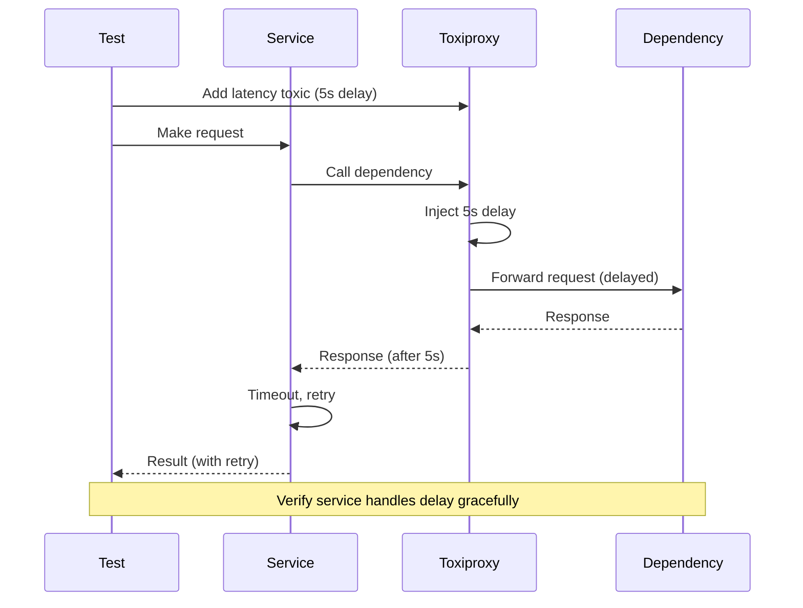
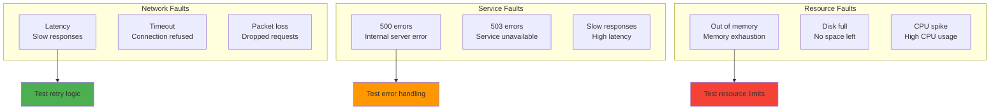
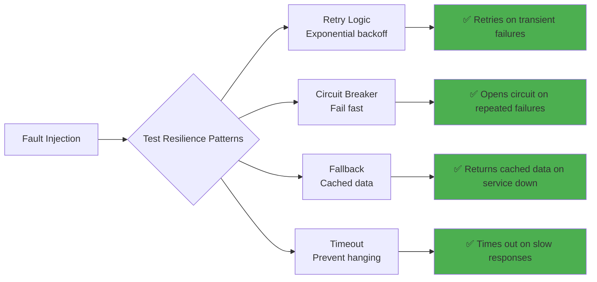
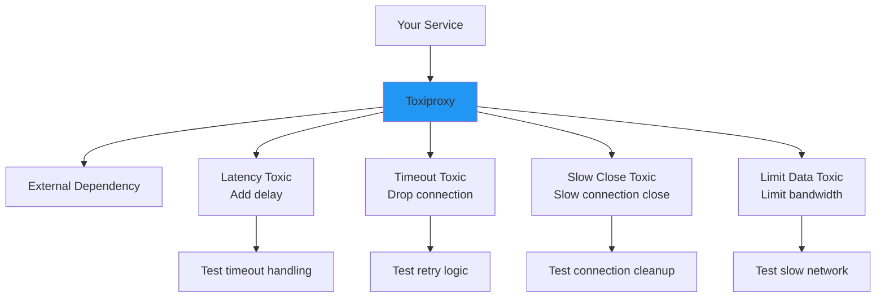

# Fault injection

## 1. Why this exists (Real-world problem first)

You're running a payment service. Database is always available in testing. Deploy to production. What breaks without fault injection testing:

- **No resilience testing**: Code assumes database always available. Database goes down. Payment service crashes. No retry logic, no fallback.
- **Cascading failures**: One service slow. Other services timeout waiting. Entire system becomes unavailable. Never tested this scenario.
- **Hidden dependencies**: Payment service depends on email service. Email service down. Payment succeeds but confirmation email fails. User thinks payment failed, tries again, double-charged.
- **No timeout testing**: External API call has no timeout. API hangs. Request waits forever, ties up thread. All requests start hanging.
- **False confidence**: All tests pass. System works in staging. Fails in production when real failures occur.

Real pain: A ride-sharing app's payment service had no retry logic. Payment gateway had 1-second outage. All payments failed. Users couldn't book rides for 10 minutes. Lost $500K. The fix: fault injection testing—simulate payment gateway failures, verify retry logic works.

**Another scenario**: A social media platform's image service assumed S3 always available. S3 had outage. Image service crashed. Entire site down. With fault injection, they would have tested S3 failures and implemented fallback.

## 2. Mental model (build imagination)

Think of fault injection as **disaster drills** for your system.

**Without fault injection**:
- Building has fire exits
- Never tested
- Real fire happens
- People don't know where exits are
- Panic, injuries

**With fault injection**:
- Regular fire drills
- Simulate fire (smoke, alarms)
- Practice evacuation
- When real fire happens, everyone knows what to do

**In technical terms**:
- **Fault injection**: Deliberately introduce failures
- **Network failure**: Simulate connection timeout, packet loss
- **Service failure**: Simulate 500 errors, slow responses
- **Resource failure**: Simulate out of memory, disk full

**Key insight**: Fault injection tests **resilience** before production failures occur.

## 3. How Node.js implements this internally

### Simulating network failures with Toxiproxy

```javascript
const Toxiproxy = require('toxiproxy-node-client');
const axios = require('axios');

const toxiproxy = new Toxiproxy('http://toxiproxy:8474');

describe('Payment Service Resilience', () => {
  let proxy;
  
  beforeAll(async () => {
    // Create proxy for payment gateway
    proxy = await toxiproxy.create({
      name: 'payment-gateway',
      listen: '0.0.0.0:8080',
      upstream: 'payment-gateway.com:443',
    });
  });
  
  afterAll(async () => {
    await proxy.delete();
  });
  
  it('should retry on network timeout', async () => {
    // Add latency toxic (simulate slow network)
    await proxy.addToxic({
      type: 'latency',
      attributes: {
        latency: 5000, // 5 seconds
      },
    });
    
    const start = Date.now();
    
    try {
      await processPayment({ amount: 100 });
    } catch (err) {
      // Should timeout and retry
      expect(err.message).toContain('timeout');
    }
    
    const duration = Date.now() - start;
    expect(duration).toBeGreaterThan(5000); // Waited for timeout
  });
  
  it('should fallback on service unavailable', async () => {
    // Add toxic to simulate connection refused
    await proxy.addToxic({
      type: 'reset_peer',
      attributes: {},
    });
    
    const result = await processPayment({ amount: 100 });
    
    // Should use fallback (e.g., queue for later processing)
    expect(result.status).toBe('queued');
  });
});
```

**What happens**:
1. Toxiproxy sits between service and dependency
2. Adds "toxics" (latency, errors, connection drops)
3. Service makes request through proxy
4. Proxy injects failure
5. Test verifies service handles failure gracefully

**Event loop impact**: Toxiproxy is external process. Node.js sees real network failures.

### Simulating service failures with nock

```javascript
const nock = require('nock');
const { getUserProfile } = require('../src/api/users');

describe('User Service Resilience', () => {
  it('should retry on 500 error', async () => {
    // First call: 500 error
    nock('http://user-service')
      .get('/users/123')
      .reply(500, { error: 'Internal server error' });
    
    // Second call: success
    nock('http://user-service')
      .get('/users/123')
      .reply(200, { id: 123, name: 'John' });
    
    const user = await getUserProfile(123);
    
    expect(user.name).toBe('John');
  });
  
  it('should use cache on service unavailable', async () => {
    // Simulate service down
    nock('http://user-service')
      .get('/users/123')
      .replyWithError('ECONNREFUSED');
    
    const user = await getUserProfile(123);
    
    // Should return cached data
    expect(user.source).toBe('cache');
  });
  
  it('should timeout on slow response', async () => {
    nock('http://user-service')
      .get('/users/123')
      .delay(5000) // 5 second delay
      .reply(200, { id: 123, name: 'John' });
    
    await expect(getUserProfile(123)).rejects.toThrow('timeout');
  });
});
```

### Simulating resource failures

```javascript
// Simulate out of memory
describe('Memory Exhaustion', () => {
  it('should handle out of memory gracefully', async () => {
    const largeArray = [];
    
    try {
      // Try to allocate huge array
      for (let i = 0; i < 1000000000; i++) {
        largeArray.push(new Array(1000).fill('x'));
      }
    } catch (err) {
      expect(err.message).toContain('out of memory');
    }
  });
});

// Simulate disk full
const fs = require('fs');
const mock = require('mock-fs');

describe('Disk Full', () => {
  beforeEach(() => {
    // Mock filesystem with limited space
    mock({
      '/tmp': mock.directory({
        mode: 0o755,
        items: {},
      }),
    });
  });
  
  afterEach(() => {
    mock.restore();
  });
  
  it('should handle disk full error', async () => {
    try {
      // Try to write large file
      fs.writeFileSync('/tmp/large-file.txt', 'x'.repeat(1000000000));
    } catch (err) {
      expect(err.code).toBe('ENOSPC'); // No space left on device
    }
  });
});
```

## 4. Multiple diagrams (MANDATORY)

### Fault injection flow



### Types of fault injection



### Resilience patterns tested



### Toxiproxy architecture



## 5. Where this is used in real projects

### Production fault injection with Toxiproxy

```javascript
// tests/resilience/payment-gateway.test.js
const Toxiproxy = require('toxiproxy-node-client');
const { processPayment } = require('../../src/services/payment');

const toxiproxy = new Toxiproxy('http://localhost:8474');

describe('Payment Gateway Resilience', () => {
  let proxy;
  
  beforeAll(async () => {
    proxy = await toxiproxy.create({
      name: 'payment-gateway',
      listen: '0.0.0.0:8080',
      upstream: 'payment-gateway.example.com:443',
    });
  });
  
  afterAll(async () => {
    await proxy.delete();
  });
  
  afterEach(async () => {
    // Remove all toxics after each test
    const toxics = await proxy.toxics();
    for (const toxic of toxics) {
      await toxic.delete();
    }
  });
  
  describe('Network failures', () => {
    it('should retry on timeout', async () => {
      await proxy.addToxic({
        type: 'timeout',
        attributes: {
          timeout: 1000, // 1 second timeout
        },
      });
      
      const result = await processPayment({
        amount: 100,
        currency: 'USD',
      });
      
      // Should retry and eventually succeed
      expect(result.status).toBe('success');
      expect(result.retries).toBeGreaterThan(0);
    });
    
    it('should use fallback on connection refused', async () => {
      await proxy.addToxic({
        type: 'reset_peer',
        attributes: {},
      });
      
      const result = await processPayment({
        amount: 100,
        currency: 'USD',
      });
      
      // Should queue payment for later processing
      expect(result.status).toBe('queued');
    });
  });
  
  describe('Service failures', () => {
    it('should handle 500 errors', async () => {
      // Simulate 500 error by adding latency + limiting data
      await proxy.addToxic({
        type: 'limit_data',
        attributes: {
          bytes: 0, // No data returned
        },
      });
      
      const result = await processPayment({
        amount: 100,
        currency: 'USD',
      });
      
      // Should retry with exponential backoff
      expect(result.retries).toBe(3);
    });
    
    it('should open circuit breaker after repeated failures', async () => {
      await proxy.addToxic({
        type: 'reset_peer',
        attributes: {},
      });
      
      // Make multiple requests
      for (let i = 0; i < 5; i++) {
        try {
          await processPayment({ amount: 100, currency: 'USD' });
        } catch (err) {
          // Expected to fail
        }
      }
      
      // Circuit should be open
      const circuitState = getCircuitBreakerState('payment-gateway');
      expect(circuitState).toBe('open');
    });
  });
  
  describe('Slow responses', () => {
    it('should timeout on slow responses', async () => {
      await proxy.addToxic({
        type: 'latency',
        attributes: {
          latency: 10000, // 10 seconds
        },
      });
      
      const start = Date.now();
      
      try {
        await processPayment({ amount: 100, currency: 'USD' });
      } catch (err) {
        expect(err.message).toContain('timeout');
      }
      
      const duration = Date.now() - start;
      expect(duration).toBeLessThan(5000); // Should timeout before 5 seconds
    });
  });
});
```

### Chaos engineering with fault injection

```javascript
// Gradually increase failure rate
describe('Chaos Engineering', () => {
  it('should handle increasing failure rate', async () => {
    const failureRates = [0.1, 0.2, 0.5, 0.8];
    
    for (const rate of failureRates) {
      // Inject failures at specified rate
      await proxy.addToxic({
        type: 'reset_peer',
        attributes: {},
        toxicity: rate, // Percentage of requests to fail
      });
      
      let successCount = 0;
      let failureCount = 0;
      
      // Make 100 requests
      for (let i = 0; i < 100; i++) {
        try {
          await processPayment({ amount: 100, currency: 'USD' });
          successCount++;
        } catch (err) {
          failureCount++;
        }
      }
      
      console.log(`Failure rate ${rate}: ${successCount} success, ${failureCount} failures`);
      
      // System should still function (with retries/fallbacks)
      expect(successCount).toBeGreaterThan(0);
      
      // Clean up
      const toxics = await proxy.toxics();
      for (const toxic of toxics) {
        await toxic.delete();
      }
    }
  });
});
```

## 6. Where this should NOT be used

### Production fault injection without safeguards

```javascript
// BAD: Inject faults in production without limits
// Could cause real outage

// GOOD: Inject faults in staging or with blast radius control
```

### Testing business logic

```javascript
// BAD: Fault injection for calculation logic
// Use unit tests instead

// GOOD: Fault injection for external dependencies
```

## 7. Failure modes & edge cases

### Fault injection causes real outage

**Scenario**: Inject too many faults. System goes down.

**Impact**: Real outage in staging/production.

**Solution**: Blast radius control—limit fault injection to small percentage of requests.

### Toxiproxy not cleaned up

**Scenario**: Test adds toxic, doesn't remove it. Next test fails unexpectedly.

**Impact**: Flaky tests.

**Solution**: Always remove toxics in `afterEach` hook.

## 8. Trade-offs & alternatives

### What you gain
- **Test resilience**: Verify system handles failures gracefully
- **Find hidden dependencies**: Discover services you depend on
- **Confidence in production**: Know system can handle real failures

### What you sacrifice
- **Complexity**: Must set up Toxiproxy, write fault injection tests
- **Time**: Fault injection tests take longer than unit tests
- **Infrastructure**: Need Toxiproxy running

### Alternatives

**Chaos Monkey**
- **Use case**: Random fault injection in production
- **Benefit**: Tests real production resilience
- **Trade-off**: Risk of real outages

**Manual testing**
- **Use case**: Manually stop services
- **Benefit**: Simple
- **Trade-off**: Not automated, not repeatable

## 9. Interview-level articulation

**Question**: "What is fault injection and why is it important?"

**Weak answer**: "It's when you inject failures to test your system."

**Strong answer**: "Fault injection is deliberately introducing failures to test system resilience. I use Toxiproxy to inject network failures (latency, timeouts, connection drops) between my service and dependencies. For example, I simulate payment gateway timeout by adding a latency toxic. This verifies my retry logic works—the service should retry with exponential backoff and eventually succeed or use a fallback. Fault injection tests resilience patterns: retries, circuit breakers, fallbacks, timeouts. Without fault injection, I have false confidence—tests pass in staging where dependencies are always available, but fail in production when real failures occur. I run fault injection tests in CI/CD to catch resilience issues early."

**Follow-up**: "How do you prevent fault injection from causing real outages?"

**Answer**: "I use blast radius control—limit fault injection to a small percentage of requests (e.g., 10%). I run fault injection in staging, not production. If I do run in production, I use feature flags to enable fault injection for specific users (e.g., internal test accounts). I also implement automatic rollback—if error rate exceeds threshold, automatically disable fault injection. I monitor metrics during fault injection—if system degrades beyond acceptable levels, I stop the test. I also use Toxiproxy's toxicity parameter to control what percentage of requests are affected."

## 10. Key takeaways (engineer mindset)

**What to remember**:
- **Fault injection tests resilience** before production failures
- **Use Toxiproxy** to inject network failures
- **Test resilience patterns**: Retries, circuit breakers, fallbacks, timeouts
- **Run in CI/CD** to catch resilience issues early
- **Blast radius control** to prevent real outages

**What decisions this enables**:
- Choosing fault injection tool (Toxiproxy, Chaos Monkey)
- Designing resilience patterns
- Setting retry policies and timeouts
- Implementing circuit breakers and fallbacks

**How it connects to other Node.js concepts**:
- **Circuit breakers**: Fault injection tests circuit breaker logic
- **Retries**: Fault injection verifies retry logic
- **Timeouts**: Fault injection tests timeout handling
- **Graceful degradation**: Fault injection verifies fallback logic
