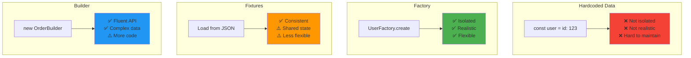
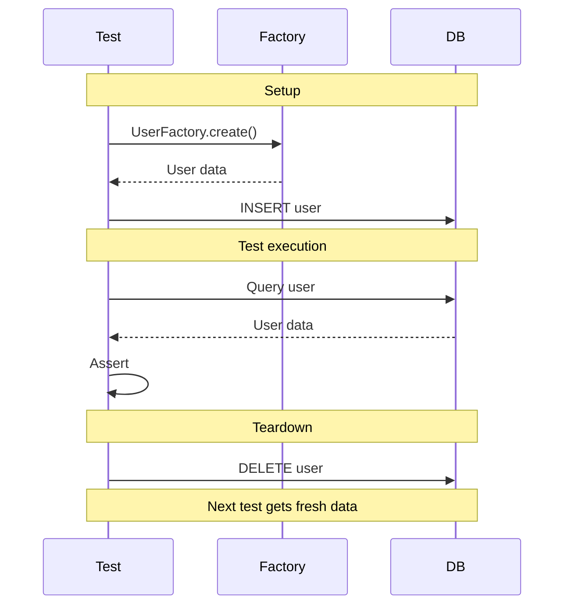
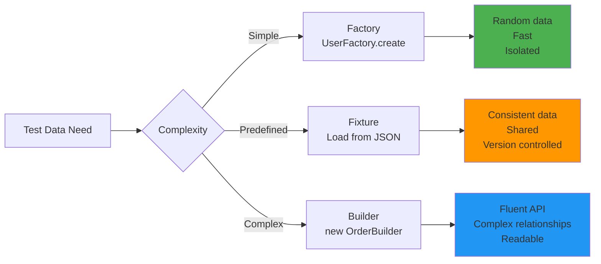
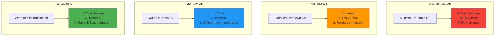

# Test data strategies

## 1. Why this exists (Real-world problem first)

You're testing an e-commerce API. Need test data: users, products, orders. What breaks without proper test data strategy:

- **Hardcoded test data**: Test uses user ID 123. Another test deletes user 123. First test fails. Tests are not isolated.
- **Shared test database**: 10 tests run in parallel. All modify same data. Tests interfere with each other. Flaky tests.
- **Production-like data missing**: Test with 10 products. Production has 10,000 products. Pagination breaks in production.
- **No edge cases**: Test with valid data only. Never test null, empty strings, special characters. Bugs slip through.
- **Slow test setup**: Each test creates 100 users, 1000 products. Tests take 10 minutes to run. Developers stop running tests.

Real pain: A payment service tested with valid credit cards only. In production, users entered invalid cards, expired cards, cards with special characters. All failed—no validation. Lost $100K in failed transactions. The fix: test data factory with edge cases (invalid cards, expired cards, special characters).

**Another scenario**: A social media platform tested with 10 users. In production, user had 10,000 followers. Feed query timed out. With realistic test data (users with 10,000 followers), they would have caught this.

## 2. Mental model (build imagination)

Think of test data as **props in a movie**.

**Without test data strategy**:
- Actors use random props
- Props from different scenes mixed up
- Props break during filming
- Must reshoot scenes

**With test data strategy**:
- Props organized by scene
- Each scene has its own props
- Props reset after each scene
- Filming runs smoothly

**In technical terms**:
- **Factory**: Generate test data programmatically
- **Fixture**: Predefined test data loaded from files
- **Builder**: Fluent API to create test data
- **Seeder**: Populate database with test data

**Key insight**: Good test data strategy makes tests **fast, isolated, and reliable**.

## 3. How Node.js implements this internally

### Test data factory with Faker

```javascript
const { faker } = require('@faker-js/faker');

class UserFactory {
  static create(overrides = {}) {
    return {
      id: faker.datatype.uuid(),
      name: faker.person.fullName(),
      email: faker.internet.email(),
      age: faker.number.int({ min: 18, max: 80 }),
      createdAt: faker.date.past(),
      ...overrides,
    };
  }
  
  static createMany(count, overrides = {}) {
    return Array.from({ length: count }, () => this.create(overrides));
  }
}

// Usage in tests
describe('User API', () => {
  it('should create user', async () => {
    const userData = UserFactory.create({
      email: 'test@example.com', // Override specific field
    });
    
    const response = await request(app)
      .post('/users')
      .send(userData)
      .expect(201);
    
    expect(response.body.email).toBe('test@example.com');
  });
  
  it('should list users', async () => {
    const users = UserFactory.createMany(10);
    
    for (const user of users) {
      await db.query('INSERT INTO users (id, name, email) VALUES ($1, $2, $3)', 
        [user.id, user.name, user.email]);
    }
    
    const response = await request(app)
      .get('/users')
      .expect(200);
    
    expect(response.body.length).toBe(10);
  });
});
```

**What happens**:
1. Factory generates random but realistic data
2. Can override specific fields for test scenarios
3. Each test gets fresh data (isolated)
4. Fast (no database queries to generate data)

**Event loop impact**: Faker is synchronous, very fast.

### Test fixtures with JSON files

```javascript
// fixtures/users.json
[
  {
    "id": "user-1",
    "name": "John Doe",
    "email": "john@example.com",
    "role": "admin"
  },
  {
    "id": "user-2",
    "name": "Jane Smith",
    "email": "jane@example.com",
    "role": "user"
  }
]

// tests/users.test.js
const users = require('../fixtures/users.json');

describe('User API', () => {
  beforeEach(async () => {
    // Load fixtures into database
    for (const user of users) {
      await db.query('INSERT INTO users (id, name, email, role) VALUES ($1, $2, $3, $4)',
        [user.id, user.name, user.email, user.role]);
    }
  });
  
  afterEach(async () => {
    // Clean up
    await db.query('DELETE FROM users');
  });
  
  it('should get admin users', async () => {
    const response = await request(app)
      .get('/users?role=admin')
      .expect(200);
    
    expect(response.body.length).toBe(1);
    expect(response.body[0].name).toBe('John Doe');
  });
});
```

### Builder pattern for complex data

```javascript
class OrderBuilder {
  constructor() {
    this.order = {
      id: faker.datatype.uuid(),
      userId: faker.datatype.uuid(),
      items: [],
      total: 0,
      status: 'pending',
      createdAt: new Date(),
    };
  }
  
  withUser(userId) {
    this.order.userId = userId;
    return this;
  }
  
  withItem(productId, quantity, price) {
    this.order.items.push({ productId, quantity, price });
    this.order.total += quantity * price;
    return this;
  }
  
  withStatus(status) {
    this.order.status = status;
    return this;
  }
  
  build() {
    return this.order;
  }
}

// Usage
const order = new OrderBuilder()
  .withUser('user-123')
  .withItem('product-1', 2, 50)
  .withItem('product-2', 1, 100)
  .withStatus('completed')
  .build();

expect(order.total).toBe(200);
```

## 4. Multiple diagrams (MANDATORY)

### Test data strategies comparison



### Test data lifecycle



### Factory vs Fixture vs Builder



### Test database strategies



## 5. Where this is used in real projects

### Production test data factory

```javascript
// tests/factories/user.factory.js
const { faker } = require('@faker-js/faker');

class UserFactory {
  static create(overrides = {}) {
    return {
      id: faker.datatype.uuid(),
      name: faker.person.fullName(),
      email: faker.internet.email(),
      password: faker.internet.password(),
      age: faker.number.int({ min: 18, max: 80 }),
      address: {
        street: faker.location.streetAddress(),
        city: faker.location.city(),
        country: faker.location.country(),
        zip: faker.location.zipCode(),
      },
      role: 'user',
      isActive: true,
      createdAt: faker.date.past(),
      ...overrides,
    };
  }
  
  static createAdmin(overrides = {}) {
    return this.create({ role: 'admin', ...overrides });
  }
  
  static createInactive(overrides = {}) {
    return this.create({ isActive: false, ...overrides });
  }
  
  static createMany(count, overrides = {}) {
    return Array.from({ length: count }, () => this.create(overrides));
  }
  
  static async createAndSave(overrides = {}) {
    const user = this.create(overrides);
    await db.query(
      'INSERT INTO users (id, name, email, password, role, is_active, created_at) VALUES ($1, $2, $3, $4, $5, $6, $7)',
      [user.id, user.name, user.email, user.password, user.role, user.isActive, user.createdAt]
    );
    return user;
  }
}

module.exports = UserFactory;

// tests/users.test.js
const UserFactory = require('./factories/user.factory');

describe('User API', () => {
  it('should create user', async () => {
    const userData = UserFactory.create();
    
    const response = await request(app)
      .post('/users')
      .send(userData)
      .expect(201);
    
    expect(response.body.email).toBe(userData.email);
  });
  
  it('should list admin users', async () => {
    await UserFactory.createAndSave(); // Regular user
    await UserFactory.createAndSave({ role: 'admin' }); // Admin user
    
    const response = await request(app)
      .get('/users?role=admin')
      .expect(200);
    
    expect(response.body.length).toBe(1);
  });
});
```

### Database seeder for integration tests

```javascript
// tests/seeders/database.seeder.js
const UserFactory = require('../factories/user.factory');
const ProductFactory = require('../factories/product.factory');

class DatabaseSeeder {
  static async seed() {
    // Create users
    const users = await Promise.all([
      UserFactory.createAndSave({ email: 'admin@example.com', role: 'admin' }),
      UserFactory.createAndSave({ email: 'user1@example.com' }),
      UserFactory.createAndSave({ email: 'user2@example.com' }),
    ]);
    
    // Create products
    const products = await Promise.all(
      ProductFactory.createMany(20).map(p => ProductFactory.createAndSave(p))
    );
    
    return { users, products };
  }
  
  static async clean() {
    await db.query('DELETE FROM orders');
    await db.query('DELETE FROM products');
    await db.query('DELETE FROM users');
  }
}

// tests/integration/orders.test.js
describe('Orders Integration', () => {
  let testData;
  
  beforeAll(async () => {
    testData = await DatabaseSeeder.seed();
  });
  
  afterAll(async () => {
    await DatabaseSeeder.clean();
  });
  
  it('should create order', async () => {
    const user = testData.users[1];
    const product = testData.products[0];
    
    const response = await request(app)
      .post('/orders')
      .send({
        userId: user.id,
        items: [{ productId: product.id, quantity: 2 }],
      })
      .expect(201);
    
    expect(response.body.total).toBe(product.price * 2);
  });
});
```

### Transaction-based test isolation

```javascript
// tests/setup.js
const db = require('../src/db');

global.beforeEach(async () => {
  await db.query('BEGIN');
});

global.afterEach(async () => {
  await db.query('ROLLBACK');
});

// tests/users.test.js
describe('User API', () => {
  it('should create user', async () => {
    const user = UserFactory.create();
    
    await db.query('INSERT INTO users (id, name, email) VALUES ($1, $2, $3)',
      [user.id, user.name, user.email]);
    
    const result = await db.query('SELECT * FROM users WHERE id = $1', [user.id]);
    expect(result.rows[0].name).toBe(user.name);
    
    // Automatically rolled back after test
  });
  
  it('should not see data from previous test', async () => {
    const result = await db.query('SELECT COUNT(*) FROM users');
    expect(parseInt(result.rows[0].count)).toBe(0);
  });
});
```

## 6. Where this should NOT be used

### Production data in tests

```javascript
// BAD: Use production database for tests
// Tests modify real user data!

// GOOD: Use separate test database
```

### Overly complex factories

```javascript
// BAD: Factory with too much logic
class UserFactory {
  static create() {
    // 100 lines of complex logic
    // Hard to understand, maintain
  }
}

// GOOD: Simple factory, use builder for complex cases
```

## 7. Failure modes & edge cases

### Fixture data becomes stale

**Scenario**: Fixture has old schema. Database schema changed. Tests fail.

**Impact**: Must manually update fixtures.

**Solution**: Use factories instead of fixtures, or auto-generate fixtures from schema.

### Test data cleanup fails

**Scenario**: Test creates data, cleanup fails. Next test sees leftover data.

**Impact**: Flaky tests.

**Solution**: Use transactions (automatic rollback) or ensure cleanup in `afterEach`.

## 8. Trade-offs & alternatives

### What you gain
- **Fast tests**: Factories generate data in-memory
- **Isolated tests**: Each test gets fresh data
- **Realistic data**: Faker generates realistic data

### What you sacrifice
- **Setup code**: Must write factories
- **Learning curve**: Team must learn factory pattern
- **Maintenance**: Must update factories when schema changes

### Alternatives

**Fixtures**
- **Use case**: Consistent test data
- **Benefit**: Version controlled, predictable
- **Trade-off**: Shared state, less flexible

**Hardcoded data**
- **Use case**: Very simple tests
- **Benefit**: No setup needed
- **Trade-off**: Not isolated, not realistic

## 9. Interview-level articulation

**Question**: "How do you manage test data?"

**Weak answer**: "I create test data in each test."

**Strong answer**: "I use test data factories with Faker to generate realistic, isolated test data. For example, `UserFactory.create()` generates a user with random name, email, age. I can override specific fields: `UserFactory.create({ email: 'test@example.com' })`. Factories are fast (in-memory), isolated (each test gets fresh data), and realistic (Faker generates realistic data). For complex data, I use the builder pattern: `new OrderBuilder().withUser(userId).withItem(productId, quantity).build()`. For database tests, I wrap each test in a transaction and rollback after the test, ensuring isolation without manual cleanup. I avoid fixtures because they create shared state and become stale when schema changes."

**Follow-up**: "How do you ensure test isolation?"

**Answer**: "I use transaction-based isolation—wrap each test in a database transaction and rollback after the test. This ensures each test starts with a clean database without manual cleanup. I also use factories instead of shared fixtures, so each test generates its own data. For integration tests that need predefined data, I use a database seeder that runs in `beforeAll` and cleans up in `afterAll`. I never use production data in tests—always use a separate test database. I also run tests in parallel with isolated databases (e.g., SQLite in-memory) to speed up test execution."

## 10. Key takeaways (engineer mindset)

**What to remember**:
- **Use factories** for fast, isolated, realistic test data
- **Faker generates realistic data** (names, emails, addresses)
- **Transaction-based isolation** for database tests
- **Avoid fixtures** (shared state, becomes stale)
- **Never use production data** in tests

**What decisions this enables**:
- Choosing test data strategy (factory, fixture, builder)
- Designing test data factories
- Implementing test isolation (transactions, separate DBs)
- Seeding test databases

**How it connects to other Node.js concepts**:
- **Database**: Test data must match schema
- **Async/await**: Factory methods can be async
- **Testing**: Good test data makes tests reliable
- **CI/CD**: Fast test data generation speeds up CI
