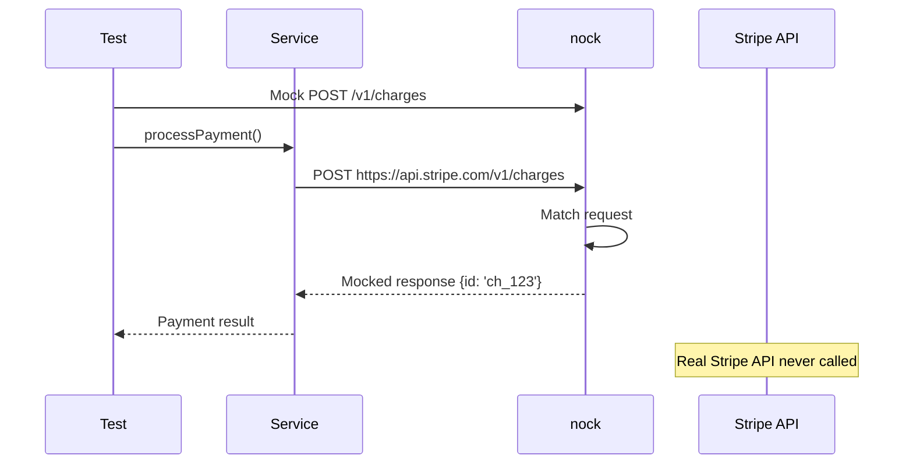
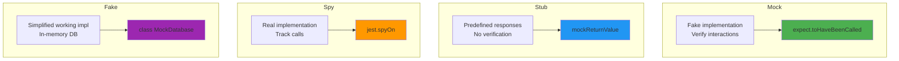
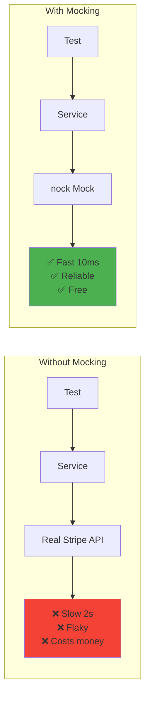
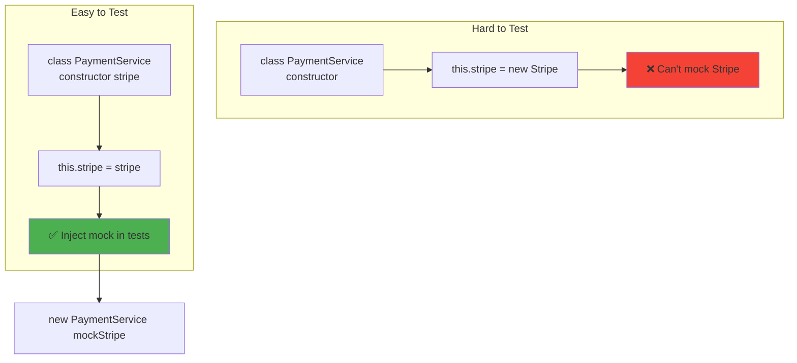

# Mocking async dependencies

## 1. Why this exists (Real-world problem first)

You're testing a payment service. It calls Stripe API. What breaks without mocking:

- **Tests depend on external service**: Stripe API must be available. Stripe has outage. All tests fail. Can't deploy.
- **Tests are slow**: Each test makes real HTTP request to Stripe. Takes 2 seconds per test. 100 tests = 200 seconds.
- **Tests cost money**: Stripe charges per API call. Running tests 100 times/day = $1000/month.
- **Can't test error scenarios**: Want to test what happens when Stripe returns 500 error. Can't force Stripe to fail.
- **Tests are flaky**: Network issues cause random failures. Tests pass locally, fail in CI.

Real pain: A payment service tested against real Stripe API. Stripe had 1-hour outage. All CI/CD builds failed. Couldn't deploy critical bug fix. The fix: mock Stripe API with nock—tests run in 10 seconds, no external dependencies, can test error scenarios.

**Another scenario**: A weather app tested against real weather API. API rate-limited after 100 requests. Tests failed after 100 runs. With mocking, unlimited test runs.

## 2. Mental model (build imagination)

Think of mocking as **stunt doubles in movies**.

**Without mocking**:
- Actor does dangerous stunt
- Risk of injury
- Expensive insurance
- Slow filming (safety checks)

**With mocking (stunt double)**:
- Stunt double does dangerous scene
- No risk to actor
- Faster filming
- Can retry many times

**In technical terms**:
- **Mock**: Fake implementation of dependency
- **Stub**: Predefined responses
- **Spy**: Track how dependency was called
- **Fake**: Simplified working implementation

**Key insight**: Mocking makes tests **fast, reliable, and independent** of external services.

## 3. How Node.js implements this internally

### Mocking HTTP requests with nock

```javascript
const nock = require('nock');
const { processPayment } = require('../src/payment');

describe('Payment Service', () => {
  afterEach(() => {
    nock.cleanAll(); // Clean up mocks
  });
  
  it('should process payment successfully', async () => {
    // Mock Stripe API
    nock('https://api.stripe.com')
      .post('/v1/charges')
      .reply(200, {
        id: 'ch_123',
        status: 'succeeded',
        amount: 1000,
      });
    
    const result = await processPayment({
      amount: 1000,
      currency: 'usd',
      source: 'tok_visa',
    });
    
    expect(result.status).toBe('succeeded');
    expect(result.chargeId).toBe('ch_123');
  });
  
  it('should handle payment failure', async () => {
    // Mock Stripe API error
    nock('https://api.stripe.com')
      .post('/v1/charges')
      .reply(402, {
        error: {
          type: 'card_error',
          message: 'Your card was declined',
        },
      });
    
    await expect(processPayment({
      amount: 1000,
      currency: 'usd',
      source: 'tok_visa',
    })).rejects.toThrow('Your card was declined');
  });
  
  it('should retry on network error', async () => {
    // First call: network error
    nock('https://api.stripe.com')
      .post('/v1/charges')
      .replyWithError('ECONNREFUSED');
    
    // Second call: success
    nock('https://api.stripe.com')
      .post('/v1/charges')
      .reply(200, { id: 'ch_123', status: 'succeeded' });
    
    const result = await processPayment({
      amount: 1000,
      currency: 'usd',
      source: 'tok_visa',
    });
    
    expect(result.status).toBe('succeeded');
  });
});
```

**What happens**:
1. nock intercepts HTTP requests
2. Returns mocked response
3. No real network request made
4. Fast, reliable, isolated

**Event loop impact**: No real HTTP request, no async I/O. Test is synchronous.

### Mocking functions with Jest

```javascript
const emailService = require('../src/services/email');
const { createUser } = require('../src/users');

describe('User Creation', () => {
  it('should send welcome email', async () => {
    // Mock email service
    const sendEmailMock = jest.spyOn(emailService, 'sendEmail').mockResolvedValue(true);
    
    const user = await createUser({
      name: 'John Doe',
      email: 'john@example.com',
    });
    
    expect(sendEmailMock).toHaveBeenCalledWith({
      to: 'john@example.com',
      subject: 'Welcome!',
      body: expect.stringContaining('Welcome, John Doe'),
    });
    
    sendEmailMock.mockRestore();
  });
  
  it('should handle email failure gracefully', async () => {
    // Mock email service to fail
    jest.spyOn(emailService, 'sendEmail').mockRejectedValue(new Error('SMTP error'));
    
    const user = await createUser({
      name: 'John Doe',
      email: 'john@example.com',
    });
    
    // User should still be created even if email fails
    expect(user.id).toBeDefined();
  });
});
```

### Mocking database with in-memory implementation

```javascript
class MockDatabase {
  constructor() {
    this.users = new Map();
  }
  
  async query(sql, params) {
    if (sql.includes('INSERT INTO users')) {
      const [id, name, email] = params;
      this.users.set(id, { id, name, email });
      return { rows: [{ id, name, email }] };
    }
    
    if (sql.includes('SELECT * FROM users WHERE id')) {
      const [id] = params;
      const user = this.users.get(id);
      return { rows: user ? [user] : [] };
    }
    
    throw new Error(`Unsupported query: ${sql}`);
  }
  
  async close() {
    this.users.clear();
  }
}

// Usage in tests
const mockDb = new MockDatabase();
jest.mock('../src/db', () => mockDb);

describe('User Repository', () => {
  it('should save and retrieve user', async () => {
    await userRepository.create({ id: '123', name: 'John', email: 'john@example.com' });
    
    const user = await userRepository.findById('123');
    expect(user.name).toBe('John');
  });
});
```

## 4. Multiple diagrams (MANDATORY)

### Mocking HTTP requests



### Mock vs Stub vs Spy vs Fake



### Test with vs without mocking



### Dependency injection for testability



## 5. Where this is used in real projects

### Production mocking with nock

```javascript
// tests/payment.test.js
const nock = require('nock');
const { processPayment, refundPayment } = require('../src/services/payment');

describe('Payment Service', () => {
  beforeEach(() => {
    // Disable real HTTP requests
    nock.disableNetConnect();
  });
  
  afterEach(() => {
    nock.cleanAll();
    nock.enableNetConnect();
  });
  
  describe('processPayment', () => {
    it('should create charge successfully', async () => {
      const scope = nock('https://api.stripe.com')
        .post('/v1/charges', {
          amount: 1000,
          currency: 'usd',
          source: 'tok_visa',
        })
        .reply(200, {
          id: 'ch_123',
          status: 'succeeded',
          amount: 1000,
          currency: 'usd',
        });
      
      const result = await processPayment({
        amount: 1000,
        currency: 'usd',
        source: 'tok_visa',
      });
      
      expect(result.chargeId).toBe('ch_123');
      expect(result.status).toBe('succeeded');
      expect(scope.isDone()).toBe(true); // Verify request was made
    });
    
    it('should handle card declined', async () => {
      nock('https://api.stripe.com')
        .post('/v1/charges')
        .reply(402, {
          error: {
            type: 'card_error',
            code: 'card_declined',
            message: 'Your card was declined',
          },
        });
      
      await expect(processPayment({
        amount: 1000,
        currency: 'usd',
        source: 'tok_visa',
      })).rejects.toThrow('Your card was declined');
    });
    
    it('should retry on timeout', async () => {
      // First call: timeout
      nock('https://api.stripe.com')
        .post('/v1/charges')
        .delayConnection(5000)
        .reply(200, { id: 'ch_123' });
      
      // Second call: success
      nock('https://api.stripe.com')
        .post('/v1/charges')
        .reply(200, {
          id: 'ch_456',
          status: 'succeeded',
        });
      
      const result = await processPayment({
        amount: 1000,
        currency: 'usd',
        source: 'tok_visa',
      });
      
      expect(result.chargeId).toBe('ch_456');
    });
  });
  
  describe('refundPayment', () => {
    it('should refund charge', async () => {
      nock('https://api.stripe.com')
        .post('/v1/refunds', {
          charge: 'ch_123',
        })
        .reply(200, {
          id: 're_123',
          status: 'succeeded',
          charge: 'ch_123',
        });
      
      const result = await refundPayment('ch_123');
      
      expect(result.refundId).toBe('re_123');
      expect(result.status).toBe('succeeded');
    });
  });
});
```

### Mocking with dependency injection

```javascript
// src/services/payment.js
class PaymentService {
  constructor(stripeClient) {
    this.stripe = stripeClient;
  }
  
  async processPayment(paymentData) {
    const charge = await this.stripe.charges.create({
      amount: paymentData.amount,
      currency: paymentData.currency,
      source: paymentData.source,
    });
    
    return {
      chargeId: charge.id,
      status: charge.status,
    };
  }
}

module.exports = PaymentService;

// tests/payment.test.js
describe('PaymentService', () => {
  it('should process payment', async () => {
    // Mock Stripe client
    const mockStripe = {
      charges: {
        create: jest.fn().mockResolvedValue({
          id: 'ch_123',
          status: 'succeeded',
        }),
      },
    };
    
    const paymentService = new PaymentService(mockStripe);
    
    const result = await paymentService.processPayment({
      amount: 1000,
      currency: 'usd',
      source: 'tok_visa',
    });
    
    expect(result.chargeId).toBe('ch_123');
    expect(mockStripe.charges.create).toHaveBeenCalledWith({
      amount: 1000,
      currency: 'usd',
      source: 'tok_visa',
    });
  });
});
```

### Mocking async timers

```javascript
// src/services/retry.js
async function retryWithBackoff(fn, maxRetries = 3) {
  for (let i = 0; i < maxRetries; i++) {
    try {
      return await fn();
    } catch (err) {
      if (i === maxRetries - 1) throw err;
      
      const delay = Math.pow(2, i) * 1000; // Exponential backoff
      await new Promise(resolve => setTimeout(resolve, delay));
    }
  }
}

// tests/retry.test.js
jest.useFakeTimers();

describe('retryWithBackoff', () => {
  it('should retry with exponential backoff', async () => {
    let attempts = 0;
    const fn = jest.fn().mockImplementation(() => {
      attempts++;
      if (attempts < 3) {
        throw new Error('Temporary failure');
      }
      return 'success';
    });
    
    const promise = retryWithBackoff(fn);
    
    // Fast-forward through delays
    await jest.advanceTimersByTimeAsync(1000); // First retry after 1s
    await jest.advanceTimersByTimeAsync(2000); // Second retry after 2s
    
    const result = await promise;
    
    expect(result).toBe('success');
    expect(fn).toHaveBeenCalledTimes(3);
  });
});

jest.useRealTimers();
```

## 6. Where this should NOT be used

### Over-mocking

```javascript
// BAD: Mock everything, test nothing
const mockDb = { query: jest.fn().mockResolvedValue({ rows: [] }) };
const mockCache = { get: jest.fn().mockResolvedValue(null) };
const mockLogger = { info: jest.fn() };
// Test verifies mocks were called, not actual behavior

// GOOD: Mock external dependencies only
// Use real database for integration tests
```

### Mocking implementation details

```javascript
// BAD: Mock internal function
jest.spyOn(myModule, 'internalHelper').mockReturnValue(42);
// Test is coupled to implementation

// GOOD: Mock external dependencies only
```

## 7. Failure modes & edge cases

### Mock not cleaned up

**Scenario**: Test mocks HTTP request, doesn't clean up. Next test fails unexpectedly.

**Impact**: Flaky tests.

**Solution**: Always clean up mocks in `afterEach`.

```javascript
afterEach(() => {
  nock.cleanAll();
  jest.restoreAllMocks();
});
```

### Mock doesn't match real API

**Scenario**: Mock returns different format than real API. Tests pass, production fails.

**Impact**: False confidence.

**Solution**: Use contract testing or record real API responses.

## 8. Trade-offs & alternatives

### What you gain
- **Fast tests**: No real HTTP requests
- **Reliable tests**: No external dependencies
- **Test error scenarios**: Force failures

### What you sacrifice
- **False confidence**: Mock may not match real API
- **Maintenance**: Must update mocks when API changes
- **Complexity**: Must write mock setup code

### Alternatives

**Integration tests**
- **Use case**: Test with real dependencies
- **Benefit**: More realistic
- **Trade-off**: Slower, flakier

**Contract testing**
- **Use case**: Verify mock matches real API
- **Benefit**: Catch API changes
- **Trade-off**: More complex setup

## 9. Interview-level articulation

**Question**: "How do you mock async dependencies in tests?"

**Weak answer**: "I use Jest mocks."

**Strong answer**: "I use nock to mock HTTP requests to external APIs. For example, to test payment processing, I mock the Stripe API: `nock('https://api.stripe.com').post('/v1/charges').reply(200, { id: 'ch_123' })`. This intercepts HTTP requests and returns mocked responses, making tests fast (no real network), reliable (no external dependencies), and flexible (can test error scenarios). I also use Jest mocks for internal dependencies: `jest.spyOn(emailService, 'sendEmail').mockResolvedValue(true)`. I clean up mocks in `afterEach` to prevent test interference. For complex dependencies, I use dependency injection—inject mock implementations in tests, real implementations in production."

**Follow-up**: "How do you ensure mocks match real APIs?"

**Answer**: "I use contract testing with Pact to verify mocks match real APIs. The consumer test defines expected request/response, generating a contract. The provider test verifies the real API satisfies the contract. I also record real API responses and use them as mocks—nock has a recording feature. For critical dependencies, I run integration tests against real APIs in CI/CD (but not on every commit). I also version mocks—when API changes, I update mocks and tests together."

## 10. Key takeaways (engineer mindset)

**What to remember**:
- **Use nock to mock HTTP requests**
- **Use Jest mocks for function calls**
- **Clean up mocks in afterEach**
- **Mock external dependencies only**, not internal functions
- **Use dependency injection** for testability

**What decisions this enables**:
- Choosing mocking library (nock, Jest, sinon)
- Designing testable code (dependency injection)
- Balancing mocks vs integration tests
- Implementing contract testing

**How it connects to other Node.js concepts**:
- **Async/await**: Mocks must handle async operations
- **HTTP requests**: nock intercepts HTTP requests
- **Dependency injection**: Makes code testable
- **Testing pyramid**: Unit tests use mocks, integration tests use real dependencies
