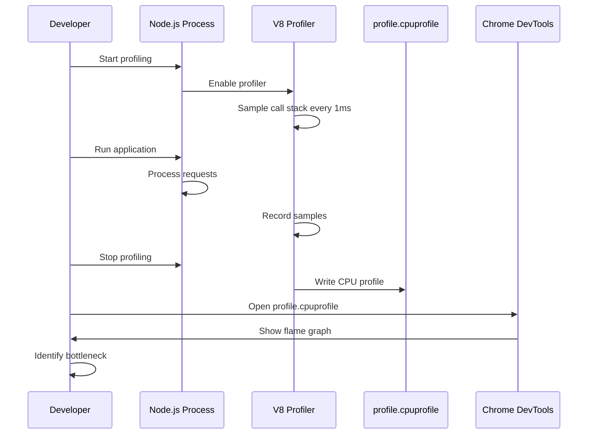
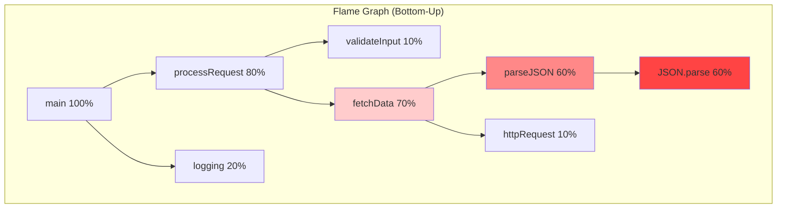
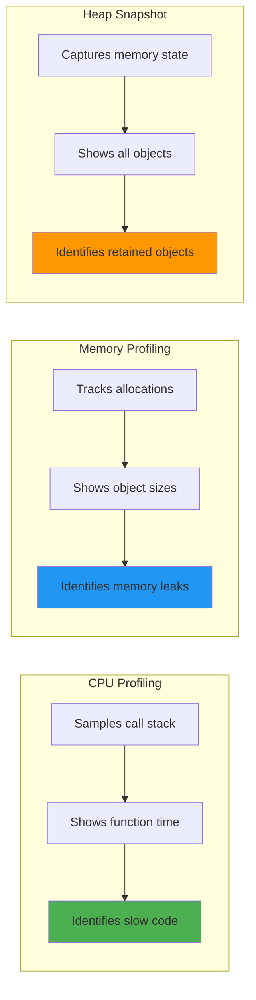
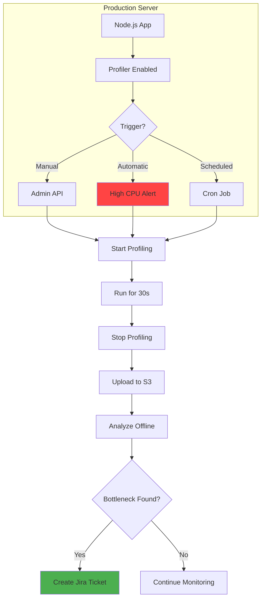

# Node.js performance profiling

## 1. Why this exists (Real-world problem first)

You're running an e-commerce API. Response times are 200ms in staging, but 5 seconds in production. Users abandon carts. Revenue drops. You check CPU, memory, database—all normal. Where is the bottleneck?

**What breaks without profiling:**

- **Blind optimization**: Engineers guess what's slow. Optimize database queries. No improvement. Wasted 2 weeks.
- **Production fires**: API times out under Black Friday load. No idea which function is slow. Can't fix it fast enough.
- **Memory leaks**: Memory usage grows from 100MB to 2GB over 3 days. Server crashes. No clue which code is leaking.
- **CPU spikes**: CPU jumps to 100% randomly. Server becomes unresponsive. Can't identify the cause.

**Real pain**: A SaaS platform had 10-second API response times. Engineers optimized database indexes, added caching, upgraded servers—nothing worked. Finally ran profiler. Found a single JSON serialization taking 9.8 seconds (circular reference bug). Fixed in 10 minutes. Without profiling, they were optimizing blind.

**Another scenario**: A chat app had memory leaks. Memory grew 50MB/hour. Server crashed every 2 days. Profiling showed event listeners not being removed. 1-line fix stopped the leak.

## 2. Mental model (build imagination)

Think of profiling as **security camera footage for your code**.

**Without profiling (no cameras)**:
- Store gets robbed
- You know something was stolen
- No idea who, when, or how
- Can only guess and add more guards everywhere

**With profiling (cameras everywhere)**:
- Store gets robbed
- Review footage
- See exactly who, when, and how
- Fix the specific security hole

**In technical terms**:
- **Profiler**: Records what your code is doing
- **CPU profiling**: Which functions consume CPU time
- **Memory profiling**: Which objects consume memory
- **Heap snapshot**: Photo of memory at a specific moment
- **Flame graph**: Visual representation of where time is spent

**Key insight**: Profiling shows **what actually happens**, not what you think happens. Code that looks fast can be slow. Code that looks complex can be fast.

## 3. How Node.js implements this internally

### V8 profiler

Node.js uses V8's built-in profiler. V8 samples the call stack at regular intervals (every 1ms by default).

**How it works**:
1. **Sampling**: Every 1ms, V8 pauses execution and records the current call stack
2. **Aggregation**: After profiling, V8 aggregates samples to show which functions were running most often
3. **Output**: Generates CPU profile (JSON) or tick log (text)

**Event loop impact**: Profiling adds ~5% overhead. Sampling pauses execution for microseconds, but doesn't block the event loop significantly.

### Built-in profiler

```javascript
// Start profiling
const { Session } = require('inspector');
const session = new Session();
session.connect();

session.post('Profiler.enable', () => {
  session.post('Profiler.start', () => {
    // Run your code
    runExpensiveOperation();
    
    session.post('Profiler.stop', (err, { profile }) => {
      // Save profile to file
      require('fs').writeFileSync('profile.cpuprofile', JSON.stringify(profile));
      session.disconnect();
    });
  });
});
```

**What happens**:
1. Inspector protocol connects to V8
2. Profiler starts sampling call stacks
3. Code runs normally
4. Profiler stops and returns aggregated data
5. Data saved as `.cpuprofile` file (viewable in Chrome DevTools)

### Common misunderstanding

**Myth**: "Profiling shows every function call."

**Reality**: Profiling **samples** the call stack. If a function runs for 0.5ms, it might not appear in the profile. Profiling shows functions that consume **significant time**, not all functions.

**Myth**: "Profiling is 100% accurate."

**Reality**: Sampling introduces statistical error. If a function runs 10ms, profiler might record 9ms or 11ms. Accuracy improves with longer profiling duration.

## 4. Multiple diagrams (MANDATORY)

### CPU profiling workflow



### Flame graph anatomy



**Reading the graph**:
- **Width**: Time spent in function (wider = slower)
- **Height**: Call stack depth
- **Bottom**: Entry point (main)
- **Top**: Leaf functions (where time is actually spent)
- **Red**: Hot path (bottleneck)

### Profiling types comparison



### Production profiling architecture



## 5. Where this is used in real projects

### Production API profiling

```javascript
// src/profiler.js
const { Session } = require('inspector');
const fs = require('fs');
const path = require('path');
const { S3Client, PutObjectCommand } = require('@aws-sdk/client-s3');

class ProductionProfiler {
  constructor() {
    this.session = null;
    this.profiling = false;
    this.s3Client = new S3Client({ region: 'us-east-1' });
  }
  
  async startProfiling(duration = 30000) {
    if (this.profiling) {
      throw new Error('Profiling already in progress');
    }
    
    this.session = new Session();
    this.session.connect();
    
    return new Promise((resolve, reject) => {
      this.session.post('Profiler.enable', () => {
        this.session.post('Profiler.start', () => {
          this.profiling = true;
          console.log(`Profiling started for ${duration}ms`);
          
          setTimeout(() => {
            this.stopProfiling()
              .then(resolve)
              .catch(reject);
          }, duration);
        });
      });
    });
  }
  
  async stopProfiling() {
    if (!this.profiling) {
      throw new Error('No profiling in progress');
    }
    
    return new Promise((resolve, reject) => {
      this.session.post('Profiler.stop', async (err, { profile }) => {
        if (err) {
          return reject(err);
        }
        
        this.profiling = false;
        this.session.disconnect();
        
        // Save locally
        const filename = `profile-${Date.now()}.cpuprofile`;
        const filepath = path.join('/tmp', filename);
        fs.writeFileSync(filepath, JSON.stringify(profile));
        
        // Upload to S3
        await this.uploadToS3(filepath, filename);
        
        console.log(`Profile saved: ${filename}`);
        resolve({ filename, filepath });
      });
    });
  }
  
  async uploadToS3(filepath, filename) {
    const fileContent = fs.readFileSync(filepath);
    
    const command = new PutObjectCommand({
      Bucket: 'my-app-profiles',
      Key: `cpu-profiles/${filename}`,
      Body: fileContent,
      ContentType: 'application/json',
    });
    
    await this.s3Client.send(command);
  }
}

module.exports = new ProductionProfiler();

// src/routes/admin.js
const express = require('express');
const profiler = require('../profiler');

const router = express.Router();

// Admin endpoint to trigger profiling
router.post('/profile/start', async (req, res) => {
  try {
    const duration = req.body.duration || 30000;
    
    // Start profiling (non-blocking)
    profiler.startProfiling(duration)
      .then(({ filename }) => {
        console.log(`Profiling completed: ${filename}`);
      })
      .catch(err => {
        console.error('Profiling failed:', err);
      });
    
    res.json({
      message: 'Profiling started',
      duration,
    });
  } catch (err) {
    res.status(500).json({ error: err.message });
  }
});

module.exports = router;
```

### Automatic profiling on high CPU

```javascript
// src/monitoring/cpu-monitor.js
const os = require('os');
const profiler = require('../profiler');

class CPUMonitor {
  constructor() {
    this.threshold = 80; // 80% CPU
    this.checkInterval = 5000; // Check every 5s
    this.cooldown = 300000; // 5 minutes cooldown
    this.lastProfileTime = 0;
  }
  
  start() {
    setInterval(() => {
      this.checkCPU();
    }, this.checkInterval);
  }
  
  async checkCPU() {
    const cpuUsage = this.getCPUUsage();
    
    if (cpuUsage > this.threshold) {
      const now = Date.now();
      
      // Cooldown to prevent profiling spam
      if (now - this.lastProfileTime > this.cooldown) {
        console.warn(`High CPU detected: ${cpuUsage}%`);
        this.lastProfileTime = now;
        
        try {
          await profiler.startProfiling(30000);
          console.log('Auto-profiling completed');
        } catch (err) {
          console.error('Auto-profiling failed:', err);
        }
      }
    }
  }
  
  getCPUUsage() {
    const cpus = os.cpus();
    let totalIdle = 0;
    let totalTick = 0;
    
    cpus.forEach(cpu => {
      for (let type in cpu.times) {
        totalTick += cpu.times[type];
      }
      totalIdle += cpu.times.idle;
    });
    
    const idle = totalIdle / cpus.length;
    const total = totalTick / cpus.length;
    const usage = 100 - (100 * idle / total);
    
    return Math.round(usage);
  }
}

module.exports = new CPUMonitor();

// src/index.js
const cpuMonitor = require('./monitoring/cpu-monitor');

if (process.env.NODE_ENV === 'production') {
  cpuMonitor.start();
  console.log('CPU monitoring enabled');
}
```

### Profiling specific endpoints

```javascript
// src/middleware/profile-middleware.js
const profiler = require('../profiler');

function profileEndpoint(duration = 10000) {
  return async (req, res, next) => {
    // Check if profiling is requested
    if (req.headers['x-profile'] === 'true') {
      console.log(`Profiling endpoint: ${req.method} ${req.path}`);
      
      try {
        // Start profiling
        const profilePromise = profiler.startProfiling(duration);
        
        // Continue with request
        next();
        
        // Wait for profiling to complete
        const { filename } = await profilePromise;
        
        // Add profile filename to response headers
        res.setHeader('X-Profile-File', filename);
      } catch (err) {
        console.error('Profiling error:', err);
        next();
      }
    } else {
      next();
    }
  };
}

module.exports = { profileEndpoint };

// src/routes/api.js
const express = require('express');
const { profileEndpoint } = require('../middleware/profile-middleware');

const router = express.Router();

// Apply profiling middleware to specific routes
router.get('/expensive-operation', 
  profileEndpoint(10000),
  async (req, res) => {
    // Expensive operation
    const result = await performComplexCalculation();
    res.json(result);
  }
);

module.exports = router;
```

## 6. Where this should NOT be used

### Always-on profiling in production

**Bad**:
```javascript
// DON'T: Enable profiling for every request
app.use((req, res, next) => {
  profiler.startProfiling();
  res.on('finish', () => profiler.stopProfiling());
  next();
});
```

**Why**: Profiling adds 5-10% overhead. Slows down all requests. Generates massive amounts of data.

**Good**: Profile on-demand or when CPU is high.

### Profiling in tight loops

**Bad**:
```javascript
// DON'T: Start/stop profiling in loop
for (let i = 0; i < 1000; i++) {
  profiler.startProfiling();
  processItem(i);
  profiler.stopProfiling();
}
```

**Why**: Profiling overhead dominates. Results are meaningless.

**Good**: Profile the entire loop once.

### Profiling without analysis

**Bad**: Generate 100 CPU profiles, never analyze them.

**Why**: Profiling is useless without action. Wastes storage and time.

**Good**: Profile when you have a specific performance problem to investigate.

## 7. Failure modes & edge cases

### Profiling overhead causes timeout

**Scenario**: API has 5-second timeout. Profiling adds 10% overhead. Request takes 4.8s normally, 5.3s with profiling. Times out.

**Impact**: Profiling makes the problem worse.

**Solution**: Increase timeout during profiling, or profile in staging with production load.

### Profile file too large

**Scenario**: Profile a long-running process for 10 minutes. Profile file is 500MB. Can't open in Chrome DevTools.

**Impact**: Can't analyze the profile.

**Solution**: Profile for shorter duration (30-60 seconds). Use sampling interval of 10ms instead of 1ms.

```javascript
// Reduce sampling frequency
session.post('Profiler.setSamplingInterval', { interval: 10000 }); // 10ms
```

### Profiling during deployment

**Scenario**: Profiling is running when deployment starts. New code deployed. Profile contains mix of old and new code.

**Impact**: Confusing results. Can't identify bottleneck.

**Solution**: Stop profiling before deployment. Or ignore profiles during deployment window.

### Memory leak from profiling

**Scenario**: Start profiling, forget to stop. Profiler accumulates samples in memory. Memory grows until OOM.

**Impact**: Server crashes.

**Solution**: Always set timeout for profiling. Auto-stop after duration.

```javascript
async startProfiling(duration = 30000) {
  // Always set timeout
  setTimeout(() => {
    if (this.profiling) {
      console.warn('Profiling timeout, force stopping');
      this.stopProfiling();
    }
  }, duration);
}
```

## 8. Trade-offs & alternatives

### What you gain

- **Identify bottlenecks**: Know exactly which functions are slow
- **Data-driven optimization**: Optimize what matters, not what you guess
- **Production debugging**: Profile live traffic to find real-world issues
- **Validate optimizations**: Measure before/after to confirm improvement

### What you sacrifice

- **Performance overhead**: 5-10% slower during profiling
- **Complexity**: Need to set up profiling infrastructure
- **Storage**: Profile files can be large (10-100MB)
- **Analysis time**: Need to review and interpret profiles

### Alternatives

**APM tools (New Relic, Datadog)**
- **Use case**: Continuous monitoring without manual profiling
- **Benefit**: Automatic bottleneck detection, no code changes
- **Trade-off**: Expensive ($100-1000/month), less detailed than profiling

**Logging with timestamps**
- **Use case**: Simple performance tracking
- **Benefit**: Easy to implement, no overhead
- **Trade-off**: Manual analysis, doesn't show call stack

**Synthetic monitoring**
- **Use case**: Track performance over time
- **Benefit**: Detect regressions early
- **Trade-off**: Doesn't identify root cause

## 9. Interview-level articulation

**Question**: "How do you profile Node.js applications in production?"

**Weak answer**: "I use the V8 profiler."

**Strong answer**: "I use Node's built-in inspector protocol to enable V8's CPU profiler. I've built an admin endpoint that triggers profiling for 30 seconds and uploads the `.cpuprofile` to S3. I also have automatic profiling that triggers when CPU exceeds 80% for more than 30 seconds, with a 5-minute cooldown to prevent spam. The profiles are analyzed offline in Chrome DevTools to identify bottlenecks. For example, we found a JSON serialization taking 60% of CPU time—turned out to be a circular reference bug. Fixed it by implementing a custom serializer. I avoid always-on profiling because it adds 5-10% overhead. Instead, I profile on-demand or when performance degrades."

**Follow-up**: "What's the difference between CPU profiling and heap snapshots?"

**Answer**: "CPU profiling shows **where time is spent**—which functions consume CPU. It samples the call stack every 1ms and aggregates to show hot paths. Heap snapshots show **where memory is allocated**—which objects consume memory. It captures the entire heap at a specific moment. Use CPU profiling for slow code, heap snapshots for memory leaks. For example, if API response time is 5 seconds, CPU profiling shows which function is slow. If memory grows from 100MB to 2GB, heap snapshots show which objects are retained."

**Follow-up**: "How do you minimize profiling overhead in production?"

**Answer**: "I profile for short durations (30-60 seconds), not continuously. I use a cooldown period (5 minutes) to prevent profiling spam. I increase the sampling interval from 1ms to 10ms to reduce overhead. I profile specific endpoints with a header flag (`X-Profile: true`) instead of all traffic. I also profile in staging with production-like load when possible. For continuous monitoring, I use APM tools like Datadog, which have lower overhead than manual profiling."

## 10. Key takeaways (engineer mindset)

**What to remember**:
- **Profile when you have a specific performance problem**, not continuously
- **Use CPU profiling to find slow code**, heap snapshots to find memory leaks
- **Profiling adds 5-10% overhead**—minimize duration and frequency
- **Flame graphs show where time is spent**—wider = slower
- **Always set timeout for profiling** to prevent memory leaks

**What decisions this enables**:
- Choosing what to optimize (data-driven, not guessing)
- Deciding when to profile (on-demand, automatic, or scheduled)
- Selecting profiling tools (built-in vs APM vs logging)
- Balancing profiling overhead vs insight

**How it connects to other Node.js concepts**:
- **Event loop**: Profiling shows which phase consumes time (timers, I/O, poll)
- **Async operations**: Profiling reveals if you're blocking the event loop
- **Memory management**: Heap snapshots identify memory leaks
- **V8 optimization**: Profiling shows if functions are optimized or deoptimized
- **Production monitoring**: Profiling complements metrics and logs
