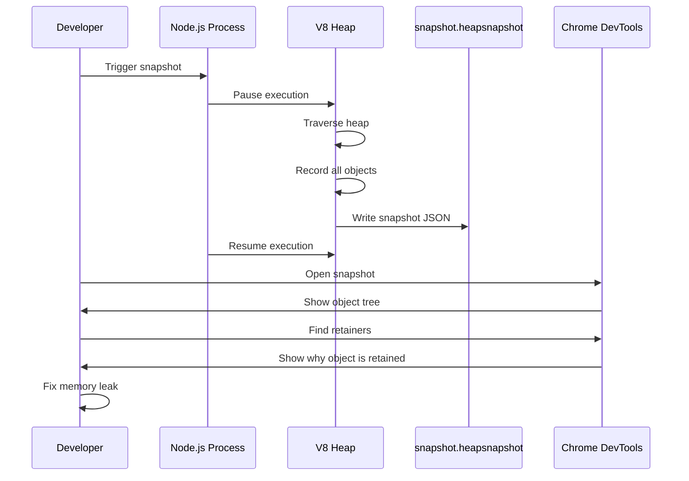
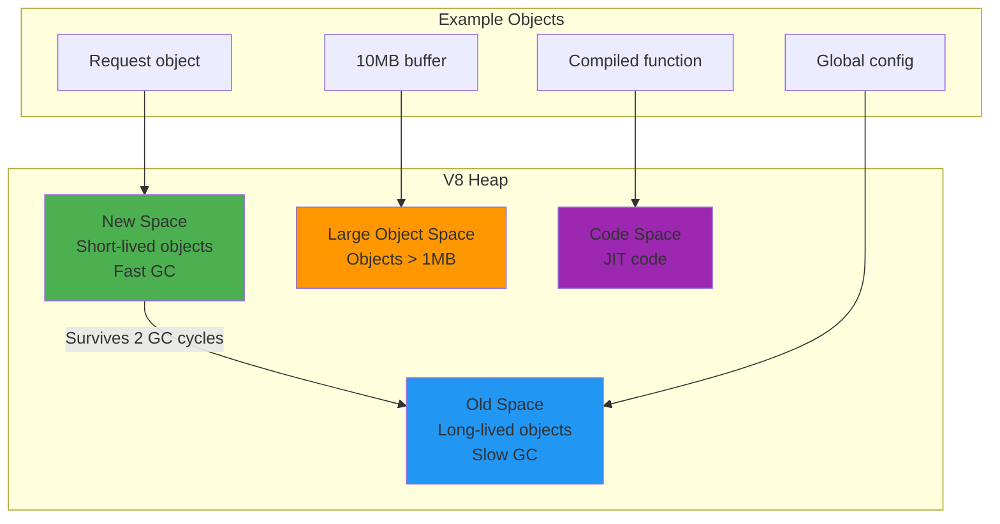
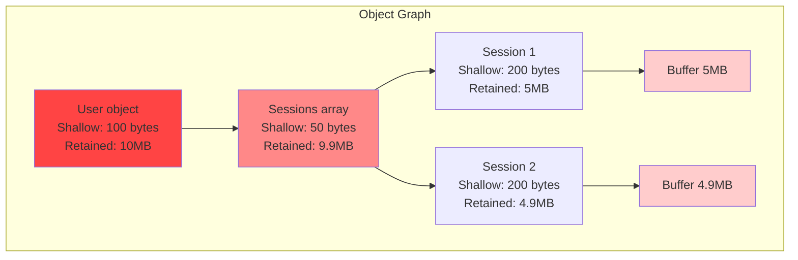
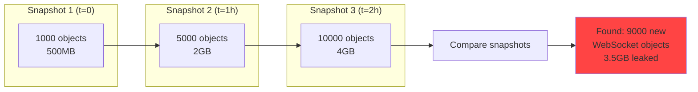

# Heap snapshots

## 1. Why this exists (Real-world problem first)

You're running a chat application. Memory usage starts at 200MB, grows to 500MB after 1 hour, 1GB after 3 hours, 2GB after 6 hours. Server crashes with "Out of Memory". You restart. Same pattern repeats. You have a memory leak, but where?

**What breaks without heap snapshots:**

- **Blind debugging**: Engineers guess which code leaks memory. Remove event listeners. No improvement. Wasted 1 week.
- **Production crashes**: Memory grows until OOM. Server crashes every 6 hours. Users lose connections. Revenue loss.
- **Inefficient memory usage**: Application uses 2GB memory but only needs 500MB. Paying for extra servers.
- **Can't identify retained objects**: Know memory is leaking, but can't find which objects are not being garbage collected.

**Real pain**: A real-time analytics platform had memory leaks. Memory grew 100MB/hour. Server crashed every 12 hours. Engineers added more memory (4GB → 8GB → 16GB). Didn't fix the leak, just delayed the crash. Finally took heap snapshots. Found 50,000 WebSocket connections not being closed. Each connection held 200KB of buffers. 50,000 × 200KB = 10GB. Fixed by properly closing connections. Memory stabilized at 500MB.

**Another scenario**: An e-commerce API used 3GB memory. Heap snapshot showed 2GB was cached product images in memory. Moved to Redis. Memory dropped to 1GB. Saved $500/month on server costs.

## 2. Mental model (build imagination)

Think of heap snapshots as **aerial photos of a warehouse**.

**Without heap snapshots (walking through warehouse)**:
- You know the warehouse is full
- Can't see what's taking up space
- Must manually check every shelf
- Takes hours to find the problem

**With heap snapshots (aerial photo)**:
- See entire warehouse layout from above
- Instantly identify which section is full
- See what items are taking up space
- Compare photos over time to see what's growing

**In technical terms**:
- **Heap**: All objects in memory (variables, closures, buffers, etc.)
- **Snapshot**: Photo of heap at a specific moment
- **Retained size**: Memory held by object + everything it references
- **Shallow size**: Memory held by object itself (not references)
- **Retainers**: What's keeping an object in memory (preventing garbage collection)

**Key insight**: Heap snapshots show **what's in memory** and **why it's still there**. Objects you think are garbage collected might still be retained by closures, event listeners, or global variables.

## 3. How Node.js implements this internally

### V8 heap structure

V8 divides heap into regions:
- **New space**: Short-lived objects (scavenger GC, fast)
- **Old space**: Long-lived objects (mark-sweep GC, slower)
- **Large object space**: Objects > 1MB
- **Code space**: JIT-compiled code
- **Map space**: Hidden classes (object shapes)

**Heap snapshot captures all regions**, showing every object and its references.

### Taking heap snapshots

```javascript
// Using inspector protocol
const { Session } = require('inspector');
const fs = require('fs');

function takeHeapSnapshot(filename) {
  const session = new Session();
  session.connect();
  
  return new Promise((resolve, reject) => {
    const chunks = [];
    
    session.on('HeapProfiler.addHeapSnapshotChunk', ({ chunk }) => {
      chunks.push(chunk);
    });
    
    session.post('HeapProfiler.takeHeapSnapshot', null, (err) => {
      if (err) {
        return reject(err);
      }
      
      const snapshot = chunks.join('');
      fs.writeFileSync(filename, snapshot);
      session.disconnect();
      resolve(filename);
    });
  });
}

// Usage
takeHeapSnapshot('heap-snapshot.heapsnapshot');
```

**What happens**:
1. V8 pauses execution (stop-the-world)
2. Traverses entire heap, recording every object
3. Records object type, size, and references
4. Generates JSON file (can be 100MB-1GB)
5. Resumes execution

**Event loop impact**: Taking snapshot blocks event loop for 1-5 seconds (depending on heap size). During this time, no requests are processed.

### Common misunderstanding

**Myth**: "Heap snapshots show memory usage over time."

**Reality**: Heap snapshot is a **single point in time**. To see memory growth, take multiple snapshots and compare them.

**Myth**: "Heap snapshots are free."

**Reality**: Taking snapshot pauses execution for 1-5 seconds. Snapshot file can be 1GB. Don't take snapshots on every request.

## 4. Multiple diagrams (MANDATORY)

### Heap snapshot workflow



### Heap structure



### Retained vs shallow size



**Key insight**: User object is only 100 bytes, but retains 10MB because it references sessions, which reference buffers.

### Comparing snapshots to find leaks



## 5. Where this is used in real projects

### Production heap snapshot on-demand

```javascript
// src/heap-snapshot.js
const { Session } = require('inspector');
const fs = require('fs');
const path = require('path');
const { S3Client, PutObjectCommand } = require('@aws-sdk/client-s3');

class HeapSnapshotManager {
  constructor() {
    this.s3Client = new S3Client({ region: 'us-east-1' });
    this.snapshotInProgress = false;
  }
  
  async takeSnapshot() {
    if (this.snapshotInProgress) {
      throw new Error('Snapshot already in progress');
    }
    
    this.snapshotInProgress = true;
    
    try {
      const filename = `heap-${Date.now()}.heapsnapshot`;
      const filepath = path.join('/tmp', filename);
      
      console.log('Taking heap snapshot...');
      const startTime = Date.now();
      
      await this.captureSnapshot(filepath);
      
      const duration = Date.now() - startTime;
      const fileSize = fs.statSync(filepath).size;
      
      console.log(`Snapshot captured in ${duration}ms, size: ${fileSize} bytes`);
      
      // Upload to S3
      await this.uploadToS3(filepath, filename);
      
      // Clean up local file
      fs.unlinkSync(filepath);
      
      return { filename, duration, fileSize };
    } finally {
      this.snapshotInProgress = false;
    }
  }
  
  captureSnapshot(filepath) {
    return new Promise((resolve, reject) => {
      const session = new Session();
      session.connect();
      
      const chunks = [];
      
      session.on('HeapProfiler.addHeapSnapshotChunk', ({ chunk }) => {
        chunks.push(chunk);
      });
      
      session.post('HeapProfiler.takeHeapSnapshot', null, (err) => {
        if (err) {
          session.disconnect();
          return reject(err);
        }
        
        const snapshot = chunks.join('');
        fs.writeFileSync(filepath, snapshot);
        session.disconnect();
        resolve();
      });
    });
  }
  
  async uploadToS3(filepath, filename) {
    const fileContent = fs.readFileSync(filepath);
    
    const command = new PutObjectCommand({
      Bucket: 'my-app-heap-snapshots',
      Key: `snapshots/${filename}`,
      Body: fileContent,
      ContentType: 'application/json',
    });
    
    await this.s3Client.send(command);
  }
}

module.exports = new HeapSnapshotManager();

// src/routes/admin.js
const express = require('express');
const heapSnapshot = require('../heap-snapshot');

const router = express.Router();

router.post('/heap-snapshot', async (req, res) => {
  try {
    const result = await heapSnapshot.takeSnapshot();
    
    res.json({
      message: 'Heap snapshot captured',
      filename: result.filename,
      duration: result.duration,
      fileSize: result.fileSize,
    });
  } catch (err) {
    res.status(500).json({ error: err.message });
  }
});

module.exports = router;
```

### Automatic snapshots on high memory

```javascript
// src/monitoring/memory-monitor.js
const heapSnapshot = require('../heap-snapshot');

class MemoryMonitor {
  constructor() {
    this.threshold = 1.5 * 1024 * 1024 * 1024; // 1.5GB
    this.checkInterval = 10000; // Check every 10s
    this.cooldown = 600000; // 10 minutes cooldown
    this.lastSnapshotTime = 0;
  }
  
  start() {
    setInterval(() => {
      this.checkMemory();
    }, this.checkInterval);
  }
  
  async checkMemory() {
    const memUsage = process.memoryUsage();
    const heapUsed = memUsage.heapUsed;
    
    if (heapUsed > this.threshold) {
      const now = Date.now();
      
      // Cooldown to prevent snapshot spam
      if (now - this.lastSnapshotTime > this.cooldown) {
        console.warn(`High memory detected: ${Math.round(heapUsed / 1024 / 1024)}MB`);
        this.lastSnapshotTime = now;
        
        try {
          await heapSnapshot.takeSnapshot();
          console.log('Auto-snapshot completed');
        } catch (err) {
          console.error('Auto-snapshot failed:', err);
        }
      }
    }
  }
}

module.exports = new MemoryMonitor();

// src/index.js
const memoryMonitor = require('./monitoring/memory-monitor');

if (process.env.NODE_ENV === 'production') {
  memoryMonitor.start();
  console.log('Memory monitoring enabled');
}
```

### Comparing snapshots to find leaks

```javascript
// scripts/compare-snapshots.js
const fs = require('fs');

function compareSnapshots(snapshot1Path, snapshot2Path) {
  const snap1 = JSON.parse(fs.readFileSync(snapshot1Path, 'utf8'));
  const snap2 = JSON.parse(fs.readFileSync(snapshot2Path, 'utf8'));
  
  // Count objects by type
  const types1 = countObjectTypes(snap1);
  const types2 = countObjectTypes(snap2);
  
  // Find growing object types
  const growth = [];
  
  for (const [type, count2] of Object.entries(types2)) {
    const count1 = types1[type] || 0;
    const delta = count2 - count1;
    
    if (delta > 0) {
      growth.push({
        type,
        count1,
        count2,
        delta,
        percentGrowth: Math.round((delta / count1) * 100),
      });
    }
  }
  
  // Sort by delta
  growth.sort((a, b) => b.delta - a.delta);
  
  console.log('Top 10 growing object types:');
  growth.slice(0, 10).forEach(({ type, count1, count2, delta, percentGrowth }) => {
    console.log(`${type}: ${count1} → ${count2} (+${delta}, +${percentGrowth}%)`);
  });
}

function countObjectTypes(snapshot) {
  const types = {};
  
  snapshot.nodes.forEach((node, i) => {
    if (i % 6 === 0) { // Node type is every 6th element
      const typeIndex = snapshot.nodes[i];
      const typeName = snapshot.strings[typeIndex];
      types[typeName] = (types[typeName] || 0) + 1;
    }
  });
  
  return types;
}

// Usage
compareSnapshots('heap-1.heapsnapshot', 'heap-2.heapsnapshot');
```

### Finding memory leaks with retainers

```javascript
// Example: Event listener leak
class ChatRoom {
  constructor() {
    this.users = new Map();
    this.messageHistory = []; // Memory leak: grows forever
  }
  
  addUser(userId, socket) {
    this.users.set(userId, socket);
    
    // Memory leak: listener never removed
    socket.on('message', (msg) => {
      this.messageHistory.push({
        userId,
        message: msg,
        timestamp: Date.now(),
      });
      
      // Broadcast to all users
      this.users.forEach((s) => s.send(msg));
    });
  }
  
  removeUser(userId) {
    const socket = this.users.get(userId);
    
    // BUG: Not removing listener
    // socket.removeAllListeners('message');
    
    this.users.delete(userId);
  }
}

// Fix: Remove listeners and limit history
class ChatRoomFixed {
  constructor() {
    this.users = new Map();
    this.messageHistory = [];
    this.maxHistory = 1000; // Limit history size
  }
  
  addUser(userId, socket) {
    const messageHandler = (msg) => {
      this.messageHistory.push({
        userId,
        message: msg,
        timestamp: Date.now(),
      });
      
      // Trim history
      if (this.messageHistory.length > this.maxHistory) {
        this.messageHistory = this.messageHistory.slice(-this.maxHistory);
      }
      
      this.users.forEach((s) => s.send(msg));
    };
    
    // Store handler reference for cleanup
    socket.messageHandler = messageHandler;
    socket.on('message', messageHandler);
    
    this.users.set(userId, socket);
  }
  
  removeUser(userId) {
    const socket = this.users.get(userId);
    
    if (socket) {
      // Remove listener
      socket.removeListener('message', socket.messageHandler);
      this.users.delete(userId);
    }
  }
}
```

## 6. Where this should NOT be used

### Taking snapshots on every request

**Bad**:
```javascript
// DON'T: Take snapshot on every request
app.use(async (req, res, next) => {
  await heapSnapshot.takeSnapshot();
  next();
});
```

**Why**: Snapshot blocks event loop for 1-5 seconds. Kills performance. Generates massive amounts of data.

**Good**: Take snapshots on-demand or when memory is high.

### Storing snapshots in memory

**Bad**:
```javascript
// DON'T: Store snapshots in memory
const snapshots = [];
snapshots.push(await takeSnapshot());
```

**Why**: Snapshot can be 1GB. Storing multiple snapshots causes OOM.

**Good**: Write snapshots to disk or S3, delete after analysis.

### Comparing snapshots manually

**Bad**: Download 10 snapshots (10GB), manually compare in Chrome DevTools.

**Why**: Time-consuming, error-prone, doesn't scale.

**Good**: Automate comparison with scripts, alert on anomalies.

## 7. Failure modes & edge cases

### Snapshot causes OOM

**Scenario**: Heap is 3GB. Taking snapshot requires additional 3GB to serialize. Total 6GB exceeds available memory. Process crashes.

**Impact**: Taking snapshot to debug memory leak causes crash.

**Solution**: Increase memory limit temporarily, or take snapshot in staging with production heap dump.

```bash
# Increase memory limit
node --max-old-space-size=8192 index.js
```

### Snapshot blocks production traffic

**Scenario**: Taking snapshot blocks event loop for 5 seconds. All requests timeout during this time.

**Impact**: Users see errors. Monitoring alerts fire.

**Solution**: Take snapshots during low-traffic periods, or on a canary instance.

### Snapshot file too large to analyze

**Scenario**: Heap is 5GB. Snapshot file is 5GB. Chrome DevTools can't open it (crashes browser).

**Impact**: Can't analyze the snapshot.

**Solution**: Use command-line tools to analyze snapshot, or reduce heap size before taking snapshot.

```bash
# Analyze snapshot with heapdump
npm install -g heapdump
node -e "require('heapdump').writeSnapshot('heap.heapsnapshot')"
```

### Snapshot doesn't show leak

**Scenario**: Memory grows over time, but snapshot shows normal objects. Leak is not visible.

**Impact**: Can't find the leak.

**Solution**: Take multiple snapshots over time and compare. Leak might be slow accumulation, not a single large object.

## 8. Trade-offs & alternatives

### What you gain

- **Identify memory leaks**: See which objects are retained
- **Understand memory usage**: Know what's consuming memory
- **Compare over time**: Track memory growth
- **Find retainers**: Understand why objects aren't garbage collected

### What you sacrifice

- **Performance impact**: Snapshot blocks event loop for 1-5 seconds
- **Storage**: Snapshot files can be 100MB-1GB
- **Analysis time**: Need to review and interpret snapshots
- **Complexity**: Need to understand heap structure and retainers

### Alternatives

**Memory profiling**
- **Use case**: Track allocations over time
- **Benefit**: Shows what's being allocated, not just what's in memory
- **Trade-off**: More overhead than snapshots

**Process monitoring (RSS, heap size)**
- **Use case**: Track memory usage over time
- **Benefit**: Lightweight, continuous monitoring
- **Trade-off**: Doesn't show what's consuming memory

**APM tools (New Relic, Datadog)**
- **Use case**: Automatic memory leak detection
- **Benefit**: No manual snapshots, automatic alerts
- **Trade-off**: Expensive, less detailed than snapshots

## 9. Interview-level articulation

**Question**: "How do you debug memory leaks in Node.js?"

**Weak answer**: "I use heap snapshots."

**Strong answer**: "I use heap snapshots to identify memory leaks. First, I monitor memory usage over time with `process.memoryUsage()`. If memory grows continuously, I take heap snapshots at different points (e.g., t=0, t=1h, t=2h). I compare snapshots in Chrome DevTools to see which object types are growing. For example, if I see 10,000 new WebSocket objects, I know there's a connection leak. I then use the 'Retainers' view to see what's keeping those objects in memory—often it's event listeners not being removed. I've also built automatic snapshot capture when memory exceeds 1.5GB, with a 10-minute cooldown to prevent spam. Snapshots are uploaded to S3 for offline analysis."

**Follow-up**: "What's the difference between shallow size and retained size?"

**Answer**: "Shallow size is the memory consumed by the object itself, not including references. Retained size is the memory that would be freed if the object was garbage collected—it includes the object and everything it references. For example, a User object might have shallow size of 100 bytes, but retained size of 10MB if it references a sessions array with large buffers. Retained size is more important for finding leaks because it shows the total memory impact of an object."

**Follow-up**: "How do you take heap snapshots in production without impacting users?"

**Answer**: "Taking heap snapshots blocks the event loop for 1-5 seconds, so I minimize impact by: (1) Taking snapshots during low-traffic periods (e.g., 3am), (2) Taking snapshots on a canary instance, not all instances, (3) Using a cooldown period (10 minutes) to prevent snapshot spam, (4) Monitoring request latency and aborting snapshot if latency spikes. For critical services, I take snapshots in staging with production-like load, or use heap dumps from crashed processes (automatic heap dump on OOM with `--heapsnapshot-signal`)."

## 10. Key takeaways (engineer mindset)

**What to remember**:
- **Heap snapshots show what's in memory at a specific moment**
- **Compare snapshots over time to find memory leaks**
- **Retained size shows total memory impact**, shallow size shows object size
- **Retainers show why objects aren't garbage collected**
- **Snapshots block event loop for 1-5 seconds**—minimize frequency

**What decisions this enables**:
- Choosing when to take snapshots (on-demand, automatic, scheduled)
- Deciding where to store snapshots (disk, S3, ephemeral)
- Selecting analysis tools (Chrome DevTools, scripts, APM)
- Balancing snapshot overhead vs insight

**How it connects to other Node.js concepts**:
- **Garbage collection**: Snapshots show what GC can't collect
- **Event listeners**: Common cause of memory leaks (not removed)
- **Closures**: Can retain large objects unintentionally
- **Buffers**: Often the largest objects in heap
- **V8 memory management**: Understanding heap structure helps interpret snapshots
