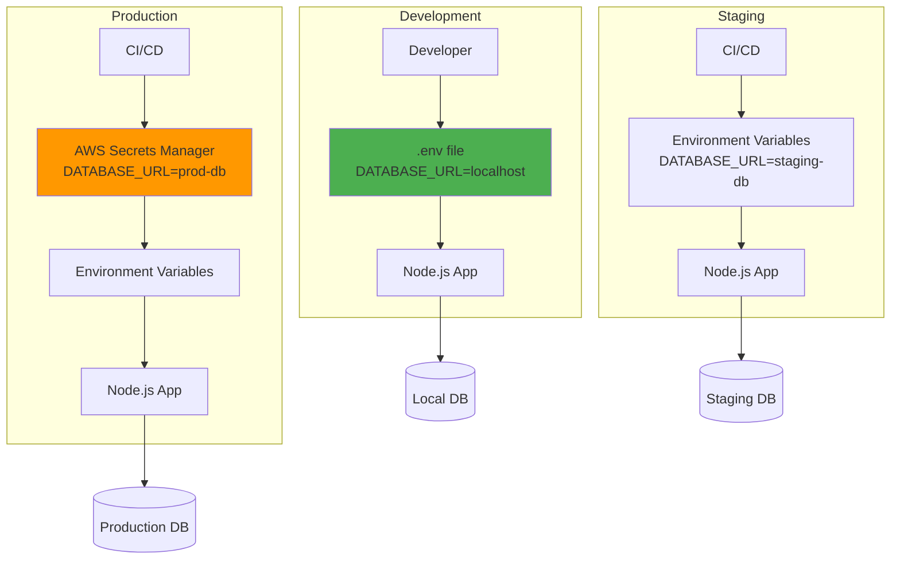
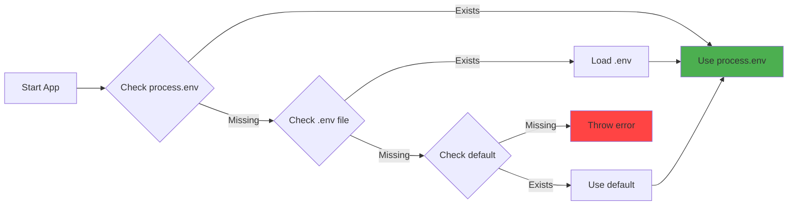
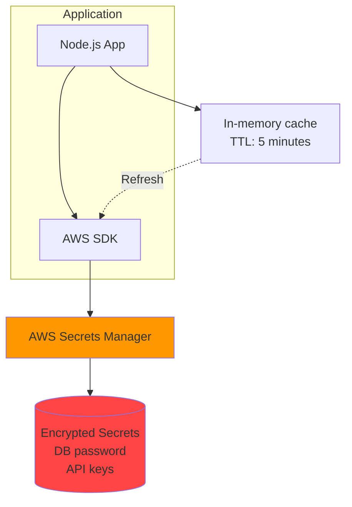
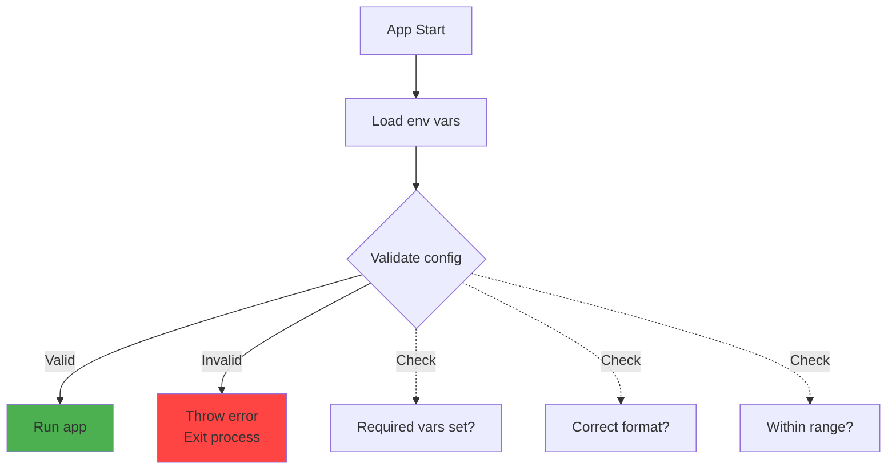

# Env-based config

## 1. Why this exists (Real-world problem first)

You deploy code to production. It connects to the staging database. Production users see test data. You hardcoded `DATABASE_URL = 'postgres://staging-db:5432/test'` in code. Disaster.

**What breaks without environment-based config:**

- **Hardcoded credentials in code**: Database passwords, API keys committed to Git. Security breach. Credentials leaked on GitHub.
- **Can't deploy same code to multiple environments**: Code works in staging, breaks in production because URLs are different. Must maintain separate codebases.
- **Can't change config without redeploying**: Need to change database host. Must rebuild, redeploy entire app. 30-minute downtime.
- **Secrets exposed in logs**: API keys hardcoded, logged in error messages. Attackers steal credentials from logs.

**Real pain**: A fintech startup hardcoded AWS credentials in code. Pushed to public GitHub repo. Within 2 hours, attackers spun up 100 EC2 instances for Bitcoin mining. AWS bill: $50,000. Company almost went bankrupt. The fix: move all secrets to environment variables, never commit credentials.

**Another scenario**: An e-commerce API had different database URLs for dev/staging/prod. Engineers maintained 3 separate config files. Deployed staging config to production by mistake. Production connected to staging database. Orders were lost. With env-based config, same code runs everywhere—only environment variables change.

## 2. Mental model (build imagination)

Think of environment-based config as **interchangeable power adapters**.

**Without env-based config (hardcoded)**:
- Phone charger only works with 110V (US)
- Travel to Europe (220V)
- Phone won't charge
- Must buy new phone

**With env-based config (adapter)**:
- Phone charger accepts any voltage
- Plug in adapter for local voltage
- Phone charges everywhere
- Same phone, different adapters

**In technical terms**:
- **Environment variable**: Configuration value set outside code (OS-level)
- **12-factor app**: Methodology that requires strict separation of config from code
- **`.env` file**: File containing environment variables (for local development)
- **Secrets management**: Secure storage for sensitive config (AWS Secrets Manager, HashiCorp Vault)

**Key insight**: Code should be **environment-agnostic**. Same code runs in dev, staging, production. Only config changes. This enables continuous deployment—deploy same artifact everywhere.

## 3. How Node.js implements this internally

### process.env

Node.js exposes environment variables via `process.env` object.

**How it works**:
1. **OS environment**: Operating system stores environment variables (key-value pairs)
2. **Process inheritance**: When Node.js process starts, it inherits parent process's environment
3. **process.env**: Node.js exposes environment as JavaScript object

```javascript
// Access environment variable
const dbUrl = process.env.DATABASE_URL;

// Set environment variable (only affects current process)
process.env.NODE_ENV = 'production';
```

**Event loop impact**: Reading `process.env` is synchronous, no I/O. No impact on event loop.

### dotenv library

`dotenv` loads environment variables from `.env` file.

**How it works**:
1. **Read `.env` file**: Parse file line by line
2. **Set process.env**: For each `KEY=value`, set `process.env.KEY = value`
3. **Override**: By default, doesn't override existing env vars

```javascript
// .env file
DATABASE_URL=postgres://localhost:5432/myapp
API_KEY=secret123

// Load .env
require('dotenv').config();

console.log(process.env.DATABASE_URL); // postgres://localhost:5432/myapp
```

### Common misunderstanding

**Myth**: "Environment variables are secure."

**Reality**: Environment variables are **visible to the process and its children**. Not encrypted. Anyone with access to the process can read them (`ps aux`, `/proc/<pid>/environ`). Use secrets management for sensitive data.

**Myth**: "`.env` files should be committed to Git."

**Reality**: **Never commit `.env` files**. They contain secrets. Add `.env` to `.gitignore`. Commit `.env.example` with dummy values as a template.

## 4. Multiple diagrams (MANDATORY)

### Environment-based config flow



### Config loading priority



### Secrets management architecture



### Config validation



## 5. Where this is used in real projects

### Production config management

```javascript
// src/config/index.js
const dotenv = require('dotenv');

// Load .env in development
if (process.env.NODE_ENV !== 'production') {
  dotenv.config();
}

// Validate required environment variables
const requiredEnvVars = [
  'NODE_ENV',
  'PORT',
  'DATABASE_URL',
  'REDIS_URL',
  'JWT_SECRET',
  'AWS_REGION',
];

requiredEnvVars.forEach((envVar) => {
  if (!process.env[envVar]) {
    throw new Error(`Missing required environment variable: ${envVar}`);
  }
});

// Export config object
module.exports = {
  env: process.env.NODE_ENV,
  port: parseInt(process.env.PORT, 10),
  
  database: {
    url: process.env.DATABASE_URL,
    poolSize: parseInt(process.env.DB_POOL_SIZE || '10', 10),
    ssl: process.env.DB_SSL === 'true',
  },
  
  redis: {
    url: process.env.REDIS_URL,
    ttl: parseInt(process.env.REDIS_TTL || '3600', 10),
  },
  
  jwt: {
    secret: process.env.JWT_SECRET,
    expiresIn: process.env.JWT_EXPIRES_IN || '1h',
  },
  
  aws: {
    region: process.env.AWS_REGION,
    accessKeyId: process.env.AWS_ACCESS_KEY_ID,
    secretAccessKey: process.env.AWS_SECRET_ACCESS_KEY,
  },
  
  features: {
    enableNewUI: process.env.FEATURE_NEW_UI === 'true',
    enableBetaAPI: process.env.FEATURE_BETA_API === 'true',
  },
};

// src/index.js
const config = require('./config');

console.log(`Starting app in ${config.env} mode`);
console.log(`Listening on port ${config.port}`);
```

### Using AWS Secrets Manager

```javascript
// src/config/secrets.js
const { SecretsManagerClient, GetSecretValueCommand } = require('@aws-sdk/client-secrets-manager');

class SecretsManager {
  constructor() {
    this.client = new SecretsManagerClient({
      region: process.env.AWS_REGION,
    });
    this.cache = new Map();
    this.ttl = 5 * 60 * 1000; // 5 minutes
  }
  
  async getSecret(secretName) {
    // Check cache
    const cached = this.cache.get(secretName);
    if (cached && Date.now() - cached.timestamp < this.ttl) {
      return cached.value;
    }
    
    // Fetch from AWS
    const command = new GetSecretValueCommand({ SecretId: secretName });
    const response = await this.client.send(command);
    
    const value = JSON.parse(response.SecretString);
    
    // Cache
    this.cache.set(secretName, {
      value,
      timestamp: Date.now(),
    });
    
    return value;
  }
}

module.exports = new SecretsManager();

// Usage
const secretsManager = require('./config/secrets');

async function initDatabase() {
  const dbCredentials = await secretsManager.getSecret('prod/database');
  
  const pool = new Pool({
    host: dbCredentials.host,
    port: dbCredentials.port,
    user: dbCredentials.username,
    password: dbCredentials.password,
    database: dbCredentials.database,
  });
  
  return pool;
}
```

### Environment-specific configuration

```javascript
// config/default.js
module.exports = {
  port: 3000,
  logLevel: 'info',
  database: {
    poolSize: 10,
    ssl: false,
  },
};

// config/production.js
module.exports = {
  logLevel: 'error',
  database: {
    poolSize: 50,
    ssl: true,
  },
};

// config/index.js
const defaultConfig = require('./default');
const envConfig = require(`./${process.env.NODE_ENV}`) || {};

module.exports = {
  ...defaultConfig,
  ...envConfig,
  // Override with environment variables
  port: process.env.PORT || defaultConfig.port,
  database: {
    ...defaultConfig.database,
    ...envConfig.database,
    url: process.env.DATABASE_URL,
  },
};
```

### Docker environment variables

```dockerfile
# Dockerfile
FROM node:18-alpine

WORKDIR /app

COPY package*.json ./
RUN npm ci --only=production

COPY . .

# Default environment variables
ENV NODE_ENV=production
ENV PORT=3000

EXPOSE 3000

CMD ["node", "index.js"]
```

```yaml
# docker-compose.yml
version: '3.8'

services:
  api:
    build: .
    ports:
      - "3000:3000"
    environment:
      NODE_ENV: production
      DATABASE_URL: postgres://db:5432/myapp
      REDIS_URL: redis://redis:6379
      JWT_SECRET: ${JWT_SECRET}  # From host environment
    env_file:
      - .env.production  # Load from file
```

## 6. Where this should NOT be used

### Storing large data in environment variables

**Bad**:
```javascript
// DON'T: Store large JSON in env var
process.env.CONFIG = JSON.stringify({ /* 10KB of config */ });
```

**Why**: Environment variables have size limits (typically 32KB-128KB). Large values slow down process startup.

**Good**: Store large config in files or remote config service (AWS AppConfig).

### Storing binary data

**Bad**:
```javascript
// DON'T: Store binary data in env var
process.env.CERTIFICATE = fs.readFileSync('cert.pem').toString('base64');
```

**Why**: Environment variables are strings. Binary data must be base64-encoded, increasing size. Difficult to manage.

**Good**: Store file paths in env vars, read files at runtime.

### Using .env in production

**Bad**: Deploy `.env` file to production servers.

**Why**: `.env` files are for local development. Production should use OS environment variables or secrets management.

**Good**: Set environment variables via deployment platform (Docker, Kubernetes, AWS).

## 7. Failure modes & edge cases

### Missing environment variable

**Scenario**: App starts, `DATABASE_URL` is undefined. App crashes on first database query.

**Impact**: App appears to start successfully, then crashes.

**Solution**: Validate required env vars at startup. Fail fast if missing.

```javascript
if (!process.env.DATABASE_URL) {
  console.error('Missing DATABASE_URL');
  process.exit(1);
}
```

### Wrong environment variable type

**Scenario**: `PORT=abc` (should be number). `parseInt('abc')` returns `NaN`. App listens on port `NaN`.

**Impact**: App starts but doesn't accept connections.

**Solution**: Validate env var types and ranges.

```javascript
const port = parseInt(process.env.PORT, 10);
if (isNaN(port) || port < 1 || port > 65535) {
  throw new Error(`Invalid PORT: ${process.env.PORT}`);
}
```

### Environment variable injection attack

**Scenario**: User input is used to set environment variable. Attacker injects malicious value.

**Impact**: Security breach.

**Solution**: Never set `process.env` from user input. Validate and sanitize all config.

### Secrets leaked in logs

**Scenario**: Log config object at startup. Includes `JWT_SECRET`. Secret exposed in logs.

**Impact**: Security breach.

**Solution**: Redact secrets when logging.

```javascript
const config = { jwt: { secret: process.env.JWT_SECRET } };
console.log(JSON.stringify(config, (key, value) => {
  if (key === 'secret') return '[REDACTED]';
  return value;
}));
```

## 8. Trade-offs & alternatives

### What you gain

- **Environment-agnostic code**: Same code runs everywhere
- **Security**: Secrets not committed to Git
- **Flexibility**: Change config without redeploying
- **12-factor compliance**: Industry best practice

### What you sacrifice

- **Complexity**: Must manage environment variables across environments
- **Debugging**: Harder to reproduce issues (different config in dev vs prod)
- **Validation**: Must validate config at startup

### Alternatives

**Config files (JSON, YAML)**
- **Use case**: Complex, hierarchical config
- **Benefit**: Easier to read, version control
- **Trade-off**: Must manage files across environments, secrets still need env vars

**Remote config service (AWS AppConfig, etcd)**
- **Use case**: Dynamic config changes without redeployment
- **Benefit**: Centralized config, audit trail
- **Trade-off**: Additional dependency, network latency

**Hardcoded config**
- **Use case**: Never (except constants like `MAX_RETRIES = 3`)
- **Benefit**: Simple
- **Trade-off**: Insecure, inflexible, not 12-factor compliant

## 9. Interview-level articulation

**Question**: "How do you manage configuration in Node.js applications?"

**Weak answer**: "I use environment variables."

**Strong answer**: "I use environment-based configuration following the 12-factor app methodology. In development, I use `dotenv` to load variables from a `.env` file (which is gitignored). In production, I set environment variables via the deployment platform—Docker, Kubernetes, or AWS. I validate all required environment variables at startup and fail fast if any are missing. For sensitive data like database passwords and API keys, I use AWS Secrets Manager with in-memory caching (5-minute TTL) to reduce API calls. I also implement config validation to ensure correct types and ranges—for example, `PORT` must be a number between 1 and 65535. This approach ensures the same code runs in all environments, secrets are never committed to Git, and config can be changed without redeploying code."

**Follow-up**: "How do you handle secrets in production?"

**Answer**: "I use AWS Secrets Manager to store sensitive data like database passwords, API keys, and JWT secrets. At app startup, I fetch secrets using the AWS SDK and cache them in memory with a 5-minute TTL. This reduces API calls while ensuring secrets are rotated regularly. I never commit secrets to Git or log them. When logging config, I redact sensitive fields. For local development, I use `.env` files with dummy values, and the real secrets are only in AWS Secrets Manager. I also implement secret rotation—AWS Secrets Manager automatically rotates database passwords every 30 days, and my app fetches the new password from the cache."

**Follow-up**: "What happens if a required environment variable is missing?"

**Answer**: "I validate all required environment variables at app startup, before initializing any services. If any variable is missing, I log a clear error message and exit with code 1. This is a fail-fast approach—better to crash immediately than to start successfully and fail later when the variable is needed. For example, if `DATABASE_URL` is missing, I don't want the app to start, accept requests, and then crash on the first database query. I also validate types and ranges—`PORT` must be a number, `DB_POOL_SIZE` must be positive. This catches configuration errors early, before they cause production issues."

## 10. Key takeaways (engineer mindset)

**What to remember**:
- **Never commit secrets to Git**—use environment variables or secrets management
- **Validate required env vars at startup**—fail fast if missing
- **Use `.env` for local development only**—production uses OS env vars
- **Same code, different config**—environment-agnostic code enables continuous deployment
- **Redact secrets when logging**—prevent accidental exposure

**What decisions this enables**:
- Choosing config management strategy (env vars, config files, remote config)
- Deciding where to store secrets (env vars, AWS Secrets Manager, HashiCorp Vault)
- Implementing config validation (required vars, types, ranges)
- Balancing security vs convenience

**How it connects to other Node.js concepts**:
- **12-factor app**: Strict separation of config from code
- **Docker**: Environment variables passed via `-e` flag or `env_file`
- **Kubernetes**: Environment variables defined in pod spec or ConfigMap/Secret
- **CI/CD**: Environment variables set in deployment pipeline
- **Security**: Secrets management prevents credential leaks
