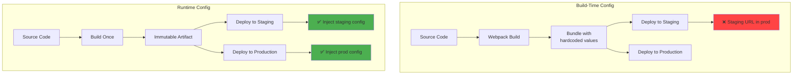
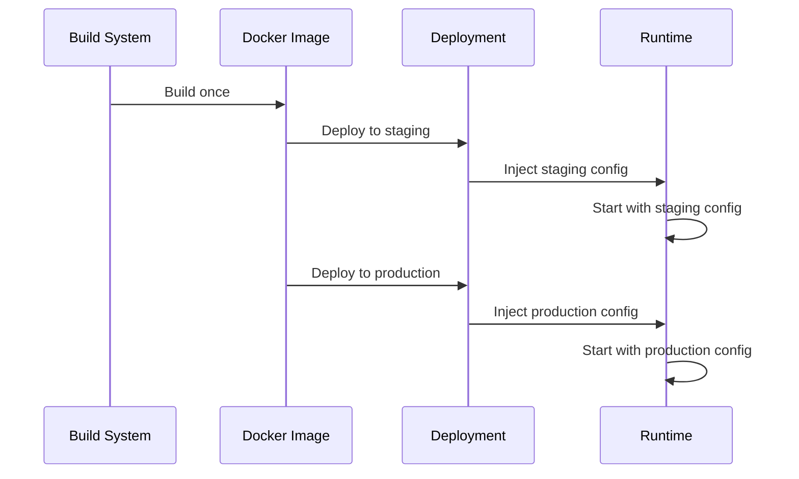
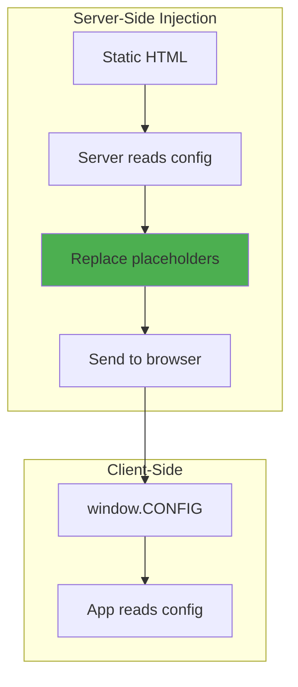
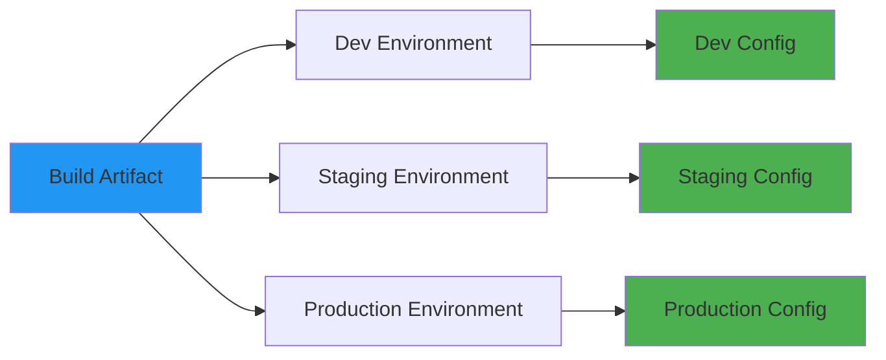

# Build vs runtime config

## 1. Why this exists (Real-world problem first)

You build a React app with API URL hardcoded: `API_URL = 'https://api.staging.com'`. Deploy to production. App calls staging API from production. Users see test data. You must rebuild the entire app to change one URL. 30-minute deployment.

**What breaks without separating build and runtime config:**

- **Can't deploy same build to multiple environments**: Build for staging has staging URL. Build for production has production URL. Must maintain separate builds.
- **Can't change config without rebuilding**: Need to change API URL. Must rebuild entire app (10 minutes), redeploy (20 minutes). Total: 30 minutes downtime.
- **Security risk**: API keys baked into build. Anyone can extract keys from JavaScript bundle.
- **Slow rollback**: Production has bug. Want to rollback to previous build. But previous build has old config. Must rebuild with new config. Can't rollback quickly.

**Real pain**: A SaaS platform built React frontend with API URL at build time (`REACT_APP_API_URL`). Deployed to 5 regions (US, EU, Asia). Each region had different API URL. Maintained 5 separate builds. Changed API URL format. Had to rebuild and redeploy all 5 regions. Took 4 hours. With runtime config, would have taken 5 minutes (update config, restart).

**Another scenario**: An e-commerce app baked Stripe API key into build. Key was visible in JavaScript bundle. Attacker extracted key, made fraudulent charges. Lost $10,000. With runtime config, key would be injected at runtime (server-side), never exposed to client.

## 2. Mental model (build imagination)

Think of build vs runtime config as **factory vs field configuration**.

**Build-time config (factory)**:
- Car color chosen at factory
- Can't change after manufacturing
- Must order new car to change color

**Runtime config (field)**:
- Radio station chosen by driver
- Change anytime while driving
- Same car, different stations

**In technical terms**:
- **Build-time config**: Values embedded during compilation/bundling (webpack, esbuild)
- **Runtime config**: Values loaded when app starts (environment variables, config files, remote config)
- **Build artifact**: Immutable package (Docker image, npm package, static files)
- **Runtime injection**: Config injected when artifact runs

**Key insight**: Build artifacts should be **environment-agnostic**. Same artifact deployed to dev, staging, production. Only runtime config changes. This enables **build once, deploy anywhere**.

## 3. How Node.js implements this internally

### Build-time config (webpack DefinePlugin)

Webpack replaces variables at build time.

```javascript
// webpack.config.js
const webpack = require('webpack');

module.exports = {
  plugins: [
    new webpack.DefinePlugin({
      'process.env.API_URL': JSON.stringify('https://api.prod.com'),
      'process.env.VERSION': JSON.stringify('1.2.3'),
    }),
  ],
};

// src/api.js
console.log(process.env.API_URL); // 'https://api.prod.com' (hardcoded in bundle)
```

**What happens**: Webpack replaces `process.env.API_URL` with `'https://api.prod.com'` in the bundle. Value is **baked in**, can't change without rebuilding.

### Runtime config (environment variables)

Node.js reads environment variables at runtime.

```javascript
// src/config.js
module.exports = {
  apiUrl: process.env.API_URL || 'https://api.default.com',
  port: parseInt(process.env.PORT || '3000', 10),
};

// src/index.js
const config = require('./config');
console.log(config.apiUrl); // Read from environment at runtime
```

**What happens**: `process.env.API_URL` is read when app starts. Value can change without rebuilding.

### Common misunderstanding

**Myth**: "Frontend apps can't use runtime config."

**Reality**: Frontend apps can use runtime config via **server-side injection**. Server injects config into HTML at runtime.

```html
<!-- index.html -->
<script>
  window.CONFIG = {
    API_URL: '{{API_URL}}', // Replaced by server at runtime
  };
</script>
```

**Myth**: "Build-time config is faster."

**Reality**: Build-time config is **not faster** at runtime. Both are just variables. Build-time config is faster to **deploy** (no config injection needed), but less flexible.

## 4. Multiple diagrams (MANDATORY)

### Build-time vs runtime config



### Config injection flow



### Frontend runtime config injection



### Build once, deploy anywhere



## 5. Where this is used in real projects

### Backend runtime config

```javascript
// src/config/index.js
module.exports = {
  env: process.env.NODE_ENV,
  port: parseInt(process.env.PORT || '3000', 10),
  
  database: {
    url: process.env.DATABASE_URL,
    poolSize: parseInt(process.env.DB_POOL_SIZE || '10', 10),
  },
  
  redis: {
    url: process.env.REDIS_URL,
  },
  
  // Build-time config (version, build ID)
  version: process.env.npm_package_version, // From package.json at build
  buildId: process.env.BUILD_ID || 'dev',
};
```

### Frontend runtime config (server-side injection)

```javascript
// server.js (Express)
const express = require('express');
const fs = require('fs');
const path = require('path');

const app = express();

app.get('*', (req, res) => {
  const indexPath = path.join(__dirname, 'dist', 'index.html');
  let html = fs.readFileSync(indexPath, 'utf8');
  
  // Inject runtime config
  const config = {
    API_URL: process.env.API_URL,
    STRIPE_PUBLIC_KEY: process.env.STRIPE_PUBLIC_KEY,
    GOOGLE_ANALYTICS_ID: process.env.GOOGLE_ANALYTICS_ID,
  };
  
  html = html.replace(
    '<!-- CONFIG_PLACEHOLDER -->',
    `<script>window.CONFIG = ${JSON.stringify(config)};</script>`
  );
  
  res.send(html);
});

app.listen(3000);
```

```html
<!-- dist/index.html -->
<!DOCTYPE html>
<html>
<head>
  <title>My App</title>
  <!-- CONFIG_PLACEHOLDER -->
</head>
<body>
  <div id="root"></div>
  <script src="/bundle.js"></script>
</body>
</html>
```

```javascript
// src/api.js (Frontend)
const API_URL = window.CONFIG.API_URL;

export async function fetchUser(id) {
  const response = await fetch(`${API_URL}/users/${id}`);
  return response.json();
}
```

### Docker runtime config

```dockerfile
# Dockerfile
FROM node:18-alpine

WORKDIR /app

COPY package*.json ./
RUN npm ci --only=production

COPY . .

# Build-time config (version)
ARG VERSION=unknown
ENV APP_VERSION=$VERSION

# Runtime config (injected when container starts)
ENV NODE_ENV=production
ENV PORT=3000

EXPOSE 3000

CMD ["node", "index.js"]
```

```bash
# Build once
docker build -t myapp:1.2.3 --build-arg VERSION=1.2.3 .

# Deploy to staging with staging config
docker run -e DATABASE_URL=postgres://staging-db myapp:1.2.3

# Deploy to production with production config
docker run -e DATABASE_URL=postgres://prod-db myapp:1.2.3
```

### Kubernetes ConfigMap

```yaml
# configmap.yaml
apiVersion: v1
kind: ConfigMap
metadata:
  name: app-config
data:
  API_URL: "https://api.prod.com"
  LOG_LEVEL: "error"

---
# deployment.yaml
apiVersion: apps/v1
kind: Deployment
metadata:
  name: app
spec:
  template:
    spec:
      containers:
      - name: app
        image: myapp:1.2.3  # Same image for all environments
        envFrom:
        - configMapRef:
            name: app-config  # Inject config at runtime
```

## 6. Where this should NOT be used

### Secrets in build-time config

**Bad**:
```javascript
// webpack.config.js
new webpack.DefinePlugin({
  'process.env.DATABASE_PASSWORD': JSON.stringify('secret123'),
});
```

**Why**: Secrets baked into build. Visible in bundle. Security breach.

**Good**: Inject secrets at runtime via environment variables or secrets management.

### Feature flags in build-time config

**Bad**:
```javascript
// Build with feature flag
new webpack.DefinePlugin({
  'process.env.FEATURE_NEW_UI': JSON.stringify('true'),
});
```

**Why**: Can't toggle feature without rebuilding. Defeats purpose of feature flags.

**Good**: Load feature flags at runtime from remote config service.

### Environment-specific code in build

**Bad**:
```javascript
// Different builds for different environments
if (process.env.NODE_ENV === 'production') {
  // Production-only code
}
```

**Why**: Violates "build once, deploy anywhere". Must maintain separate builds.

**Good**: Same code, different runtime config.

## 7. Failure modes & edge cases

### Config injection fails

**Scenario**: Server crashes before injecting config. Frontend loads with placeholders (`{{API_URL}}`). App breaks.

**Impact**: Total outage.

**Solution**: Validate config injection. Fail fast if placeholders remain.

```javascript
if (window.CONFIG.API_URL.includes('{{')) {
  throw new Error('Config injection failed');
}
```

### Build-time and runtime config conflict

**Scenario**: Build has `API_URL='staging'`. Runtime has `API_URL='production'`. App uses build-time value.

**Impact**: Wrong config used.

**Solution**: Never mix build-time and runtime config for same value. Choose one.

### Large runtime config

**Scenario**: Inject 100KB of config into HTML. Page load slows down.

**Impact**: Poor user experience.

**Solution**: Only inject essential config. Load large config via API.

## 8. Trade-offs & alternatives

### Build-time config

**What you gain**:
- Simple deployment (no config injection)
- Faster startup (no config loading)
- Dead code elimination (webpack removes unused code)

**What you sacrifice**:
- Must rebuild to change config
- Can't deploy same build to multiple environments
- Secrets exposed in bundle

**Use when**: Config never changes (version, build ID, feature flags that don't change)

### Runtime config

**What you gain**:
- Build once, deploy anywhere
- Change config without rebuilding
- Secrets not exposed in bundle

**What you sacrifice**:
- Complex deployment (config injection)
- Slower startup (config loading)
- No dead code elimination

**Use when**: Config changes per environment (API URL, database URL, secrets)

### Alternatives

**Remote config service (AWS AppConfig, LaunchDarkly)**
- **Use case**: Dynamic config changes without redeployment
- **Benefit**: Change config in real-time
- **Trade-off**: Additional dependency, network latency

**Hybrid approach**
- **Use case**: Some config at build time, some at runtime
- **Benefit**: Best of both worlds
- **Trade-off**: More complex

## 9. Interview-level articulation

**Question**: "What's the difference between build-time and runtime config?"

**Weak answer**: "Build-time config is set during build, runtime config is set at runtime."

**Strong answer**: "Build-time config is embedded during compilation or bundling—values are baked into the artifact and can't change without rebuilding. Runtime config is injected when the app starts—values can change without rebuilding. For example, in a React app, I use build-time config for the app version (never changes) and runtime config for the API URL (changes per environment). This enables 'build once, deploy anywhere'—I build the app once and deploy the same artifact to dev, staging, and production, injecting different runtime config for each environment. For backend apps, I use runtime config exclusively via environment variables, following the 12-factor app methodology."

**Follow-up**: "How do you inject runtime config into frontend apps?"

**Answer**: "I use server-side injection. The server serves the static HTML and replaces placeholders with actual config values at runtime. For example, my HTML has `<!-- CONFIG_PLACEHOLDER -->`, and the Express server replaces it with `<script>window.CONFIG = {API_URL: 'https://api.prod.com'};</script>`. The frontend reads `window.CONFIG.API_URL`. This way, the same build works in all environments—only the server's environment variables change. I validate that placeholders are replaced by checking if `window.CONFIG.API_URL` contains `{{`—if it does, config injection failed and I throw an error."

**Follow-up**: "When would you use build-time config?"

**Answer**: "I use build-time config for values that never change across environments, like app version, build ID, or feature flags that are permanent. For example, I use webpack's DefinePlugin to inject `process.env.VERSION` at build time from `package.json`. This enables dead code elimination—if a feature flag is false at build time, webpack removes the code entirely. However, I never use build-time config for secrets or environment-specific values like API URLs, because that would require separate builds for each environment, violating 'build once, deploy anywhere.'"

## 10. Key takeaways (engineer mindset)

**What to remember**:
- **Build-time config is baked in, can't change without rebuilding**
- **Runtime config is injected at startup, can change without rebuilding**
- **Build once, deploy anywhere**—same artifact, different runtime config
- **Never use build-time config for secrets or environment-specific values**
- **Frontend apps can use runtime config via server-side injection**

**What decisions this enables**:
- Choosing build-time vs runtime config for each value
- Implementing server-side injection for frontend apps
- Designing immutable build artifacts
- Balancing deployment simplicity vs flexibility

**How it connects to other Node.js concepts**:
- **12-factor app**: Strict separation of config from code (runtime config)
- **Docker**: Build once, run with different environment variables
- **Kubernetes**: ConfigMaps and Secrets for runtime config
- **CI/CD**: Build artifact once, deploy to multiple environments
- **Environment variables**: Primary mechanism for runtime config
