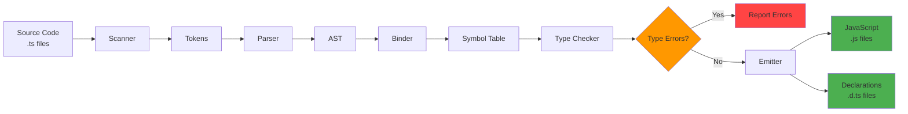
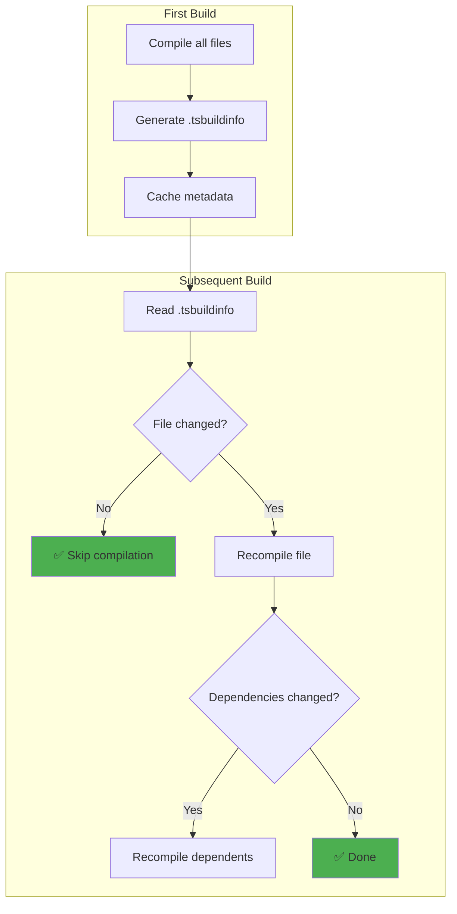
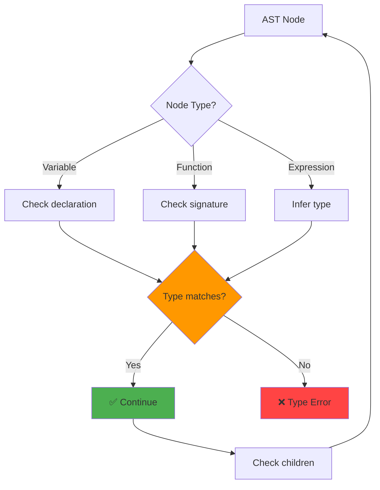
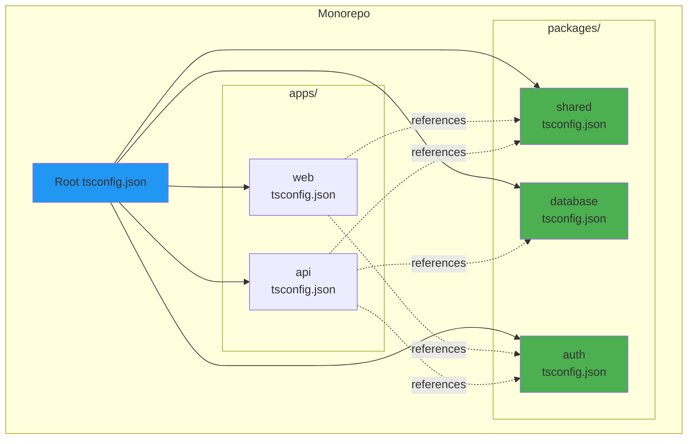

# TS Compiler internals (high-level)

## 1. Why this exists (Real-world problem first)

You're building a large TypeScript codebase. Compilation takes 5 minutes. Every code change requires 5-minute wait. Developers complain. Productivity drops. You don't understand why it's slow or how to fix it.

**What breaks without understanding TS compiler:**

- **Slow builds**: Compilation takes 10 minutes. CI/CD pipeline times out. Can't deploy.
- **Type errors in production**: TypeScript compiles successfully, but runtime errors occur. Type system didn't catch the bug.
- **Memory issues**: Compiler uses 8GB RAM. CI/CD server crashes (only 4GB available).
- **Can't optimize**: Don't know which compiler options to tune. Blindly change settings, make it worse.

**Real pain**: A fintech platform had 500+ TypeScript files. Compilation took 8 minutes. Developers waited 8 minutes after every change. Productivity dropped 40%. Engineers didn't understand why. Finally learned about incremental compilation and project references. Enabled `--incremental` flag. Compilation dropped to 30 seconds. Productivity restored.

**Another scenario**: An e-commerce API had type errors that TypeScript didn't catch. Used `any` everywhere. Runtime errors in production. Learned that `any` bypasses type checking. Enabled `strict` mode. TypeScript caught 50+ bugs before production.

## 2. Mental model (build imagination)

Think of TypeScript compiler as **factory assembly line with quality control**.

**Source code (raw materials)**:
- TypeScript files arrive at factory
- Each file is raw material

**Compiler pipeline (assembly line)**:
- **Scanner**: Breaks code into tokens (like cutting raw materials into pieces)
- **Parser**: Arranges tokens into AST (like assembling pieces into structure)
- **Binder**: Links symbols (like connecting components)
- **Checker**: Validates types (like quality control inspection)
- **Emitter**: Generates JavaScript (like packaging final product)

**In technical terms**:
- **Scanner**: Converts source code into tokens (keywords, identifiers, operators)
- **Parser**: Converts tokens into Abstract Syntax Tree (AST)
- **Binder**: Creates symbol table, links identifiers to declarations
- **Checker**: Performs type checking, validates type safety
- **Emitter**: Generates JavaScript code and `.d.ts` declaration files

**Key insight**: TypeScript compiler is **multi-phase**. Each phase depends on previous phase. Understanding phases helps optimize compilation and debug type errors.

## 3. How TypeScript implements this internally

### Compiler pipeline

```typescript
// Simplified TypeScript compiler flow
function compile(sourceFile: string): CompileResult {
  // Phase 1: Scanning
  const tokens = scanner.scan(sourceFile);
  
  // Phase 2: Parsing
  const ast = parser.parse(tokens);
  
  // Phase 3: Binding
  const symbols = binder.bind(ast);
  
  // Phase 4: Type Checking
  const errors = checker.check(ast, symbols);
  
  // Phase 5: Emitting
  const javascript = emitter.emit(ast);
  
  return { javascript, errors };
}
```

**What happens**:
1. **Scanner**: Reads source code character by character, produces tokens
2. **Parser**: Builds AST from tokens (tree structure representing code)
3. **Binder**: Creates symbol table (maps identifiers to declarations)
4. **Checker**: Walks AST, validates types, reports errors
5. **Emitter**: Walks AST, generates JavaScript code

**No Node.js-specific implementation**: TypeScript compiler is separate from Node.js runtime. Runs in Node.js, but doesn't use event loop for compilation (synchronous process).

### Incremental compilation

TypeScript caches compilation results to speed up subsequent builds.

```json
// tsconfig.json
{
  "compilerOptions": {
    "incremental": true,
    "tsBuildInfoFile": ".tsbuildinfo"
  }
}
```

**How it works**:
1. **First build**: Compile all files, save metadata to `.tsbuildinfo`
2. **Subsequent builds**: Check which files changed, only recompile those
3. **Dependency tracking**: If file A imports file B, changing B triggers recompilation of A

**Performance impact**: Incremental compilation reduces build time by 80-90% for unchanged files.

### Common misunderstanding

**Myth**: "TypeScript compiler runs at runtime."

**Reality**: TypeScript compiler runs at **build time**. It generates JavaScript, which runs at runtime. TypeScript doesn't exist at runtime.

**Myth**: "TypeScript guarantees no runtime errors."

**Reality**: TypeScript only checks **types**, not **logic**. It can't catch division by zero, null pointer errors (if you use `any`), or business logic bugs.

## 4. Multiple diagrams (MANDATORY)

### TypeScript compiler pipeline



### Incremental compilation



### Type checking flow



### Project references architecture



## 5. Where this is used in real projects

### Optimizing compilation speed

```json
// tsconfig.json
{
  "compilerOptions": {
    // Enable incremental compilation
    "incremental": true,
    "tsBuildInfoFile": ".tsbuildinfo",
    
    // Skip type checking of declaration files
    "skipLibCheck": true,
    
    // Skip default library type checking
    "skipDefaultLibCheck": true,
    
    // Use faster module resolution
    "moduleResolution": "node",
    
    // Disable source maps in development
    "sourceMap": false,
    
    // Use faster transpiler (no type checking)
    "isolatedModules": true
  },
  
  // Exclude unnecessary files
  "exclude": [
    "node_modules",
    "dist",
    "**/*.spec.ts"
  ]
}
```

**Benefits**:
- `incremental`: 80-90% faster subsequent builds
- `skipLibCheck`: Skip type checking `node_modules` (saves 30-50%)
- `isolatedModules`: Enable faster transpilers like esbuild

### Project references for monorepos

```json
// packages/shared/tsconfig.json
{
  "compilerOptions": {
    "composite": true,  // Enable project references
    "declaration": true,
    "outDir": "dist"
  },
  "include": ["src/**/*"]
}
```

```json
// apps/api/tsconfig.json
{
  "compilerOptions": {
    "composite": true,
    "outDir": "dist"
  },
  "references": [
    { "path": "../../packages/shared" },
    { "path": "../../packages/database" }
  ],
  "include": ["src/**/*"]
}
```

```json
// tsconfig.json (root)
{
  "files": [],
  "references": [
    { "path": "packages/shared" },
    { "path": "packages/database" },
    { "path": "apps/api" }
  ]
}
```

**Build command**:
```bash
# Build all projects in dependency order
tsc --build

# Build specific project and dependencies
tsc --build apps/api

# Clean build artifacts
tsc --build --clean
```

**Benefits**:
- Parallel compilation of independent projects
- Only rebuild changed projects
- Enforce dependency boundaries

### Using faster transpilers

```json
// tsconfig.json (for type checking only)
{
  "compilerOptions": {
    "noEmit": true,  // Don't generate JavaScript
    "strict": true
  }
}
```

```javascript
// Build with esbuild (10x faster than tsc)
const esbuild = require('esbuild');

esbuild.build({
  entryPoints: ['src/index.ts'],
  bundle: true,
  platform: 'node',
  target: 'node18',
  outfile: 'dist/index.js',
  sourcemap: true,
}).catch(() => process.exit(1));
```

**Workflow**:
1. **Type checking**: `tsc --noEmit` (validates types, no output)
2. **Transpilation**: `esbuild` (generates JavaScript, no type checking)

**Benefits**:
- esbuild is 10-100x faster than tsc
- Still get type safety from `tsc --noEmit`
- Best of both worlds

### Compiler API for custom tooling

```typescript
// scripts/analyze-types.ts
import * as ts from 'typescript';
import * as fs from 'fs';

function analyzeTypes(fileName: string) {
  const program = ts.createProgram([fileName], {
    target: ts.ScriptTarget.ES2020,
    module: ts.ModuleKind.CommonJS,
  });
  
  const sourceFile = program.getSourceFile(fileName);
  const checker = program.getTypeChecker();
  
  ts.forEachChild(sourceFile!, (node) => {
    if (ts.isFunctionDeclaration(node) && node.name) {
      const symbol = checker.getSymbolAtLocation(node.name);
      const type = checker.getTypeOfSymbolAtLocation(symbol!, node);
      
      console.log(`Function: ${node.name.text}`);
      console.log(`Type: ${checker.typeToString(type)}`);
    }
  });
}

analyzeTypes('src/index.ts');
```

**Use cases**:
- Custom linting rules
- Code generation
- Documentation generation
- Dependency analysis

## 6. Where this should NOT be used

### Over-optimizing compilation

**Bad**: Disable all type checking to speed up builds.

```json
{
  "compilerOptions": {
    "noEmit": true,
    "skipLibCheck": true,
    "skipDefaultLibCheck": true,
    "strict": false  // BAD: Disables type safety
  }
}
```

**Why**: Defeats purpose of TypeScript. No type safety.

**Good**: Use incremental compilation and faster transpilers, keep type checking enabled.

### Using `any` everywhere

**Bad**:
```typescript
function processData(data: any): any {
  return data.map((item: any) => item.value);
}
```

**Why**: Bypasses type checking. Runtime errors.

**Good**: Use proper types or `unknown` with type guards.

### Ignoring compiler errors

**Bad**: Use `@ts-ignore` to suppress errors.

```typescript
// @ts-ignore
const result = dangerousOperation();
```

**Why**: Hides real bugs. Errors surface in production.

**Good**: Fix the error or use proper type assertions.

## 7. Failure modes & edge cases

### Compilation out of memory

**Scenario**: Large codebase (1000+ files). Compiler uses 8GB RAM. CI/CD server has 4GB. Compilation fails.

**Impact**: Can't build, can't deploy.

**Solution**: Use project references to split codebase. Enable `incremental` compilation. Increase CI/CD server memory.

### Circular dependencies

**Scenario**: File A imports B, B imports C, C imports A. Compiler hangs or produces incorrect types.

**Impact**: Compilation fails or produces wrong types.

**Solution**: Refactor to remove circular dependencies. Use dependency injection.

### Type checking is slow

**Scenario**: Type checking takes 5 minutes. Developers wait 5 minutes for feedback.

**Impact**: Slow development cycle.

**Solution**: Use `skipLibCheck`, enable `incremental`, use faster transpilers for development.

### Declaration files conflict

**Scenario**: Two packages export same type name. Compiler error: "Duplicate identifier."

**Impact**: Can't compile.

**Solution**: Use namespaces or rename types.

## 8. Trade-offs & alternatives

### What you gain

- **Type safety**: Catch bugs at compile time
- **Better IDE support**: Autocomplete, refactoring
- **Documentation**: Types serve as documentation
- **Refactoring confidence**: Rename safely, compiler catches all usages

### What you sacrifice

- **Build time**: Compilation adds 10-60 seconds
- **Complexity**: Must configure compiler, understand types
- **Learning curve**: Team must learn TypeScript
- **Tooling overhead**: Must maintain `tsconfig.json`, type definitions

### Alternatives

**JavaScript with JSDoc**
- **Use case**: Type checking without TypeScript
- **Benefit**: No build step
- **Trade-off**: Less type safety, verbose comments

**Flow**
- **Use case**: Alternative type system
- **Benefit**: Similar to TypeScript
- **Trade-off**: Smaller ecosystem, less adoption

**No types**
- **Use case**: Small projects, prototypes
- **Benefit**: Simple, fast
- **Trade-off**: No type safety, more runtime errors

## 9. Interview-level articulation

**Question**: "How does the TypeScript compiler work?"

**Weak answer**: "It converts TypeScript to JavaScript."

**Strong answer**: "The TypeScript compiler has five phases: (1) Scanner converts source code into tokens, (2) Parser builds an Abstract Syntax Tree from tokens, (3) Binder creates a symbol table linking identifiers to declarations, (4) Type Checker validates types by walking the AST, and (5) Emitter generates JavaScript and declaration files. Understanding these phases helps optimize compilation—for example, enabling `incremental` mode caches results from all phases, reducing subsequent builds by 80-90%. I've used project references in monorepos to parallelize compilation and enforce dependency boundaries. For large codebases, I use `tsc --noEmit` for type checking and esbuild for transpilation, which is 10-100x faster while maintaining type safety."

**Follow-up**: "How do you optimize TypeScript compilation in large projects?"

**Answer**: "I use several strategies: (1) Enable `incremental` compilation with `.tsbuildinfo` to cache results, (2) Use `skipLibCheck` to skip type checking `node_modules`, (3) Enable `isolatedModules` to allow faster transpilers like esbuild, (4) Use project references in monorepos to parallelize compilation and only rebuild changed projects, (5) Exclude unnecessary files like tests and `node_modules` from compilation. For example, in a 500-file codebase, these optimizations reduced build time from 8 minutes to 30 seconds. I also use `tsc --noEmit` for type checking in CI/CD and esbuild for development builds, giving fast feedback while maintaining type safety."

**Follow-up**: "What's the difference between `tsc` and `esbuild`?"

**Answer**: "`tsc` is the official TypeScript compiler that performs full type checking and transpilation. `esbuild` is a fast transpiler that converts TypeScript to JavaScript without type checking—it's 10-100x faster than `tsc`. I use both: `tsc --noEmit` for type checking (validates types, no output) and `esbuild` for transpilation (generates JavaScript, no type checking). This gives fast builds while maintaining type safety. In CI/CD, I run `tsc --noEmit` to catch type errors, then use `esbuild` to generate production bundles. This workflow reduced our build time from 5 minutes to 30 seconds."

## 10. Key takeaways (engineer mindset)

**What to remember**:
- **TypeScript compiler has 5 phases**: Scanner, Parser, Binder, Checker, Emitter
- **Incremental compilation caches results**—80-90% faster subsequent builds
- **Project references enable parallel compilation** in monorepos
- **`tsc --noEmit` + esbuild = fast builds + type safety**
- **`skipLibCheck` skips `node_modules` type checking**—30-50% faster

**What decisions this enables**:
- Choosing compiler options for speed vs strictness
- Deciding when to use project references
- Selecting transpiler (tsc vs esbuild vs swc)
- Optimizing build pipeline for large codebases

**How it connects to other Node.js concepts**:
- **Build tools**: TypeScript integrates with webpack, esbuild, Vite
- **Monorepos**: Project references enable monorepo compilation
- **CI/CD**: Compilation is part of build pipeline
- **Type safety**: Compiler catches bugs before runtime
- **Performance**: Faster compilation improves developer productivity
