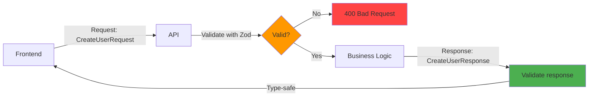
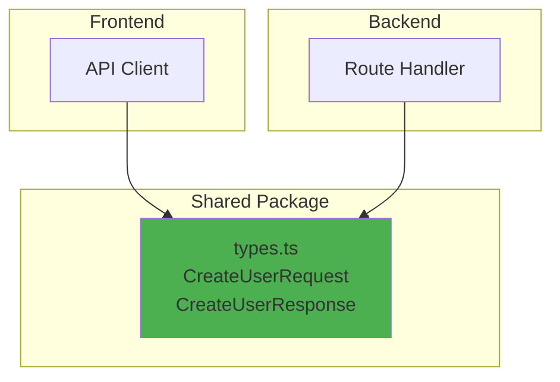
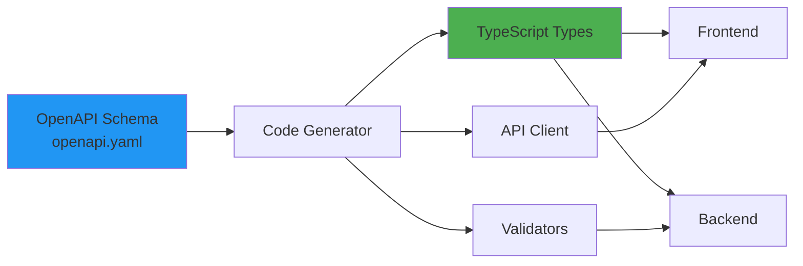
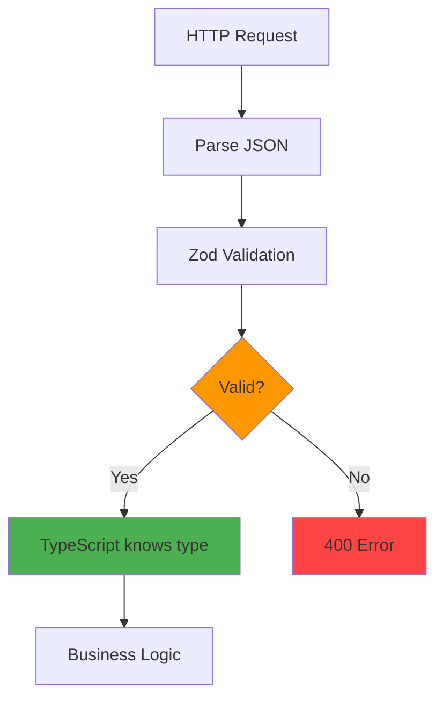

# Type-safe APIs

## 1. Why this exists (Real-world problem first)

You're building an API. Frontend sends `{ userId: "123" }`. Backend expects `{ user_id: number }`. API crashes. Frontend shows error. Users complain. You spend 2 hours debugging. The problem: type mismatch between frontend and backend.

**What breaks without type-safe APIs:**

- **Runtime errors**: Frontend sends wrong data type. Backend crashes. Production outage.
- **Silent failures**: Backend ignores unexpected fields. Data lost. Users affected.
- **Documentation drift**: API docs say one thing, code does another. Frontend breaks.
- **Refactoring fear**: Change API response. Don't know which frontends will break. Can't refactor safely.

**Real pain**: An e-commerce platform had 50+ API endpoints. Frontend and backend had different type definitions. Changed product API to add `discount` field. Forgot to update frontend types. Frontend crashed when accessing `discount`. Affected 10,000 users. Lost $50,000 in sales. Implemented type-safe APIs with shared types. Frontend and backend use same type definitions. Compiler catches mismatches before deployment.

**Another scenario**: A SaaS platform had API docs that were 6 months out of date. Developers relied on docs, sent wrong request format. API returned 400 errors. Took 1 week to debug. With type-safe APIs and auto-generated docs, docs are always up-to-date.

## 2. Mental model (build imagination)

Think of type-safe APIs as **assembly line with quality control checkpoints**.

**Without type-safe APIs (no quality control)**:
- Parts arrive at assembly line
- No inspection
- Defective parts assembled
- Final product breaks

**With type-safe APIs (quality control at every step)**:
- Parts arrive
- Inspect at entry (request validation)
- Inspect during assembly (business logic)
- Inspect at exit (response validation)
- Only good products ship

**In technical terms**:
- **Request validation**: Ensure incoming data matches expected type
- **Response validation**: Ensure outgoing data matches declared type
- **Shared types**: Frontend and backend use same type definitions
- **Code generation**: Generate types from schema (OpenAPI, GraphQL)

**Key insight**: Type-safe APIs catch errors at **compile time** (frontend) and **request time** (backend), not in production.

## 3. How TypeScript implements this internally

### Type-safe Express routes

```typescript
import { Request, Response } from 'express';

// Define request/response types
interface CreateUserRequest {
  name: string;
  email: string;
  age: number;
}

interface CreateUserResponse {
  id: string;
  name: string;
  email: string;
  createdAt: Date;
}

// Type-safe route handler
app.post('/users', async (
  req: Request<{}, CreateUserResponse, CreateUserRequest>,
  res: Response<CreateUserResponse>
) => {
  // TypeScript knows req.body has name, email, age
  const { name, email, age } = req.body;
  
  const user = await createUser({ name, email, age });
  
  // TypeScript ensures response matches CreateUserResponse
  res.json({
    id: user.id,
    name: user.name,
    email: user.email,
    createdAt: user.createdAt,
  });
});
```

**What happens**:
1. TypeScript checks `req.body` matches `CreateUserRequest`
2. TypeScript checks `res.json()` argument matches `CreateUserResponse`
3. Compiler errors if types don't match

**No runtime impact**: Types are erased at runtime. No performance overhead.

### Common misunderstanding

**Myth**: "TypeScript validates API requests at runtime."

**Reality**: TypeScript only validates at **compile time**. Need runtime validation library (Zod, Joi) to validate actual HTTP requests.

**Myth**: "Type-safe APIs prevent all bugs."

**Reality**: Type-safe APIs prevent **type mismatches**, not logic bugs. Can still have bugs in business logic.

## 4. Multiple diagrams (MANDATORY)

### Type-safe API flow



### Shared types architecture



### OpenAPI code generation



### Request validation flow



## 5. Where this is used in real projects

### Type-safe Express with Zod

```typescript
import express from 'express';
import { z } from 'zod';

// Define schemas
const CreateUserSchema = z.object({
  name: z.string().min(1).max(100),
  email: z.string().email(),
  age: z.number().int().min(18).max(120),
});

const UserResponseSchema = z.object({
  id: z.string().uuid(),
  name: z.string(),
  email: z.string(),
  createdAt: z.date(),
});

// Infer TypeScript types from schemas
type CreateUserRequest = z.infer<typeof CreateUserSchema>;
type UserResponse = z.infer<typeof UserResponseSchema>;

// Type-safe route with runtime validation
app.post('/users', async (req, res) => {
  // Runtime validation
  const result = CreateUserSchema.safeParse(req.body);
  
  if (!result.success) {
    return res.status(400).json({
      error: 'Validation failed',
      details: result.error.errors,
    });
  }
  
  // TypeScript knows result.data matches CreateUserRequest
  const { name, email, age } = result.data;
  
  const user = await createUser({ name, email, age });
  
  // Validate response (optional, for extra safety)
  const validatedUser = UserResponseSchema.parse({
    id: user.id,
    name: user.name,
    email: user.email,
    createdAt: user.createdAt,
  });
  
  res.json(validatedUser);
});
```

### Shared types in monorepo

```typescript
// packages/types/src/user.ts
export interface CreateUserRequest {
  name: string;
  email: string;
  age: number;
}

export interface UserResponse {
  id: string;
  name: string;
  email: string;
  createdAt: Date;
}

// apps/backend/src/routes/users.ts
import { CreateUserRequest, UserResponse } from '@myapp/types';

app.post('/users', async (req, res) => {
  const data: CreateUserRequest = req.body;
  const user: UserResponse = await createUser(data);
  res.json(user);
});

// apps/frontend/src/api/users.ts
import { CreateUserRequest, UserResponse } from '@myapp/types';

export async function createUser(data: CreateUserRequest): Promise<UserResponse> {
  const response = await fetch('/api/users', {
    method: 'POST',
    headers: { 'Content-Type': 'application/json' },
    body: JSON.stringify(data),
  });
  
  return response.json();
}
```

### OpenAPI with type generation

```yaml
# openapi.yaml
openapi: 3.0.0
paths:
  /users:
    post:
      requestBody:
        content:
          application/json:
            schema:
              type: object
              required: [name, email, age]
              properties:
                name:
                  type: string
                  minLength: 1
                  maxLength: 100
                email:
                  type: string
                  format: email
                age:
                  type: integer
                  minimum: 18
                  maximum: 120
      responses:
        '200':
          content:
            application/json:
              schema:
                type: object
                properties:
                  id:
                    type: string
                    format: uuid
                  name:
                    type: string
                  email:
                    type: string
                  createdAt:
                    type: string
                    format: date-time
```

```bash
# Generate TypeScript types from OpenAPI
npx openapi-typescript openapi.yaml --output src/types/api.ts
```

```typescript
// Generated types
import type { paths } from './types/api';

type CreateUserRequest = paths['/users']['post']['requestBody']['content']['application/json'];
type CreateUserResponse = paths['/users']['post']['responses']['200']['content']['application/json'];
```

### tRPC for end-to-end type safety

```typescript
// server.ts
import { initTRPC } from '@trpc/server';
import { z } from 'zod';

const t = initTRPC.create();

export const appRouter = t.router({
  createUser: t.procedure
    .input(z.object({
      name: z.string(),
      email: z.string().email(),
      age: z.number().int().min(18),
    }))
    .output(z.object({
      id: z.string(),
      name: z.string(),
      email: z.string(),
      createdAt: z.date(),
    }))
    .mutation(async ({ input }) => {
      // TypeScript knows input type
      const user = await createUser(input);
      return user;
    }),
});

export type AppRouter = typeof appRouter;

// client.ts
import { createTRPCProxyClient, httpBatchLink } from '@trpc/client';
import type { AppRouter } from './server';

const client = createTRPCProxyClient<AppRouter>({
  links: [httpBatchLink({ url: 'http://localhost:3000/trpc' })],
});

// Fully type-safe, no manual type definitions needed
const user = await client.createUser.mutate({
  name: 'John',
  email: 'john@example.com',
  age: 30,
});

// TypeScript knows user type
console.log(user.id);
```

## 6. Where this should NOT be used

### Over-validating internal APIs

**Bad**: Validate every internal function call with Zod.

```typescript
function addNumbers(a: number, b: number): number {
  // DON'T: Unnecessary validation
  z.number().parse(a);
  z.number().parse(b);
  return a + b;
}
```

**Why**: TypeScript already validates at compile time. Runtime validation adds overhead.

**Good**: Only validate external inputs (HTTP requests, user input).

### Complex nested validation

**Bad**: 10-level nested Zod schema.

```typescript
const ComplexSchema = z.object({
  level1: z.object({
    level2: z.object({
      level3: z.object({
        // ... 7 more levels
      }),
    }),
  }),
});
```

**Why**: Hard to read, slow to validate, difficult to debug.

**Good**: Break into smaller schemas, compose them.

## 7. Failure modes & edge cases

### Schema and type drift

**Scenario**: Update Zod schema, forget to regenerate TypeScript types. Types don't match schema.

**Impact**: Runtime validation fails, but TypeScript thinks it's valid.

**Solution**: Generate types from schema automatically. Use `z.infer<>`.

### Validation performance

**Scenario**: Complex Zod schema validates 1000 requests/second. Validation takes 50ms per request. API slows down.

**Impact**: High latency.

**Solution**: Cache validation results, use simpler schemas, or validate asynchronously.

### Date serialization

**Scenario**: API returns `Date` object. JSON.stringify converts to string. Frontend receives string, not Date.

**Impact**: Type mismatch.

**Solution**: Use ISO strings in API types, parse to Date on frontend.

## 8. Trade-offs & alternatives

### What you gain

- **Compile-time safety**: Catch type errors before deployment
- **Runtime safety**: Validate actual HTTP requests
- **Refactoring confidence**: Change types, compiler catches all usages
- **Auto-generated docs**: OpenAPI docs always up-to-date

### What you sacrifice

- **Setup complexity**: Must configure validation, code generation
- **Runtime overhead**: Validation adds 1-10ms per request
- **Learning curve**: Team must learn Zod, tRPC, or OpenAPI
- **Maintenance**: Must keep schemas and types in sync

### Alternatives

**Manual validation**
- **Use case**: Simple APIs, few endpoints
- **Benefit**: No dependencies
- **Trade-off**: Error-prone, no type safety

**GraphQL**
- **Use case**: Complex data fetching
- **Benefit**: Built-in type safety, flexible queries
- **Trade-off**: More complex than REST

**No validation**
- **Use case**: Internal APIs, trusted clients
- **Benefit**: Simple, fast
- **Trade-off**: No safety, runtime errors

## 9. Interview-level articulation

**Question**: "How do you ensure type safety between frontend and backend?"

**Weak answer**: "I use TypeScript."

**Strong answer**: "I use shared types in a monorepo—frontend and backend import from the same `@myapp/types` package. This ensures both use identical type definitions. For runtime validation, I use Zod to validate HTTP requests. I define schemas with Zod and infer TypeScript types using `z.infer<>`, so types and validation are always in sync. For example, `CreateUserSchema` validates the request, and `type CreateUserRequest = z.infer<typeof CreateUserSchema>` generates the TypeScript type. I also use OpenAPI with code generation—I define the API in `openapi.yaml` and generate TypeScript types with `openapi-typescript`. This ensures API docs, types, and validation are all derived from a single source of truth. For maximum type safety, I've used tRPC, which provides end-to-end type safety without manual type definitions—the client automatically knows all procedure types from the server."

**Follow-up**: "What's the difference between compile-time and runtime validation?"

**Answer**: "Compile-time validation happens during TypeScript compilation—it checks types in your code but doesn't validate actual runtime data. Runtime validation happens when the app runs—it validates actual HTTP requests, user input, or external data. TypeScript can't validate runtime data because types are erased at runtime. That's why I use Zod for runtime validation. For example, TypeScript ensures `req.body` is typed as `CreateUserRequest`, but Zod validates that the actual HTTP request body matches the schema. I use both: TypeScript for compile-time safety (catches type errors in code) and Zod for runtime safety (catches invalid data from clients)."

**Follow-up**: "How do you handle API versioning with type-safe APIs?"

**Answer**: "I use URL versioning (`/v1/users`, `/v2/users`) and maintain separate type definitions for each version. In a monorepo, I have `@myapp/types-v1` and `@myapp/types-v2` packages. Each version has its own schemas and types. When introducing breaking changes, I create a new version while keeping the old version running. I gradually migrate clients to the new version and eventually deprecate the old one. For non-breaking changes, I use optional fields and default values. I also use OpenAPI to document each version separately, making it clear which types belong to which version."

## 10. Key takeaways (engineer mindset)

**What to remember**:
- **Use shared types in monorepos**—frontend and backend use same definitions
- **Combine TypeScript (compile-time) + Zod (runtime)**—both are necessary
- **Generate types from schemas**—use `z.infer<>` or OpenAPI code generation
- **Validate external inputs only**—don't validate internal function calls
- **tRPC provides end-to-end type safety**—no manual type definitions needed

**What decisions this enables**:
- Choosing validation library (Zod, Joi, Yup)
- Deciding between REST + OpenAPI vs tRPC vs GraphQL
- Implementing shared types in monorepos
- Balancing type safety vs complexity

**How it connects to other Node.js concepts**:
- **API design**: Type-safe APIs improve API reliability
- **Monorepos**: Shared types work best in monorepos
- **Code generation**: OpenAPI generates types, docs, and clients
- **Runtime validation**: Complements TypeScript's compile-time checking
- **Error handling**: Validation errors provide clear feedback to clients
