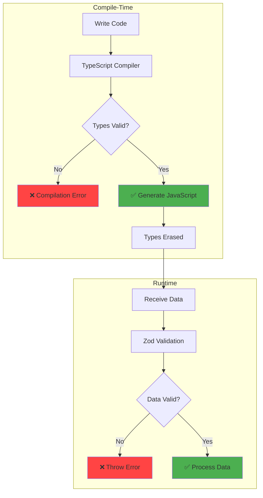
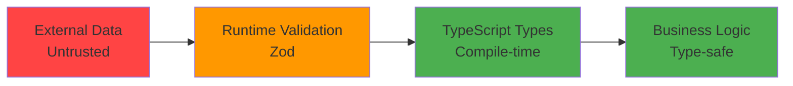
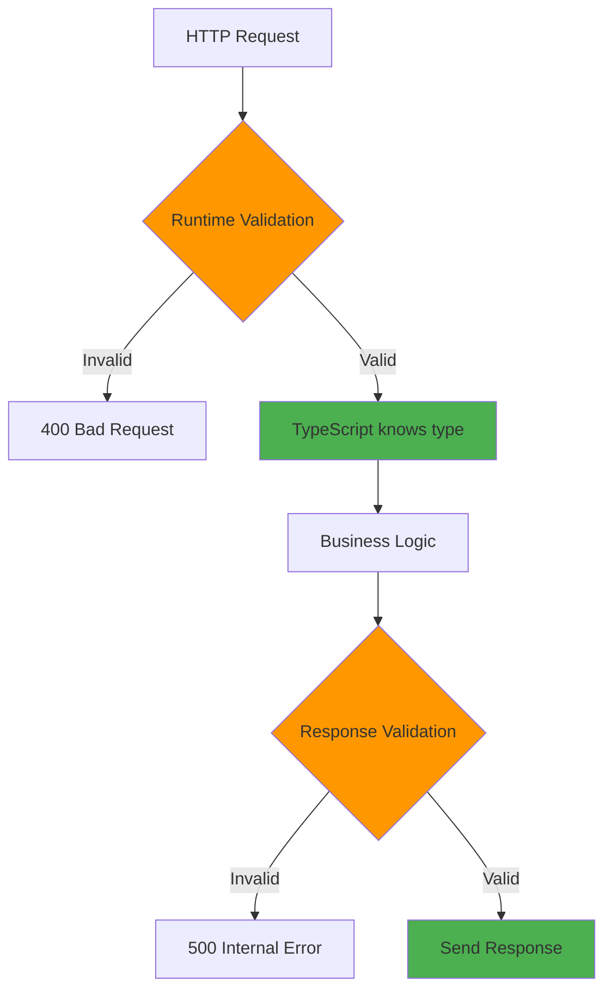
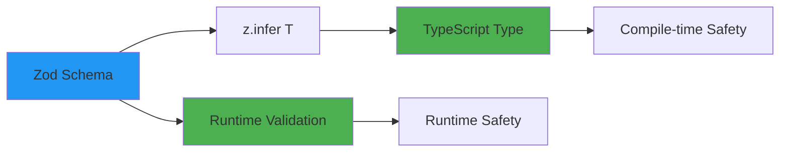

# Runtime validation vs compile-time

## 1. Why this exists (Real-world problem first)

You build an API with TypeScript. All types are perfect. Deploy to production. User sends `{ age: "twenty" }` instead of `{ age: 20 }`. TypeScript didn't catch it (types are erased at runtime). API crashes. Production outage.

**What breaks without runtime validation:**

- **Type erasure**: TypeScript types don't exist at runtime. Malicious or buggy clients send wrong data. API crashes.
- **External data is untrusted**: User input, API responses, database queries—all can have unexpected types. TypeScript can't validate them.
- **Silent failures**: Wrong data type passes through. Business logic fails. Data corruption.
- **Security vulnerabilities**: SQL injection, XSS attacks—TypeScript can't prevent them.

**Real pain**: A fintech API had perfect TypeScript types. User sent `{ amount: "1000000" }` (string) instead of `{ amount: 1000000 }` (number). TypeScript didn't catch it (external input). Database stored string. Payment processing failed. Lost $100,000. Added Zod validation. Runtime validation catches type mismatches before they reach business logic.

**Another scenario**: An e-commerce API trusted database queries to return correct types. Database had corrupted data (`price: null` instead of `price: number`). TypeScript assumed price was number. Code crashed when calculating total. With runtime validation, caught null values and handled gracefully.

## 2. Mental model (build imagination)

Think of compile-time vs runtime validation as **blueprint inspection vs construction inspection**.

**Compile-time (blueprint inspection)**:
- Architect reviews building blueprints
- Catches design errors before construction
- Fast, cheap
- Can't catch construction defects

**Runtime (construction inspection)**:
- Inspector checks actual building during construction
- Catches material defects, worker errors
- Slower, more expensive
- Catches real-world problems

**In technical terms**:
- **Compile-time**: TypeScript checks types in your code before running
- **Runtime**: Validation library (Zod, Joi) checks actual data when app runs
- **Type erasure**: TypeScript types are removed during compilation
- **Both needed**: Compile-time catches code errors, runtime catches data errors

**Key insight**: TypeScript and runtime validation solve **different problems**. TypeScript ensures your code is type-safe. Runtime validation ensures external data is type-safe.

## 3. How TypeScript implements this internally

### Compile-time type checking

```typescript
function addNumbers(a: number, b: number): number {
  return a + b;
}

addNumbers(1, 2);  // ✅ TypeScript: OK
addNumbers("1", "2");  // ❌ TypeScript: Error
```

**What happens**:
1. TypeScript compiler checks argument types
2. If types don't match, compilation fails
3. Types are erased in JavaScript output

**JavaScript output**:
```javascript
function addNumbers(a, b) {
  return a + b;
}
```

**No types at runtime**: JavaScript has no type information.

### Runtime validation

```typescript
import { z } from 'zod';

const NumberSchema = z.number();

function addNumbers(a: unknown, b: unknown): number {
  // Runtime validation
  const validA = NumberSchema.parse(a);
  const validB = NumberSchema.parse(b);
  
  return validA + validB;
}

addNumbers(1, 2);  // ✅ Runtime: OK
addNumbers("1", "2");  // ❌ Runtime: Throws error
```

**What happens**:
1. Zod checks actual values at runtime
2. If validation fails, throws error
3. If validation passes, TypeScript knows type

### Common misunderstanding

**Myth**: "TypeScript validates data at runtime."

**Reality**: TypeScript types are **erased** at runtime. Only compile-time checking.

**Myth**: "Runtime validation is slow."

**Reality**: Validation adds 1-10ms per request. Negligible for most APIs.

## 4. Multiple diagrams (MANDATORY)

### Compile-time vs runtime validation



### Type safety layers



### Validation flow



### Type inference from validation



## 5. Where this is used in real projects

### Zod for runtime validation

```typescript
import { z } from 'zod';
import express from 'express';

// Define schema
const CreateUserSchema = z.object({
  name: z.string().min(1).max(100),
  email: z.string().email(),
  age: z.number().int().min(18).max(120),
});

// Infer TypeScript type from schema
type CreateUserRequest = z.infer<typeof CreateUserSchema>;

app.post('/users', async (req, res) => {
  // Runtime validation
  const result = CreateUserSchema.safeParse(req.body);
  
  if (!result.success) {
    return res.status(400).json({
      error: 'Validation failed',
      details: result.error.errors,
    });
  }
  
  // TypeScript knows result.data is CreateUserRequest
  const { name, email, age } = result.data;
  
  const user = await createUser({ name, email, age });
  res.json(user);
});
```

### Validating database responses

```typescript
const UserSchema = z.object({
  id: z.string().uuid(),
  name: z.string(),
  email: z.string().email(),
  age: z.number().int(),
  createdAt: z.date(),
});

type User = z.infer<typeof UserSchema>;

async function getUserById(id: string): Promise<User> {
  const result = await db.query('SELECT * FROM users WHERE id = $1', [id]);
  
  if (result.rows.length === 0) {
    throw new Error('User not found');
  }
  
  // Runtime validation of database response
  const user = UserSchema.parse(result.rows[0]);
  
  return user;
}
```

### Validating external API responses

```typescript
const GitHubUserSchema = z.object({
  login: z.string(),
  id: z.number(),
  avatar_url: z.string().url(),
  name: z.string().nullable(),
  email: z.string().email().nullable(),
});

type GitHubUser = z.infer<typeof GitHubUserSchema>;

async function fetchGitHubUser(username: string): Promise<GitHubUser> {
  const response = await fetch(`https://api.github.com/users/${username}`);
  const data = await response.json();
  
  // Runtime validation of external API response
  const user = GitHubUserSchema.parse(data);
  
  return user;
}
```

### Custom validation with refinements

```typescript
const PasswordSchema = z.string()
  .min(8, 'Password must be at least 8 characters')
  .max(100, 'Password must be at most 100 characters')
  .refine((password) => /[A-Z]/.test(password), {
    message: 'Password must contain at least one uppercase letter',
  })
  .refine((password) => /[a-z]/.test(password), {
    message: 'Password must contain at least one lowercase letter',
  })
  .refine((password) => /[0-9]/.test(password), {
    message: 'Password must contain at least one number',
  });

const CreateAccountSchema = z.object({
  email: z.string().email(),
  password: PasswordSchema,
  confirmPassword: z.string(),
}).refine((data) => data.password === data.confirmPassword, {
  message: 'Passwords do not match',
  path: ['confirmPassword'],
});
```

## 6. Where this should NOT be used

### Validating internal function calls

**Bad**:
```typescript
function addNumbers(a: number, b: number): number {
  // DON'T: Unnecessary runtime validation
  z.number().parse(a);
  z.number().parse(b);
  return a + b;
}
```

**Why**: TypeScript already validates at compile time. Runtime validation adds overhead.

**Good**: Only validate external inputs.

### Over-validating

**Bad**:
```typescript
// Validate every property access
const name = z.string().parse(user.name);
const email = z.string().parse(user.email);
const age = z.number().parse(user.age);
```

**Why**: If `user` is already validated, no need to validate each property.

**Good**: Validate once at entry point.

### Using `any` with validation

**Bad**:
```typescript
function process(data: any) {
  const validated = Schema.parse(data);
  // ...
}
```

**Why**: Defeats purpose of TypeScript. Use `unknown` instead.

**Good**:
```typescript
function process(data: unknown) {
  const validated = Schema.parse(data);
  // ...
}
```

## 7. Failure modes & edge cases

### Validation performance

**Scenario**: Complex schema validates 1000 requests/second. Validation takes 50ms per request. API slows down.

**Impact**: High latency.

**Solution**: Cache validation results, simplify schemas, or validate asynchronously.

### Schema and type drift

**Scenario**: Update schema, forget to update TypeScript type. Type doesn't match schema.

**Impact**: Runtime validation fails, but TypeScript thinks it's valid.

**Solution**: Always use `z.infer<>` to generate types from schemas.

### Partial validation

**Scenario**: Validate request body, but not query parameters. Malicious query parameter causes SQL injection.

**Impact**: Security vulnerability.

**Solution**: Validate all external inputs (body, query, params, headers).

## 8. Trade-offs & alternatives

### What you gain

- **Runtime safety**: Catch invalid data before it reaches business logic
- **Security**: Prevent injection attacks, XSS
- **Better errors**: Clear validation error messages
- **Type inference**: Generate TypeScript types from schemas

### What you sacrifice

- **Performance**: Validation adds 1-10ms per request
- **Complexity**: Must define schemas and validation logic
- **Learning curve**: Team must learn validation library
- **Maintenance**: Must keep schemas and types in sync

### Alternatives

**Manual validation**
- **Use case**: Simple validation, few fields
- **Benefit**: No dependencies
- **Trade-off**: Error-prone, no type inference

**TypeScript only**
- **Use case**: Internal functions, trusted data
- **Benefit**: No runtime overhead
- **Trade-off**: Can't validate external data

**JSON Schema**
- **Use case**: Language-agnostic validation
- **Benefit**: Works with any language
- **Trade-off**: No type inference, verbose

## 9. Interview-level articulation

**Question**: "What's the difference between compile-time and runtime validation?"

**Weak answer**: "Compile-time is TypeScript, runtime is Zod."

**Strong answer**: "Compile-time validation happens during TypeScript compilation—it checks types in your code but doesn't validate actual runtime data. Runtime validation happens when the app runs—it validates actual data from external sources like HTTP requests, databases, or APIs. TypeScript types are erased at runtime, so they can't validate external data. That's why I use both: TypeScript for compile-time safety (catches type errors in code) and Zod for runtime safety (catches invalid data from clients). For example, TypeScript ensures `req.body` is typed as `CreateUserRequest`, but Zod validates that the actual HTTP request body matches the schema. I use `z.infer<>` to generate TypeScript types from Zod schemas, ensuring types and validation are always in sync."

**Follow-up**: "When do you use runtime validation?"

**Answer**: "I use runtime validation for all external inputs: HTTP request bodies, query parameters, headers, database responses, and external API responses. I don't validate internal function calls because TypeScript already validates those at compile time. For example, in an API endpoint, I validate the request body with Zod before processing it. If validation fails, I return a 400 error with detailed error messages. I also validate database responses to catch data corruption—if the database returns `null` where I expect a number, Zod throws an error instead of letting the code crash later. For external APIs, I validate responses to ensure they match the expected schema, protecting against API changes."

**Follow-up**: "How do you handle validation errors?"

**Answer**: "I use `safeParse()` instead of `parse()` to avoid throwing errors. `safeParse()` returns `{ success: true, data }` or `{ success: false, error }`, allowing me to handle errors gracefully. For API endpoints, I return a 400 Bad Request with detailed validation errors from `error.errors`, which includes the field path, error message, and expected type. For internal validation, I log the error and return a default value or throw a custom error. I also use Zod's custom error messages to provide user-friendly feedback, like 'Email must be valid' instead of 'Expected string, received number'."

## 10. Key takeaways (engineer mindset)

**What to remember**:
- **TypeScript types are erased at runtime**—can't validate external data
- **Use both compile-time (TypeScript) and runtime (Zod) validation**
- **Generate types from schemas with `z.infer<>`**—keeps types and validation in sync
- **Validate all external inputs**—HTTP requests, database responses, API responses
- **Don't validate internal function calls**—TypeScript already validates them

**What decisions this enables**:
- Choosing when to use runtime validation
- Selecting validation library (Zod, Joi, Yup)
- Designing validation schemas
- Balancing type safety vs performance

**How it connects to other Node.js concepts**:
- **API security**: Runtime validation prevents injection attacks
- **Error handling**: Validation errors provide clear feedback
- **Type safety**: Complements TypeScript's compile-time checking
- **Performance**: Validation adds overhead, must be optimized
- **Schema-driven development**: Schemas are source of truth for types and validation
